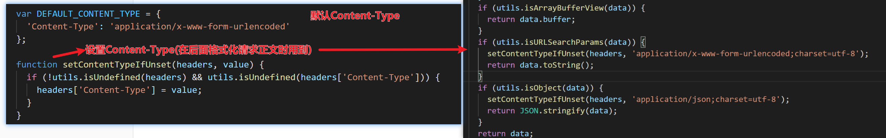
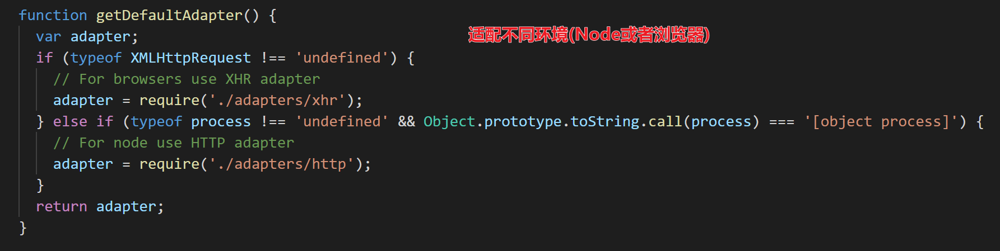
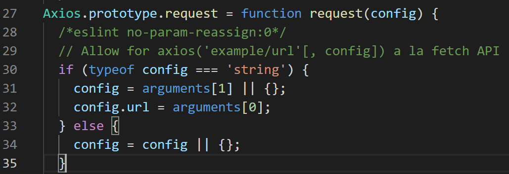
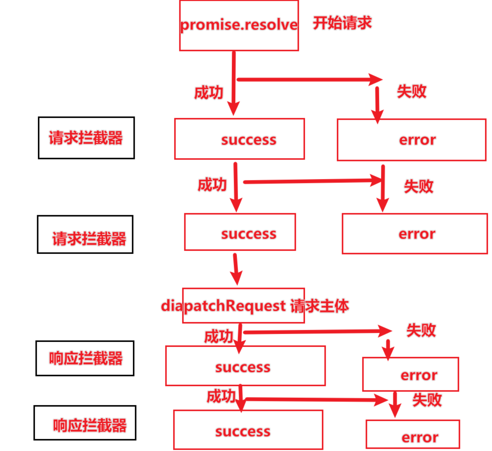

- [Axios的基本使用](#axios的基本使用)
  - [请求方式](#请求方式)
    - [`axios(config)`/`axios.request(config)`](#axiosconfigaxiosrequestconfig)
      - [使用方法](#使用方法)
      - [源码](#源码)
    - [`axiosmethod`](#axiosmethod)
      - [使用方法](#使用方法-1)
      - [源码](#源码-1)
    - [`axios.create()`](#axioscreate)
  - [config](#config)
    - [默认配置](#默认配置)
  - [`request`](#request)
    - [用户配置](#用户配置)
    - [拦截器](#拦截器)

# Axios的基本使用

```js
//引入
import axios from 'axios'
```

## 请求方式

首先Axios支持多种请求方式：

+ `axios(config)`或者`axios.reauest(config)`
+  `axios[method]()`

注意：`request()`是axios中最重要的方法之一，上面所有的调起请求的方式都是基于这个方法，也是我们下面学习源码重点解读的部分。

### `axios(config)`/`axios.request(config)`

#### 使用方法

```js
axios({
  method: 'post',
  url: '/user/12345',
  data: {
    firstName: 'Fred',
    lastName: 'Flintstone'
  }
});
```

#### 源码

可以看到`axios(config)`本质上是调用了`createInstance(config)`方法生成的Axios实例，最终内部通过是在调用`Axios`的`request`方法：

```js
function createInstance(defaultConfig) {
  var context = new Axios(defaultConfig);
  var instance = bind(Axios.prototype.request, context);
  // Copy axios.prototype to instance
  utils.extend(instance, Axios.prototype, context);
  // Copy context to instance
  utils.extend(instance, context);
  return instance;
}
// Create the default instance to be exported
var axios = createInstance(defaults);
// Expose Axios class to allow class inheritance
axios.Axios = Axios;
```

### `axios[method]()`

可以根据请求的`method`，可以选择对应的请求方法，比如get请求可以使用`axios.get`，post请求可以使用`axios.post`。

#### 使用方法

```js
 axios.get("https://httpbin.org/get", {
      params: {
        name: "xiaoming",
        age: 18
      }
    }).then(res => {
      console.log(res);
    }).catch(err => {
      console.log(err);
    });
```

#### 源码

可以看到，这些方法其实都是封装了`axios.request()`方法的，只是把传入的参数中`method`固定下来。

```js
utils.forEach(['delete', 'get', 'head', 'options'], function forEachMethodNoData(method) {
  /*eslint func-names:0*/
  Axios.prototype[method] = function(url, config) {
    return this.request(mergeConfig(config || {}, {
      method: method,
      url: url,
      data: (config || {}).data
    }));
  };
});

utils.forEach(['post', 'put', 'patch'], function forEachMethodWithData(method) {
  /*eslint func-names:0*/
  Axios.prototype[method] = function(url, data, config) {
    return this.request(mergeConfig(config || {}, {
      method: method,
      url: url,
      data: data
    }));
  };
});
```

### `axios.create()`

这个方法不是能直接发起请求的，而是创建一个Axios实例，然后在通过实例的`request()`方法或者其他实例上的方法去发起请求。

```
// Create an instance using the config defaults provided by the library
// At this point the timeout config value is `0` as is the default for the library
const instance = axios.create();

instance.get('/longRequest', {
  timeout: 5000
});
```

## config

### 默认配置

默认配置 + 用户配置 = 最终配置。

首先axios存在默认配置（位于源码的defaults.js文件中），主要是设置默认的请求头、格式化请求正文以及响应正文：

设置默认请求头：



根据当前环境，获取默认的请求方法：



这是默认配置，再来看用户配置，因为我们知道这些请求方式本质都是在调用`request`，`request`方法的参数其实才是我们说的用户配置。接下来进入`request`的源码。

## `request`

### 用户配置

`request`部分主要完成合并配置，以及将拦截器的函数入栈`chain`，然后用`Promise`来执行。

首先看合成配置，之前提到过请求的配置除了传参进来的`config`之外，还有在`axios.defaults`中的配置。所以，需要先拿到`config`，然后跟`axios.defaults`得到本次请求的配置。

> lib/core/Axios.js

我们知道**`arguments`** 是传递给函数的参数组成的类数组对象。这里的逻辑是先判断config是否是string类型，如果是，第二个传参才是config（第一个传参是url），否则，第一个传参就是config

> ```js
> // 第一种传参方式
> axios.request('/api', {
>   method: 'get'
>   // ...
> })
> // 第二种传参方式
> axios.request({
>   url: '/api',
>   method: 'get'
>   // ...
> })
> ```



这是用户配置的部分，接下来是合并配置：默认配置+用户配置=最终配置；

```js
config = mergeConfig(this.defaults, config);
```

`mergeConfig`方法在`lib/coremergeConfig.js`中，主要完成了深拷贝以及默认值处理，最后返回完整配置对象。

这是`mergeConfig`源码的部分。

接下来在`request`源码中处理了请求的`method`，如果用户有传就将值改全小写，都没有就默认为`get`。

然后就是`request`后半部分，请求拦截器跟响应拦截器。

### 拦截器

拦截器部分本质上就是将请求拦截器，和响应拦截器，以及实际的请求（dispatchRequest）的方法组合成数组，类似如下的结构：

`[请求拦截器1success, 请求拦截器1error, dispatchRequest, undefined, 响应拦截器1success, 响应拦截器1error]`

这样一来，数组的结构就是从头到尾为就是按照请求的过程排好了请求拦截器一对对函数，然后是请求函数跟`undefined`，然后是响应拦截器一对对函数。

然后声明一个`Promise.resolve()`后返回的`promise`, 把数组中从头部开始一对对函数的传入`promise.then()`中。

这个操作可以利用`promise.then()`的特点，自动通过promise链去调用方法。如果请求拦截器中有报错，则最后不会调`dispatchRequest`方法并断掉。

```js
promise = Promise.resolve(config);
    while (chain.length) {
      promise = promise.then(chain.shift(), chain.shift());
    }
```





所以拦截就是在过程中做操作，并不会改变什么：


```js
//lib/core/Axios.js中拦截器的部分
var requestInterceptorChain = [];
  var synchronousRequestInterceptors = true;
  this.interceptors.request.forEach(function unshiftRequestInterceptors(interceptor) {
    if (typeof interceptor.runWhen === 'function' && interceptor.runWhen(config) === false) {
      return;
    }

    synchronousRequestInterceptors = synchronousRequestInterceptors && interceptor.synchronous;

    requestInterceptorChain.unshift(interceptor.fulfilled, interceptor.rejected);
  });

  var responseInterceptorChain = [];
  this.interceptors.response.forEach(function pushResponseInterceptors(interceptor) {
    responseInterceptorChain.push(interceptor.fulfilled, interceptor.rejected);
  });

  var promise;

  if (!synchronousRequestInterceptors) {
    var chain = [dispatchRequest, undefined];

    Array.prototype.unshift.apply(chain, requestInterceptorChain);
    chain.concat(responseInterceptorChain);

    promise = Promise.resolve(config);
    while (chain.length) {
      promise = promise.then(chain.shift(), chain.shift());
    }

    return promise;
  }


  var newConfig = config;
  while (requestInterceptorChain.length) {
    var onFulfilled = requestInterceptorChain.shift();
    var onRejected = requestInterceptorChain.shift();
    try {
      newConfig = onFulfilled(newConfig);
    } catch (error) {
      onRejected(error);
      break;
    }
  }

  try {
    promise = dispatchRequest(newConfig);
  } catch (error) {
    return Promise.reject(error);
  }

  while (responseInterceptorChain.length) {
    promise = promise.then(responseInterceptorChain.shift(), responseInterceptorChain.shift());
  }

  return promise;
```


