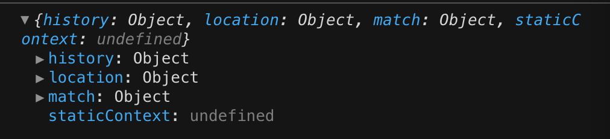

- [react-router](#react-router)
  
  - [回顾历史](#回顾历史)
  
  - [前端路由](#前端路由)
  
  - [react-router-dom的使用](#react-router-dom的使用)
    
    - [NavLink](#navlink)
    - [Switch](#switch)
    - [Redirect](#redirect)
  
  - [路由嵌套](#路由嵌套)
    
    - [一般实现](#一般实现)
    - [hooks写法](#hooks写法)
      - [useParams](#useparams)
  
  - [路由配置](#路由配置)
  
  - [react-router中的hooks](#react-router中的hooks)
    
    - [useParams](#useparams-1)
    - [useRouteMatch](#useroutematch)
  
  - [BrowserRouter和HashRouter的原理](#browserrouter和hashrouter的原理)
    
    - [History 模式](#history-模式)
      - [在 history 中跳转](#在-history-中跳转)
      - [添加和修改历史记录中的条目](#添加和修改历史记录中的条目)
      - [监听页面路由切换](#监听页面路由切换)
    - [Hash 模式](#hash-模式)
      - [使用location.hash来设置和获取 hash](#使用locationhash来设置和获取-hash)
      - [监听hashchange事件](#监听hashchange事件)
    - [History的实现细节（history的一些api）](#history的实现细节history的一些api)
      - [browserHistory](#browserhistory)
      - [hashHistory](#hashhistory)
  
  - [写在后面](#写在后面)
    
    - [Route的render属性](#route的render属性)
    
    - [withRouter](#withrouter)
    
    - [RouteComponentProps](#routecomponentprops)
      
      # react-router

## 回顾历史

在前端技术早期，一个 URL 对应一个页面，如果你要从 A 页面切换到 B 页面，那么必然伴随着页面的刷新。这个体验并不好，不过在最初也是无奈之举——毕竟用户只有在刷新页面的情况下，才可以重新去请求数据。

后来，改变发生了——Ajax 出现了，它允许人们在不刷新页面的情况下发起请求；与之共生的，还有“不刷新页面即可更新页面内容”这种需求。在这样的背景下，出现了SPA（单页面应用）。

SPA 极大地提升了用户体验，它允许页面在不刷新的情况下更新页面内容，使内容的切换更加流畅。但是在 SPA 诞生之初，人们并没有考虑到“定位”这个问题——在内容切换前后，页面的 URL 都是一样的，这就带来了两个问题：

+ SPA 其实并不知道当前的页面“进展到了哪一步”，可能你在一个站点下经过了反复的“前进”才终于唤出了某一块内容，但是此时只要刷新一下页面，一切就会被清零，你必须重复之前的操作才可以重新对内容进行定位——SPA 并不会“记住”你的操作；

+ 由于有且仅有一个 URL 给页面做映射，这对 SEO 也不够友好，搜索引擎无法收集全面的信息。

为了解决这个问题，前端路由出现了。

## 前端路由

> 单页面富应用：视图之间的跳转不应该导致整个页面被重新加载，而是应该就在当前页面里渲染。具象化来说是一个`portal`(入口)，里面包含多个页面view。

react本质上只是一个视图层的框架，官方并没有提供状态管理或者路由方案，这给了开发者很大的自由，react社区非常活跃，提供了很多成熟的方案，但也会让人很纠结到底使用哪种方案。

不过对于路由实现，整个社区的认知是统一的，那就是`react-router`。

`raect-router`在version 4开始，路由就不再集中于一个包进行管理：

+ react-router是router的核心部分代码；
+ react-router-dom是用于浏览器的；
+ react-router-native是用于原生应用的；

当前react-router的版本是version 5。当然看GitHub，已经出了v6 alpha，v6 beta。版本的alpha意思是内测版，bug多，不稳定，还在不断添加新功能；版本的beta意思是公测版，但比alpha稳定，bug还是很多，仍在不断添加新功能。

> 此外还会有RC版本，意思是经过了多个beta版本后逐渐稳定（基本不再添加新功能），修复完bug即可进入正式发布版；release版即为正式版本（release本身就是发布的意思），推荐生产使用。

安装react-router：

```js
yarn add react-router-dom
```

注意：安装react-router-dom会自动帮我们安装react-router的依赖。

## react-router-dom的使用

react-router-dom最主要的API是给我们提供了一些组件：

+ BrowserRouter和HashRouter
  + 前者使用history模式，后者使用hash模式（后面我们会在源码当中分析）
  + 这两个Router包裹在最外层，作为路由器用于监听路径的改变；
+ Link和NavLink
  + 这两个组件作为导航，用于路径的跳转，最终会被渲染成a元素；
  + NavLink是Link的特定版本，会在匹配到URL的同时添加参数（增加样式属性）；
  + to属性：路由中最重要的属性，用于设置跳转到的URL；
+ Route
  + Route就是匹配路由，作为Link中路径的匹配路由，用于声明Link映射到的组件层的哪个组件；
  + path属性：和Link或者NavLink中的to属性一一对应，表示和哪一个路径匹配；
  + component属性：设置匹配到路径后，渲染的组件；
  + exact属性：精准匹配，只有精准匹配到完全一致的路径，才会渲染对应的组件；

官方提供的代码如下：

```js
import React from "react";
import {
  BrowserRouter as Router,
  Switch,
  Route,
  Link
} from "react-router-dom";

export default function App() {
  return (
    <Router>
        <Link to="/">Home</Link>
        <Link to="/about">About</Link>
        <Link to="/users">Users</Link>
        <Switch>
    <Route exact path="/"><Home /></Route>
          <Route path="/about"> <About /></Route>
          <Route path="/users"> <Users /></Route>
        </Switch>
    </Router>
  );
}

function Home() {
  return <h2>Home</h2>;
}

function About() {
  return <h2>About</h2>;
}

function Users() {
  return <h2>Users</h2>;
}
```


### NavLink

上面我们使用的是Link，作为导航；不过使用Link没办法添加样式，因此有了NavLink：

+ activeStyle：活跃时（匹配到）的样式
+ activeClassName：活跃时添加的class（进而设置样式）
+ exact：是否是精确匹配；

### Switch

可能会存在这样一种情况：

```js
<Route exact path="/" component={Home}/>
<Route path="/about" component={About}/>
<Route path="/users" component={Users}/>
<Route path="/:id" component={Users}/>
<Route component={NoMatch}/>
```

我们会发现当匹配到`/about`或者`/users`时，`/:id`也会被匹配到，而且最后一个`NoMatch`始终会被匹配到。

原因是`react-router`中只要和导航`Link`匹配到的`Route`，对应的组件都会被渲染。所以我们需要利用`react-router-dom`提供的`switch`实现**排他**：

+ 只要匹配到了第一个，那么后面的就不该继续匹配了
+ 只需要利用Switch包裹即可

```js
<Switch>
  <Route exact path="/" component={Home}/>
    <Route path="/about" component={About}/>
    <Route path="/users" component={Users}/>
    <Route path="/:id" component={Users}/>
    <Route component={NoMatch}/>
</Switch>
```

### Redirect

`Redirect`是重定向路由，当这个组件出现时，就会跳转到对应的`to`路径中。

比如鉴权，判断是否登陆，没登录就重定向到`login`组件中。

```js
function User(){
  //省略逻辑
  return (
      <div>
        isLogin?<div>已登陆</div>:<Redirect to="/login"/>
    </div>
  )
}
```

## 路由嵌套

### 一般实现

这是开发中常见的情景，在路由下还会有子路由：

> 写法：在一级路由中的的Route组件指向的组件之中编写二级路由，二级路由的路径需要在一级路由的基础上写，同理，三级路由需要在二级路由的基础上写。

```js
import React from "react";
import {BrowserRouter as Router,Switch,Link,Route} from "react-router-dom";
function AboutProduct(){
  return (
      <div>AboutProduct</div>
  )
}
function AboutUsers(){
  return (
  <div>AboutUsers</div>
  )
}

export default function About (){
  return (
      <Router>
        <Link to="/about">商品</Link>
        <Link to="about/users">商品客户</Link>
    <Switch>
        <Route exact path="/about" component={AboutProduct}/>
        <Route path="/about/users" component={AboutUsers}/>
    </Switch>
    </Router>
  )
}
```

### hooks写法

在`react-router v5`之后，有了很多新的功能，比如增加了`react-router`的`hooks`。

#### useParams

`useParams` 获取路由参数，不需要借助高阶组件`withRouter`。

```js
import React from "react";
import {
  BrowserRouter as Router,
  Switch,
  Route,
  Link,
  useParams,
  useRouteMatch
} from "react-router-dom";
/**
* useParams 获取路由参数，不需要借助高阶组件withRouter
* useRouteMatch 接受一个path字符串作为参数。当参数的path与当前的路径相匹配时，useRouteMatch会返回match对象，否则返回null。
*/
export default function NestingExample() {
  return (
    <Router>
      <div>
        <ul>
          <li>
            <Link to="/">Home</Link>
          </li>
          <li>
            <Link to="/topics">Topics</Link>
          </li>
        </ul>
        <Switch>
          <Route exact path="/">
            <Home />
          </Route>
          <Route path="/topics">
            <Topics />
          </Route>
        </Switch>
      </div>
    </Router>
  );
}
function Home() {
  return (
    <div>
      <h2>Home</h2>
    </div>
  );
}
function Topics() {
  //useRouteMatch提供对匹配对象的访问，在这里就是该组件外面包裹的<Route/>
  //`path`是包裹的<Route>路径，而`url`则是Route对应的link链接。
  let { path, url } = useRouteMatch();
  return (
    <div>
      <h2>Topics</h2>
      <ul>
        <li>
          <Link to={`${url}/rendering`}>Rendering with React</Link>
        </li>
        <li>
          <Link to={`${url}/components`}>Components</Link>
        </li>
        <li>
          <Link to={`${url}/props-v-state`}>Props v. State</Link>
        </li>
      </ul>

      <Switch>
        <Route exact path={path}>
          <h3>Please select a topic.</h3>
        </Route>
        <Route path={`${path}/:topicId`}>
          <Topic />
        </Route>
      </Switch>
    </div>
  );
}

function Topic() {
  //组件的<Route>的路径为`/topics/:topicId`。 URL的`:topicId`部分表示一个占位符，我们可以从   `useParams（）`获取。
  let { topicId } = useParams();
  return (
    <div>
      <h3>{topicId}</h3>
    </div>
  );
}
```

## 路由配置

为了避免路由过于混乱，我们需要把所有的路由放到一起管理。

```js
//import部分
const routes = [
  {
    path: "/sandwiches",
    component: Sandwiches
  },
  {
    path: "/tacos",
    component: Tacos,
    routes: [
      {
        path: "/tacos/bus",
        component: Bus
      },
      {
        path: "/tacos/cart",
        component: Cart
      }
    ]
  }
];

export default function RouteConfigExample() {
  return (
    <Router>
      <div>
        <ul>
          <li>
            <Link to="/tacos">Tacos</Link>
          </li>
          <li>
            <Link to="/sandwiches">Sandwiches</Link>
          </li>
        </ul>

        <Switch>
          {routes.map((route, i) => (
            <RouteWithSubRoutes key={i} {...route} />
          ))}
        </Switch>
      </div>
    </Router>
  );
}

function RouteWithSubRoutes(route) {
  return (
    <Route
      path={route.path}
      render={props => (
        // pass the sub-routes down to keep nesting
        <route.component {...props} routes={route.routes} />
      )}
    />
  );
}

function Sandwiches() {
  return <h2>Sandwiches</h2>;
}

function Tacos({ routes }) {
  return (
    <div>
      <h2>Tacos</h2>
      <ul>
        <li>
          <Link to="/tacos/bus">Bus</Link>
        </li>
        <li>
          <Link to="/tacos/cart">Cart</Link>
        </li>
      </ul>

      <Switch>
        {routes.map((route, i) => (
          <RouteWithSubRoutes key={i} {...route} />
        ))}
      </Switch>
    </div>
  );
}

function Bus() {
  return <h3>Bus</h3>;
}

function Cart() {
  return <h3>Cart</h3>;
}
```


## react-router中的hooks

在`react-router v5`之后，`react-router`实现了`hooks`，而且在`router`中也可以不用再写`component`了，只要记得用把组件用`Route`包裹起来就行了。

```js
<Route path="/" component={Home} />
```

变为

```js
<Route path="/">
  <Home />
</Route>
```

### useParams

`useParams` 获取路由参数 （外面包裹的`<Route/>`）。

```js
import { useParams, Route } from 'react-router-dom';

function Profile() {
  const { name } = useParams();
  return <p>{name}'s Profile</p>;
}

function Dashboard() {
  return (
    <>
      <nav>
        <Link to={`/profile/ann`}>Ann's Profile</Link>
      </nav>
      <main>
        <Route path="/profile/:name">
          <Profile />
        </Route>
      </main>
    </>
  );
}
```

### useRouteMatch

提供对匹配对象的访问（外面包裹的`<Route/>`或者匹配到的）。

`useRouteMatch` 接受一个`path`字符串作为参数。当参数的`path`与当前的路径相匹配时，`useRouteMatch`会返回`match`对象，否则返回`null`。

> `useRouteMatch`在对于一些，不是路由级别的组件。但是组件自身的显隐却和当前路径相关的组件时，非常有用。

```js
const Home = () => {
  return (
    <div>Home</div>
  )
}
// Header组件只会在匹配`/detail/:id`时出现
const Header = () => {
  // 只有当前路径匹配`/detail/:id`时，match不为null
  const match = useRouteMatch('/detail/:id')
  return (
    match && <div>Header</div>
  )
}
const Detail = () => {
  return (
    <div>Detail</div>
  )
}
function App() {
  return (
    <div className="App">
      <Router>
        <Header/>
        <Switch>
          <Route exact path="/" component={Home}/>
          <Route exact path="/detail/:id" component={Detail}/> 
        </Switch>
      </Router>
    </div>
  );
}
```

这在`react-router v5`之前需要这样写：

```js
const Home = () => {
  return (
    <div>Home</div>
  )
}
// Header组件只会在匹配`/detail/:id`时出现
const Header = () => {
  return (
    <Route
      path="/detail/:id"
      strict
      sensitive
      render={({ match }) => {
        return match && <div>Header</div>
      }}
    />
  )
}
const Detail = () => {
  return (
    <div>Detail</div>
  )
}
function App() {
  return (
    <div className="App">
      <Router>
        <Header/>
        <Switch>
          <Route exact path="/" component={Home}/>
          <Route exact path="/detail/:id" component={Detail}/> 
        </Switch>
      </Router>
    </div>
  );
}
```

## BrowserRouter和HashRouter的原理

> `history`是一个统一了所有DOM和非DOM环境会话记录的Javascript库。history提供了简洁的API，让你可以管理history堆栈、跳转、跳转前确认，以及保持会话之间的状态。

 每个router组件创建了一个history对象，用来记录当前路径( `history.location` )，上一步路径也存储在堆栈中。当前路径改变时，视图会重新渲染，给你一种跳转的感觉。当前路径又是如何改变的呢？history对象有 `history.push()`和 `history.replace()`这些方法来实现。当你点击 `<Link>`组件会触发 `history.push()`，使用 `<Redirect>`则会调用 `history.replace()`。其他方法 - 例如 `history.goBack()`和 `history.goForward()` - 用来根据页面的后退和前进来跳转history堆栈。

**react-router** 是建立在history之上的，**history本质上是维护了一个路由堆栈**，底层就是对于浏览器原声api的封装。

### History 模式

History 的路由模式，依赖了一个关键的属性window.history，该属性可用来获取用于操作浏览器历史记录的 History 对象。也就是说，通过使用window.history，我们可以实现以下与路由相关的重要能力。比如：

#### 在 history 中跳转

使用window.history.back()、window.history.forward()和window.history.go()方法，可以实现在用户历史记录中向后和向前的跳转。

#### 添加和修改历史记录中的条目

使用history.pushState()和history.replaceState()方法，它可以操作浏览器的历史栈，同时不会引起页面的刷新（可避免页面重新加载）。

#### 监听页面路由切换

当同一个页面在历史记录间切换时，就会产生popstate事件，可以通过window.popstate监听页面路由切换的情况。

也就是说，使用pushState()和replaceState()来修改路由信息，通过popstate事件监听页面路由变化，来进行页面的局部更新，这便是 History 的路由模式。

但 History 的路由模式需要依赖 HTML5 History API（IE10 以上），以及服务器的配置来支持，所以也有不少的开发者会使用 Hash 模式来管理 Web 应用的路由。

### Hash 模式

Hash 模式使用的是从井号(#)开始的 URL（锚）片段，主要依赖 Location 对象的 hash 属性（location.hash）和hashchange事件，包括：

#### 使用location.hash来设置和获取 hash

location.hash的设置和获取，并不会造成页面重新加载，利用这一点，我们可以记录页面关键信息的同时，提升页面体验。

#### 监听hashchange事件

当页面的 hash 改变时，hashchange事件会被触发，同时提供了两个属性：newURL（当前页面新的 URL）和oldURL（当前页面旧的 URL）。

部分浏览器不支持onhashchange事件，我们可以自行使用定时器检测和触发的方式来进行兼容，可以使用以下的代码逻辑来实现：

```js
(function (window) {
  // 如果浏览器原生支持该事件，则退出
  if ("onhashchange" in window.document.body) {
    return;
  }
  var location = window.location,
    oldURL = location.href,
    oldHash = location.hash;
  // 每隔100ms检测一下location.hash是否发生变化
  setInterval(function () {
    var newURL = location.href,
      newHash = location.hash;
    // 如果hash发生了变化，且绑定了处理函数...
    if (newHash != oldHash && typeof window.onhashchange === "function") {
      // 执行事件触发
      window.onhashchange({
        type: "hashchange",
        oldURL: oldURL,
        newURL: newURL,
      });
      oldURL = newURL;
      oldHash = newHash;
    }
  }, 100);
})(window);
```

我们可以看到，Hash 路由模式使用location.hash来设置和获取 hash，并通过window.onhashchange监听基于 hash 的路由变化，来进行页面更新处理的。

### History的实现细节（history的一些api）

在认识history之前，我们首先知道浏览器给我们提供的原生路由功能，比如[`location`](https://developer.mozilla.org/zh-CN/docs/Web/API/Location)，接下来的很多方法中将出现它们的影子。

`history`提供了三种路由实现的方式。

1. `browserHistory`，支持HTML5 history API的路由实现
2. `hashHistory`，向下兼容传统浏览器的hash路由实现
3. `createMemoryHistory`，React实现的定制化路由，不依赖任何环境，可用于非DOM环境，比如`React Native` 或 `SSR`

#### browserHistory

通过`history.createBrowserHistory`创建

原生方法 ---> 封装方法

1. `pushState` ---> `push`
2. `popState` ---> `goBack`
3. `replaceState` ---> `replace`

```js
window.history.pushState(state, title, url) 
// state：需要保存的数据，这个数据在触发popstate事件时，可以在event.state里获取
// title：标题，基本没用，一般传 null
// url：设定新的历史记录的 url。新的 url 与当前 url 的 origin 必须是一樣的，否则会抛出错误。url可以是绝对路径，也可以是相对路径。
//如 当前url是 https://www.baidu.com/a/,执行history.pushState(null, null, './qq/')，则变成 https://www.baidu.com/a/qq/，
//执行history.pushState(null, null, '/qq/')，则变成 https://www.baidu.com/qq/

window.history.replaceState(state, title, url)
// 与 pushState 基本相同，但她是修改当前历史记录，而 pushState 是创建新的历史记录

window.addEventListener("popstate", function() {
    // 监听浏览器前进后退事件，pushState 与 replaceState 方法不会触发              
});

window.history.back() // 后退
window.history.forward() // 前进
window.history.go(1) // 前进一步，-2为后退两步，window.history.lengthk可以查看当前历史堆栈中页面的数量
```

> 重要!! `history` 模式改变 url 的方式会导致浏览器向服务器发送请求，这不是我们想看到的，我们需要在服务器端做处理：如果匹配不到任何静态资源，则应该始终返回同一个 html 页面。

#### hashHistory

通过`history.createHashHistory`创建

这里的hash就是指url尾巴后的#号以及后面的字符。也称作锚点，本身是用来做页面定位的，它可以使对应id的元素显示在可视区域内。

由于hash值变化不会导致浏览器向服务器发出请求，而且hash改变会触发`hashChange`事件，浏览器的前进后退也能对其进行控制，所以在html5的`history`出现前，基本都是使用hash来实现前端路由的，这也是hash模式能兼容老版浏览器的原因。

实际上`BrowserRouter`和`HashRouter`只是`React Router`对 `browserHistory` 和 `hashHistory` 实现的组件封装。

其实之前react-router-dom还提供了一个IndexRoute组件，现在已经被废弃了，我们现在使用`Switch`来替代它。

翻看`createBrowserHistory.js`，可以看到`history`内部是怎么实现监听浏览器路由变化的。

**[window.popstate](https://developer.mozilla.org/en-US/docs/Web/API/Window/popstate_event)**

> The popstate event of the `Window` interface is fired when the active history entry changes。

源码中显示，通过`window.addEventListener('popstate',cb)`注册的回调，需要注意的是，调用`history.pushState`或`history.replaceState`时不会触发`popstate`事件，只有在做出浏览器动作时，才会触发该事件，如用户点击浏览器的回退按钮（或者在JS中调用`history.back()`).

**[window.hashchange](https://developer.mozilla.org/en-US/docs/Web/API/Window/hashchange_event)**

> The `hashchange` event is fired when the fragment identifier of the URL has changed

`window.addEventListener('hashchange',cb)`注册的回调，需要注意的是浏览器原生只会监听`#`符号后的变化，而我们在react或者类react项目中使用的`#/`，都是框架层做的封装。

## 写在后面

### Route的render属性

Route 有一个名为 render 的 prop。设置这个 render 函数，那么就可以在路由中做出复杂的逻辑处理。

```
<Switch>
  <Route path="/login" exact
    render={() => auth ? <Redirect to="/product" /> : <Login  />
  <Route path="/" 
    render={() => auth ? <PrimaryLayout/> : <Redirect to="/login"/>} />
</Switch>
复制代码
```

变量 auth 为用户的登录状态，当用户已登录时无法直接访问 login 页面，未登录时无法访问之后需要权限的页面。对于更为复杂的权限管理，按照相同的方式编写 render 函数即可。

### withRouter

```js
import { withRouter, RouteComponentProps } from "react-router";
```

效果：将一个组件包裹进`Route`里面, 然后`react-router`的三个对象`history, location, match`就会被放进这个组件的`props`属性中。

withRouter可以包装任何自定义组件，将react-router 的 history,location,match 三个对象传入。
无需一级级传递react-router 的属性，当需要用的router 属性的时候，将组件包一层withRouter，就可以拿到需要的路由信息。



### RouteComponentProps

**RouteComponentProps** 能提供 `withRouter()`下`props`的类型：

```js
const App: React.FC<IProps & RouteComponentProps> = function(props) {
 //逻辑代码 
}
App.defaultProps = {};
export default withRouter(App);
```
