[toc]


## 写在前面

**所有的内容均以`react v17.0.2`为基础。**

> **多看看前端框架源码。**悄悄读源码，然后惊艳所有人。

注意：**React17并没有包含新特性！**最显著的变化：全新的事件机制+全新的`JSX`转换机制。

OK，接下来可以读源码了。

## `React`中一些概念

> 可以稍后再看

### Fiber

> `Fiber`对应一个组件需要被处理或者已经处理了，一个组件可以有一个或者多个`Fiber`。
>
> **非文本类型的 `ReactElement` ==== `Fiber` 节点**。

`Fiber`结构定义在`packages/react-reconciler/src/ReactInternalTypes.js`文件中：

```js
export type Fiber = {|
  // 标记不同的组件类型
  tag: WorkTag,
  // ReactElement中的key，作为唯一标识符
  key: null | string,
  // ReactElement.type的值会作为createElement的第一个参数，在整个调和过程中保证不变
  elementType: any,
  //  异步组件resolved之后返回的内容，一般是`function`或者`class`
  type: any,
  // 实例对象, 如类组件的实例、原生 dom 实例, 而 function 组件没有实例, 因此该属性是空
  stateNode: any,
  // 指向他在Fiber节点树中的`parent`，用来在处理完这个节点之后向上返回
  return: Fiber | null,

  // 单链表树结构
  // 指向自己的第一个子节点                 
  child: Fiber | null,
  // 指向自己的兄弟节点，兄弟节点的return指向同一个父节点
  sibling: Fiber | null,
  index: number,

  ref:
    | null
    | (((handle: mixed) => void) & {_stringRef: ?string, ...})
    | RefObject,

  // 新的变动带来新的props
  pendingProps: any, 
  // 上一次渲染完成之后的props                                  
  memoizedProps: any, // The props used to create the output.

  // 该Fiber对应的组件产生的Update会存放在这个队列里面
  updateQueue: mixed,

  // 上一次渲染完成之后的state
  memoizedState: any,

  // 该fiber的依赖项（上下文或者事件）
  dependencies: Dependencies | null,

  // 当前组件及子组件处于何种渲染模式 详见 TypeOfMode
  mode: TypeOfMode,

  // 用来记录side effect
  flags: Flags,
  subtreeFlags: Flags,
  deletions: Array<Fiber> | null,
                                    
	// 单链表用来快速查找下一个side effect
  nextEffect: Fiber | null,
	
  // 子树中第一个side effect                                
  firstEffect: Fiber | null,
  // 子树中最后一个side effect                                  
  lastEffect: Fiber | null,
	
  // 和优先级相关（在新的Fiber架构中很重要）                                 
  lanes: Lanes,
  childLanes: Lanes,

  alternate: Fiber | null,

  actualDuration?: number,

  actualStartTime?: number,

  selfBaseDuration?: number,

  treeBaseDuration?: number,
	// 仅在开发环境下
  _debugID?: number,
  _debugSource?: Source | null,
  _debugOwner?: Fiber | null,
  _debugIsCurrentlyTiming?: boolean,
  _debugNeedsRemount?: boolean,

  _debugHookTypes?: Array<HookType> | null,
|};

```

### fiberRoot和rootFiber

先来剧透一下，`render`的第一个任务就是创建`fiberRoot`，创建 `fiberRoot`对象要先给`root`赋值（`container._reactRootContainer`），`root`对象的结构很复杂：

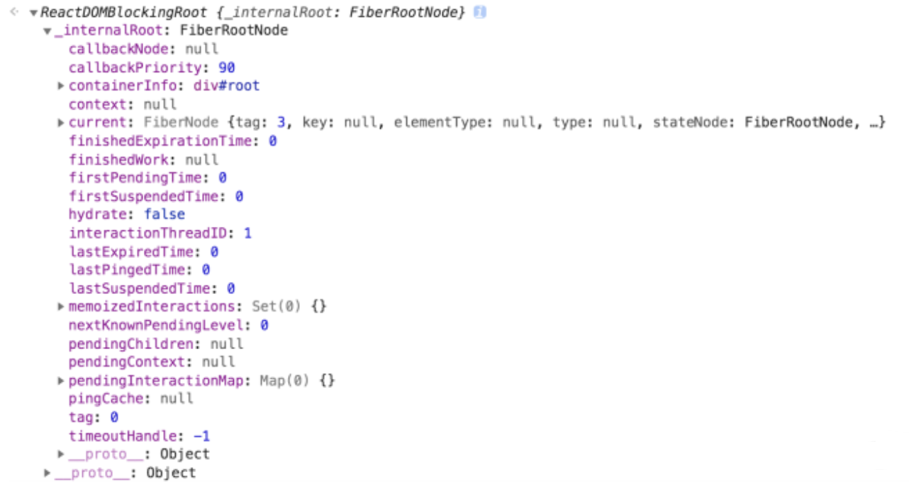

可以看到，`root` 对象（`container._reactRootContainer`）上有一个 `_internalRoot` 属性，这个 `_internalRoot `也就是 `fiberRoot`。`fiberRoot` 的本质是一个 `FiberRootNode` 对象，其中包含一个 `current` 属性：

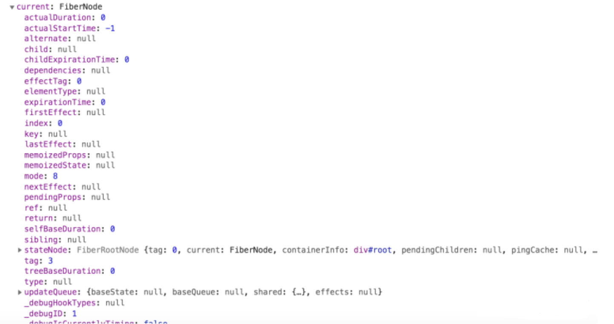

可以看到，`current `对象是一个` FiberNode` 实例，**而 `FiberNode`，正是 `Fiber` 节点对应的对象类型**。所以`current` 对象是一个`Fiber` 节点，而且还是**当前 `Fiber` 树的头部节点**。

考虑到 `current` 属性对应的 `FiberNode` 节点，在调用栈中实际是由 `createHostRootFiber` 方法创建的，`React` 源码中也有多处以 `rootFiber` 代指 `current` 对象，因此以 `rootFiber` 指代 `current`对象。

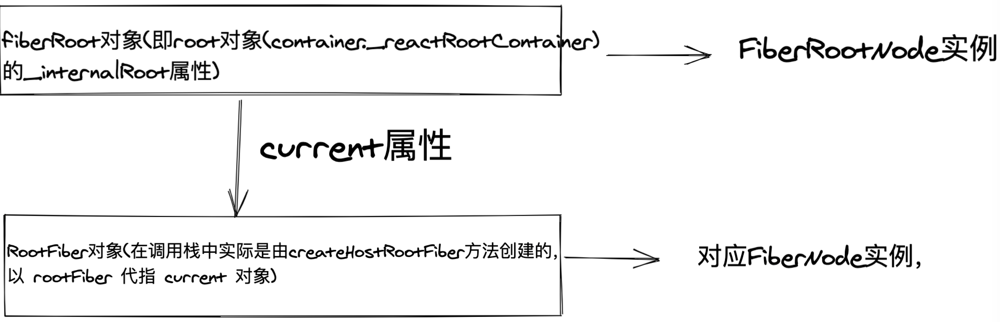

#### `fiberRoot`与`rootFiber`的关系

> 摘自卡颂大佬：
>
> `current Fiber树`中的`Fiber节点`被称为`current fiber`，`workInProgress Fiber树`中的`Fiber节点`被称为`workInProgress fiber`，他们通过`alternate`属性连接。
>
> ```js
> currentFiber.alternate === workInProgressFiber;
> workInProgressFiber.alternate === currentFiber;
> ```
>
> `React`应用的根节点通过使`current`指针在不同`Fiber树`的`rootFiber`间切换来完成`current Fiber`树指向的切换。
>
> 即当`workInProgress Fiber树`构建完成交给`Render`渲染在页面上后，应用根节点的`current`指针指向`workInProgress Fiber树`，此时`workInProgress Fiber树`就变为`current Fiber树`。
>
> 每次状态更新都会产生新的`workInProgress Fiber树`，通过`current`与`workInProgress`的替换，完成`DOM`更新。
>
> 首次执行`ReactDOM.render`会创建`fiberRootNode`（`fiberRoot`）和`rootFiber`。其中`fiberRootNode`是整个应用的根节点，`rootFiber`是`<App/>`所在组件树的根节点。
>
> 之所以要区分`fiberRootNode`与`rootFiber`，是因为在应用中我们可以多次调用`ReactDOM.render`渲染不同的组件树，他们会拥有不同的`rootFiber`。但是整个应用的根节点只有一个，那就是`fiberRootNode`。
>
> `fiberRootNode`的`current`会指向当前页面上已渲染内容对应`Fiber树`，即`current Fiber树`。
>
> 由于是首屏渲染，页面中还没有挂载任何`DOM`，所以`fiberRootNode.current`指向的`rootFiber`没有任何`子Fiber节点`（即`current Fiber树`为空）。
>
> 接下来进入`render阶段`，根据组件返回的`JSX`在内存中依次创建`Fiber节点`并连接在一起构建`Fiber树`，被称为`workInProgress Fiber树`。
>
> 在构建`workInProgress Fiber树`时会尝试复用`current Fiber树`中已有的`Fiber节点`内的属性，在`首屏渲染`时只有`rootFiber`存在对应的`current fiber`（即`rootFiber.alternate`）。
>
> > 这个决定是否复用的过程就是Diff算法。
>
> `workInProgress Fiber 树`在`render阶段`完成构建后进入`commit阶段`渲染到页面上。
>
> 此时`DOM`更新`workInProgress Fiber树`对应的样子(渲染完毕)。`fiberRootNode`的`current`指针指向`workInProgress Fiber树`使其变为`current Fiber 树`。

#### 总结

`fiberRootNode`是整个应用的根节点，`rootFiber`是`<App/>`所在组件树的根节点（`ReactElement`的父节点）。在整个react应用中，`fiberRoot`只有一个，但是`rootFiber`可以有多个（因为每次开启`render`都会产生不同的`rootFiber`树）。`fiberRoot`的`current`会指向当前页面上已渲染内容对应`Fiber树`，即`current Fiber树`。

## 剧透

在讲之前，要先剧透，梳理一下，我觉得很重要，如果后面哪里思路断了，可以回过头来看一下这部分的内容。

从`ReactDOM.render`，这是所有的开始，进入`ReactDOM.render()`后，会经历三个阶段：初始化——`render`阶段——`commit`阶段；

+ 初始化阶段做了两件事：初始化`fiberRoot`以及非批量更新（这是为了`render`阶段做准备）；

+ `render`阶段：`render`是一个深度优先遍历创建`Fiber`树的过程，整个 `Fiber` 树的构建过程中，会有**`beginWork`** （递）和 **`completeWork`** （归）穿插工作。

  无论是 `beginWork` 还是 `completeWork`，它们的应用对象都是 `workInProgress` 树上的节点。我们说 `render` 阶段是一个递归的过程，“递归”的对象，正是这棵 `workInProgress` 树。

  `render`阶段会递归`workInProgress`树，找到需要更新的部分。**`render` 阶段的工作目标是找出界面中需要处理的更新**（`diff`就发生在这个阶段）。

  补充`diff`的流程。

+ `commit`阶段，实现更新，渲染DOM。

  - 代表当前页面状态的`current Fiber树`，对应当前DOM映射的`Fiber`节点；
  - 代表正在`render阶段`的`workInProgress Fiber树`

  在`commit阶段`完成页面渲染后，`workInProgress Fiber树`变为`current Fiber树`，`workInProgress Fiber树`内`Fiber节点`的`updateQueue`就变成`current updateQueue`。


## `ReactDOM.render`——一切的开始

```js
ReactDOM.render(<App/>,document.getElementById("root"))
//ReactDom.render(element,container,[,callback])
```

这是`react`的开始。其中`element`是要渲染的`react`元素，`container`是容器，也就是要挂载到的真实的`DOM`节点`<div id="root"></div>`，第三个是一个可选的回调函数，在`react`初次渲染或者更新完成后，如果有`callback`，就会执行`callback`回调函数。

`ReactDOM.render`分为三个阶段：

+ 初始化
+ `render`
+ `commit`

### 入口——`render`函数

`render`函数是渲染入口，先走一遍渲染的流程，后面再站在更高的角度来看`react`。

`render`函数定义在` packages/raect-dom/src/client/ReactDomLegacy.js`文件下，

实际上`render`函数做的事比较简单，一个是检验`container`参数，另一个是返回`legacyRenderSubtreeIntoContainer`的调用：

```js
export function render(
  element: React$Element<any>,
  container: Container,
  callback: ?Function,
) {
  //判断容器是否是真实的dom节点
  invariant(
    isValidContainer(container),
    'Target container is not a DOM element.',
  );
  //开发环境
  if (__DEV__) {
    const isModernRoot =
      isContainerMarkedAsRoot(container) &&
      container._reactRootContainer === undefined;
    if (isModernRoot) {
      console.error(
        'You are calling ReactDOM.render() on a container that was previously ' +
          'passed to ReactDOM.createRoot(). This is not supported. ' +
          'Did you mean to call root.render(element)?',
      );
    }
  }
  return legacyRenderSubtreeIntoContainer(
    null,
    element,
    container,
    false,
    callback,
  );
}
```


#### `isValidContainer`函数

这个函数用来检验`container`参数。

**函数位于`packages/react-dom/src/client/ReactDOMRoot.js`文件中**。

函数会返回一个布尔值，判断`node`是否是符合要求的`DOM`节点：

 * `node`可以是元素节点
 * `node`可以是 document 节点
 * `node`可以是 文档碎片节点
 * `node`可以是注释节点但注释内容必须是 `react-mount-point-unstable`

   >  `react` 内部会找到注释节点的父级 通过调用父级元素的 `insertBefore` 方法，将 `element` 插入到注释节点的前面

```js
export function isValidContainer(node: mixed): boolean {
  return !!(
    node &&
    (node.nodeType === ELEMENT_NODE ||
      node.nodeType === DOCUMENT_NODE ||
      node.nodeType === DOCUMENT_FRAGMENT_NODE ||
      (node.nodeType === COMMENT_NODE &&
        (node: any).nodeValue === ' react-mount-point-unstable '))
  );
}
```

#### `legacyRenderSubtreeIntoContainer`函数

> 实际上这个函数做的事就是初始化`FiberRoot`。

接下里进入`legacyRenderSubtreeIntoContainer`的逻辑（同样在` packages/raect-dom/src/client/ReactDomLegacy.js`文件下）：

```js
function legacyRenderSubtreeIntoContainer(
  parentComponent: ?React$Component<any, any>,
  children: ReactNodeList,
  container: Container,
  forceHydrate: boolean,
  callback: ?Function,
) {
  if (__DEV__) {
    topLevelUpdateWarnings(container);
    warnOnInvalidCallback(callback === undefined ? null : callback, 'render');
  }

  // container 对应的是我们传入的真实 DOM 对象
  let root: RootType = (container._reactRootContainer: any);
  // 初始化fiberRoot
  let fiberRoot;
  if (!root) {
    // 初次挂载
    // 若 root 为空，则初始化 _reactRootContainer，并将其值赋值给 root
    root = container._reactRootContainer = legacyCreateRootFromDOMContainer(
      container,
      forceHydrate,
    );
    // legacyCreateRootFromDOMContainer 创建出的对象会有一个 _internalRoot 属性，将其赋值给 fiberRoot
    fiberRoot = root._internalRoot;
    // 这里处理的是 ReactDOM.render 入参中的回调函数
    if (typeof callback === 'function') {
      const originalCallback = callback;
      callback = function() {
        const instance = getPublicRootInstance(fiberRoot);
        originalCallback.call(instance);
      };
    }
    // 初次挂载，非批量更新
    unbatchedUpdates(() => {
      updateContainer(children, fiberRoot, parentComponent, callback);
    });
  } else {
    // else 逻辑处理的是非首次渲染的情况（即更新），其逻辑除了跳过了初始化工作
    fiberRoot = root._internalRoot;
    if (typeof callback === 'function') {
      const originalCallback = callback;
      callback = function() {
        const instance = getPublicRootInstance(fiberRoot);
        originalCallback.call(instance);
      };
    }
    // 更新
    updateContainer(children, fiberRoot, parentComponent, callback);
  }
  return getPublicRootInstance(fiberRoot);
}
```

`legacyRenderSubtreeIntoContainer`函数会判断是否是初次渲染：

+ 若是初次渲染则创建`FiberRoot`节点，然后就会非批量执行`updateContainer`；
+ 如果不是初次渲染，则直接执行`updateContainer`；

> 注意这两次都会判断`callback`是否存在`if (typeof callback === 'function'){//...do something}`，存在的话，则改变`callback`的`this`指向（指向getPublicRootInstance(fiberRoot)，这个后面细说），最终传参给`updateContainer`。

以上是这是总体的逻辑。下面分析细节。

### 初始化

> 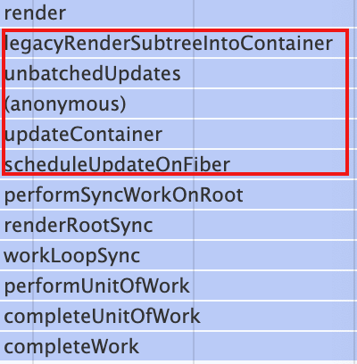
>
> 初始化就是从`legacyRenderSubtreeIntoContainer`到`scheduleUpdateOnFiber`的过程，这中间主要做了两件事：第一件事就是初始化FiberRoot；第二件事就是进入非批量更新的逻辑，`scheduleUpdateOnFiber`调度更新之后，初始化阶段才算真正完成；当然真正更新是第二个阶段render阶段的事，也就是`performSyncWorkOnRoot`函数要做的事。

#### 初始化`FiberRoot`

还是在`legacyRenderSubtreeIntoContainer`的逻辑里。

初次渲染是非批量更新的，这是因为批量更新是异步的可以被打断，但是初次渲染需要尽快完成、不能被打断，所以不执行批量更新。

初次渲染`root`为`undefined`，所以`root = container._reactRootContainer=legacyCreateRootFromDOMContainer(container,forceHydrate,);`

其中`legacyCreateRootFromDOMContainer`函数在` packages/raect-dom/src/client/ReactDomLegacy.js`文件中，主要做的就是在最后返回`createLegacyRoot`的调用，而`createLegacyRoot`函数在` packages/raect-dom/src/client/ReactDomRoot.js`文件中：

```js
export function createLegacyRoot(
  container: Container,
  options?: RootOptions,
): RootType {
  return new ReactDOMLegacyRoot(container, options);
}
```

可以看到其内部实例化了`ReactDOMLegacyRoot`（同样在` packages/raect-dom/src/client/ReactDomRoot.js`文件中）：

```js
function ReactDOMLegacyRoot(container: Container, options: void | RootOptions) {
  this._internalRoot = createRootImpl(container, LegacyRoot, options);
}
```

可以看到该实例的属性 `_internalRoot` 是 `createRootImpl(container, tag, options)`，函数`createRootImpl`同样在` packages/raect-dom/src/client/ReactDomRoot.js`文件中：

```js
function createRootImpl(
  container: Container,
  tag: RootTag,
  options: void | RootOptions,
) {
  // 省略了其他逻辑
  const root = createContainer(
    container,
    tag,
    hydrate,
    hydrationCallbacks,
    strictModeLevelOverride,
  );
	// 省略了其他逻辑
  return root;
}
```

进入`createContainer`的逻辑，函数在`packages/react-reconciler/src/Reconciler.js`中：

```js
export function createContainer(
  containerInfo: Container,
  tag: RootTag,
  hydrate: boolean,
  hydrationCallbacks: null | SuspenseHydrationCallbacks,
  strictModeLevelOverride: null | number,
): OpaqueRoot {
  return createFiberRoot(
    containerInfo,
    tag,
    hydrate,
    hydrationCallbacks,
    strictModeLevelOverride,
  );
}
```

`createFiberRoot`函数在`packages/react-reconciler/src/ReactFiberRoot.js`里：

```js
export function createFiberRoot(
  containerInfo: any,
  tag: RootTag,
  hydrate: boolean,
  hydrationCallbacks: null | SuspenseHydrationCallbacks,
  strictModeLevelOverride: null | number,
): FiberRoot {
  const root: FiberRoot = (new FiberRootNode(containerInfo, tag, hydrate): any);
//省略中间判断逻辑
  return root;
}
```

可以看到最后是实例化了 `FiberRootNode(containerInfo, tag, hydrate)` 构造函数，也就是 `FiberRoot` 。

**至此，我们走完了初次渲染的第一步：初始化`FiberRoot`；**。

##### 总结

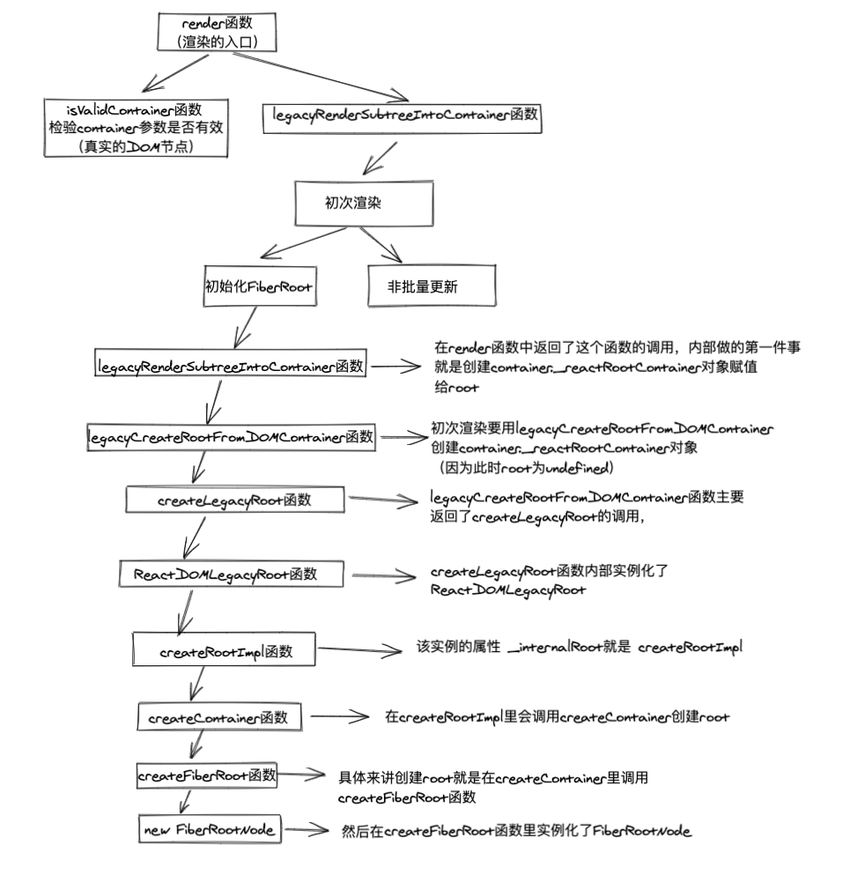

#### 非批量更新

创建了`FiberRoot`后就要开始更新了，对于初次渲染来讲是非批量更新：

> 这是因为批量更新是异步的可以被打断，但是初次渲染需要尽快完成、不能被打断，所以要执行非批量更新。

```js
// packages/raect-reconciler/src/ReactFiberWorkLoop.old.js(ReactFiberWorkLoop.new.js)
export function unbatchedUpdates<A, R>(fn: (a: A) => R, a: A): R {
  // 这部分就是对上下文的处理
  const prevExecutionContext = executionContext;
  // 去除executionContext上的BatchedContext
  executionContext &= ~BatchedContext;
  // 往executionContext上添加LegacyUnbatchedContext
  executionContext |= LegacyUnbatchedContext;
  // 进行回调
  try {
    // 直接调用传入的回调函数 fn，对应当前链路中的 updateContainer 方法
    return fn(a);
  } finally {
    // finally 逻辑里是对回调队列的处理
    executionContext = prevExecutionContext;
    if (executionContext === NoContext) {
      // Flush the immediate callbacks that were scheduled during this batch
      resetRenderTimer();
      // 刷新同步任务队列
      flushSyncCallbackQueue();
    }
  }
}
```

所以在 `unbatchedUpdates` 函数体里，它直接调用了传入的回调 fn。而在当前链路中，**fn 是针对 updateContainer 的调用。**

```js
unbatchedUpdates(function () {
  updateContainer(children, fiberRoot, parentComponent, callback);
});
```

来看`updateContainer`的逻辑，`updateContainer`函数主要做了三件事：

+ 请求当前 `Fiber` 节点的 `lane`（优先级）；

+ 结合` lane`（优先级），创建当前 `Fiber` 节点的 `update` 对象，并将其入队；

+ 调度当前节点（`rootFiber`）。

**这一步主要做的就是创建`update`任务更新队列**

```js
//函数位于packages/raect-reconciler/src/ReactFiberReconciler.old.js(ReactFiberReconciler.new.js)
export function updateContainer(
  element: ReactNodeList,
  container: OpaqueRoot,
  parentComponent: ?React$Component<any, any>,
  callback: ?Function,
): Lane {
  
  //...开发环境下的判断逻辑
  
  // 这是一个比较关键的入参，lane 表示优先级
  const lane = requestUpdateLane(current);
  // 结合 lane（优先级）信息，创建 update 对象，一个 update 对象意味着一个更新
  const update = createUpdate(eventTime, lane);
  // update 的 payload 对应的是一个 React 元素
  update.payload = {element};
	// 处理 callback，这个 callback 其实就是我们调用 ReactDOM.render 时传入的 callback
  callback = callback === undefined ? null : callback;
  if (callback !== null) {
    //...开发环境下的判断逻辑
    update.callback = callback;
  }
	//将update加入updateQueue
  enqueueUpdate(current, update, lane);
  //调度更新
  const root = scheduleUpdateOnFiber(current, lane, eventTime);
  if (root !== null) {
    entangleTransitions(root, current, lane);
  }
  // 返回当前节点（fiberRoot）的优先级
  return lane;
}
```

在`updateContainer`函数的最后，会进行调度更新的操作`scheduleUpdateOnFiber`，调度更新之后，初始化阶段才算真正完成，然后会进入`render`的第二个阶段——`render`阶段。

#### 总结

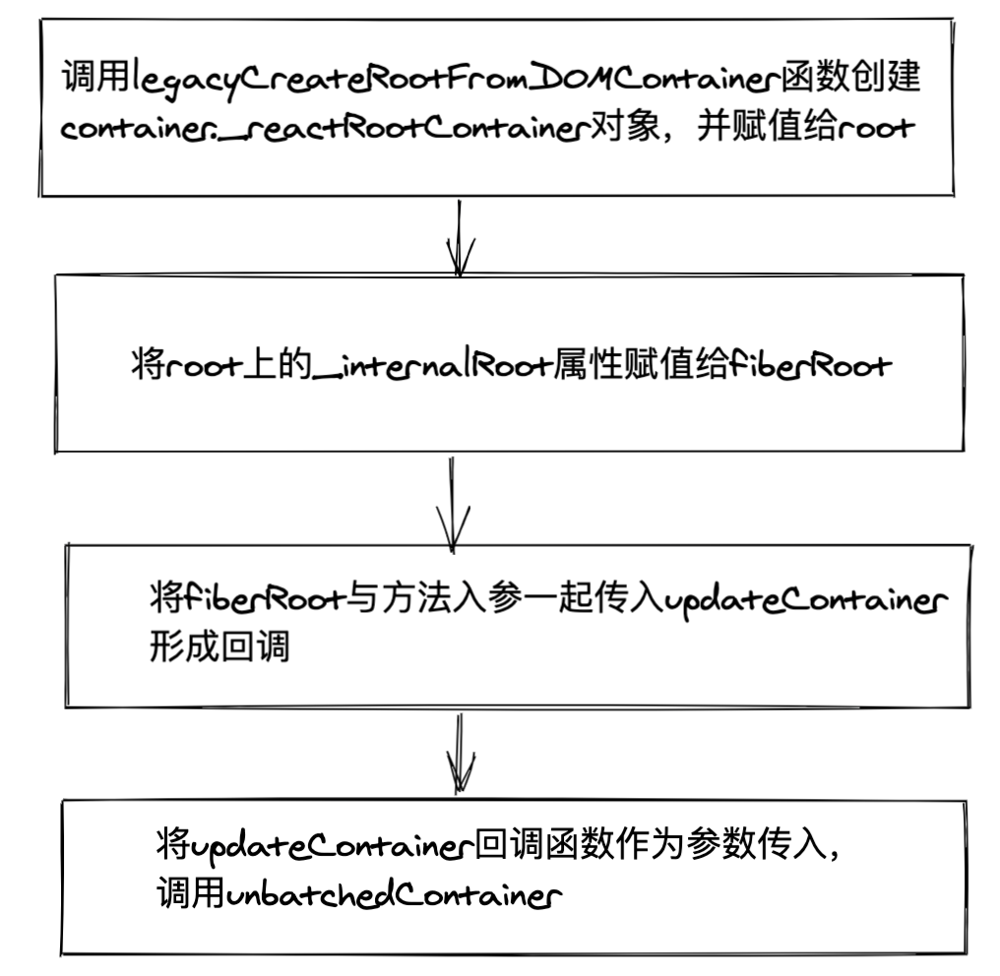

### `render`

> 从`performSyncWorkOnRoot`到`commitRoot`。

`render阶段`开始于`performSyncWorkOnRoot`或`performConcurrentWorkOnRoot`方法的调用。这取决于本次更新是同步更新还是异步更新。

> `render`是一个深度优先遍历创建`Fiber`树的过程，整个 `Fiber` 树的构建过程中，会有**`beginWork`** 和 **`completeWork`** 穿插工作。
>
> 无论是 `beginWork` 还是 `completeWork`，它们的应用对象都是 `workInProgress` 树上的节点。我们说 `render` 阶段是一个递归的过程，“递归”的对象，正是这棵 `workInProgress` 树。
>
> `render`阶段会递归`workInProgress`树，找到需要更新的部分。**`render` 阶段的工作目标是找出界面中需要处理的更新**。
>
> 
>
> 在`beginWork`一节我们提到
>
> > 对于`update`的组件，他会将当前组件与该组件在上次更新时对应的Fiber节点比较（也就是俗称的Diff算法），将比较的结果生成新Fiber节点。
>
> `Diff`的入口函数`reconcileChildFibers`（在`beginwork`中的`switch`逻辑中的`upDateXXX`这一大类函数中被调用）出发，该函数会根据`newChild`（即`JSX对象`）类型调用不同的处理函数。
>
> ## “递”阶段
>
> 首先从`rootFiber`开始向下深度优先遍历。为遍历到的每个`Fiber节点`调用`beginWork`方法。
>
> 该方法会根据传入的`Fiber节点`创建`子Fiber节点`，并将这两个`Fiber节点`连接起来。
>
> 当遍历到叶子节点（即没有子组件的组件）时就会进入“归”阶段。
>
> ## “归”阶段
>
> 在“归”阶段会调用`completeWork` 处理`Fiber节点`——创建DOM节点。
>
> 当某个`Fiber节点`执行完`completeWork`，如果其存在`兄弟Fiber节点`（即`fiber.sibling !== null`），会进入其`兄弟Fiber`的“递”阶段。
>
> 如果不存在`兄弟Fiber`，会进入`父级Fiber`的“归”阶段。
>
> “递”和“归”阶段会交错执行直到“归”到`rootFiber`。至此，`render阶段`的工作就结束了。

#### 创建`workInProgress Fiber`树

> 整体的流程如下：首先构建`workInProgress Fiber`树的头部节点，确立`current fiber`树和`workInProgress`树的关系；构建`workInProgress Fiber`树。

首先看`performSyncWorkOnRoot`函数（在`scheduleUpdateOnFiber`函数里，执行到这个函数标志着`render`的开始），位于`/packages/react-reconciler/src/ReactFiberWorkLoop.js`中，这个函数的关键在于调用了`renderRootSync`（**做了两件事，第一件就是构建`workInProgress`节点，初始化`current fiber`树和`workInProgress`树的关系；第二件事就是构建`workInProgress Fiber`树(从`beginWork`开始)**）。

`renderRootSync`函数的位置在`/packages/react-reconciler/src/RenactFiberWorkLoop.js`里（在这个函数里构建了`workInProgress`节点，创建新节点，构建`Fiber`树）。

而在`renderRootSync`函数里又调用了`prepareFreshStack`函数，`prepareFreshStack` 函数的作用是重置一个新的堆栈环境，**在`prepareFreshStack` 函数里，核心是对`createWorkInProgress`函数的调用**。`createWorkInProgress` 函数位于`/packages/react-reconciler/src/ReactFiber.js`：

```js
// 这里入参中的 current 传入的是现有树结构中的 rootFiber 对象
function createWorkInProgress(current, pendingProps) {
  // react使用了双缓存技术，我们最多可以有两棵fiber树
  // current fiber树和workInProgress树
  // 两棵树分别通过每棵树的alternate属性联系在一起
  let workInProgress = current.alternate;
  // ReactDOM.render 触发的首屏渲染将进入这个逻辑
  if (workInProgress === null) {
    // 1.workInProgress 是 createFiber 方法的返回值
    workInProgress = createFiber(current.tag, pendingProps, current.key, current.mode);
    workInProgress.elementType = current.elementType;
    workInProgress.type = current.type;
    workInProgress.stateNode = current.stateNode;
    // 2.workInProgress 的 alternate 将指向 current
    workInProgress.alternate = current;
    // 3.current 的 alternate 将反过来指向 workInProgress
    current.alternate = workInProgress;
  } else {
    // ...省略else 的逻辑
  }
  // ...省略 workInProgress 对象的属性处理逻辑
  // 返回 workInProgress 节点
  return workInProgress;
}
```

`createWorkInProgress`做了三件事：

- `createWorkInProgress` 函数**调用 `createFiber`**，`workInProgress`**是 `createFiber` 方法的返回值**；
- `workInProgress` 的 **`alternate` 指向 `current`**；
- **`current` 的 `alternate` 反过来指向 `workInProgress`**。

`createFiber`函数也很简单，同样位于`/packages/react-reconciler/src/ReactFiber.js`中：

```js
const createFiber = function(
  tag: WorkTag,
  pendingProps: mixed,
  key: null | string,
  mode: TypeOfMode,
): Fiber {
  return new FiberNode(tag, pendingProps, key, mode);
};
```

我们可以看到**`createFiber` 最后创建了一个 `FiberNode` 实例**，对于 `FiberNode`，我们知道他就是 `Fiber` 节点的类型。**因此 `workInProgress` 就是一个 `Fiber` 节点**。而且 `workInProgress` 的入参其实来源于 `current`：

```js
 workInProgress = createFiber(current.tag, pendingProps, current.key, current.mode);
```

**所以，`workInProgress` 节点其实就是 `current` 节点（即 `rootFiber`）的副本**。

再结合 `current` 指向 `rootFiber`对象（同样是 `FiberNode` 实例），以及 `current` 和 `workInProgress` 通过 `alternate` 联系在一起，所以，整棵树的结构应该如下所示：

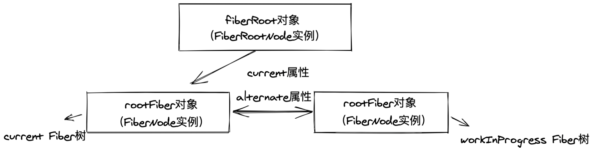

到这里，完成了第一个任务：创建`workInProgress节点`构建出`current fiber`树和`workInProgress`树的关系；接下来做第二件事，就进入`workLoopSync`的逻辑（`/packages/react-reconciler/src/ReactFiberWorkLoop.js`）：

```js
function workLoopSync() {
  // 若 workInProgress 不为空
  while (workInProgress !== null) {
    // 针对它执行 performUnitOfWork 方法
    performUnitOfWork(workInProgress);
  }
}
```

`workLoopSync` 做的事情就是**通过 `while` 循环反复判断 `workInProgress` 是否为空，并在不为空的情况下针对它执行 `performUnitOfWork` 函数**（`/packages/react-reconciler/src/ReactFiberWorkLoop.js`）：

```js
function performUnitOfWork(unitOfWork: Fiber): void {
  // ...
  let next;
  if (enableProfilerTimer && (unitOfWork.mode & ProfileMode) !== NoMode) {
    startProfilerTimer(unitOfWork);
    next = beginWork(current, unitOfWork, subtreeRenderLanes);    stopProfilerTimerIfRunningAndRecordDelta(unitOfWork, true);
  } else {
    next = beginWork(current, unitOfWork, subtreeRenderLanes);
  }
  // ...
}
```

 `performUnitOfWork` 函数将**触发对 `beginWork` 的调用，进而实现对新 `Fiber` 节点的创建**。若 `beginWork` 所创建的 `Fiber` 节点不为空，则 `performUniOfWork` 会用这个新的 `Fiber` 节点来更新 `workInProgress` 的值，**为下一次循环做准备**。

**通过循环调用 `performUnitOfWork` 来触发 `beginWork`，新的 `Fiber` 节点就会被不断地创建**。当 `workInProgress` 终于为空时，说明没有新的节点可以创建了，也就意味着已经完成对整棵 `Fiber` 树的构建。

在这个过程中，**每一个被创建出来的新 `Fiber` 节点，都会一个一个挂载为最初那个 `workInProgress` 节点的后代节点**。而上述过程中构建出的这棵 `Fiber` 树，也正是**`workInProgress` 树**。

而`current` 指针所指向的根节点所在的那棵树，我们叫它“**`current`树**”。

#### `beginWork`开启`fiber`节点创建

`beginWork`函数位于`/packages/react-reconciler/src/ReactFiberBeginWork.js`文件中，代码很多（400行左右）：

```js
function beginWork(
  current: Fiber | null,
  workInProgress: Fiber,
  renderLanes: Lanes,
): Fiber | null{
  ......
  //  current 节点不为空的情况下，会加一道辨识，看看是否有更新逻辑要处理
  if (current !== null) {
    // 获取新旧 props
    const oldProps = current.memoizedProps;
    const newProps = workInProgress.pendingProps;
    // 若 props 更新或者上下文改变，则认为需要"接受更新"
    if (oldProps !== newProps || hasContextChanged() || (
     workInProgress.type !== current.type )) {
      // 打个更新标
      didReceiveUpdate = true;
    } else if (xxx) {
      // 不需要更新的情况 A
      return A
    } else {
      if (需要更新的情况 B) {
        didReceiveUpdate = true;
      } else {
        // 不需要更新的其他情况，这里我们的首次渲染就将执行到这一行的逻辑
        didReceiveUpdate = false;
      }
    }
  } else {
    didReceiveUpdate = false;
  } 
  ......
  // 这堆 switch 是 beginWork 中的核心逻辑，原有的代码量相当大
  switch (workInProgress.tag) {
    ......
    // 这里省略掉大量形如"case: xxx"的逻辑
    // 根节点将进入这个逻辑
    case HostRoot:
      return updateHostRoot(current, workInProgress, renderLanes)
    // dom 标签对应的节点将进入这个逻辑
    case HostComponent:
      return updateHostComponent(current, workInProgress, renderLanes)
    // 文本节点将进入这个逻辑
    case HostText:
      return updateHostText(current, workInProgress)
    ...... 
    // 这里省略掉大量形如"case: xxx"的逻辑
  }
 	// 这里是错误兜底，处理 switch 匹配不上的情况
  invariant(
    false,
    'Unknown unit of work tag (%s). This error is likely caused by a bug in ' +
      'React. Please file an issue.',
    workInProgress.tag,
  );
}
```

其中`invariant`函数位于`/packages/shared/invariant.js`中(就是抛出错误)：

```js
export default function invariant(condition, format, a, b, c, d, e, f) {
  throw new Error(
    'Internal React error: invariant() is meant to be replaced at compile ' +
      'time. There is no runtime version.',
  );
}
```

整理一下`beginWork`做的事：

1. `beginWork` 的入参是**一对用 `alternate` 连接起来的 `workInProgress` 和 `current` 节点**；
2. **`beginWork` 的核心逻辑是根据 `fiber` 节点（`workInProgress`**）**的 `tag` 属性的不同，调用不同的节点创建函数**。

当前的 `current` 节点是 `rootFiber`，而 `workInProgress` 则是 `current` 的副本，它们的 `tag` 都是 3，如下图所示：


而 3 正是 `HostRoot` 所对应的值，因此第一个 `beginWork` 将进入 `updateHostRoot` 的逻辑。

在整段 `switch` 逻辑里，包含的形如“`update`+类型名”这样的函数是非常多的。这些函数之间不仅命名形式一致，工作内容也相似。就 `render` 链路来说，它们共同的特性，就是都会**通过调用 `reconcileChildren` 方法，生成当前节点的子节点**。

`reconcileChildren` 的源码如下（`/packages/react-reconciler/src/ReactFiberBeginWork.js`）：

```js
export function reconcileChildren(
  current: Fiber | null,
  workInProgress: Fiber,
  nextChildren: any,
  renderLanes: Lanes,
){
  // 判断 current 是否为 null
  if (current === null) {
    // 若 current 为 null，则进入 mountChildFibers 的逻辑
    workInProgress.child = mountChildFibers(workInProgress, null, nextChildren, renderLanes);
  } else {
    // 若 current 不为 null，则进入 reconcileChildFibers 的逻辑
    workInProgress.child = reconcileChildFibers(workInProgress, current.child, nextChildren, renderLanes);
  }
}
```

从源码来看，`reconcileChildren` 也只是做逻辑的分发，具体的工作还要到 **`mountChildFibers`** 和 **`reconcileChildFibers`** 里去看。

#### 真正处理 `Fiber` 节点——`ChildReconciler`

在源码中，我们可以看到两个赋值语句（`/packages/react-reconciler/src/ReactChildFiber.js`）：

```js
export const reconcileChildFibers = ChildReconciler(true);
export const mountChildFibers = ChildReconciler(false);
```

实际上 `reconcileChildFibers` 和 `mountChildFibers` **就是 `ChildReconciler` 这个函数的返回值，仅仅存在入参上的区别**（即对于副作用的处理）。而 `ChildReconciler`逻辑更加复杂（大概1000行），这里只看主要逻辑（同样位于`/packages/react-reconciler/src/ReactChildFiber.js`中）：

```js
function ChildReconciler(shouldTrackSideEffects) {
  // 删除节点的逻辑
  function deleteChild(returnFiber: Fiber, childToDelete: Fiber): void {
    if (!shouldTrackSideEffects) {
      // Noop.
      return;
    } 
    // 以下执行删除逻辑
  }
  ......
  // 单个节点的插入逻辑
  function placeSingleChild(newFiber: Fiber): Fiber {
    if (shouldTrackSideEffects && newFiber.alternate === null) {
      newFiber.flags = Placement;
    }
    return newFiber;
  }
  // 插入节点的逻辑
  function placeChild(
    newFiber: Fiber,
    lastPlacedIndex: number,
    newIndex: number,
  ): number {
    newFiber.index = newIndex;
    if (!shouldTrackSideEffects) {
      // Noop.
      return lastPlacedIndex;
    }
    // 以下执行插入逻辑
  }
  ......
  // 此处省略一系列 updateXXX 的函数，它们用于处理 Fiber 节点的更新
  // 处理不止一个子节点的情况
  function reconcileChildrenArray(
    returnFiber: Fiber,
    currentFirstChild: Fiber | null,
    newChildren: Array<*>,
    lanes: Lanes,
  ): Fiber | null {
    ......
  }
  // 此处省略一堆 reconcileXXXXX 形式的函数，它们负责处理具体的 reconcile 逻辑
  function reconcileChildFibers(
    returnFiber: Fiber,
    currentFirstChild: Fiber | null,
    newChild: any,
    lanes: Lanes,
  ): Fiber | null {
    // 这是一个逻辑分发器，它读取入参后，会经过一系列的条件判断，调用上方所定义的负责具体节点操作的函数
  }
  // 将总的 reconcileChildFibers 函数返回
  return reconcileChildFibers;
}
```

要点在于：

1. 关键的入参 `shouldTrackSideEffects`，意为“是否需要追踪副作用”，**因此 `reconcileChildFibers` 和 `mountChildFibers` 的不同，在于对副作用的处理不同**；
2. `ChildReconciler` 中定义了大量如 `placeXXX`、`deleteXXX`、`updateXXX`、`reconcileXXX` 等这样的函数，这些函数覆盖了对 `Fiber` 节点的创建、增加、删除、修改等动作，将直接或间接地被 `reconcileChildFibers` 所调用；
3. `ChildReconciler` 的返回值是一个名为 `reconcileChildFibers` 的函数，这个函数是一个逻辑分发器，**它将根据入参的不同，执行不同的 `Fiber` 节点操作，最终返回不同的目标 `Fiber` 节点**。

对于第 1 点，这里展开说说。对副作用的处理不同，以 `placeSingleChild` 为例，以下是 `placeSingleChild` 的源码：

```js
function placeSingleChild(newFiber) {
  if (shouldTrackSideEffects && newFiber.alternate === null) {
    newFiber.flags = Placement;
  }
  return newFiber;
}
```

可以看出，一旦判断 `shouldTrackSideEffects` 为 `false`，那么下面所有的逻辑都不执行了，直接返回。

如果执行后面的逻辑，就会给 `Fiber` 节点打上一个叫“`flags`”的标记，像这样：

```js
newFiber.flags = Placement;
```

由于`current` 是 `rootFiber`，它不为 `null`，也就是说在 `mountChildFibers` 和 `reconcileChildFibers` 之间，它选择的是 **`reconcileChildFibers`**。

结合前面的分析可知，`reconcileChildFibers` 是`ChildReconciler(true)`的返回值。入参为 `true`，意味着其内部逻辑是允许追踪副作用的，因此“打`effectTag`”这个动作将会生效。

接下来进入 `reconcileChildFibers` 的逻辑，在 `reconcileChildFibers` 这个逻辑分发器中，会把 `rootFiber`子节点的创建工作分发给`reconcileSingleElement` 来处理，

`reconcileSingleElement` 将基于 `rootFiber` 子节点的 `ReactElement` 对象信息，创建其对应的 `FiberNode`。

这里需要说明的一点是：**rootFiber 作为 Fiber 树的根节点**，它并没有一个确切的 `ReactElement` 与之映射。结合` JSX` 结构来看，**我们可以将其理解为是 `JSX` 中根组件的父节点**。

##### `flags`标记

> `flags`用来标记副作用。

在`react17`中，该属性名是 `flags`，但在更早一些的版本中，这个属性名叫“`effectTag`”。在社区讨论中，`effectTag` 这个叫法更常见，也更语义化，因此以 “`effectTag`”代指“`flags`”。

`Placement` 这个 `effectTag` 的意义，是在渲染器执行时，也就是真实 DOM 渲染时，告诉渲染器：**我这里需要新增 DOM 节点**。` effectTag` 记录的是**副作用的类型**，而**所谓“副作用”**，`React` 给出的定义是“**数据获取、订阅或者修改 DOM**”等动作。在这里，`Placement` 对应的是 DOM 相关的副作用操作。

像 `Placement` 这样的副作用标识，还有很多，它们均以二进制常量的形式存在：

```js
// You can change the rest (and add more).
export const Placement = /*                    */ 0b000000000000000000010;
export const Update = /*                       */ 0b000000000000000000100;
export const PlacementAndUpdate = /*           */ Placement | Update;
export const Deletion = /*                     */ 0b000000000000000001000;
export const ChildDeletion = /*                */ 0b000000000000000010000;
```

##### `Fiber` 节点的创建过程梳理

我们说在`workInProgress`阶段会做两件事，创建`workInProgress节点`构建出`current fiber`树和`workInProgress`树的关系；第二件事，进入`workLoopSync`的逻辑循环，不断创建新的`Fiber`节点，并添加到`workInProgress`树里。

`workLoopSync`会循环地调用 `performUnitOfWork`**，而 `performUnitOfWork`，之前已经提过，其主要工作是“ 通过调用 `beginWork`，来实现新 `Fiber` 节点的创建 ”；它还有一个次要工作，**就是把新创建的这个 `Fiber` 节点的值更新到 `workInProgress` 变量里去。

`beginWork`开启`fiber`节点的创建，在不同的`switch case`里面，通过调用`updateXXX`来调用真正创建`fiber`节点的函数`reconcileChildren`。不过`reconcileChildren`也只是做逻辑的分发，具体的工作是**`mountChildFibers`** 和 **`reconcileChildFibers`** 这两个函数来完成的。

不过**`mountChildFibers`** 和 **`reconcileChildFibers`**也只是对应了`ChildReconciler`的不同入参，所以`beginWork`是开启了`fiber`节点的创建，`ChildReconciler`才是真正开始创建节点的核心函数，**它将根据入参的不同，执行不同的 `Fiber` 节点操作，最终返回不同的目标 `Fiber` 节点**。

##### `Fiber`树的创建过程梳理

##### 循环创建新的 `Fiber` 节点

研究节点创建的工作流，我们的切入点是`workLoopSync`这个函数：

```js
function workLoopSync() {
  // 若 workInProgress 不为空
  while (workInProgress !== null) {
    // 针对它执行 performUnitOfWork 方法
    performUnitOfWork(workInProgress);
  }
}
```

**它会循环地调用 `performUnitOfWork`**，而 `performUnitOfWork`，之前已经提过，其主要工作是“ 通过调用 `beginWork`，来实现新 `Fiber` 节点的创建 ”；它还有一个次要工作，**就是把新创建的这个 `Fiber` 节点的值更新到 `workInProgress` 变量里去**。源码中的相关逻辑提取如下：

```js
// 新建 Fiber 节点
next = beginWork$1(current, unitOfWork, subtreeRenderLanes);
// 将新的 Fiber 节点赋值给 workInProgress
if (next === null) {
  completeUnitOfWork(unitOfWork);
} else {
  workInProgress = next;
}
```

如此便能够确保每次 `performUnitOfWork` 执行完毕后，当前的 **`workInProgress` 都存储着下一个需要被处理的节点，从而为下一次的 `workLoopSync` 循环做好准备**。

**组件自上而下，每一个非文本类型的 `ReactElement` 都有了它对应的 `Fiber` 节点**。

> 注：`React` 并不会为所有的文本类型 `ReactElement` 创建对应的 `FiberNode`，这是一种优化策略。是否需要创建 `FiberNode`，在源码中是通过`isDirectTextChild`这个变量来区分的。

这样一来，我们构建的这棵树里，就多出了不少 `FiberNode`。

##### `Fiber` 节点间连接

```js
function App() {
    return (
      <div className="App">
        <div className="container">
          <h1>我是标题</h1>
          <p>我是第一段话</p>
          <p>我是第二段话</p>
        </div>
      </div>
    );
}
```

**不同的 `Fiber` 节点之间，将通过 `child`、`return`、`sibling` 这 3 个属性建立关系**，**其中 `child`、`return` 记录的是父子节点关系（`return`指向父Fiber节点，`child`指向第一个子`Fiber`节点），而 `sibling` 记录的则是兄弟节点关系（ 指向的是当前节点的第 1 个兄弟节点）**。

这里我以 `h1` 这个元素对应的 `Fiber` 节点为例，给你展示下它是如何与其他节点相连接的。展开这个 `Fiber` 节点，对它的 `child`、 `return`、`sibling` 3 个属性作截取：

`child` 属性为 `null`，说明 `h1` 节点没有子 `Fiber` 节点：

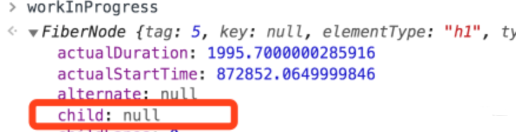

`return`属性：

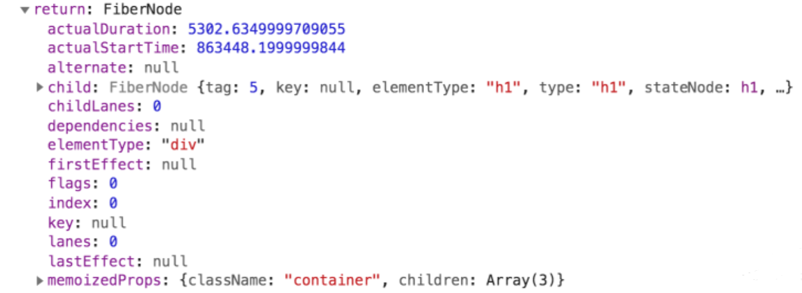

`sibling`属性：

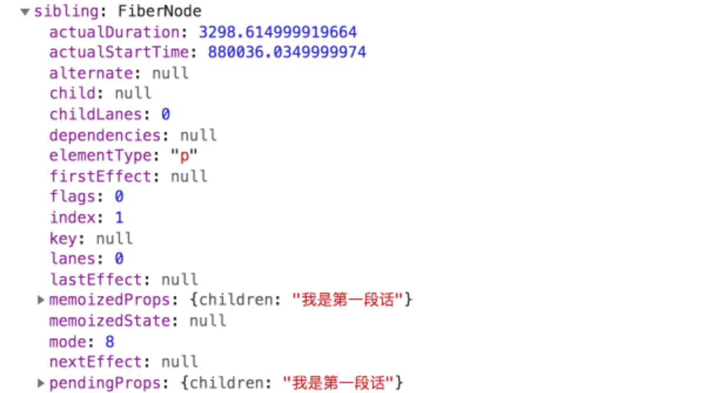

`return` 属性指向的是 `class` 为 `container` 的 `div` 节点，而 `sibling` 属性指向的是第 1 个 `p` 节点。结合` JSX` 中的嵌套关系 ——**`FiberNode` 实例中，`return` 指向的是当前 `Fiber` 节点的父节点，而 `sibling` 指向的是当前节点的第 1 个兄弟节点**。

结合这 3 个属性所记录的节点间关系信息，我们可以轻松地将上面梳理出来的新 `FiberNode` 连接起来：

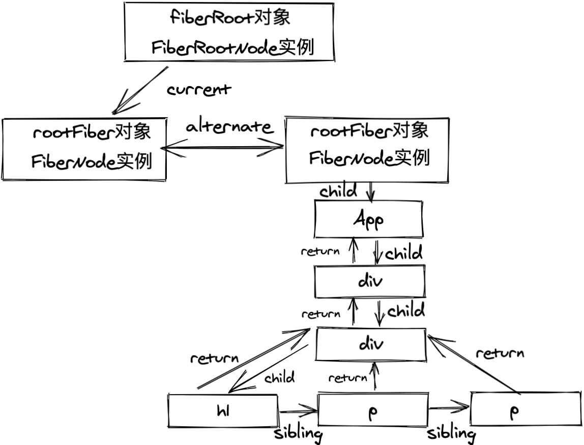

以上便是` workInProgress Fiber` 树的最终形态了。从图中可以看出，虽然人们习惯上仍然将眼前的这个产物称为“`Fiber` 树”，但**它的数据结构本质其实已经从树变成了链表**。

注意，在分析 `Fiber` 树的构建过程时，我们选取了 **`beginWork`** 作为切入点，但整个 `Fiber` 树的构建过程中，并不是只有 `beginWork` 在工作。这其中，还穿插着 **`completeWork`** 的工作。只有将 `completeWork` 和 `beginWork` 放在一起来看，你才能够真正理解，`Fiber` 架构下的“深度优先遍历”到底是怎么一回事。

#### `completeWork`

> `completeWork`和`beginWork`一样，也是针对不同`fiber.tag`调用不同的处理逻辑，不过`beginWork`是创建`Fiber`节点，但是`completeWork`负责的是处理 `Fiber` 节点到 DOM 节点的映射逻辑（创建、处理DOM节点）。（回顾：**`beginWork` 的核心逻辑是根据 `fiber` 节点（`workInProgress`**）**的 `tag` 属性的不同，调用不同的节点创建函数**。）

##### `completeWork` 的调用时机

我们之前讲过`workLoopSync` 做的事情就是**通过 `while` 循环反复判断 `workInProgress` 是否为空，并在不为空的情况下针对它执行 `performUnitOfWork` 函数**。

实际上`completeWork`的执行时机是这样的：`performUnitOfWork——>beginWork——>completeUnitOfWork——>completeWork`（在`completeUnitOfWork`里调用了`completeWork`）：

> `performUnitOfWork`和`completeUnitOfWork`位于`/packages/react-reconciler/sec/ReactFiberWorkLoop.js`

```js
function performUnitOfWork(unitOfWork: Fiber): void {
  // 获取入参节点对应的current节点
  const current = unitOfWork.alternate;
  setCurrentDebugFiberInDEV(unitOfWork);

  let next;
  if (enableProfilerTimer && (unitOfWork.mode & ProfileMode) !== NoMode) {
    startProfilerTimer(unitOfWork);
    // 创建当前节点的子节点
    next = beginWork(current, unitOfWork, subtreeRenderLanes);
  stopProfilerTimerIfRunningAndRecordDelta(unitOfWork, true);
  } else {
    // 创建当前节点的子节点
    next = beginWork(current, unitOfWork, subtreeRenderLanes);
  }

  resetCurrentDebugFiberInDEV();
  unitOfWork.memoizedProps = unitOfWork.pendingProps;
  if (next === null) {
    // 调用 completeUnitOfWork
    completeUnitOfWork(unitOfWork);
  } else {
    // 将当前节点更新为新创建出的 Fiber 节点
    workInProgress = next;
  }
  ReactCurrentOwner.current = null;
}
```

`performUnitOfWork` 每次会尝试调用 `beginWork` 来创建当前节点的子节点，若创建出的子节点为空（也就意味着当前节点不存在子 `Fiber` 节点），则说明当前节点是一个叶子节点。**按照深度优先遍历的原则，当遍历到叶子节点时，“递”阶段就结束了，随之而来的是“归”的过程**。因此这种情况下，就会调用 `completeUnitOfWork`，执行当前节点对应的 `completeWork` 逻辑。

接下来我们在 `Demo` 代码的 `completeWork` 处打上断点，看看第一个走到 `completeWork` 的节点是哪个，结果如下图所示：

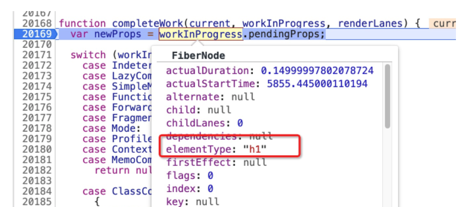

显然，第一个进入 `completeWork` 的节点是 `h1`，这也符合我们之前所构建出来的 `Fiber` 树中的节点关系，如下图所示：


由图可知，按照深度优先遍历的原则，`h1` 确实将是第一个被遍历到的叶子节点。接下来我们就以 `h1` 为例，一起看看 `completeWork` 都围绕它做了哪些事情。

##### `completeWork` 的工作原理

`completeWork`函数（大概700行）位于`/packages/react-reconciler/src/ReactFiberCompleteWork.js`：

```js
function completeWork(
  current: Fiber | null,
  workInProgress: Fiber,
  renderLanes: Lanes,
): Fiber | null {
  // 取出 Fiber 节点的属性值，存储在 newProps 里
  const newProps = workInProgress.pendingProps;
  // 根据 workInProgress 节点的 tag 属性的不同，决定要进入哪段逻辑
  switch (workInProgress.tag) {
    case ......:
      return null;
    case ClassComponent:
      {
        .....
      }
    case HostRoot:
      {
        ......
      }
    // h1 节点的类型属于 HostComponent，因此这里为你讲解的是这段逻辑
    case HostComponent:
      {
        popHostContext(workInProgress);
        const rootContainerInstance = getRootHostContainer();
        const type = workInProgress.type;
        // 判断 current 节点是否存在，因为目前是挂载阶段，因此 current 节点是不存在的
        if (current !== null && workInProgress.stateNode != null) {
          updateHostComponent(current, workInProgress, type, newProps, rootContainerInstance);
          if (current.ref !== workInProgress.ref) {
            markRef(workInProgress);
          }
        } else {
          // 这里首先是针对异常情况进行 return 处理
          if (!newProps) {
            invariant(
            workInProgress.stateNode !== null,
            'We must have new props for new mounts. This error is likely ' +
              'caused by a bug in React. Please file an issue.',
          );
            bubbleProperties(workInProgress);
            return null;
          }
          // 接下来就为 DOM 节点的创建做准备了
          const currentHostContext = getHostContext();
          // _wasHydrated 是一个与服务端渲染有关的值，这里不用关注
          const wasHydrated = popHydrationState(workInProgress);
          // 判断是否是服务端渲染
          if (wasHydrated) {
            // 这里不用关注，请你关注 else 里面的逻辑
            if (prepareToHydrateHostInstance(workInProgress, rootContainerInstance, currentHostContext)) {
              markUpdate(workInProgress);
            }
          } else {
            // 这一步很关键， createInstance 的作用是创建 DOM 节点
            const instance = createInstance(type, newProps, rootContainerInstance, currentHostContext, workInProgress);
            // appendAllChildren 会尝试把上一步创建好的 DOM 节点挂载到 DOM 树上去
            appendAllChildren(instance, workInProgress, false, false);
            // stateNode 用于存储当前 Fiber 节点对应的 DOM 节点
            workInProgress.stateNode = instance; 
            // finalizeInitialChildren 用来为 DOM 节点设置属性
            if (finalizeInitialChildren(instance, type, newProps, rootContainerInstance)) {
              markUpdate(workInProgress);
            }
          }
          ......
        }
        return null;
      }
    case HostText:
      {
        ......
      }
    case SuspenseComponent:
      {
        ......
      }
    case HostPortal:
      ......
      return null;
    case ContextProvider:
      ......
      return null;
    ......//各种case
  }
  invariant(
    false,
    'Unknown unit of work tag (%s). This error is likely caused by a bug in ' +
      'React. Please file an issue.',
    workInProgress.tag,
  );
}
```

 `completeWork` 的重点在于：

1. `completeWork` 的核心逻辑是一段体量巨大的 `switch` 语句，在这段 `switch` 语句中，**`completeWork` 将根据 `workInProgress` 节点的 `tag` 属性的不同，进入不同的 DOM 节点的创建、处理逻辑（和`beginWork`的思路一样）**。
2. 在 Demo 示例中，`h1` 节点的 `tag` 属性对应的类型应该是 `HostComponent`，也就是“原生 DOM 元素类型”。
3. `completeWork` 中的 `current`、 `workInProgress` 分别对应的是下图中左右两棵 `Fiber` 树上的节点：


其中 `workInProgress` 树代表的是“当前正在 `render` 中的树”，而 `current` 树则代表“已经存在的树”。

`workInProgress` 节点和 `current` 节点之间用 `alternate` 属性相互连接。在组件的挂载阶段，`current` 树只有一个 `rootFiber` 节点，并没有其他内容。因此 `h1` 这个 `workInProgress` 节点对应的 `current` 节点是 `null`。


所以关于 `completeWork`：

（1）用一句话来总结 `completeWork` 的工作内容：**负责处理 `Fiber` 节点到 DOM 节点的映射逻辑**。

（2）`completeWork` 内部有 3 个关键动作：

- **创建**DOM 节点（`CreateInstance`）
- 将 DOM 节点**插入**到 DOM 树中（`AppendAllChildren`）
- 为 DOM 节点**设置属性**（`FinalizeInitialChildren`）

（3）**创建好的 DOM 节点会被赋值给 `workInProgress` 节点的 `stateNode` 属性**。也就是说当我们想要定位一个 `Fiber` 对应的 DOM 节点时，访问它的 `stateNode` 属性就可以了。这里我们可以尝试访问运行时的 `h1` 节点的 `stateNode` 属性，结果如下图所示：

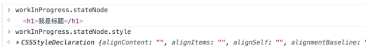

（4）将 DOM 节点插入到 DOM 树的操作是通过 `appendAllChildren`函数来完成的。

说是将 DOM 节点插入到 DOM 树里去，实际上是将**子 `Fiber` 节点所对应的 DOM 节点**挂载到其**父 `Fiber` 节点所对应的 DOM 节点里去**。比如说在本讲 Demo 所构建出的 `Fiber` 树中，`h1` 节点的父结点是 `div`，那么 `h1` 对应的 DOM 节点就理应被挂载到 `div` 对应的 DOM 节点里去。

那么如果执行 `appendAllChildren` 时，父级的 DOM 节点还不存在怎么办？

比如 `h1` 节点作为第一个进入 `completeWork` 的节点，它的父节点 `div` 对应的 DOM 就尚不存在。其实不存在也没关系，反正 `h1 DOM` 节点被创建后，会作为 `h1 Fiber` 节点的 `stateNode` 属性存在，丢不掉的。当父节点 `div` 进入 `appendAllChildren` 逻辑后，会逐个向下查找并添加自己的后代节点，这时候，`h1` 就会被挂载到父级 DOM 节点上。

##### `completeUnitOfWork` —— 开启收集 `EffectList` 的“大循环”

> 背景：我们之前讲过`workLoopSync` 做的事情就是**通过 `while` 循环反复判断 `workInProgress` 是否为空，并在不为空的情况下针对它执行 `performUnitOfWork` 函数**。`performUnitOfWork` 每次会尝试调用 `beginWork` 来创建当前节点的子节点，若创建出的子节点为空（也就意味着当前节点不存在子 `Fiber` 节点），则说明当前节点是一个叶子节点。**按照深度优先遍历的原则，当遍历到叶子节点时，“递”阶段就结束了，随之而来的是“归”的过程**。因此这种情况下，就会调用 `completeUnitOfWork`，执行当前节点对应的 `completeWork` 逻辑以及**存储副作用**。

`completeUnitOfWork` 的作用是开启一个大循环，在这个大循环中，将会重复地做下面三件事：

1. **针对传入的当前节点，调用 `completeWork`**，`completeWork` 的工作内容前面已经讲过，这一步应该是没有异议的；
2. 将**当前节点的副作用链**（`EffectList`）插入到其**父节点对应的副作用链**（`EffectList`）中；
3. 以当前节点为起点，循环遍历其兄弟节点及其父节点。当遍历到兄弟节点时，就会 `return` 掉当前调用，触发兄弟节点对应的 `performUnitOfWork` 逻辑；而遍历到父节点时，则会直接进入下一轮循环，也就是重复 1、2 的逻辑。

这里需要解读的是步骤 2 和步骤 3 的含义。

##### `completeUnitOfWork` 开启下一轮循环的原则

在理解副作用链之前，首先要理解 `completeUnitOfWork` 开启下一轮循环的原则，也就是步骤 3。步骤 3 相关的源码如下所示：

```js
do {
  ......
  // 这里省略步骤 1 和步骤 2 的逻辑 
  // 获取当前节点的兄弟节点
  var siblingFiber = completedWork.sibling;
  // 若兄弟节点存在
  if (siblingFiber !== null) {
    // 将 workInProgress 赋值为当前节点的兄弟节点
    workInProgress = siblingFiber;
    // 将正在进行的 completeUnitOfWork 逻辑 return 掉
    return;
  } 
  // 若兄弟节点不存在，completeWork 会被赋值为 returnFiber，也就是当前节点的父节点
  completedWork = returnFiber; 
    // 这一步与上一步是相辅相成的，上下文中要求 workInProgress 与 completedWork 保持一致
  workInProgress = completedWork;
} while (completedWork !== null);
```

步骤 3 是整个循环体的收尾工作，它会在当前节点相关的各种工作都做完之后执行。

当前节点处理完了，自然是去寻找下一个可以处理的节点。我们知道，当前的 `Fiber` 节点之所以会进入 `completeWork`，是因为“递无可递”了，才会进入“归”的逻辑，这就意味着当前 `Fiber` 要么没有 `child` 节点、要么 `child` 节点的 `completeWork` 早就执行过了。因此 `child` 节点不会是下次循环需要考虑的对象，下次循环只需要考虑兄弟节点（`sibling Fiber`）和父节点（`return Fiber`）。

在源码中，遇到兄弟节点会`return`，遇到父节点才会进入下次循环。以 `h1` 节点的节点关系为例进行说明：

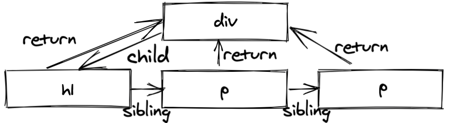

结合前面的分析和图示可知，**`h1` 节点是递归过程中所触及的第一个叶子节点，也是其兄弟节点中被遍历到的第一个节点**；而剩下的两个 `p` 节点，此时都还没有被遍历到，也就是说连 `beginWork` 都没有执行过。

**因此对于 `h1` 节点的兄弟节点来说，当下的第一要务是回去从 `beginWork` 开始走起，直到 `beginWork`“递无可递”时，才能够执行 `completeWork` 的逻辑**。`beginWork` 的调用是在 `performUnitOfWork` 里发生的，因此 `completeUnitOfWork` 一旦识别到当前节点的兄弟节点不为空，就会终止后续的逻辑，退回到上一层的 `performUnitOfWork` 里去。

接下来我们再来看 `h1` 的父节点 `div`：在向下递归到 `h1` 的过程中，`div` 必定已经被遍历过了，也就是说 `div`的“递”阶段（ `beginWork`） 已经执行完毕，只剩下“归”阶段的工作要处理了。因此，对于父节点，`completeUnitOfWork` 会毫不犹豫地把它推到下一次循环里去，让它进入 `completeWork` 的逻辑。

值得注意的是，**`completeUnitOfWork` 中处理兄弟节点和父节点的顺序是**：先检查兄弟节点是否存在，若存在则优先处理兄弟节点；确认没有待处理的兄弟节点后，才转而处理父节点。这也就意味着，**`completeWork` 的执行是严格自底向上的**，子节点的 `completeWork` 总会先于父节点执行。

> 自底向下的`completeWork`，子节点的 `completeWork` 总是比父节点先执行。每次处理到一个节点，都将当前节点的 `effectList` 插入到其父节点的 `effectList` 中。当所有节点的 `completeWork` 都执行完毕时，就可以从“终极父节点”，也就是 `rootFiber` 上，拿到一个**存储了当前 `Fiber` 树所有 `effect Fiber`**的“终极版”的 `effectList` 。`effectList`记录着**需要更新的后代节点**

##### 副作用链（`effectList`）的设计与实现

无论是 `beginWork` 还是 `completeWork`，它们的应用对象都是 `workInProgress` 树上的节点。我们说 `render` 阶段是一个递归的过程，“递归”的对象，正是这棵 `workInProgress` 树（见下图右侧高亮部分）：

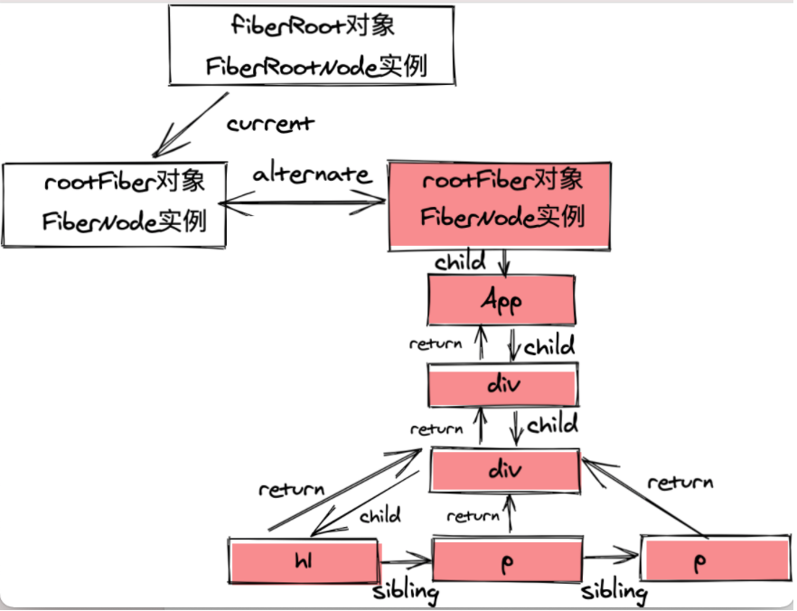

那么我们递归的目的是什么呢？或者说，`render` 阶段的工作目标是什么呢？

**`render` 阶段的工作目标是找出界面中需要处理的更新**。

在实际的操作中，并不是所有的节点上都会产生需要处理的更新。比如在挂载阶段，对图中的整棵 `workInProgress` 递归完毕后，React 会发现实际只需要对 `App` 节点执行一个挂载操作就可以了；而在更新阶段，这种现象更为明显。

更新阶段与挂载阶段的主要区别在于更新阶段的 `current` 树不为空，比如说情况可以是下图这样子的：

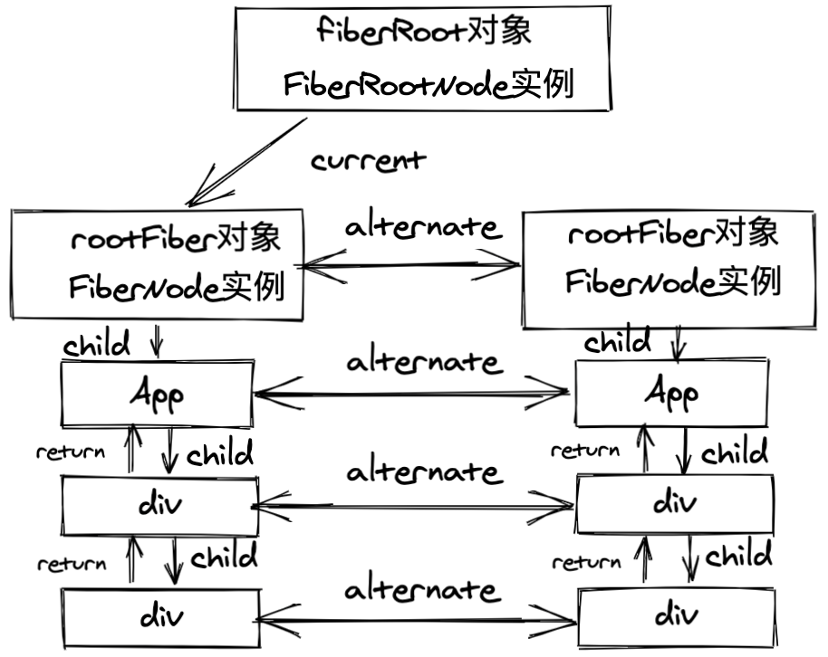

假如说我的某一次操作，仅仅对 `p` 节点产生了影响，那么对于渲染器来说，它理应只关注 `p` 节点这一处的更新（其余的就直接复用这里就涉及到diff算法）。**目标是让渲染器又快又好地定位到那些真正需要更新的节点**。

> 这里不是说怎么`diff`，而是说怎么把`diff`的结果告诉`commit`阶段。——通过副作用链

在 `render` 阶段，我们通过递归来明确“`p` 节点有一处更新”这件事情。按照 React 的设计思路，`render` 阶段结束后，“找不同”这件事情其实也就告一段落了。**`commit` 只负责实现更新，而不负责寻找更新**，这就意味着我们必须找到一个办法能让 `commit` 阶段“坐享其成”，能直接拿到 `render` 阶段的工作成果。而这，正是**副作用链**（**`effectList`**）的价值所在。

**副作用链（`effectList`）** 可以理解为 `render` 阶段“工作成果”的一个集合：每个 `Fiber` 节点都维护着一个属于它自己的 `effectList`，`effectList` 在数据结构上以链表的形式存在，链表内的每一个元素都是一个 `Fiber` 节点。这些 `Fiber` 节点需要满足两个共性：

1. 都是当前 `Fiber` 节点的后代节点
2. 都有待处理的副作用

没错，`Fiber` 节点的 `effectList` 里记录的并非它自身的更新，而是其**需要更新的后代节点**。带着这个结论，我们再来看一下 `completeUnitOfWork` 中的“步骤 2”：

> 将**当前节点的副作用链**（`effectList`）插入到其**父节点对应的副作用链**（`effectList`）中。

前面已经分析过，“**`completeWork` 是自底向上执行的**”，也就是说，子节点的 `completeWork` 总是比父节点先执行。每次处理到一个节点，都将当前节点的 `effectList` 插入到其父节点的 `effectList` 中。当所有节点的 `completeWork` 都执行完毕时，就可以从“终极父节点”，也就是 `rootFiber` 上，拿到一个**存储了当前 `Fiber` 树所有 `effect Fiber`**的“终极版”的 `effectList` 了。

**把所有需要更新的 `Fiber` 节点单独串成一串链表，方便后续有针对性地对它们进行更新，这就是所谓的“收集副作用”的过程**。

这里我以挂载过程为例，带你分析一下这个过程是如何实现的。

首先我们要知道的是，这个 `effectList` 链表在 `Fiber` 节点中是通过 `firstEffect` 和 `lastEffect` 来维护的，如下图所示：

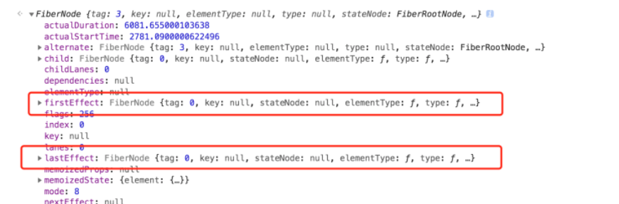

其中 `firstEffect` 表示 `effectList` 的第一个节点，而 `lastEffect` 则记录最后一个节点。

对于挂载过程来说，我们唯一要做的就是把 `App` 组件挂载到界面上去，因此 `App` 后代节点们的 `effectList` 其实都是不存在的。`effectList` 只有在 `App` 的父节点（`rootFiber`）这才不为空。

 `effectList` 的创建逻辑也非常简单，只需要为 `firstEffect` 和 `lastEffect` 各赋值一个引用即可。以下是从 `completeUnitOfWork` 源码中提取出的相关逻辑：

```js
// 若副作用类型的值大于“PerformedWork”，则说明这里存在一个需要记录的副作用
if (flags > PerformedWork) {
  // returnFiber 是当前节点的父节点
  if (returnFiber.lastEffect !== null) {
    // 若父节点的 effectList 不为空，则将当前节点追加到 effectList 的末尾去
    returnFiber.lastEffect.nextEffect = completedWork;
  } else {
    // 若父节点的 effectList 为空，则当前节点就是 effectList 的 firstEffect
    returnFiber.firstEffect = completedWork;
  }
  // 将 effectList 的 lastEffect 指针后移一位
  returnFiber.lastEffect = completedWork;
}
```

代码中的 `flags` 咱们已经反复强调过了，以前会被叫做“`effectTag`”，是用来标识副作用类型的；而“`completedWork`”这个变量，在当前上下文中存储的就是“正在被执行 `completeWork` 相关逻辑”的节点；至于“`PerformedWork`”，它是一个值为 1 的常量，`React`规定若 `flags`（又名 `effectTag`）的值小于等于 1，则不必提交到 `commit` 阶段。因此 `completeUnitOfWork` 只会对 `flags` 大于 `PerformedWork` 的 `effect fiber` 进行收集。

这里以 `App` 节点为例，走一遍 `effectList` 的创建过程：

1. `App FiberNode` 的 `flags` 属性为 3，大于 `PerformedWork`，因此会进入 `effectList` 的创建逻辑；
2. 创建 `effectList` 时，并不是为当前 `Fiber` 节点创建，而是为它的父节点创建，`App` 节点的父节点是 `rootFiber`，`rootFiber` 的 `effectList` 此时为空；
3. `rootFiber` 的 `firstEffect` 和 `lastEffect` 指针都会指向 `App` 节点，`App` 节点由此成为 `effectList` 中的唯一一个 `FiberNode`：


在“归”阶段，所有有`effectTag`的`Fiber节点`都会被追加在`effectList`中，最终形成一条以`rootFiber.firstEffect`为起点的单向链表：

```js
                       nextEffect         nextEffect
rootFiber.firstEffect -----------> fiber -----------> fiber
```

这样，在`commit阶段`只需要遍历`effectList`就能执行所有`effect`了。

借用`React`团队成员**Dan Abramov**的话：`effectList`相较于`Fiber树`，就像圣诞树上挂的那一串彩灯。

至此，`render阶段`全部工作完成。然后在`performSyncWorkOnRoot`函数中`fiberRootNode`被传递给`commitRoot`方法，开启`commit阶段`工作流程。

只需要把握住“根节点（`rootFiber`）上的 `effectList` 信息，是 `commit` 阶段的更新线索”这个结论，就足以将 `render` 阶段和 `commit` 阶段串联起来。

### `commit` 阶段工作流简析

> 实现更新，渲染DOM。
>
> 在`commit阶段`完成页面渲染后，`workInProgress Fiber树`变为`current Fiber树`，`workInProgress Fiber树`内`Fiber节点`的`updateQueue`就变成`current updateQueue`。

在整个 `ReactDOM.render` 的渲染链路中，`render` 阶段是 `Fiber` 架构的核心体现。所以介绍了很多。`render`阶段之后就是`commit`阶段。

`commit` 会在 `performSyncWorkOnRoot` 中被调用，如下图所示：

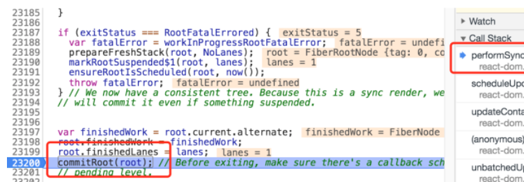

这里的入参 `root` 并不是 `rootFiber`，而是 `fiberRoot`（`FiberRootNode`）实例。`fiberRoot` 的 `current` 节点指向 `rootFiber`，因此拿到 `effectList` 对后续的 `commit` 流程来说不是什么难事。

从流程上来说，`commit` 共分为 3 个阶段：**`before` `mutation`、`mutation`、`layout`。**

- `before mutation` 阶段，**这个阶段 DOM 节点还没有被渲染到界面上去**，过程中会触发 `getSnapshotBeforeUpdate`，也会处理 `useEffect` 钩子相关的调度逻辑。
- `mutation`，**这个阶段负责 DOM 节点的渲染**。在渲染过程中，会遍历 `effectList`，根据 `flags`（`effectTag`）的不同，执行不同的 DOM 操作。
- `layout`，**这个阶段处理 DOM 渲染完毕之后的收尾逻辑**。比如调用 `componentDidMount/componentDidUpdate`，调用 `useLayoutEffect` 钩子函数的回调等。除了这些之外，它还会**把 `fiberRoot` 的 `current` 指针指向 `workInProgress Fiber` 树**。

对于 `commit`，**它是一个绝对同步的过程**。`render` 阶段可以同步也可以异步，但 `commit` 一定是同步的。

### Diff算法

`render`是一个深度优先遍历创建`Fiber`树的过程，整个 `Fiber` 树的构建过程中，会有**`beginWork`** 和 **`completeWork`** 穿插工作。

无论是 `beginWork` 还是 `completeWork`，它们的应用对象都是 `workInProgress` 树上的节点。我们说 `render` 阶段是一个递归的过程，“递归”的对象正是这棵 `workInProgress` 树。

`render`阶段会递归`workInProgress`树，找到需要更新的部分。**`render` 阶段的工作目标就是找出界面中需要处理的更新**。

在最开始我们提到：

> 对于`update`的组件，他会将当前组件与该组件在上次更新时对应的Fiber节点比较（也就是俗称的Diff算法），将比较的结果生成新Fiber节点。

`Diff`的入口函数`reconcileChildFibers`（在`beginwork`中的`switch`逻辑中的`upDateXXX`等一大类函数中被调用）出发，该函数会根据`newChild`（即`JSX对象`）类型调用不同的处理函数。

这一章讲解`Diff算法`的实现。

一个`DOM节点`在某一时刻最多会有4个节点和他相关。

1. `current Fiber`。如果该`DOM节点`已在页面中，`current Fiber`代表该`DOM节点`对应的`Fiber节点`。
2. `workInProgress Fiber`。如果该`DOM节点`将在本次更新中渲染到页面中，`workInProgress Fiber`代表该`DOM节点`对应的`Fiber节点`。
3. `DOM节点`本身。
4. `JSX对象`。即`ClassComponent`的`render`方法的返回结果，或`FunctionComponent`的调用结果。`JSX对象`中包含描述`DOM节点`的信息。

`Diff算法`的本质是对比1和4，生成2。

**即 `current Fiber`树与虚拟DOM树比对，生成`workInProgress Fiber`树，`Diff`的入口函数`reconcileChildFibers`，`render`阶段（`beginWork`里）的一个函数**。

```js
// 根据newChild类型选择不同diff函数处理
function reconcileChildFibers(
  returnFiber: Fiber,
  currentFirstChild: Fiber | null,
  newChild: any,
): Fiber | null {

  const isObject = typeof newChild === 'object' && newChild !== null;

  if (isObject) {
    // object类型，可能是 REACT_ELEMENT_TYPE 或 REACT_PORTAL_TYPE
    switch (newChild.$$typeof) {
      case REACT_ELEMENT_TYPE:
        // 调用 reconcileSingleElement 处理
      // // ...省略其他case
    }
  }

  if (typeof newChild === 'string' || typeof newChild === 'number') {
    // 调用 reconcileSingleTextNode 处理
    // ...省略
  }

  if (isArray(newChild)) {
    // 调用 reconcileChildrenArray 处理
    // ...省略
  }

  // 一些其他情况调用处理函数
  // ...省略

  // 以上都没有命中，删除节点
  return deleteRemainingChildren(returnFiber, currentFirstChild);
}
```

我们可以从同级的节点数量将Diff分为两类：

+ 当newChild类型为object、number、string，代表同级只有一个节点

+ 当newChild类型为Array，同级有多个节点

### Fiber 架构下的“双缓存”模式

> “两棵树”之间的合作模式会将挂载过程和更新过程联系起来。

#### “双缓存”模式

**两套缓存数据。呈现在眼前的连贯画面，就是不同的缓冲数据交替被读取后的结果**。

在计算机图形领域，通过让图形硬件交替读取两套缓冲数据，可以实现画面的无缝切换，减少视觉效果上的抖动甚至卡顿。在 React 中，双缓存模式的主要是**能够帮我们较大限度地实现 Fiber 节点的复用**，从而减少性能方面的开销。

#### current 树与 workInProgress 树

- 代表当前页面状态的`current Fiber树`，对应当前DOM映射的`Fiber`节点；
- 代表正在`render阶段`的`workInProgress Fiber树`

在 `React` 中，`current` 树与 `workInProgress` 树，两棵树可以对标“双缓存”模式下的两套缓冲数据：当 `current` 树呈现在用户眼前时，所有的更新都会由 `workInProgress` 树来承接。`workInProgress` 树将会在用户看不到的地方（内存里）完成所有改变，直到 `current` 指针指向它的时候，此时就意味着 `commit` 阶段已经执行完毕，`workInProgress` 树变成了那棵呈现在界面上的 `current` 树。

`Demo`代码如下：

```js
import { useState } from 'react';
function App() {
  const [state, setState] = useState(0)
  return (
    <div className="App">
      <div onClick={() => { setState(state + 1) }} className="container">
        <p style={{ width: 128, textAlign: 'center' }}>
          {state}
        </p>
      </div>
    </div>
  );
}
export default App;
```

这个组件挂载后呈现出的界面很简单，就是一个数字 0，如下图所示：


每点击数字 0 一下，它的值就会 +1，这就是我们的更新动作。

##### 挂载后的 `Fiber`  树

关于 Fiber 树的构建过程，前面已经详细讲解过，这里不再重复。下面直接展示挂载时的 `render` 阶段结束后，`commit` 执行前，两棵 `Fiber` 树的形态，如下图所示：

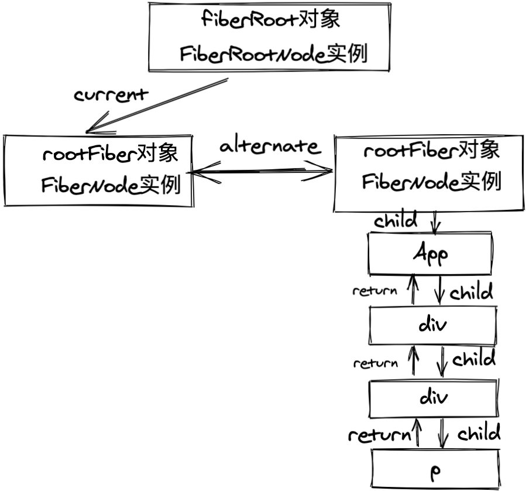

待 `commit` 阶段完成后，右侧的 `workInProgress` 树对应的 DOM 树就被真正渲染到了页面上，此时 `current` 指针会指向 `workInProgress` 树：

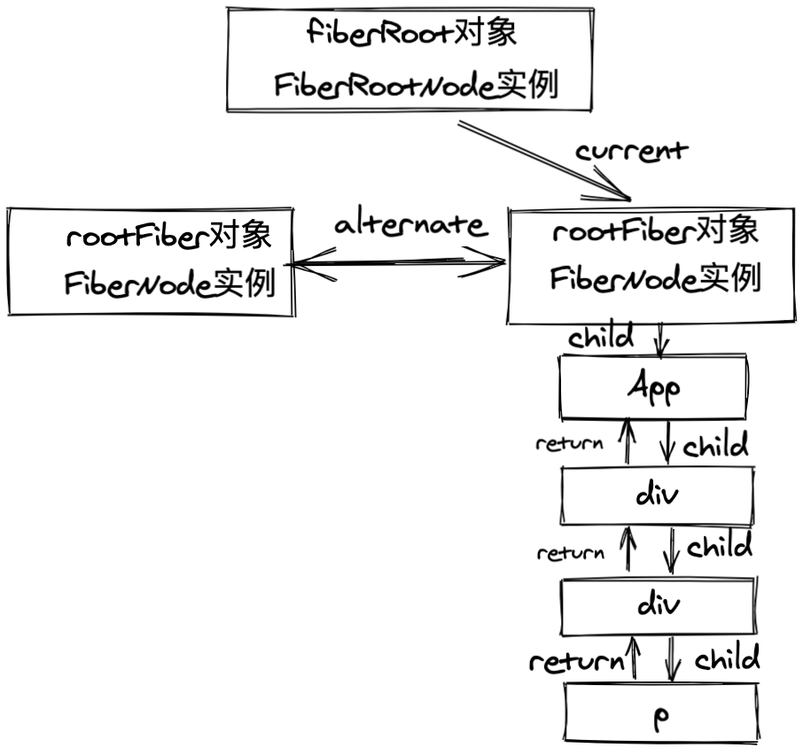

由于挂载是一个从无到有的过程，在这个过程中我们是在不断地创建新节点，因此还谈不上什么“节点复用”。节点复用要到更新过程中去看。

##### 第一次更新

现在我点击数字 0，触发一次更新。这次更新中，下图高亮的 `rootFiber` 节点就会被复用：

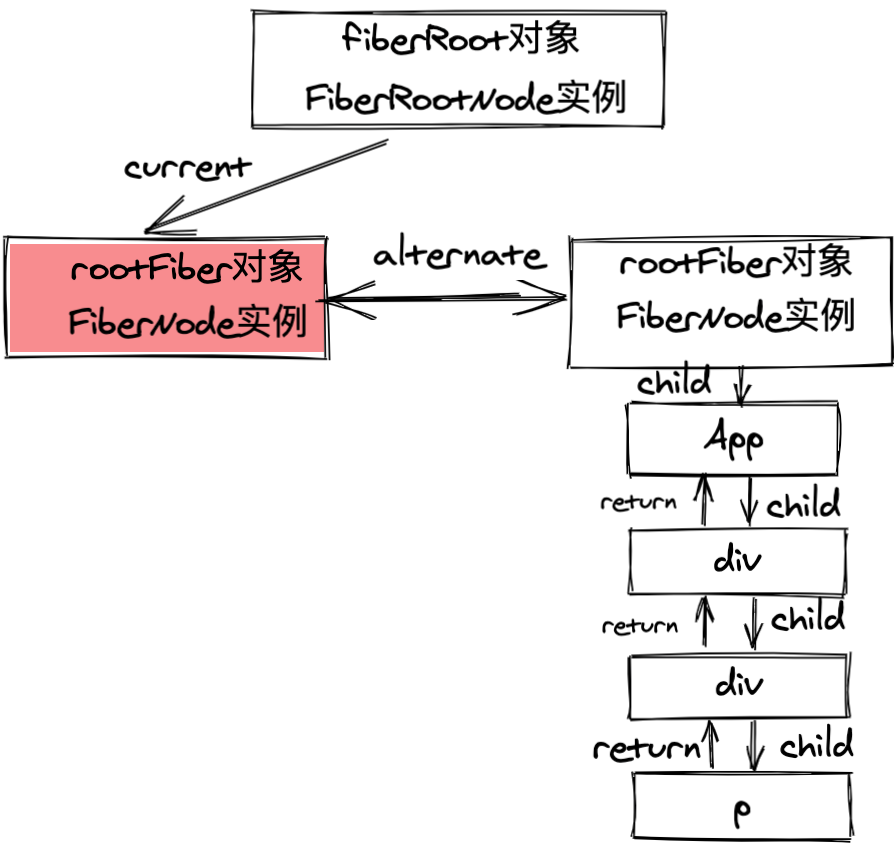

这段复用的逻辑在 `beginWork` 调用链路中的 `createWorkInProgress` 方法里。这是`createWorkInProgress` 方法里面一段非常关键的逻辑：

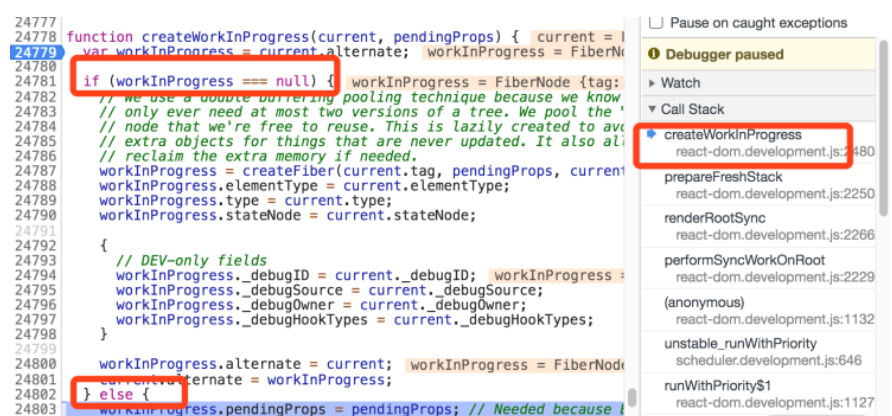

在`createWorkInProgress` 方法中，会先取当前节点的 `alternate` 属性，将其记为 `workInProgress` 节点。对于 `rootFiber` 节点来说，它的 `alternate` 属性，其实就是上一棵 `current` 树的 `rootFiber`，如下图高亮部分所示：


**当检查到上一棵 `current` 树的 `rootFiber` 存在时，`React` 会直接复用这个节点，让它作为下一棵 `workInProgress` 的节点存在下去**，也就是说会走进 `createWorkInProgress` 的 `else` 逻辑里去。如果它和目标的 `workInProgress` 节点之间存在差异，直接在该节点上修改属性、使其与目标节点一致即可，而不必再创建新的 `Fiber` 节点。

**至于剩下的 `App`、`div`、`p` 等节点，由于没有对应的 `alternate` 节点存在，因此它们的 `createWorkInProgress` 调用会走进下图高亮处的逻辑中：**

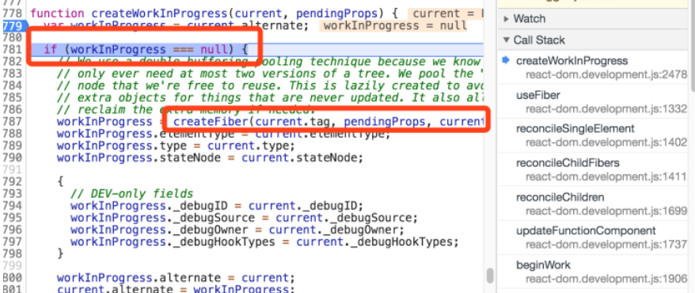

在这段逻辑里，将调用 `createFiber` 来新建一个 `FiberNode`。

第一次更新结束后，我们会得到一棵新的 `workInProgress` `Fiber` 树，`current` 指针最后将会指向这棵新的 `workInProgress Fiber` 树，如下图所示：

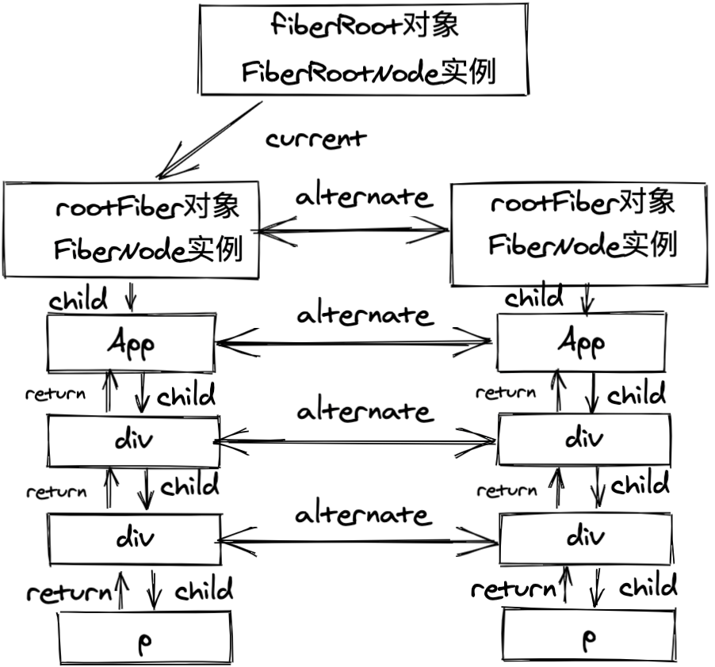

##### 第二次更新

接下来我们再次点击数字 1，触发 `state` 的第二次更新。

在这次更新中，`current` 树中的每一个 `alternate` 属性都不为空（如上图所示）。因此每次通过 `beginWork` 触发 `createWorkInProgress` 调用时，都会一致地走入 `else` 里面的逻辑，也就是直接复用现成的节点。以上便是 `current` 树和 `work` 树相互“打配合”，实现节点复用的过程（纯文本节点没有相应的`Fiber`节点对应）。

### 更新链路要素拆解

在上一讲，我们已经学习了挂载阶段的渲染链路。同步模式下的更新链路与挂载链路的 `render` 阶段基本是一致的，都是通过 `performSyncWorkOnRoot` 来触发包括 `beginWork`、`completeWork` 在内的深度优先搜索过程。这里我为你展示一个更新过程的调用栈，请看下图：

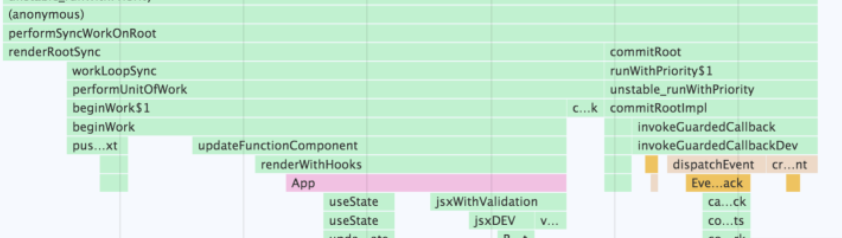

**其实，挂载可以理解为一种特殊的更新，`ReactDOM.render` 和 `setState` 一样，也是一种触发更新的姿势**。在 React 中，`ReactDOM.render`、`setState`、`useState` 等方法都是可以触发更新的，这些方法发起的调用链路很相似，**都会通过创建 `update` 对象来进入同一套更新工作流**。

#### `update` 的创建

接下来我继续以开篇的 Demo 为例，为你拆解更新链路中的要素。在点击数字后，点击相关的回调被执行，它首先触发的是 `dispatchAction` 这个方法，如下图所示：

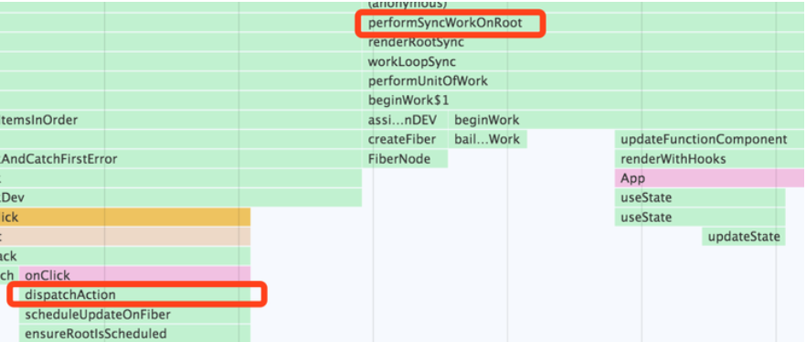

请你关注图中两处标红的函数调用，你会看到 `dispatchAction` 方法在 `performSyncWorkOnRoot` 的左边。也就是说整体的更新链路应该是这样的：

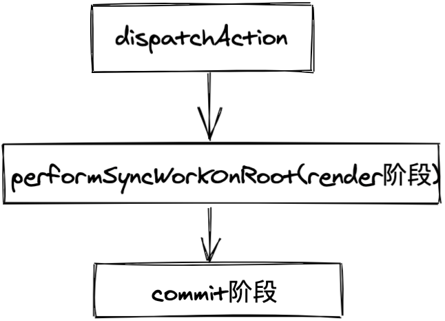

`dispatchAction` 中，会完成`update` 对象的创建，如下图标红处所示：

```js
function dispatchAction<S, A>(
  fiber: Fiber,
  queue: UpdateQueue<S, A>,
  action: A,
) {
  //...
  const eventTime = requestEventTime();
  const lane = requestUpdateLane(fiber);

  const update: Update<S, A> = {
    lane,
    action,
    eagerReducer: null,
    eagerState: null,
    next: (null: any),
  };

  const alternate = fiber.alternate;
	//...
```

#### 从 `update` 对象到 `scheduleUpdateOnFiber`

实际上在 `updateContainer` 中，`React` 曾经有过性质一模一样的行为，下面是 `updateContainer` 函数中的相关逻辑：

```js
//函数位于packages/raect-reconciler/src/ReactFiberReconciler.old.js(ReactFiberReconciler.js)
	
	//...
  // 结合 lane（优先级）信息，创建 update 对象，一个 update 对象意味着一个更新
  const update = createUpdate(eventTime, lane);
  // update 的 payload 对应的是一个 React 元素
  update.payload = {element};
	// 处理 callback，这个 callback 其实就是我们调用 ReactDOM.render 时传入的 callback
  callback = callback === undefined ? null : callback;
  if (callback !== null) {
    //...开发环境下的判断逻辑
    update.callback = callback;
  }
	//将update加入updateQueue
  enqueueUpdate(current, update, lane);
  //调度更新
  const root = scheduleUpdateOnFiber(current, lane, eventTime);
  if (root !== null) {
    entangleTransitions(root, current, lane);
  }
  // 返回当前节点（fiberRoot）的优先级
  return lane;
}
```

图中这一段代码的逻辑是非常清晰的，以 `enqueueUpdate` 为界，它一共做了以下三件事：

1. `enqueueUpdate` 之前：**创建 `update`**。
2. `enqueueUpdate` 调用：**将`update` 入队**。这里简单说下，每一个 `Fiber` 节点都会有一个属于它自己的 `updateQueue`，用于存储多个更新，这个 `updateQueue` 是以链表的形式存在的。在 `render` 阶段，**`updateQueue` 的内容会成为 `render` 阶段计算 `Fiber` 节点的新 `state` 的依据**。
3. `scheduleUpdateOnFiber`：**调度 `update`**。这个方法后面紧跟的就是 `performSyncWorkOnRoot` 所触发的 `render` 阶段，如下图所示：

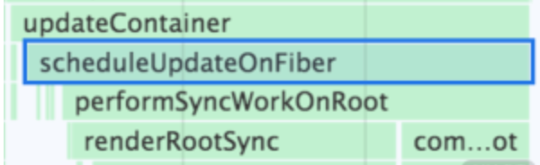

现在再来看 `dispatchAction` 的逻辑，会发现 `dispatchAction` 里面同样有对这三个动作的处理。上面我对 `dispatchAction` 的局部截图，包含了对 `update` 对象的创建和入队处理。`dispatchAction` 的更新调度动作，在函数的末尾：

```js
	}
scheduleUpdateOnFiber(fiber,lane,eventTime);
}
```

这里有一个点需要提示一下：`dispatchAction` 中，**调度的是当前触发更新的节点**，这一点和挂载过程需要区分开来。在挂载过程中，`updateContainer` 会直接调度根节点。其实，对于更新这种场景来说，**大部分的更新动作确实都不是由根节点触发的**，而 `render` 阶段的起点则是根节点。因此在 `scheduleUpdateOnFiber` 中，有这样一个方法，见下图标红处：

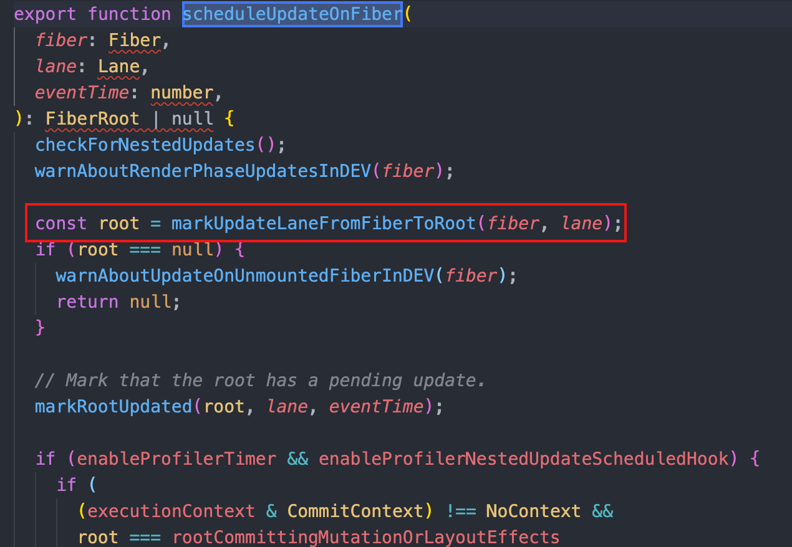

`markUpdateLaneFromFiberToRoot` 将会从当前 `Fiber` 节点开始，向上遍历直至根节点，并将根节点返回。

#### `scheduleUpdateOnFiber` 如何区分同步还是异步？ 

之前同步渲染链路的逻辑：

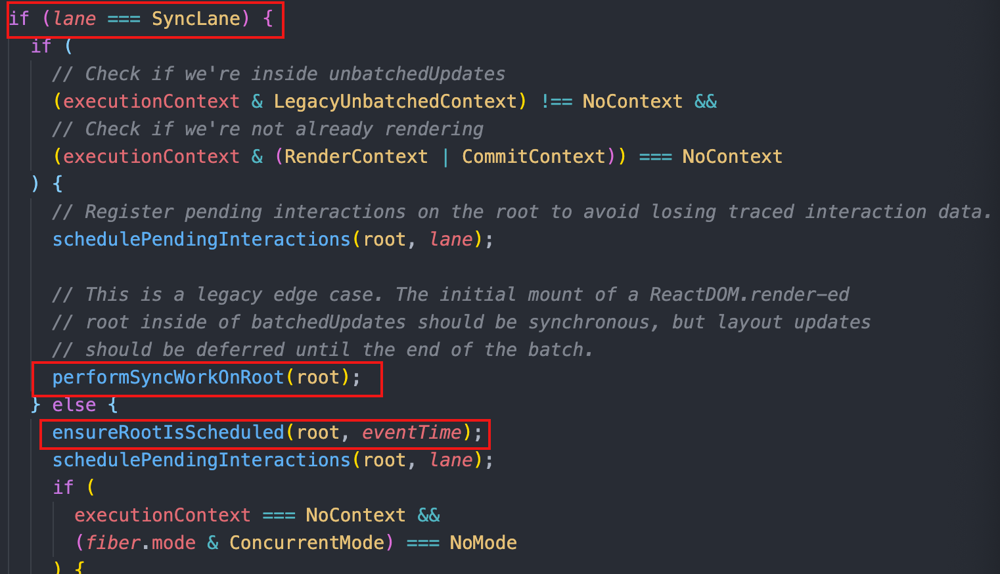

这是 `scheduleUpdateOnFiber` 中的一段逻辑。在同步的渲染链路中，`lane === SyncLane` 这个条件是成立的，因此会直接进入 `performSyncWorkOnRoot` 的逻辑，开启同步的 `render` 流程；而在异步渲染模式下，则将进入 `else` 的逻辑。

在 `else` 中，需要注意的是 `ensureRootIsScheduled` 这个方法，该方法很关键，它将决定如何开启当前更新所对应的 `render` 阶段。在 `ensureRootIsScheduled` 中：

```js
if (newCallbackPriority === SyncLanePriority) {
    // 同步更新的 render 入口
    newCallbackNode = scheduleSyncCallback(performSyncWorkOnRoot.bind(null, root));
  } else {
    // 将当前任务的 lane 优先级转换为 scheduler 可理解的优先级
    var schedulerPriorityLevel = lanePriorityToSchedulerPriority(newCallbackPriority);
    // 异步更新的 render 入口
    newCallbackNode = scheduleCallback(schedulerPriorityLevel, performConcurrentWorkOnRoot.bind(null, root));
  }
```

这里要关注**`performSyncWorkOnRoot` 和 `performConcurrentWorkOnRoot`** 这两个方法：**前者是同步更新模式下的 `render` 阶段入口；而后者是异步模式下的 `render` 阶段入口**。

从这段逻辑中我们可以看出，`React` 会以当前更新任务的优先级类型为依据，决定接下来是调度 `performSyncWorkOnRoot` 还是 `performConcurrentWorkOnRoot`。这里调度任务用到的函数分别是 `scheduleSyncCallback` 和 `scheduleCallback`，**这两个函数在内部都是通过调用 `unstable_scheduleCallback` 方法来执行任务调度的**。而 `unstable_scheduleCallback` 正是 `Scheduler`（调度器）中导出的一个核心方法。

在解读 `unstable_scheduleCallback` 的工作原理之前，我们先来一起认识一下 `Scheduler`。

### `Scheduler`——“时间切片”与“优先级”的幕后推手

Fiber 架构最迷人的那一面——Concurrent 模式（异步渲染）下的“**时间切片**”和“**优先级**”实现。

`Scheduler` 从架构上来看，是 `Fiber` 架构分层中的“调度层”；从实现上来看，它并非一段内嵌的逻辑，而是一个与 `react-dom` 同级的文件夹，如下图所示，其中收敛了所有相对通用的调度逻辑：

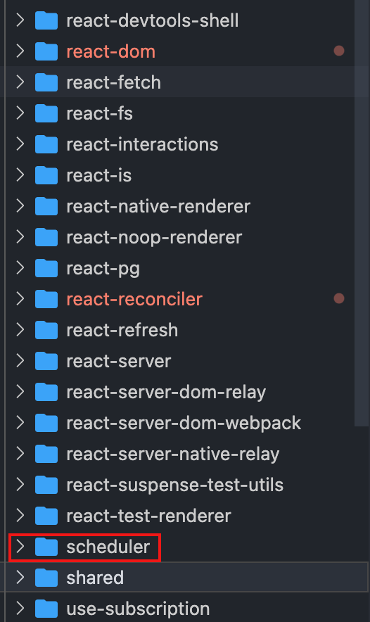

通过前面的学习，我们已经知道 Fiber 架构下的异步渲染（即 Concurrent 模式）的核心特征分别是“**时间切片**”与“**优先级调度**”。而这两点，也正是 Scheduler 的核心能力。接下来，我们就以这两个特征为线索，解锁 Scheduler 的工作原理。

#### 时间切片

首先要搞清楚时间切片是一种什么样的现象。

在 ReactDOM.render 相关的课时中，我曾经强调过，同步渲染模式下的 render 阶段，是一个同步的、深度优先搜索的过程。同步的过程会让调用栈很深。现在，我们直接通过调用栈来理解它，下面是一个渲染工作量相对比较大的 React Demo，代码如下：

```js
import React from 'react';
function App() {
  const arr = new Array(1000).fill(0)
  const renderContent = arr.map(
    (i, index) => <p style={{ width: 128, textAlign: 'center' }}>{`测试文本第${index}行`}</p>
  )
  return (
    <div className="App">
      <div className="container">
        {
          renderContent
        }
      </div>
    </div>
  );
}
export default App;
```

这个 App 组件会在界面上渲染出 1000 行文本。

当我使用 ReactDOM.render 来渲染这个长列表时，它的调用栈如下图所示：

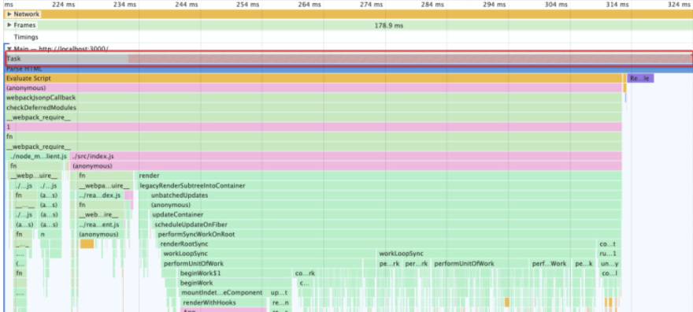

在这张图中，你就不必再重复去关注 beginWork、completeWork 之流了，请把目光放在调用栈的上层，也就是图中标红的地方——一个不间断的灰色“Task”长条，对浏览器来说就意味着是一个**不可中断**的任务。

在我的浏览器上，这个 Task 的执行时长在 130ms 以上（将鼠标悬浮在 Task 长条上就可以查看执行时长）。而**浏览器的刷新频率为 60Hz，也就是说每 16.6ms 就会刷新一次**。在这 16.6ms 里，除了 JS 线程外，渲染线程也是有工作要处理的，**但超长的 Task 显然会挤占渲染线程的工作时间**，引起“掉帧”，进而带来卡顿的风险，这就是“**JS 对主线程的超时占用**”问题。

若将 ReactDOM.render 调用改为 createRoot 调用（即开启 Concurrent 模式），调用栈就会变成下面这样：

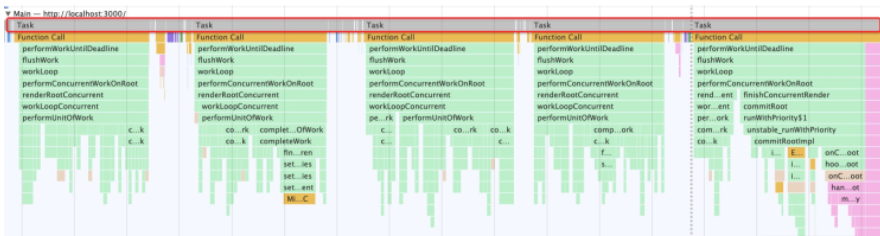

请继续将你的注意力放在顶层的 `Task` 长条上。

你会发现那一个不间断的 `Task` 长条（大任务），如今像是被“切”过了一样，已经变成了多个断断续续的 `Task` “短条”（小任务），单个短 `Task` 的执行时长在我的浏览器中是 `5ms` 左右。这些短 `Task` 的工作量加起来，和之前长 `Task` 工作量是一样的。但短 `Task` 之间留出的时间缝隙，却给了浏览器喘息的机会，这就是所谓的“时间切片”效果。

#### 时间切片的实现

在同步渲染中，循环创建 Fiber 节点、构建 Fiber 树的过程是由 **`workLoopSync`** 函数来触发的。这里我们来复习一下 `workLoopSync` 的源码：

```js
function workLoopSync() {
  // 若 workInProgress 不为空
  while (workInProgress !== null) {
    // 针对它执行 performUnitOfWork 方法
    performUnitOfWork(workInProgress);
  }
}
```

在 `workLoopSync` 中，只要 `workInProgress` 不为空，`while` 循环就不会结束，它所触发的是一个同步的 `performUnitOfWork` 循环调用过程。

而在异步渲染模式下，这个循环是由 **`workLoopConcurrent`** 来开启的。`workLoopConcurrent` 的工作内容和 `workLoopSync` 非常相似，仅仅在循环判断上有一处不同，请注意下图源码中标红部分：

> `/packages/react-reconciler/src/ReactFiberWorkLoop.js`

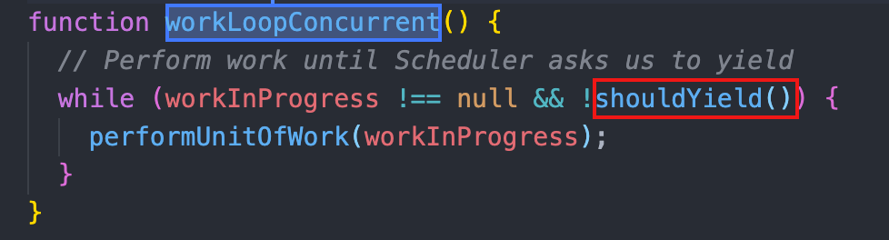

`shouldYield` 直译过来的话是“需要让出”。即，**当 `shouldYield()` 调用返回为 `true` 时，就说明当前需要对主线程进行让出了，此时 `whille` 循环的判断条件整体为 `false`，`while` 循环将不再继续**。

那么这个 `shouldYield` 又是何方神圣呢？在源码中可以看到：

```js
export const shouldYield = Scheduler.unstable_shouldYield;
```

可以看出，`shouldYield` 的本体其实是 **`Scheduler.unstable_shouldYield`**，也就是 `Scheduler`包中导出的 `unstable_shouldYield` 方法，该方法本身比较简单：

> `/packages/scheduler/src/forks/SchedulerPostTask.js`

```js
export function unstable_shouldYield() {
  return getCurrentTime() >= deadline;
}
```

这里`getCurrentTime`同样定义在该文件中：

```js
const perf = window.performance;
const setTimeout = window.setTimeout;

// Use experimental Chrome Scheduler postTask API.
const scheduler = global.scheduler;

const getCurrentTime = perf.now.bind(perf);
export const unstable_now = getCurrentTime;
```

这里`getCurrentTime`的值，即“**当前时间**”。 `deadline` 可以被理解为**当前时间切片的到期时间**，它的计算过程在 `Scheduler` 包中的 `performWorkUntilDeadline` 方法里可以找到，也就是下图的标红部分：

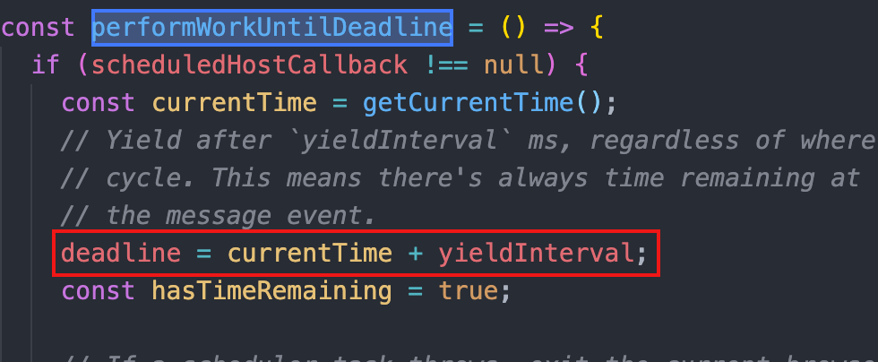

在这行算式里，`currentTime` 是当前时间，`yieldInterval` 是**时间切片的长度**。注意，时间切片的长度并不是一个常量，它是由 `React` 根据浏览器的帧率大小计算所得出来的，与浏览器的性能有关。

现在我们来总结一下时间切片的实现原理：**`React` 会根据浏览器的帧率，计算出时间切片的大小，并结合当前时间计算出每一个切片的到期时间。在 `workLoopConcurrent` 中，`while` 循环每次执行前，会调用 `shouldYield` 函数来询问当前时间切片是否到期，若已到期，则结束循环、出让主线程的控制权。**

#### 优先级调度是如何实现的

在“更新链路要素拆解”这一小节的末尾，我们已经知道，无论是 `scheduleSyncCallback` 还是 `scheduleCallback`，最终都是通过调用 **unstable_scheduleCallback** 来发起调度的。`unstable_scheduleCallback` 是 `Scheduler` 导出的一个核心方法，它将**结合任务的优先级信息为其执行不同的调度逻辑**。

接下来我们就结合源码，一起看看这个过程是如何实现的：

```js
function unstable_scheduleCallback(priorityLevel, callback, options) {
  // 获取当前时间
  var currentTime = exports.unstable_now();
  // 声明 startTime，startTime 是任务的预期开始时间
  var startTime;
  // 以下是对 options 入参的处理
  if (typeof options === 'object' && options !== null) {
    var delay = options.delay;
    // 若入参规定了延迟时间，则累加延迟时间
    if (typeof delay === 'number' && delay > 0) {
      startTime = currentTime + delay;
    } else {
      startTime = currentTime;
    }
  } else {
    startTime = currentTime;
  }
  // timeout 是 expirationTime 的计算依据
  var timeout;
  // 根据 priorityLevel，确定 timeout 的值
  switch (priorityLevel) {
    case ImmediatePriority:
      timeout = IMMEDIATE_PRIORITY_TIMEOUT;
      break;
    case UserBlockingPriority:
      timeout = USER_BLOCKING_PRIORITY_TIMEOUT;
      break;
    case IdlePriority:
      timeout = IDLE_PRIORITY_TIMEOUT;
      break;
    case LowPriority:
      timeout = LOW_PRIORITY_TIMEOUT;
      break;
    case NormalPriority:
    default:
      timeout = NORMAL_PRIORITY_TIMEOUT;
      break;
  }
  // 优先级越高，timout 越小，expirationTime 越小
  var expirationTime = startTime + timeout;
  // 创建 task 对象
  var newTask = {
    id: taskIdCounter++,
    callback: callback,
    priorityLevel: priorityLevel,
    startTime: startTime,
    expirationTime: expirationTime,
    sortIndex: -1
  };
  {
    newTask.isQueued = false;
  }
  // 若当前时间小于开始时间，说明该任务可延时执行(未过期）
  if (startTime > currentTime) {
    // 将未过期任务推入 "timerQueue"
    newTask.sortIndex = startTime;
    push(timerQueue, newTask);
    // 若 taskQueue 中没有可执行的任务，而当前任务又是 timerQueue 中的第一个任务
    if (peek(taskQueue) === null && newTask === peek(timerQueue)) {
      ......
          // 那么就派发一个延时任务，这个延时任务用于检查当前任务是否过期
      requestHostTimeout(handleTimeout, startTime - currentTime);
    }
  } else {
    // else 里处理的是当前时间大于 startTime 的情况，说明这个任务已过期
    newTask.sortIndex = expirationTime;
    // 过期的任务会被推入 taskQueue
    push(taskQueue, newTask);
    ......

    // 执行 taskQueue 中的任务
    requestHostCallback(flushWork);
  }
  return newTask;
}
```

从源码中我们可以看出，`unstable_scheduleCallback` 的主要工作是针对当前任务创建一个 `task`，然后结合 `startTime` 信息将这个 `task` 推入 **`timerQueue`** 或 **`taskQueue`**，最后根据 `timerQueue` 和 `taskQueue` 的情况，执行延时任务或即时任务。

要想理解这个过程，首先要搞清楚以下几个概念。

- **`startTime`**：任务的开始时间。
- **`expirationTime`**：这是一个和优先级相关的值，`expirationTime` 越小，任务的优先级就越高。
- **`timerQueue`**：一个以 `startTime` 为排序依据的**小顶堆**，它存储的是 `startTime` 大于当前时间（也就是待执行）的任务。
- **`taskQueue`**：一个以 `expirationTime` 为排序依据的**小顶堆**，它存储的是 `startTime` 小于当前时间（也就是已过期）的任务。

这里的“小顶堆”概念可能会触及一部分同学的知识盲区，我简单解释下：堆是一种特殊的**完全二叉树**。如果对一棵完全二叉树来说，它每个结点的结点值都不大于其左右孩子的结点值，这样的完全二叉树就叫“**小顶堆**”。小顶堆自身特有的插入和删除逻辑，**决定了无论我们怎么增删小顶堆的元素，其根节点一定是所有元素中值最小的一个节点**。这样的性质，使得小顶堆经常被用于实现**优先队列**。

结合小顶堆的特性，我们再来看源码中涉及 `timerQueue` 和 `taskQueue` 的操作，这段代码同时也是整个 `unstable_scheduleCallback` 方法中的核心逻辑：

```js
// 若当前时间小于开始时间，说明该任务可延时执行(未过期）
  if (startTime > currentTime) {
    // 将未过期任务推入 "timerQueue"
    newTask.sortIndex = startTime;
    push(timerQueue, newTask);
    // 若 taskQueue 中没有可执行的任务，而当前任务又是 timerQueue 中的第一个任务
    if (peek(taskQueue) === null && newTask === peek(timerQueue)) {
      ......
          // 那么就派发一个延时任务，这个延时任务用于将过期的 task 加入 taskQueue 队列
      requestHostTimeout(handleTimeout, startTime - currentTime);
    }
  } else {
    // else 里处理的是当前时间大于 startTime 的情况，说明这个任务已过期
    newTask.sortIndex = expirationTime;
    // 过期的任务会被推入 taskQueue
    push(taskQueue, newTask);
    ......
    // 执行 taskQueue 中的任务
    requestHostCallback(flushWork);
  }
```

若判断当前任务是待执行任务，那么该任务会在 sortIndex 属性被赋值为 `startTime` 后，被**推入 `timerQueue`**。随后，会进入这样的一段判断逻辑：

```js
// 若 taskQueue 中没有可执行的任务，而当前任务又是 timerQueue 中的第一个任务
if (peek(taskQueue) === null && newTask === peek(timerQueue)) {
  ......
    // 那么就派发一个延时任务，这个延时任务用于将过期的 task 加入 taskQueue 队列
  requestHostTimeout(handleTimeout, startTime - currentTime);
}
```

要理解这段逻辑，首先需要理解 `peek(xxx)` 做了什么：`peek()` 的入参是一个小顶堆，它将取出这个小顶堆的堆顶元素。

`taskQueue` 里存储的是已过期的任务，`peek(taskQueue)` 取出的任务若为空，则说明 `taskQueue` 为空、当前并没有已过期任务。在没有已过期任务的情况下，会进一步判断 `timerQueue`，也就是未过期任务队列里的情况。

而通过前面的科普，大家已经知道了小顶堆是一个**相对有序**的数据结构。`timerQueue` 作为一个小顶堆，它的排序依据其实正是 **`sortIndex`** 属性的大小。这里的 `sortIndex` 属性取值为 `startTime`，**意味着小顶堆的堆顶任务一定是整个 `timerQueue` 堆结构里 `startTime` 最小的任务，也就是需要最早被执行的未过期任务**。

若当前任务（`newTask`）就是 `timerQueue` 中需要最早被执行的未过期任务，那么 `unstable_scheduleCallback` 会通过调用 `requestHostTimeout`，为当前任务发起一个延时调用。

注意，这个延时调用（也就是 `handleTimeout`）**并不会直接调度执行当前任务**——它的作用是在当前任务到期后，将其从 `timerQueue` 中取出，加入 `taskQueue` 中，然后触发对 `flushWork` 的调用。真正的调度执行过程是在 `flushWork` 中进行的。**`flushWork` 中将调用 `workLoop`，`workLoop` 会逐一执行 `taskQueue` 中的任务，直到调度过程被暂停（时间片用尽）或任务全部被清空**。

以上便是针对未过期任务的处理。在这个基础上，我们不难理解 `else` 中，对过期任务的处理逻辑（也就是下面这段代码）：

```js
{
  // else 里处理的是当前时间大于 startTime 的情况，说明这个任务已过期
  newTask.sortIndex = expirationTime;
  // 过期的任务会被推入 taskQueue
  push(taskQueue, newTask);
  ......
  // 执行 taskQueue 中的任务
  requestHostCallback(flushWork);
}
```

与 `timerQueue` 不同的是，`taskQueue` 是一个以 `expirationTime`为 `sortIndex`（排序依据）的小顶堆。对于已过期任务，`React` 在将其推入 `taskQueue` 后，会通过 `requestHostCallback(flushWork)` 发起一个针对 `flushWork` 的即时任务，而 `flushWork` 会执行 `taskQueue` 中过期的任务。

从 `React 17` 源码来看，当下 `React` 发起`Task` 调度的姿势有两个：**`setTimeout`**、**`MessageChannel`**。在宿主环境不支持 `MessageChannel` 的情况下，会降级到 `setTimeout`。但不管是 `setTimeout` 还是 `MessageChannel`，它们发起的都是**异步任务**。

因此  `requestHostCallback` 发起的“即时任务”最早也要等到**下一次事件循环**才能够执行。“即时”仅仅意味它相对于“延时任务”来说，不需要等待指定的时间间隔，并不意味着同步调用。

这里为了方便大家理解，我将 `unstable_scheduleCallback` 方法的工作流总结进一张大图：

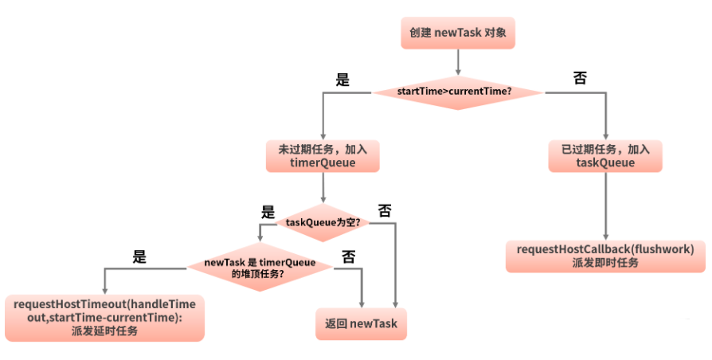

### 总结

这一讲我们首先认识了“双缓存”模式在`Fiber` 架构下的实现，接着对更新链路的种种要素进行了拆解，理解了挂载 / 更新等动作的本质。最后，我们结合源码对 `Scheduler`（调度器）的核心能力，也就是“时间切片”和“优先级调度”两个方面进行了剖析，最终揭开了 `Fiber` 架构异步渲染的神秘面纱，理解了 `Concurrent` 模式背后的实现逻辑。


