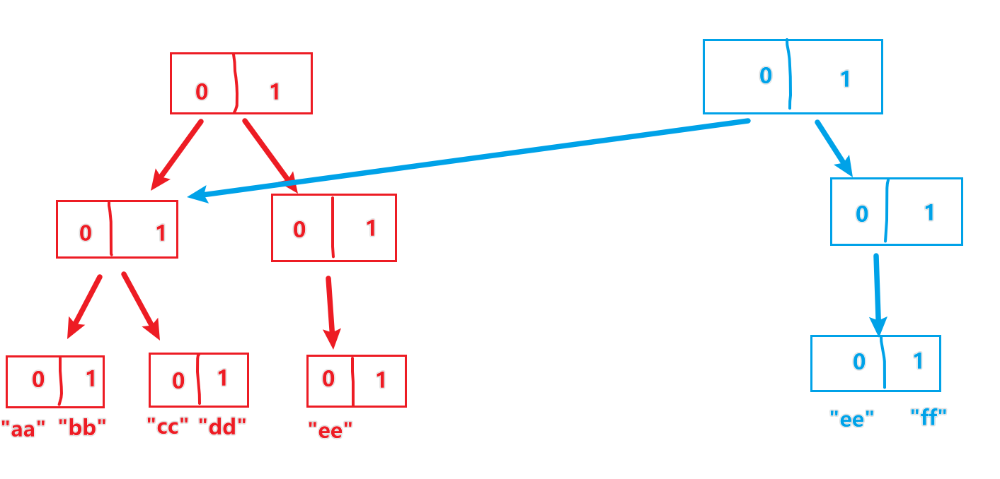

## Immutable思想

React一直在强调数据不可变（在`useState`、`useRef`等hooks中也能感受到），这也是函数式编程中的理念。可惜的是JavaScript在语言层面并没有实现不可变数据。

因为引用赋值，可能会导致改了这里，其他地方的数据也会改变。在大型项目中，有了Bug，就很难排查。

不可变数据也有很多好处，比如：

+ 避免数据改变可以做到对旧数据的引用；更简单的实现切换；
+ 可以更容易的确定是否已经进行了修改，进而确定组件何时要重渲染；
  + 没有不可变数据，如果我们传递的是引用数据类型的数据，我们需要在`shouldComponentUpdate`里进行深层比较，每次比较所有值，数据层次很深时，就很浪费性能。
    +  当然也可以深拷贝，但是太浪费了，我想很少有人这么做

`FaceBook`推出的`Immutable.js`就很好的实现了不可变数据结构。主要的思想就是**持久化数据结构**：如果对象树中的一个节点发生了变化，只修改这个节点和受它影响的父节点，其他节点则进行数据共享。避免了深拷贝把所有节点都复制一遍带来的性能浪费。

## 持久化数据结构的实现

以Map为例：

```js
{0=>"aa",1=>"bb",2=>"cc",3=>"dd",4=>"ee"}
```

假设我们有一个Map，key值全为数字（当然也可以不为数字，后面再讲），我们可以把Map看作一个扁平化的树结构：

如果要添加 `5=>"ff"`，则：



这里为了简单起见，以二叉树为例，不过由于二叉树的每一个节点所能容纳的子节点较少，所以在处理较大的数据量时，树会很深，查询结果很耗时，所以我们实际用的是32叉树。因为32=2^5，所以可以把32进制的每一位，当作5个二进制位，这样向下搜索会更快。

## 源码部分

Map部分的源码800多行。这里只摘出部分核心代码：

```js
export class Map extends KeyedCollection {
  constructor(value) {
    return value === null || value === undefined
      ? emptyMap()
      : isMap(value) && !isOrdered(value)
        ? value
        : emptyMap().withMutations(map => {
            const iter = KeyedCollection(value);
            assertNotInfinite(iter.size);
            iter.forEach((v, k) => map.set(k, v));
          });
  }
//将键值对取出，并且放到withMutations（withMutations是为了实现临时的可变数据结构）
  static of(...keyValues) {
    return emptyMap().withMutations(map => {
      for (let i = 0; i < keyValues.length; i += 2) {
        if (i + 1 >= keyValues.length) {
          throw new Error('Missing value for key: ' + keyValues[i]);
        }
        map.set(keyValues[i], keyValues[i + 1]);
      }
    });
  }
  // Map中提供的get、set、remove方法仅仅是给了一个API的入口作用，真正具体的实现是要在Map中定义的节点类的逻辑
  get(k, notSetValue) {
    return this._root
      ? this._root.get(0, undefined, k, notSetValue)
      : notSetValue;
  }
  set(k, v) {
    return updateMap(this, k, v);
  }

  remove(k) {
    return updateMap(this, k, NOT_SET);
  }

```

注意，Map中包含一个属性`__oenerID`，来区分不同的节点树，本身是由`new ownerID()`创建，返回一个空对象，因为每一个对象的内存地址不同，所以所以定义的`__ownerID`是唯一的。

```js
function OwnerID() {}
```

具体来讲就是先比较该节点的`ownerID`与传进来的父节点是否一致，然后会直接在节点操作或者返回新的节点：

```js
//Map中的update逻辑
update(ownerID, shift, keyHash, key, value, didChangeSize, didAlter) {
  // ...省略前面的代码
  const isEditable = ownerID && ownerID === this.ownerID;
  const newNodes = setAt(nodes, idx, newNode, isEditable);

  if (isEditable) {
    this.count = newCount;
    this.nodes = newNodes;
    return this;
  }

  return new HashArrayMapNode(ownerID, newCount, newNodes);
}
```

还有一个特别厉害的方法，用作性能优化， 使用`withMutations`构造临时的可变数据结构来提高效率：

`withMutations`方法首先调用 `asMutable`方法获取了需要执行操作的 Map。如果该 Map 对象并未定义`asMutable`方法会调用 Map 类中定义的`__ensureOwner`方法，传入新定义的`__ownerID`，最终仍然会返回 Map 对象本身。

> 虽然“不可变”是 `Immutable.js` 的主要优势，但“可变”形态下的操作当然效率更高。有时对于某一系列操作，我们只需要得到这组操作结束后的状态，若中间的每一个操作都用不可变数据结构去实现显然有些多余。

```js
// src/methods/asMutable.js
export function asMutable() {
  // new OwnerID() 返回一个空对象的内存地址，用于保证其唯一性
  return this.__ownerID ? this : this.__ensureOwner(new OwnerID());
}
```

```js
// src/methods/withMutations.js
export function withMutations(fn) {
  // asMutable 会通过 ensureOwner 返回一个新的数据结构，并且这个数据结构一定会有一个 ownerID。
  const mutable = this.asMutable();
  fn(mutable);
  // 修改完之后这个 ownerID 需要还原成原来的 ownerID。
  return mutable.wasAltered() ? mutable.__ensureOwner(this.__ownerID) : this;
}
```


