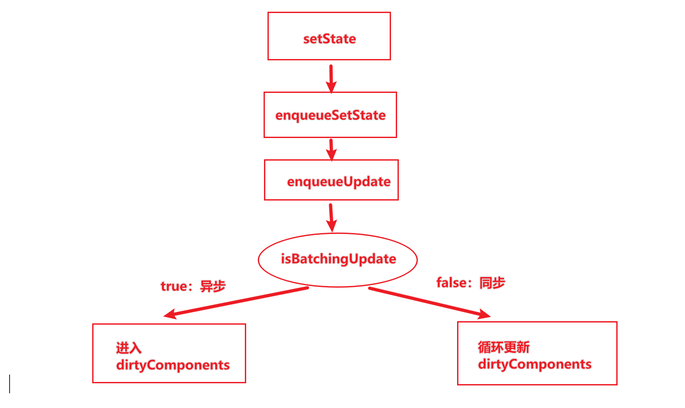

有一个很经典的React面试题，**`setState` 是同步更新还是异步更新？**

这里直接说结论，通常`setState`是异步更新的，主要表现在生命周期以及合成事件里；他也可以是同步更新的，在`setTimeOut`以及原生DOM事件中。

注意合成事件在`React17`前后发生了变化：

> 总的来说，React合成事件借鉴了原生的事件委托的思想，
>
> 在 React 中，绝大部分的事件都不会被绑定在具体的元素上，而是统一被绑定在页面的 document 上。当事件在具体的 DOM 节点上被触发后，最终都会冒泡到 document 上，React 首先会对事件进行包装，把原生 DOM 事件包装成合成事件。然后document 上所绑定的统一事件处理程序会将事件分发到具体的组件实例。
>
> 在`React17`之前，React 给 document 挂上事件监听；DOM 事件触发后冒泡到 document；React 把原生事件包装成合成事件；分发事件。
>
> 在` React 17 `，事件委托不再挂在 document 上，而是挂在 DOM 容器上，也就是 `ReactDom.Render` 所调用的根节点上。

+ 就是`setState`的逻辑，这里`setState`充当了一个分发器，将传入的对象分发到`enqueueSetState`中，
+ `enqueueSetState`将新的 state 放进组件的状态队列里；用 `enqueueUpdate` 来处理将要更新的实例对象；
+ 进入到`enqueueUpdate` 的逻辑，在这里会有`batchingStrategy`对象，即批处理策略，引出最重要的`isBatchUpdates`这个属性，来决定是否直接走更新流程还是排队等待。
  + `isBatchingUpdates `这个属性，在 React 的生命周期函数以及合成事件执行前，会被 React 修改为 true，在 `isBatchingUpdates` 的约束下，`setState` 只能是异步的。

## 总结

在React源码中，通过`isBatchingUpdates` 来判断`setState` 是先存进 state 队列还是直接更新，如果值为 true 则执行异步操作，为 false 则直接更新。

### 异步的优势

`setState`设计为异步，可以显著的提升性能；

+ 如果每次调用`setState`都进行一次更新，那么意味着render函数会被频繁调用，界面重新渲染，这样效率是很低的；
+ 更好的策略是获取到多个更新放到队列中，进行批量更新；

如果同步更新了state，但是还没有执行render函数，那么state和props不能保持同步；

+ state和props不能保持一致性，会在开发中产生很多的问题；

