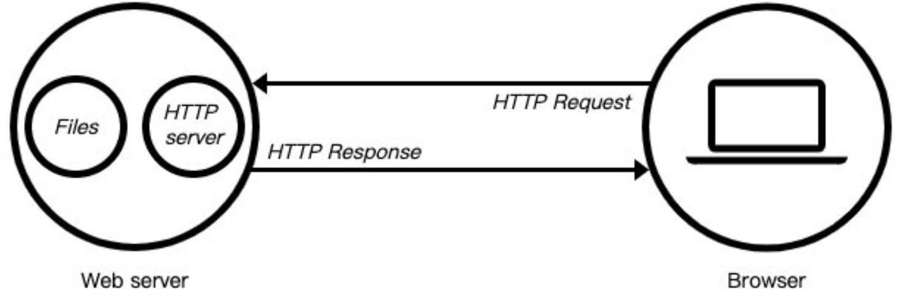

[toc]

## 详解模块化


## `Nodejs`的事件循环


## `http`模块

当应用程序（客户端）需要某一个资源时，可以向一台服务器，通过`Http`请求获取到这个资源；提供资源的这个服务器，就是一个`Web`服务器；



目前有很多开源的Web服务器：`Nginx`、`Apache（静态）`、`Apache Tomcat（静态、动态）`、`Node.js`

```js
const http=require("http");
const server=http.createServer((req,res)=>{
    res.end("hello server");
});

server.listen(8000,()=>{
    console.log("服务器启动成功")
})
```

需要注意的是，`server.listen`是一个异步方法，也许有人习惯这样写：

```js
server.listen(8000);
console.log("服务器启动成功");
```

但是这样不管启动成功还是失败，最终都会打印出`服务器启动成功`这段话，所以真正的监听要放在`server.listen`里面。

### 创建服务器

一般来讲创建服务器对象有两种方法：

+ 通过`http.createServer((req,res)=>{})`，直接返回服务器对象；
+ 也可以直接`new http.Server((req,res)=>{})`来创建这个对象；

来看一下源码：

```js
function createServer(opts, requestListener) {
  return new Server(opts, requestListener);
}
```

可以看到底层都是用的`new Server`对象；

### 主机和端口

`Server`通过`listen`方法来开启服务器，并且在某一个主机和端口上监听网络请求；就是当我们通过`ip:port`的方式发送到我们监听的Web服务器上时，就可以对其进行相关的处理；

```js
const server=http.createServer((req,res)=>{
    req.end("hello node")
})
server.listen(8888,"127.0.0.1",()=>{
    console.log("服务器启动成功")
})
```

`listen`方法有三个参数：

+ 端口`port`：可以不传，系统会默认分配端；

  > 可以在回调中利用`console.log(server.address().port`拿到默认分配的端口号；

+ 主机host：通常可以传入`localhost`、`ip`地址127.0.0.1、或者`ip`地址`0.0.0.0`，默认是`0.0.0.0`；

  + `localhost`：本质上是一个域名，通常情况下会被解析成`127.0.0.1`；

  + `127.0.0.1`：回环地址（`Loop Back Address`），表达的意思其实是我们主机自己发出去的包，直接被自己接收；

    + 正常的数据库包经常应用层- 传输层- 网络层- 数据链路层- 物理层；

    + 而回环地址，是在网络层直接就被获取到了，是不会经过数据链路层和物理层的；

      > 比如我们监听127.0.0.1时，在同一个网段下的主机中，通过`ip`地址是不能访问的；

  + `0.0.0.0`：

    + 监听`IPV4`上所有的地址，再根据端口找到不同的应用程序；

      > 比如我们监听`0.0.0.0`时，在同一个网段下的主机中，通过`ip`地址是可以访问的；

+ 回调函数：服务器启动成功时的回调函数；

### `request`对象

Node会封装一个request对象，包含了客户端向服务器发送的所有信息。

#### `URL`的处理

`req.url`本质上是拿到形如`/login?a=1&b=2&c=3`，即**路径加上`qurery`**

##### 路径的处理

+ `req.url`中只有简单的路径

```js
const http=require("http");
const server=http.createServer((req,res)=>{
    if(req.url==="/login"){
       	res.end("欢迎回来~")
       }else if(req.url==="/products"){
         res.end("商品页~")  
       }else{
           res.end("404")
       }
});
```

+ `qurery`的处理

在Node.js里提供了内置模块——`url`模块，用于处理`url`地址

`url.parse`用来解析地址。把想要解析的`req.url`传给`url.parse`，解析成对象。

```js
const http=require("http");
const url=require("url");
const server=http.createServer((req,res)=>{
    console.log(url.parse(req.url))
    res.end("hello server");
    
});

server.listen(8000,()=>{
    console.log("服务器启动成功!")
   
})
```

以`localhost:8000/login?a=1&b=3`为例，我们拿到的解析后的对象是：

```js
Url {
  protocol: null,
  slashes: null,
  auth: null,
  host: null,
  port: null,
  hostname: null,
  hash: null,
  search: '?a=1&b=3',
  query: 'a=1&b=3',
  pathname: '/login',
  path: '/login?a=1&b=3',
  href: '/login?a=1&b=3'
}
```

我们真正需要的就是`pathname`和`query`，需要另一个内置模块`querystring`对query部分相应的处理：

```js
const http=require("http");
const url=require("url");
const qs=require("querystring");

const server=http.createServer((req,res)=>{
    const {pathname,query}=url.parse(req.url);
    if(pathname==="/login"){
        const {a,b}=qs.parse(query);
        console.log(a,b);//1 3
    }
    res.end("hello server");
});

server.listen(8000,()=>{
    console.log("服务器启动成功!")
   
})
```


####　请求方式


#### 请求头的处理


## `express`框架


## `koa`框架


