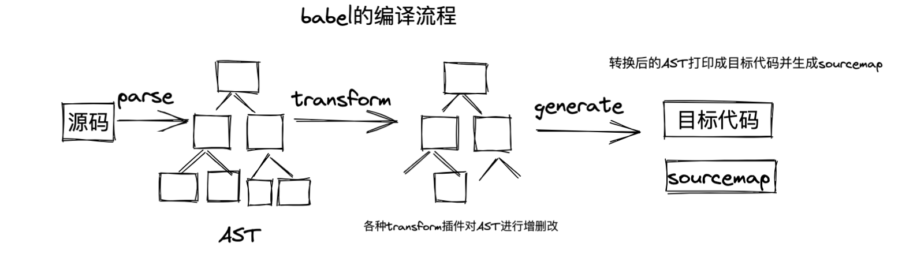
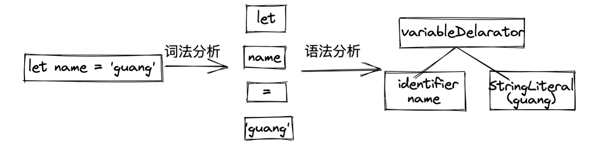
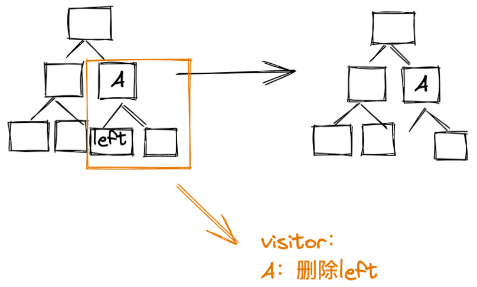
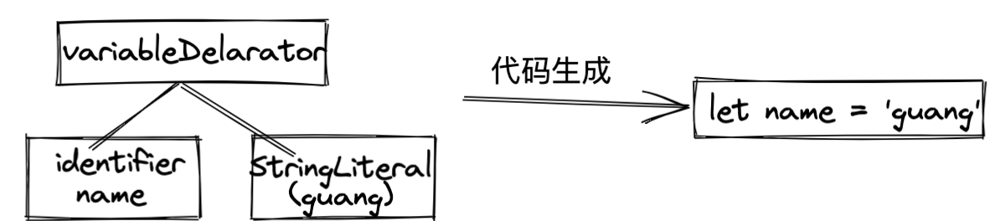
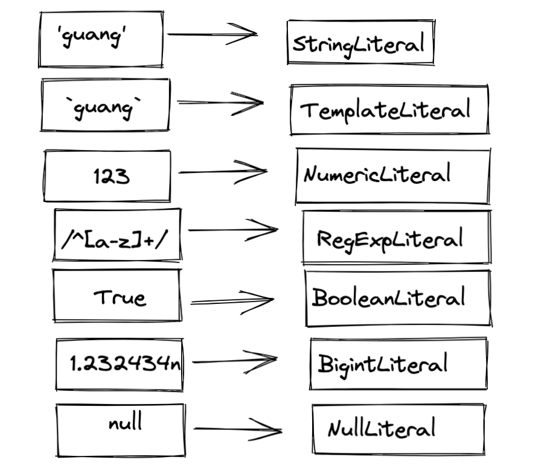
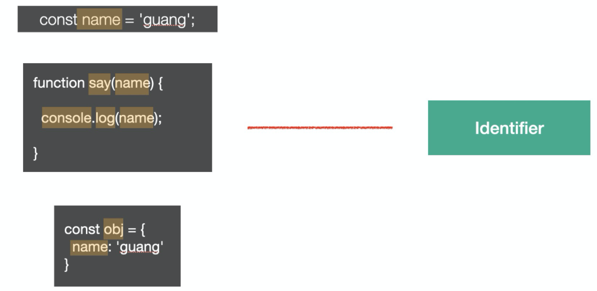
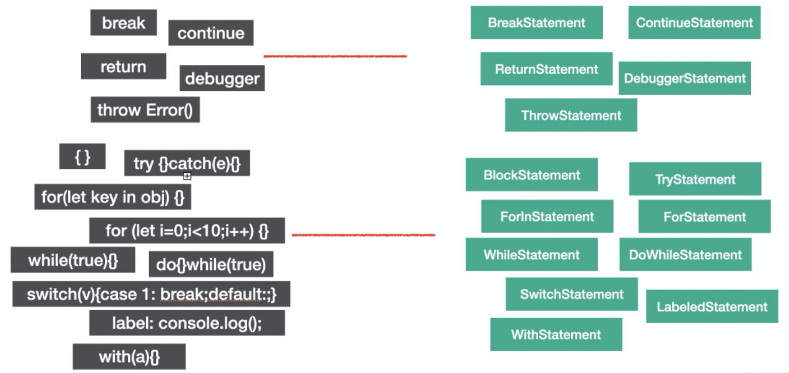
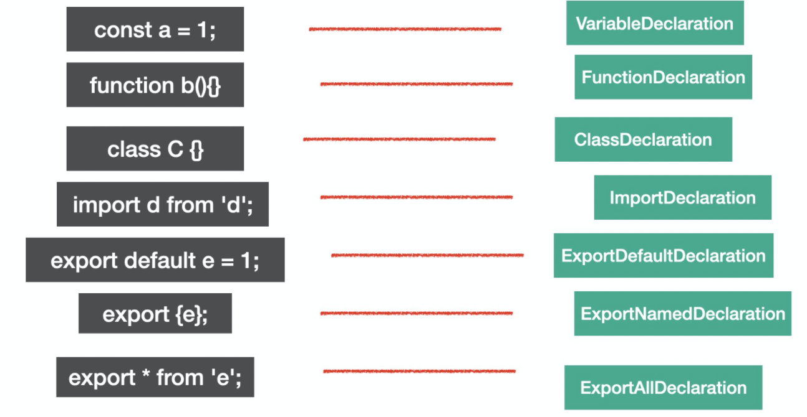
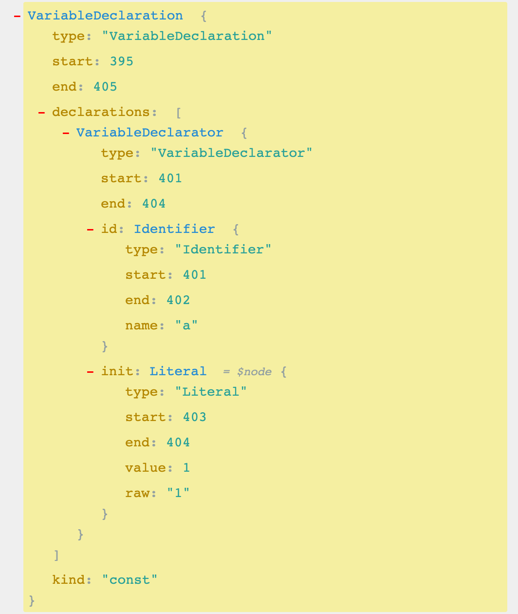

 babel最开始叫6to5，就是es6转es5，不过后面因为es7、es8等esnext的出现，6to5已经没办法表达出转译器的定位了，所以改名为babel。

babel是巴别塔的意思。

## babel的用途

### 转译esnext、ts、flow等到目标环境支持的js

这个是最常见的功能，用来把代码中的esnext的新语法、ts和flow的语法转成基于目标环境支持的语法实现。并且还可以把目标环境不支持的api进行polyfill。

> polypill是一块代码，赋能，为旧浏览器赋予新功能，就是为旧浏览器提供没有原生支持的较新的功能。
>
> 比如说 polyfill 可以让 IE7 使用 Silverlight 插件来模拟 HTML Canvas 元素的功能，或模拟 CSS 实现 rem 单位的支持，或 [`text-shadow`](https://developer.mozilla.org/zh-CN/docs/Web/CSS/text-shadow)，或其他任何你想要的功能。

babel 7 支持了 preset-env，可以指定 targets 来进行按需转换，转换更加的精准，产物更小。

### 特定用途的代码转换

babel 作为一个转译器，暴露了很多 api，用这些 api 可以完成代码到 AST 的 parse，AST 的转换，以及目标代码的生成。

开发者可以用它来来完成一些特定用途的转换，比如函数插桩（函数中自动插入一些代码，例如埋点代码）、自动国际化、default import 转 named import 等。这些都是后面的实战案例。

现在比较流行的小程序转译工具 taro，就是基于 babel 的 api 来实现的。

后续案例会实现自动埋点的功能，也是一种自定义的代码转换。

### 代码的静态分析

> 静态分析是在不需要执行代码的前提下对代码进行分析的处理过程 （执行代码的同时进行代码分析即是动态分析）。
>
> 静态分析的目的是多种多样的， 它可用于语法检查，编译，代码高亮，代码转换，优化，压缩等等场景。

对代码进行parse之后，能够进行转换，是因为通过 AST 的结构能够理解代码。理解了代码之后，除了进行转换然后生成目标代码之外，也同样可以用于分析代码的信息，进行一些检查。

- linter 工具就是分析 AST 的结构，对代码规范进行检查。
- api 文档自动生成工具，可以提取源码中的注释，然后生成文档。
- type checker 会根据从 AST 中提取的或者推导的类型信息，对 AST 进行类型是否一致的检查，从而减少运行时因类型导致的错误。
- 压缩混淆工具，这个也是分析代码结构，进行删除死代码、变量名混淆、常量折叠等各种编译优化，生成体积更小、性能更优的代码。
- js 解释器，除了对 AST 进行各种信息的提取和检查以外，我们还可以直接解释执行 AST。

### 总结

babel的定位是 js转译器，用于es next、typescript等代码的转换，同时还暴露出了api让开发者可以进行特定用途的转换（用这些 api 可以完成代码到 AST 的 parse，AST 的转换，以及目标代码的生成。），除此之外，还可以做各种静态分析（linter就是分析ast的结构，对代码规范做检查）。

## babel的编译流程

babel的定位是一个转译器（Transpiler），但是我们更熟悉的一个词是编译器（ Compiler ），编译一般指的是从一种语言转成令一种语言，主要指的是从高级语言到低级语言。

> 高级语言：有很多用于描述逻辑的语言特性，比如分支、循环、函数、面向对象等，接近人的思维，可以让开发者快速的通过它来表达各种逻辑。比如 c++、javascript。
>
> 低级语言：与硬件和执行细节有关，会操作寄存器、内存，具体做内存与寄存器之间的复制，需要开发者理解熟悉计算机的工作原理，熟悉具体的执行细节。比如汇编语言、机器语言。

对于从高级语言到高级语言的转换工具，我们一般叫做转译器。

> babel本质上就是一个转译器，不过转译器是特殊的编译器，下面研究一下他的编译流程

babel是从源码到源码的转换，整体编译流程分为3步：

+ Parse：通过parse把源码转成抽象语法数（AST）
+ Transform：遍历AST，调用各种transform插件对AST进行增删改
+ generate：把转换后的AST打印成目标代码，并生成sourcemap



我们知道了大概的流程，来说一下为什么会分成这三步：

### 为什么分三步

#### 为什么要有parse

> 将源码转成AST，为了计算机能理解。

我们写的代码本质上就是一串字符串，只不过是按照语法格式来组织的。为了能让计算机读懂，我们要将源码转成一种数据结构，用不同的对象保存不同的数据，并且按照依赖关系来组织，这种数据结构就是抽象语法树（abstract syntax tree）。因为数据结构中省去了一些无具体意义的分隔符`;`、`{`、`}`等，所以叫抽象语法树。有了AST，计算机就可以理解源码字符串的意思。

#### 为什么要有transform

> 通过修改AST来修改代码

转成AST之后就可以通过修改AST的方式来修改代码，这一步会遍历AST并进行各种增删改，也是babel最核心的部分。

#### 为什么要有generate

> 把修改后的AST转换成目标代码

经过转换后的AST就是符合要求的代码了，就可以再转回字符串，转回字符串的过程中会把之前删掉的分隔符等再加回来。

#### 总结

为了让计算机能够理解代码，需要先对源码字符串进行parse，生成AST。把对代码的修改转为对AST的增删改，转换为AST之后再打印成目标代码字符串。

### 编译细节

#### parse

parse阶段的目的就是把源码字符串转换成机器能够理解的AST，这个过程分为词法分析、语法分析。

比如`let name='guang';`这样一段代码，我们要先把他分成一个个不能细分的单词（token），即：let、name、=、'gang'，这个过程就是词法分析，按照单词的构成规则来拆分字符串成单词。

之后要把`token`进行递归的组装，生成AST，这个过程是语法分析，按照不同的语法结构来把一组单词组合成对象。



#### transform

transform阶段是对parse生成的AST的处理，会进行AST的遍历，遍历的过程中处理到不同的AST节点，会调用注册的相应的visitor函数，visitor函数里面可以对AST节点进行增删改操作，返回新的AST的过程，（可以指定是否继续遍历新生成的 AST）。这样遍历完一遍 AST 之后就完成了对代码的修改。



#### generate

generate阶段会把AST打印成目标代码字符串，并且会生成sourcemap。不同的AST对应的不同结构的字符串（数据），比如`IfStatement`就可以打印成`if(test){}`格式的代码。这样从AST根结点进行递归打印，就可以生成目标代码的字符串。



sourcemap记录了源码到目标代码的转换关系，通过它我们可以找到目标中每一个节点对应的源码位置。

> sourcemap本质上是一个JSON键值对
>
> ```
> {
> 　　　　version : 3,        //Source map的版本
> 　　　　file: "out.js",      //转换后的文件名
> 　　　　sourceRoot : "",   //转换前的文件所在的目录。如果与转换后的文件在同一目录，该项为空
> 　　　　sources: ["foo.js", "bar.js"],   //转换前的文件。该项是一个数组，表示可能存在多个文件合并
> 　　　　names: ["src", "maps", "are", "fun"],   //转换前的所有变量名和属性名
> 　　　　mappings: "AAgBC,SAAQ,CAAEA"  //映射点，记录位置信息的字符串
> 　　}
> ```

#### 总结

parse 生成 ast，transform 对 ast 进行转换，generate 打印 ast 成目标代码并生成 sourcemap


## babel的AST

babel 编译的第一步是把源码 parse 成抽象语法树 AST （Abstract Syntax Tree），后续对这个 AST 进行转换。（之所以叫抽象语法树是因为省略掉了源码中的分隔符、注释等内容）。

AST 也是有标准的，JS parser 的 AST 大多是 [estree 标准](https://link.juejin.cn/?target=https%3A%2F%2Fgithub.com%2Festree%2Festree)，从 SpiderMonkey 的 AST 标准扩展而来。babel 的整个编译流程都是围绕 AST 来的，这一节我们来学一下 AST。

熟悉了 AST，也就是知道转译器和 JS 引擎是怎么理解代码的（这里V8的AST和babel的第一步是一致的），对深入掌握 Javascript 也有很大的好处。

### 常见的AST节点

AST是对源码的抽象，省去了源码中的注释以及分隔符等，AST是一种数据结构，用不同的对象保存不同的数据，**字面量、标识符、表达式、语句、模块语法、class 语法都有各自的 AST**：

#### Literal

literal是字面量的意思，比如 `let name = 'guang'`中，`'guang'`就是一个字符串字面量 StringLiteral，相应的还有数字字面量 NumericLiteral，布尔字面量 BooleanLiteral，字符串字面量 StringLiteral，正则表达式字面量 RegExpLiteral 等。




代码中的字面量很多，babel就是通过xxLiteral来抽象他们。

#### Identifier

Identifer 是标识符的意思，变量名、属性名、参数名等各种声明和引用的名字，都是Identifer。我们知道，JS 中的标识符只能包含字母或数字或下划线（“_”）或美元符号（“$”），且不能以数字开头。这是 Identifier 的词法特点。

**Identifier 是变量和变量的引用，代码中也是随处可见。**

```js
const name = 'guang';

function say(name) {
  console.log(name);
}

const obj = {
  name: 'guang'
}
```



#### Statement

statement 是语句，它是可以独立执行的单位，比如 break、continue、debugger、return 或者 if 语句、while 语句、for 语句，还有声明语句，表达式语句等。我们写的每一条可以独立执行的代码都是语句。

语句末尾一般会加一个分号分隔，或者用换行分隔。

**语句是代码执行的最小单位，可以说，代码是由语句（Statement）构成的。**

下面这些我们经常写的代码，每一行都是一个 Statement：

```js
break;
continue;
return;
debugger;
throw Error();
{}
try {} catch(e) {} finally{}
for (let key in obj) {}
for (let i = 0;i < 10;i ++) {}
while (true) {}
do {} while (true)
switch (v){case 1: break;default:;}
label: console.log();
with (a){}
```

他们对应的AST如图：



#### Declaration

声明语句是一种特殊的语句，它执行的逻辑是在作用域内声明一个变量、函数、class、import、export 等。

**声明语句用于定义变量，变量声明也是代码中一个基础的部分。**

比如下面这些声明语句：

```javascript
const a = 1;
function b(){}
class C {}

import d from 'e';

export default e = 1;
export {e};
export * from 'e';
```



我们判断 AST 节点是不是某种类型要看它是不是符合该种类型的特点，比如语句的特点是能够单独执行，表达式的特点是有返回值。

有的表达式可以单独执行，符合语句的特点，所以也是语句，比如赋值表达式、数组表达式等，但有的表达式不能单独执行，需要和其他类型的节点组合在一起构成语句。比如匿名函数表达式和匿名 class 表达式单独执行会报错

#### Modules

es module 是语法级别的模块规范，所以也有专门的 AST 节点。

##### import

import 有 3 种语法：

named import：

```javascript
import {c, d} from 'c';
```

default import：

```javascript
import a from 'a';
```

namespaced import:

```javascript
import * as b from 'b';
```

这 3 种语法都对应 ImportDeclaration 节点，但是 specifiers 属性不同，分别对应 ImportSpicifier、ImportDefaultSpecifier、ImportNamespaceSpcifier。

##### export

export 也有3种语法：

named export：

```javascript
export { b, d};
```

default export：

```javascript
export default a;
```

all export：

```
export * from 'c';
```

分别对应 ExportNamedDeclaration、ExportDefaultDeclaration、ExportAllDeclaration 的节点

### AST 的公共属性

每种 AST 都有自己的属性，但是它们也有一些公共属性：

- `type`： AST 节点的类型
- `start、end、loc`：start 和 end 代表该节点对应的源码字符串的开始和结束下标，不区分行列。而 loc 属性是一个对象，有 line 和 column 属性分别记录开始和结束行列号。
- `leadingComments、innerComments、trailingComments`： 表示开始的注释、中间的注释、结尾的注释，因为每个 AST 节点中都可能存在注释，而且可能在开始、中间、结束这三种位置，通过这三个属性来记录和 Comment 的关联。
- `extra`：记录一些额外的信息，用于处理一些特殊情况。

### 总结

我们学习了代码中常见的语法在 babel 的 AST 中对应的节点：

标识符 Identifer、各种字面量 xxLiteral、各种语句 xxStatement，各种声明语句 xxDeclaration，各种表达式 xxExpression，以及 Class、Modules、File、Program、Directive、Comment 这些 AST 节点。

了解了这些节点，就能知道平时写的代码是怎么用 AST 表示的，当然也不需要记，可以去文档或一些工具网站 (astexpoler.net) 去查。

AST 节点可能同时有多种类型，确定一种 AST 节点是什么类型主要看它的特点，比如 Statement 的特点是可以单独执行，Expression 的特点是有返回值，所以一些可以单独执行的 Expression 会包一层 ExpressionStatement 执行。

不同 AST 节点有不同的属性来存放各自对应的源码内容，但是都有一些公共属性如 type、xxComments、loc 等。

学会了 AST，就可以把对代码的操作转为对 AST 的操作了。

> `const a = 1`
>
> 
>
> 差不多就是：
>
> ```js
> {
>   type: 'File', // 文件节点
>   program: {    
>     type: "Program", // 程序节点
>     body: [
>       { //  第一行语句
>         type: "VariableDeclaration", // 声明语句
>         kind: "const",               // 声明类型
>         declarations: [
>           { 
>             type: "VariableDeclarator",
>             id: {
>               type: "Identifier", // 变量类型
>               name: "a",          // 变量名
>             },
>             init: {
>               type: "NumericLiteral", // 值类型
>               value: 1                // 值
>             }
>           },
>         ]
>       }
>     ]
>   }
> }
> ```

## babel的api

我们知道 babel 的编译流程分为三步：parse、transform、generate，每一步都暴露了一些 api 出来。

- parse 阶段有`@babel/parser`，功能是把源码转成 AST
- transform 阶段有 `@babel/traverse`，可以遍历 AST，并调用 visitor 函数修改 AST，修改 AST 自然涉及到 AST 的判断、创建、修改等，这时候就需要 `@babel/types` 了，当需要批量创建 AST 的时候可以使用 `@babel/template` 来简化 AST 创建逻辑。
- generate 阶段会把 AST 打印为目标代码字符串，同时生成 sourcemap，需要 `@babel/generate` 包
- 中途遇到错误想打印代码位置的时候，使用 `@babel/code-frame` 包
- babel 的整体功能通过 `@babel/core` 提供，基于上面的包完成 babel 整体的编译流程，并实现插件功能。

我们主要学习的就是 `@babel/parser`，`@babel/traverse`，`@babel/generate`，`@babel/types`，`@babel/template` 这五个包的 api 的使用。

- `@babel/parser` 对源码进行 parse，可以通过 plugins、sourceType 等来指定 parse 语法
- `@babel/traverse` 通过 visitor 函数对遍历到的 ast 进行处理，分为 enter 和 exit 两个阶段，具体操作 AST 使用 path 的 api，还可以通过 state 来在遍历过程中传递一些数据
- `@babel/types` 用于创建、判断 AST 节点，提供了 xxx、isXxx、assertXxx 的 api
- `@babel/template` 用于批量创建节点
- `@babel/code-frame` 可以创建友好的报错信息
- `@babel/generator` 打印 AST 成目标代码字符串，支持 comments、minified、sourceMaps 等选项。
- `@babel/core` 基于上面的包来完成 babel 的编译流程，可以从源码字符串、源码文件、AST 开始。
  - 前面的包是完成某一部分的功能的，而 `@babel/core` 包则是基于它们完成整个编译流程，从源码到目标代码，生成 sourcemap。

### @babel/parser

**作用是将源码转成AST**。

@babel/parser可以支持 es next（现在支持到 es2020）、jsx、flow、typescript 等语法的解析，其中 jsx、flow、typescript 这些非标准的语法的解析需要指定语法插件。

比如parser 要开启 jsx 的 plugin：

```js
const parser = require('@babel/parser');

const ast = parser.parse(inputString,{
	plugins:['jsx'],
})
```

这里用了parser的parse这个API，parse主要提供了两个API：parse 和 parseExpression。两者都是把源码转成 AST，不过 parse 返回的 AST 根节点是 File（整个 AST），parseExpression 返回的 AST 根节点是是 Expression（表达式的 AST），粒度不同。

```ts
function parse(input: string, options?: ParserOptions): File
function parseExpression(input: string, options?: ParserOptions): Expression
```

我们一般用parse。

详细的 options 可以查看[文档](https://link.juejin.cn/?target=https%3A%2F%2Fbabeljs.io%2Fdocs%2Fen%2Fbabel-parser%23options)。其实主要分为两类，一是 parse 的内容是什么，二是以什么方式去 parse

**parse 的内容是什么：**

- `plugins`： 指定jsx、typescript、flow 等插件来解析对应的语法
- `allowXxx`： 指定一些语法是否允许，比如函数外的 await、没声明的 export等
- `sourceType`： 指定是否支持解析模块语法，有 module、script、unambiguous 3个取值，module 是解析 es module 语法，script 则不解析 es module 语法，当作脚本执行，unambiguous 则是根据内容是否有 import 和 export 来确定是否解析 es module 语法。
  - 一般是`unambiguous`

**以什么方式 parse**

- `strictMode` 是否是严格模式
- `startLine` 从源码哪一行开始 parse
- `errorRecovery` 出错时是否记录错误并继续往下 parse
- `tokens` parse 的时候是否保留 token 信息
- `ranges` 是否在 ast 节点中添加 ranges 属性

其实最常用的 option 就是 plugins、sourceType 这两个，比如要 parse tsx 模块，那么就可以这样来写

```javascript
require("@babel/parser").parse("code", {
  sourceType: "module",
  plugins: [
    "jsx",
    "typescript"
  ]
});
```

### @babel/traverse

parse 出的 AST 由 `@babel/traverse` 来遍历和修改，babel traverse 包提供了 traverse 方法：

```javascript
function traverse(parent, opts)
```

常用的就前面两个参数，parent 指定要遍历的 AST 节点，opts 指定 visitor 函数。babel 会在遍历 parent 对应的 AST 时调用相应的 visitor 函数。

#### 遍历过程

visitor 对象的 value 是对象或者函数：

- 如果 value 为函数，那么就相当于是 enter 时调用的函数。
- 如果 value 为对象，则可以明确指定 enter 或者 exit 时的处理函数。

函数会接收两个参数 path 和 state。

```javascript
visitor: {
    Identifier (path, state) {},
    StringLiteral: {
        enter (path, state) {},
        exit (path, state) {}
    }
}
```

enter 时调用是在遍历当前节点的子节点前调用，exit 时调用是遍历完当前节点的子节点后调用。


可以为单个节点的类型，也可以是多个节点类型通过 `|` 连接，还可以通过别名指定一系列节点类型。

```javascript
// 进入 FunctionDeclaration 节点时调用
traverse(ast, {
  FunctionDeclaration: {
      enter(path, state) {}
  }
})

// 默认是进入节点时调用，和上面等价
traverse(ast, {
  FunctionDeclaration(path, state) {}
})

// 进入 FunctionDeclaration 和 VariableDeclaration 节点时调用
traverse(ast, {
  'FunctionDeclaration|VariableDeclaration'(path, state) {}
})

// 通过别名指定离开各种 Declaration 节点时调用
traverse(ast, {
  Declaration: {
      exit(path, state) {}
  }
})
```

具体的别名有哪些在[babel-types 的类型定义](https://link.juejin.cn/?target=https%3A%2F%2Fgithub.com%2Fbabel%2Fbabel%2Fblob%2Fmain%2Fpackages%2Fbabel-types%2Fsrc%2Fast-types%2Fgenerated%2Findex.ts%23L2489-L2535)可以查。

#### path


path 是遍历过程中的路径，会保留上下文信息，有很多属性和方法，比如:

- path.node 指向当前 AST 节点
- path.get、path.set 获取和设置当前节点属性的 path
- path.parent 指向父级 AST 节点
- path.getSibling、path.getNextSibling、path.getPrevSibling 获取兄弟节点

这些属性和方法是获取当前节点以及它的关联节点的

- path.scope 获取当前节点的作用域信息

这个属性可以获取作用域的信息

- path.isXxx 判断当前节点是不是 xx 类型
- path.assertXxx 判断当前节点是不是 xx 类型，不是则抛出异常

isXxx、assertXxx 系列方法可以用于判断 AST 类型

- path.insertBefore、path.insertAfter 插入节点
- path.replaceWith、path.replaceWithMultiple、replaceWithSourceString 替换节点
- path.remove 删除节点

这些方法可以对 AST 进行增删改

- path.skip 跳过当前节点的子节点的遍历
- path.stop 结束后续遍历

这俩方法可以跳过一些遍历


上面罗列了几个常用的 api，可以通过这些 api 完成对 AST 的操作。当然，path 的 api 不是只有这些，后面实战案例用到了再介绍。

#### state

第二个参数 state 则是遍历过程中在不同节点之间传递数据的机制，插件会通过 state 传递 options 和 file 信息，我们也可以通过 state 存储一些遍历过程中的共享数据。


### @babel/types

遍历 AST 的过程中需要创建一些 AST 和判断 AST 的类型，这时候就需要 `@babel/types` 包。

举例来说，如果要创建IfStatement就可以调用

```javascript
t.ifStatement(test, consequent, alternate);
```

而判断节点是否是 IfStatement 就可以调用 isIfStatement 或者 assertIfStatement

```javascript
t.isIfStatement(node, opts);
t.assertIfStatement(node, opts);
```

opts 可以指定一些属性是什么值，增加更多限制条件，做更精确的判断。

```javascript
t.isIdentifier(node, { name: "paths" })
```

isXxx 会返回 boolean 表示结果，而 assertXxx 则会在类型不一致时抛异常。

所有的 AST 的 build、assert 的 api 可以在 [babel types 文档](https://link.juejin.cn/?target=https%3A%2F%2Fbabeljs.io%2Fdocs%2Fen%2Fbabel-types%23api)中查。

### @babel/generator

AST 转换完之后就要打印成目标代码字符串，通过 `@babel/generator` 包的 generate api

```
function (ast: Object, opts: Object, code: string): {code, map} 
```

第一个参数是要打印的 AST

第二个参数是 options，指定打印的一些细节，比如通过 comments 指定是否包含注释，通过 minified 指定是否包含空白字符

第三个参数当[多个文件合并打印](https://link.juejin.cn/?target=undefined)的时候需要用到

options 中常用的是 sourceMaps，开启了这个选项才会生成 sourcemap

```javascript
const { code, map } = generate(ast, { sourceMaps: true })
```

### @babel/core

前面的包是完成某一部分的功能的，而 `@babel/core` 包则是基于它们完成整个编译流程，从源码到目标代码，生成 sourcemap。

```javascript
transformSync(code, options); // => { code, map, ast }
transformFileSync(filename, options); // => { code, map, ast }
transformFromAstSync(
  parsedAst,
  sourceCode,
  options
); // => { code, map, ast }
```

前三个 transformXxx 的 api 分别是从源代码、源代码文件、源代码 AST 这开始处理，最终生成目标代码和 sourcemap。

options 主要配置 plugins 和 presets，指定具体要做什么转换。

这些 api 也同样提供了异步的版本，异步地进行编译，返回一个 promise

```javascript
transformAsync("code();", options).then(result => {})
transformFileAsync("filename.js", options).then(result => {})
transformFromAstAsync(parsedAst, sourceCode, options).then(result => {})
```

注意：transformXxx 的 api，已经被标记为过时了，后续会删掉，不建议用，直接用 transformXxxSync 和 transformXxxAsync。

@babel/core 包还有一个 createConfigItem 的 api，用于 plugin 和 preset 的封装，后面章节会涉及到。

```javascript
createConfigItem(value, options) // configItem
```

### babel实战：插入函数调用参数

> 我们经常会打印一些日志来辅助调试，但是有的时候会不知道日志是在哪个地方打印的。希望通过 babel 能够自动在 console.log 等 api 中插入文件名和行列号的参数，方便定位到代码。

需要做的是在遍历 AST 的时候对 console.log、console.info 等 api 自动插入一些参数，也就是要通过 visitor 指定对函数调用表达式 CallExpression（这个可以通过 [astexplorer.net](https://link.juejin.cn/?target=https%3A%2F%2Fastexplorer.net%2F) 来查看） 做一些处理。CallExrpession 节点有两个属性，callee 和 arguments，分别对应调用的函数名和参数， 所以我们要判断当 callee 是 console.xx 时，在 arguments 的数组中中插入一个 AST 节点，创建 AST 节点需要用到 `@babel/types` 包。


```javascript
const parser = require('@babel/parser');
const traverse = require('@babel/traverse').default;
const generate = require('@babel/generator').default;
const types = require('@babel/types');

const sourceCode = `console.log(1);`;

const ast = parser.parse(sourceCode, {
  sourceType: 'unambiguous'
});

traverse(ast, {
    CallExpression(path, state) {

    }
});

const { code, map } = generate(ast);
console.log(code);
```

（因为 `@babel/parser` 等包都是通过 es module 导出的，所以通过 commonjs 的方式引入有的时候要取 default 属性。）

parser 需要指定代码是不是包含 import、export 等，需要设置 moduleType 为 module 或者 script，我们干脆设置为 unambiguous，让它根据内容是否包含 import、export 来自动设置 moduleType。

搭好框架之后，我们先设计一下要转换的代码：

```javascript
const sourceCode = `
    console.log(1);

    function func() {
        console.info(2);
    }

    export default class Clazz {
        say() {
            console.debug(3);
        }
        render() {
            return <div>{console.error(4)}</div>
        }
    }
`;
```

代码没啥具体含义，主要是用于测试功能。

这里用到了 jsx 的语法，所以 parser 要开启 jsx 的 plugin。

我们按照前面分析的思路来写一下代码：

```javascript
const ast = parser.parse(sourceCode, {
    sourceType: 'unambiguous',
    plugins: ['jsx']
});

traverse(ast, {
    CallExpression (path, state) {
        if ( types.isMemberExpression(path.node.callee) 
            && path.node.callee.object.name === 'console' 
            && ['log', 'info', 'error', 'debug'].includes(path.node.callee.property.name) 
           ) {
            const { line, column } = path.node.loc.start;
            path.node.arguments.unshift(types.stringLiteral(`filename: (${line}, ${column})`))
        }
    }
});
```

当是 console.xxx 的 AST 时，在参数中插入文件名和行列号，行列号从 AST 的公共属性 loc 上取。

输出的代码符合预期：

```javascript
console.log("filename: (2, 4)", 1);

function func() {
  console.info("filename: (5, 8)", 2);
}

export default class Clazz {
  say() {
    console.debug("filename: (10, 12)", 3);
  }

  render() {
    return <div>{console.error("filename: (13, 25)", 4)}</div>;
  }

}
```

现在判断条件比较复杂，要先判断 path.node.callee 的类型，然后一层层取属性来判断，其实我们可以用 generator 模块来简化.

```javascript
const targetCalleeName = ['log', 'info', 'error', 'debug'].map(item => `console.${item}`);
traverse(ast, {
    CallExpression(path, state) {
        const calleeName = generate(path.node.callee).code;
         if (targetCalleeName.includes(calleeName)) {
            const { line, column } = path.node.loc.start;
            path.node.arguments.unshift(types.stringLiteral(`filename: (${line}, ${column})`))
        }
    }
});
```

代码瞬间精简了很多，更精简的方式是调用 path.get('callee').toString()，一样的效果，代码更精简。

#### 需求变更

> 后来我们觉得在同一行打印会影响原本的参数的展示，所以想改为在 console.xx 节点之前打印的方式

#### 思路分析

这个需求的改动只是从参数中插入变成了在当前 console.xx 的AST之前插入一个 console.log 的 AST，整体流程还是一样。创建这种较复杂的 AST，我们可以使用 `@babel/template`包。

这里有两个注意的点：

1. JSX 中的 console 代码不能简单的在前面插入一个节点，而要把整体替换成一个数组表达式，因为 JSX 中只支持写单个表达式。

也就是

```javascript
<div>{console.log(111)}</div>
```

要替换成数组的形式

```javascript
<div>{[console.log('filename.js(11,22)'), console.log(111)]}</div>
```

1. 用新的节点替换了旧的节点之后，babel traverse 会继续遍历新节点，这是没必要的，所以要跳过新生成的节点的处理。

#### 代码实现

插入 AST 可以使用 path.insertBefore 的 api， 而替换整体节点用 path.replaceWith， 判断是 insertBefore 还是 replaceWith 要看当前节点是否在 JSXElement 之下，所以要用path.findParent 方法顺着 path 查找是否有 JSXElement 节点。replace 的新节点要调用 path.skip 跳过后续遍历。

```javascript
if (path.findParent(path => path.isJSXElement())) {
    path.replaceWith(types.arrayExpression([newNode, path.node]))
    path.skip();// 跳过子节点处理
} else {
    path.insertBefore(newNode);
}
```

要跳过新的节点的处理（不是子节点，所以 path.skip 没用），就需要在节点上加一个标记，如果有这个标记的就跳过。

整体代码如下

```javascript
const targetCalleeName = ['log', 'info', 'error', 'debug'].map(item => `console.${item}`);
traverse(ast, {
    CallExpression(path, state) {
        if (path.node.isNew) {
            return;
        }
        const calleeName = generate(path.node.callee).code;
         if (targetCalleeName.includes(calleeName)) {
            const { line, column } = path.node.loc.start;
            const newNode = template.expression(`console.log("filename: (${line}, ${column})")`)();
            newNode.isNew = true;

            if (path.findParent(path => path.isJSXElement())) {
                path.replaceWith(types.arrayExpression([newNode, path.node]))
                path.skip();
            } else {
                path.insertBefore(newNode);
            }
        }
    }
});
```

## babel插件和preset

Babel插件一般尽可能拆成小的力度，开发者可以按需引进。比如对ES6转ES5的功能，Babel官方拆成了20+个插件。

这样的好处显而易见，既提高了性能，也提高了扩展性。比如开发者想要体验ES6的箭头函数特性，那他只需要引入`transform-es2015-arrow-functions`插件就可以，而不是加载ES6全家桶。

但很多时候，逐个插件引入的效率比较低下。比如在项目开发中，开发者想要将所有ES6的代码转成ES5，插件逐个引入的方式令人抓狂，不单费力，而且容易出错。

这个时候，可以采用Babel Preset。

可以简单的把Babel Preset视为Babel Plugin的集合。比如`babel-preset-es2015`就包含了所有跟ES6转换有关的插件。

我们先说一下plugin的使用：

```js
babel 的 plugin 是在配置文件里面通过 plugins 选项配置，值为字符串或者数组。

{
  "plugins": ["pluginA", ["pluginB"], ["pluginC", {/* options */}]]
}
```

如果需要传参就用数组格式，第二个元素为参数。

### plugin的格式

babel plugin 有两种格式：

+ 返回对象的函数
+ 对象

#### 返回对象的函数

第一种是一个函数返回一个对象的格式，对象里有 visitor、pre、post、inherits、manipulateOptions 等属性。

```javascript
export default function(api, options, dirname) {
  return {
    inherits: parentPlugin,
    manipulateOptions(options, parserOptions) {
        options.xxx = '';
    },
    pre(file) {
      this.cache = new Map();
    },
    visitor: {
      StringLiteral(path, state) {
        this.cache.set(path.node.value, 1);
      }
    },
    post(file) {
      console.log(this.cache);
    }
  };
} 
```

首先，插件函数有 3 个参数，api、options、dirname。

- options 就是外面传入的参数
- dirname 是目录名（不常用）
- api 里包含了各种 babel 的 api，比如 types、template 等，这些包就不用在插件里单独单独引入了，直接取来用就行。

返回的对象有 inherits、manipulateOptions、pre、visitor、post 等属性。

- inherits 指定继承某个插件，和当前插件的 options 合并，通过 Object.assign 的方式。
- visitor 指定 traverse 时调用的函数。
- pre 和 post 分别在遍历前后调用，可以做一些插件调用前后的逻辑，比如可以往 file（表示文件的对象，在插件里面通过 state.file 拿到）中放一些东西，在遍历的过程中取出来。
- manipulateOptions 用于修改 options，是在插件里面修改配置的方式，比如 syntaxt plugin一般都会修改 parser options：


插件做的事情就是通过 api 拿到 types、template 等，通过 state.opts 拿到参数，然后通过 path 来修改 AST。可以通过 state 放一些遍历过程中共享的数据，通过 file 放一些整个插件都能访问到的一些数据，除了这两种之外，还可以通过 this 来传递本对象共享的数据。

#### 对象

插件的第二种格式就是直接写一个对象，不用函数包裹，这种方式用于不需要处理参数的情况。

```javascript
export default plugin =  {
    pre(state) {
      this.cache = new Map();
    },
    visitor: {
      StringLiteral(path, state) {
        this.cache.set(path.node.value, 1);
      }
    },
    post(state) {
      console.log(this.cache);
    }
};
```

### preset

plugin 是单个转换功能的实现，当 plugin 比较多或者 plugin 的 options 比较多的时候就会导致使用成本升高。这时候可以封装成一个 preset，用户可以通过 preset 来批量引入 plugin 并进行一些配置。preset 就是对 babel 配置的一层封装。

preset 格式和 plugin 一样，也是可以是一个对象，或者是一个函数，函数的参数也是一样的 api 和 options，区别只是 preset 返回的是配置对象，包含 plugins、presets 等配置。

```javascript
export default function(api, options) {
  return {
      plugins: ['pluginA'],
      presets: [['presetsB', { options: 'bbb'}]]
  }
}
```

或者

```javascript
export default obj = {
      plugins: ['pluginA'],
      presets: [['presetsB', { options: 'bbb'}]]
  }
}
```

### ConfigItem

@babel/core 的包提供了 createConfigItem 的 api，用于创建配置项。我们之前都是字面量的方式创建的，当需要把配置抽离出去时，可以使用 createConfigItem。

```js
const pluginA = createConfigItem('pluginA);
const presetB = createConfigItem('presetsB', { options: 'bbb'})

export default obj = {
      plugins: [ pluginA ],
      presets: [ presetB ]
  }
}
```

preset 和 plugin 从形式上差不多，但是应用顺序不同。

babel 会按照如下顺序处理插件和 preset：

1. 先应用 plugin，再应用 preset
2. plugin 从前到后，preset 从后到前

这个顺序是 babel 的规定。

比如`.babelrc`配置如下，那么执行的顺序为：

1. Plugin：transform-react-jsx、transform-async-to-generator
2. Preset：es2016、es2015

```json
{
  "plugins": [ 
    "transform-react-jsx",
    "transform-async-to-generator"
  ],
  "presets": [ 
    "es2015",
    "es2016"    
  ]
}
```

### 名字

babel 对插件名字的格式有一定的要求，比如最好包含 babel-plugin，如果不包含的话也会自动补充。

babel plugin 名字的补全有这些规则：

- 如果是 ./ 开头的相对路径，不添加 babel plugin，比如 ./dir/plugin.js
- 如果是绝对路径，不添加 babel plugin，比如 /dir/plugin.js
- 如果是单独的名字 aa，会添加为 babel-plugin-aa，所以插件名字可以简写为 aa
- 如果是单独的名字 aa，但以 module 开头，则不添加 babel plugin，比如 module:aa
- 如果 @scope 开头，不包含 plugin，则会添加 babel-plugin，比如 @scope/mod 会变为 @scope/babel-plugin-mod
- babel 自己的 @babel 开头的包，会自动添加 plugin，比如 @babel/aa 会变成 @babel/plugin-aa

（preset也是一样）

规则比较多，总结一下就是 babel 希望插件名字中能包含 babel plugin，这样写 plugin 的名字的时候就可以简化，然后 babel 自动去补充。所以我们写的 babel 插件最好是 babel-plugin-xx 和 @scope/babel-plugin-xx 这两种，就可以简单写为 xx 和 @scope/xx。

写 babel 内置的 plugin 和 preset 的时候也可以简化，比如 @babel/preset-env 可以直接写@babel/env，babel 会自动补充为 @babel/preset-env。

### 总结

这一节我们学习了 babel 的 plugin 和 preset 的格式，两者基本一样，都是可以对象和函数两种形式，函数的形式接收 api 和 options 参数，babel 7 的插件最好使用兼容写法，就是用 declare 包裹一层。还可以通过 @babel/core 包里的 createConfigItem 来创建配置项，方便抽离出去。 plugin 和 preset 是有顺序的，先 plugin 再 preset，plugin 从左到右，preset 从右到左。plugin 和 preset 还有名字的规范，符合规范的名字可以简写，这样 babel 会自动补充上 babel plugin 或 babel preset。

这一节主要学习插件的的格式和规则，具体转换逻辑还是之前的方式，结合之前学的 babel api，就可以开发插件了。

## babel插件

### 使用 Babel plugins

我们之前有写过插入函数调用参数，不过当时只是使用api来开发。

我们用plugin的第一种格式，形式是函数返回一个对象，对象有 visitor 属性。

```javascript
module.exports = function(api, options) {
  return {
    visitor: {
      Identifier(path, state) {},
    },
  };
}
```

第一个参数可以拿到 types、template 等常用包的 api，可以直接用。

作为插件用的时候，并不需要自己调用 parse、traverse、generate，只需要提供一个 visitor 函数，在这个函数内完成转换功能。state 中可以拿到用户配置信息 options 和 file 信息，filename 就可以通过 state.file.filename 来取。

为了用上 plugins，需要将 `traverse` 中的功能部分抽成函数，并新建 `insertParametersPlugin.js` 文件， 其内容为：

```js
// insertParametersPlugin.js
const targetCalleeName = ['log', 'info', 'error', 'debug'].map(item => `console.${item}`);

const parametersInsertPlugin = ({ types, template }, options, dirname) => {
    return {
        visitor: {
            CallExpression(path, state) {
                if (path.node.isNew) {
                    return;
                }
                const calleeName = path.get('callee').toString();
                 if (targetCalleeName.includes(calleeName)) {
                    const { line, column } = path.node.loc.start;
                    const newNode = template.expression(`console.log("${state.file.filename || 'unkown filename'}: (${line}, ${column})")`)();
                    newNode.isNew = true;

                    if (path.findParent(path => path.isJSXElement())) {
                        path.replaceWith(types.arrayExpression([newNode, path.node]))
                        path.skip();
                    } else {
                        path.insertBefore(newNode);
                    }
                }
            }
        }
    }
}
module.exports = parametersInsertPlugin;
```

然后通过 `@babel/core` 的 transformSync 方法来调用：

```javascript
// usePlugin.js
const { transformFromAstSync, parseSync } = require('@babel/core');
const parser = require('@babel/parser');
const fs = require('fs');
const path = require('path');
const insertParametersPlugin = require('./insertParametersPlugin')

const sourceCode = fs.readFileSync(path.join(__dirname, './sourceCode.js'), {
    encoding: 'utf-8'
});

// 
const ast = parser.parse(sourceCode, {
    sourceType: 'unambiguous',
    plugins: ['jsx']
});

const { code } = transformFromAstSync(ast, sourceCode, {
    plugins: [insertParametersPlugin]
});

console.log(code);

```

这样我们成功就把前面调用 parse、traverse、generate 的代码改造成了 babel 插件的形式，只需要提供一个转换函数，traverse 的过程中会自动调用。

控制台 `node usePlugin.js `，输出：

```js
console.log("unkown filename: (1, 0)")
console.log(1);

function func() {
  console.log("unkown filename: (4, 4)")
  console.info(2);
}

export default class Clazz {
  say() {
    console.log("unkown filename: (9, 8)")
    console.debug(3);
  }

  render() {
    return <div>{[console.log("unkown filename: (12, 21)"), console.error(4)]}</div>;
  }

}
```

