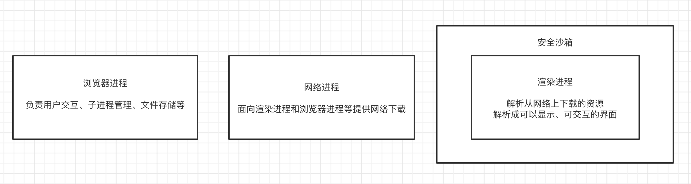

- [从输入URL，到页面展示，发生了什么？](#从输入url到页面展示发生了什么)
  
  - [细说渲染阶段](#细说渲染阶段)
    - [1.构建 DOM 树](#1构建-dom-树)
    - [2.样式计算](#2样式计算)
    - [3.布局阶段](#3布局阶段)
    - [4.分层](#4分层)
    - [5.绘制](#5绘制)
    - [6.分块](#6分块)
    - [7.栅格化和合成](#7栅格化和合成)
  - [1. 重排（回流）](#1-重排回流)
  - [2. 重绘](#2-重绘)

- [如何触发重绘和重排？](#如何触发重绘和重排)

- [如何避免重绘或者重排？](#如何避免重绘或者重排)
  
  - [集中改变样式](#集中改变样式)
  
  - [使用DocumentFragment](#使用documentfragment)
  
  - [提升为合成层](#提升为合成层)
    
    ## 从输入URL，到页面展示，发生了什么？

> 一个很经典的问题

从整体上看，一共要经历7个阶段：

1. 输入URL
2. DNS解析URL
3. 建立TCP连接（连接复用）
4. 发送HTTP请求
5. 服务器收到请求，发送HTTP响应
6. 浏览器解析渲染页面
7. 关闭TCP连接

对于浏览器来讲，主要有三个进程配合完成：

1. 浏览器进程
2. 网络进程
3. 渲染进程



可以看到，渲染进程是跑在安全沙箱里，这是因为我们在渲染进程里的一切都是在网络上拿到的，可能会有一些恶意代码利用浏览器漏洞对系统进行攻击。

**同样会经历7个阶段**

> 前期是浏览器进程和网络进程的通信，后期是浏览器进程、渲染进程、网络进程之间的通信

+ 首先，浏览器进程接收到用户输入的url请求，浏览器进程便将该URL转发给网络进程。
  
  > 浏览器进程通过进程间通信（IPC）将 URL 发送至**网络进程**

+ 在网络进程发起真正的URL请求。

+ 接着网络进程接收到了响应头数据，便解析响应头数据，并将数据转发给浏览器进程。

+ 浏览器进程接收到网络进程的响应头数据之后，便调用"CommitNavigation"函数发送IPC消息到渲染进程。
  
  > 最终调用到RenderFrameHostImpl::CommitNavigation()，RenderFrameHostImpl发送了一个IPC消息到Render进程。
  > 
  >  CommitNavigation()函数会携带response_header、request_params等基本信息传递给渲染进程。
- 渲染进程接收到“提交导航”的消息之后，便开始准备接收 HTML 数据，接收数据的方式是直接和网络进程建立数据管道；

- 最后渲染进程会向浏览器进程“确认提交”，这是告诉浏览器进程：“已经准备好接受和解析页面数据了”。
  
  > 默认情况下，Chrome 会为每个页面分配一个渲染进程
  > 
  > 如为同一站点（same-site），即根域名及协议一致，则会复用同一渲染进程

- 浏览器进程接收到渲染进程“提交文档”的消息之后，便开始移除之前旧的文档，然后更新浏览器进程中的页面状态。
  
  > 因为这里渲染进程和网络进程存在数据传输的阶段，文档数据传输完毕，浏览器进程才会收到渲染进程的消息，才会更新界面状态。所以输入URL后前一个页面还会存在一段时间。

### 细说渲染阶段


> 渲染阶段可分为**7个子阶段**：构建 DOM 树（）、样式计算（）、布局阶段（）、分层（）、绘制（）、分块（）、光栅化和合成（）
> 
> 每个阶段关注三个部分：输入，处理过程，输出

#### 1.构建 DOM 树

HTML 文件经 HTML 解析器解析，生成 DOM 树

HTML 解析器并不是等整个文档加载完成之后再解析的，而是**网络进程加载了多少数据，HTML 解析器便解析多少数据**

#### 2.样式计算

解析CSS，构建CSSOM树：标准化style值、结合继承规则计算 DOM 树每个节点的样式属性，保存在 ComputedStyle 中

**CSSOM 体现在 DOM 中就是document.styleSheets**

#### 3.布局阶段

>  **从布局开始可能会有重排**

DOM和CSSOM结合，计算出 DOM 树中可见元素的几何位置

> visibility: hidden这种也会绘制

因为DOM 树还含有很多不可见的元素，比如 head 标签，还有使用了`display:none`属性的元素。所以在显示之前，我们还要额外地构建一棵只包含可见元素布局树。**DOM 树中所有不可见的节点都不包含到布局树中**

#### 4.分层

对布局树进行分层，构建图层树

#### 5.绘制

**从绘制开始可能存在重绘**

根据图层树，依次对每个图层进行绘制

#### 6.分块

为防止开销过大，合成线程会将图层划分为图块，照视口附近的图块来优先生成位图

> 图块生成位图具体是在栅格化阶段做的

#### 7.栅格化和合成

**图块是栅格化执行的最小单位**

栅格化指将图块转换为位图，一旦所有图块都被栅格化，合成线程就会生成一个绘制图块的命令——“DrawQuad”，然后将该命令提交给浏览器进程。

**合成就是栅格化后生成绘制命令，提交给浏览器进程**

浏览器进程里面有一个叫 viz 的组件，用来接收合成线程发过来的 DrawQuad 命令，然后根据 DrawQuad 命令，将其页面内容绘制到内存中，最后再将内存显示在屏幕上。

### 1. 重排（回流）

重排和重绘肯定是样式计算阶段发生了改变，然后影响了布局或者绘制之后的整个流程更新。


- 更新元素的几何属性（宽，高等）
- 触发重新布局，开销最大

触发重排的操作有：

- 添加或删除可见的 DOM 元素 => 循环添加多个元素时，可借助 `DocumentFragment`
- 元素位置改变
- 元素尺寸改变
- 内容改变
- 浏览器窗口尺寸改变
- **获取需要及时计算的特定值**，如 offsetTop、offsetLeft、 offsetWidth、offsetHeight，getComputedStyle

### 2. 重绘


- 更新元素绘制属性（如颜色）
- 直接进入绘制，省去布局和分层，执行效率比重排高

## 如何触发重绘和重排？

重排肯定会带来重绘，但是重绘不会造成重排。

- 添加、删除、更新DOM节点——重新生成布局树，所以会有重排和重绘

- 通过display: none隐藏⼀个DOM节点——触发重排和重绘

- 通过visibility: hidden隐藏⼀个DOM节点——只触发重绘，因为没有⼏何变化

- 用户行为，例如调整窗口大小，改变字号，或者滚动——触发重排和重绘

## 如何避免重绘或者重排？

### 集中改变样式

我们往往通过改变class的⽅式来集中改变样式

不要一条一条地修改 DOM 的样式。可以先定义好 css 的 class，然后修改 DOM 的 className。

```js
// 判断是否是⿊⾊系样式
const theme = isDark ? 'dark' : 'light'
// 根据判断来设置不同的class
ele.setAttribute('className', theme)
```

### 使用DocumentFragment

我们可以通过createDocumentFragment创建⼀个游离于DOM树之外的节点，然后在此节点上批量操作，最后插⼊

DOM树中，因此只触发⼀次重排

```js
var fragment = document.createDocumentFragment();
for (let i = 0;i<10;i++){
let node = document.createElement("p");
node.innerHTML = i;
fragment.appendChild(node);
}
document.body.appendChild(fragment);
```

### 提升为合成层

将元素提升为合成层有以下优点：

- 合成层的位图，会交由 GPU 合成，⽐ CPU 处理要快

- 当需要 repaint 时，只需要 repaint 本身，不会影响到其他的层

- 对于 transform 和 opacity 效果，不会触发 layout 和 paint

提升合成层的最好方式是使⽤ CSS 的 will-change 属性：

```css
#target {
    will-change: transform;
}
```