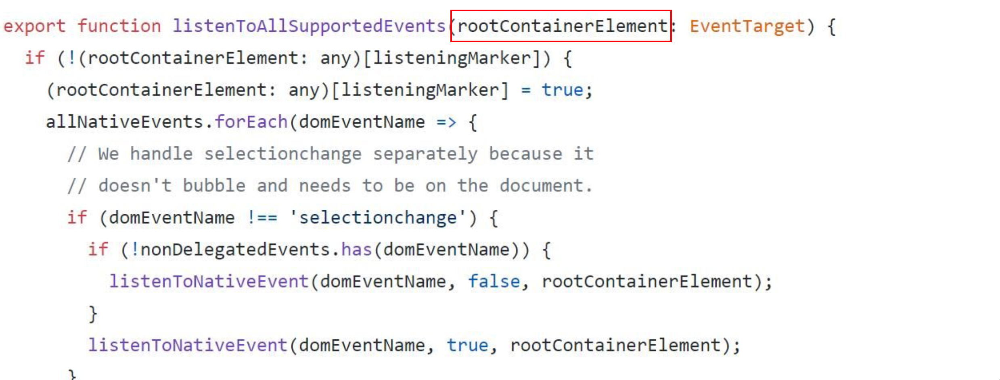
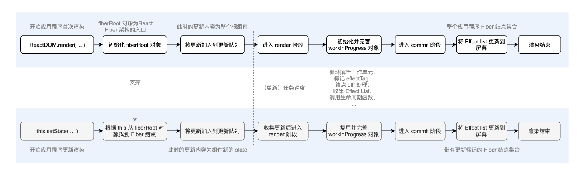

- [说一下JSX](#说一下jsx)
- [虚拟DOM](#虚拟dom)
- [diff算法](#diff算法)
- [react生命周期](#react生命周期)
- [react事件系统](#react事件系统)
- [hooks原理](#hooks原理)
- [React Fiber架构](#react-fiber架构)
  - [整体流程](#整体流程)
    - [双缓存](#双缓存)
    - [渲染](#渲染)
      - [首次渲染](#首次渲染)
      - [更新](#更新)
  - [时间切片](#时间切片)
    - [requestIdleCallback实现时间分片](#requestidlecallback实现时间分片)
    - [中断](#中断)
    - [总结](#总结)
- [redux](#redux)

## 说一下JSX

> 在日常开发中，我们已经习惯了用JSX来描述React组件。

在react 17之前，我们必须import React from "react" 才可以写JSX，本质上 是babel预编译JSX为React.createElemnet(type,config,children)，

```js
{
  "presets": ["@babel/preset-react"]
}
```

在react17之后，引入了全新的JSX转换，不会再将JSX转为React.createElemnet，而是自动从react的package中引入新的。

**JSX 的本质是React.createElement这个 JS 调用的语法糖。**

createElement接受三个参数，type用于标识节点的类型，比如div、h1、也可以是react组件类型或者react  fragment；config是以对象形式传入节点的属性（没有的话就是null），children是组件之间传入的内容（子组件、子元素）。最后React.createElement会返回ReactElement调用，ReactElement 会把传入的参数按照一定的规范，进行数据处理，“组装”进了 element 对象，并且返回element对象，最终在createElement里就会返回element对象实例。这个 **ReactElement 对象实例**，本质上**是以 JavaScript 对象形式存在的对 DOM 的描述**，也就是“虚拟 DOM”。

## 虚拟DOM

一句话就够了：虚拟DOM并不是为了性能。

JSX最终返回的是element对象，就是描述组件内容的数据结构，但是不包括组件在更新中的优先级、组件的状态、组件被打上的用于**Renderer**的`标记`等（这些都包括在fiber中）；

所以，在组件`mount`时，`Reconciler`根据`JSX`返回的组件内容生成组件对应的`Fiber节点`。

在`update`时，`Reconciler`将`JSX`与`Fiber节点`保存的数据对比，生成组件对应的`Fiber节点`，并根据对比结果为`Fiber节点`打上`标记`。-> `diff`

`commit`时，只更新打上标记的`fiber`节点。

至此，渲染结束。

## diff算法

react diff算法主要分为三个维度：

+ tree diff
  
  + 对树进行分层比较。两棵树只对同一层次的节点进行比较，如果发现节点已经不存在了，则该节点及其子节点会被完全删除掉。

+ component diff
  
  + 更新前后同一层react组件，如果组件是同一类型则进行树比对；如果不是就会进行销毁->创建

+ element diff
  
  + 同一层级所有节点的diff，主要有删除、插入、移动三种节点操作；其中节点重新排序同时涉及插入、移动、删除三个操作，可以通过标记 key 的方式，React 可以直接移动 DOM 节点，降低内耗。

在fiber机制下，这里说的节点和树对应着fiberNode和fiberTree，整个更新过程由 current 与 workInProgress 两株树双缓冲完成。当 workInProgress 更新完成后，通过修改 current 相关指针指向的节点，完成更新。

## react生命周期

生命周期主要分为三个阶段：挂载期、更新期、卸载期；

### 挂载期

首先是挂载阶段，也就是初始化渲染，会经历

+ `constructor()`初始化状态

+ `getDerivedStateFromProps()`利用`props`更新`state`，接收来自父组件的`props`以及自身`state`两个参数，**返回一个对象作为更新组件的`stat`**
  
  + `render()`把需要更新的内容返回出来（真实的`DOM`渲染会经过`ReactDom.render`完成）

+ 最后是`componentDidMount()`会在渲染结束后被触发

### 更新期

然后是更新阶段：

组件更新会存在两种可能：父组件触发的更新以及组件自身调用`setState`。

+ 对于由父组件触发的更新，我们会经历`getDerivedStateFromProps()`，然后是`shouldComponentUpdate()`逻辑；

+ 对于组件自身触发的更新，我们会直接来到`shouldComponentUpdate()`这个逻辑，`shouldComponentUpdate`默认返回`true`，也就是无条件重渲染，如果返回`false`，则不进行渲染，在实际开发中会引入`pureComponent`进行浅比较，不要无条件重渲染。

+ 然后是`render()`

+ `getSnapBeforeUpdate()`传入两个参数`(prevState,prevProps)`，执行时机是真实`DOM`更新之前，我们可以拿到更新前DOM信息，返回值将作为参数传递给 `componentDidUpdate()`

+ `componentDidUpdate()`组件渲染结束后调用该方法。

### 卸载期

最后是卸载阶段：

+ `ComponentWillUnmount()`


那些抛弃的生命周期方法主要是给`fiber`让路。

在`react16`之后，我们废弃了很多`componentWillxxx`这样的`API`，主要原因在于引入了`fiber`架构，`fiber`架构会使原本同步的`render`过程变成"异步"的。这就意味着`render`阶段可以暂停、中止、重启；所以很多生命周期可能会被重复执行。

很多滥用生命周期的操作，在`fiber`机制下就会有很多`bug`，才会有`getDerivedStateFromProps()`这个静态方法，没办法拿到`this`，确保了生命周期方法更纯粹、可控、可预测。

## react事件系统

react事件在原生的DOM事件体系上封装了一个合成事件层。react事件系统采用委托机制，实现了统一的事件监听；

事件都不会被绑定在具体的元素上，而是统一被绑定在页面的 document 上。当事件在具体的 DOM 节点上被触发后，最终都会冒泡到 document 上，然后将事件分发到具体的组件实例。

react17之后，代理到`fiberRoot`上了。



> + 合成事件符合W3C规范，在底层抹平了不同浏览器的差异，不必再关注底层兼容。
> 
> + 事件委托可以节省内存开销 → React 合成事件承袭了事件委托的思想 → 合成事件性能更好。

## React Fiber架构

在 React 16 之前，每当我们触发一次组件的更新，React 都会构建一棵新的虚拟 DOM 树，通过与上一次的虚拟 DOM 树进行 diff，实现对 DOM 的定向更新。这个过程，是一个递归的过程（**react16之后就没有所谓的两棵虚拟DOM树了**）。这个过程被称为Reconcilation，中文叫做协调。但是在协调期间，react会一直霸占浏览器资源，一则会导致用户的行为得不到响应，二则是掉帧。

react通过fiber架构，让自己的协调过程变成**可中断**的，适时让出任务执行权，可以让浏览器及时响应用户的交互。（一个任务短时间内无法完成就中断，执行另一个任务，不阻塞交互，让用户觉得快）。



不管是初次渲染还是再次更新，render阶段做的都是更新计算，确定在屏幕中要做的更新内容，核心逻辑是构建 workInProgress 对象树，收集副作用。执行结果： 得到标记了副作用的 Fiber 结点树（一个链表，需要在 commit 阶段重点处理的信息）。

在 render 阶段，React 通过时间分片的方式来处理一个或多个 Fiber 结点的更新任务，每次更新 Fiber 结点时会先向调度器请求任务执行权，如果有更高优先级的任务（如动画）则等它们执行完成之后再执行自己的更新任务。

得到任务执行权后，React 将**每个 Fiber 结点作为最小工作单位**（执行单元），通过自顶向下逐个遍历 Fiber 结点，构建workInProgress 树（一颗新的Fiber 树，更新的计算、调用部分生命周期函数等会在这个过程中完成）。这一过程总是从顶层的 HostRoot 结点开始遍历，直到找到未完成工作或者需要处理的结点。render 阶段执行完成后，FiberRoot 对象上面的 current 属性指向了一颗「Fiber 树」，我们称它为 current树，current 树上面的alternate 属性指向了另一颗「Fiber 树」也就是 workInProgress 树。

> 副作用列表来描述需要实际做的操作，比如 DOM 的更新与增删，调用生命周期函数等等。

commit阶段负责将更新内容映射到屏幕，该阶段目标： 将 render 阶段得到的副作用列表中的更新信息渲染到屏幕。执行逻辑： 通过遍历副作用列表根据副作用类型提交具体的副作用，包括 DOM 更新、调用生命周期函数、ref 更新等一系列用户可见的 UI 变化。进入 commit 阶段时，fiberRoot 对象上面的 current 树反应 当前 屏幕上 UI 的状态，workInProgress 树反映 未来。
需要映射到屏幕上 UI 的状态。副作用列表来描述需要实际做的操作，比如 DOM 的更新与增删，调用生命周期函数等等。事实上，副作用列表是 workInProgress 树的子集。
commit 阶段的工作会导致用户可见的变化，比如 DOM 更新。因此该过程不可中断，必须一直执行直到更新完成。

**React 应用程序首次渲染时的关键环节解析**

1. 构建 fiberRoot 对象（ FiberRootNode 构造函数的实例），fiberRoot 对象是整个 Fiber 架构的根结点对象。
2. 将更新加入到更新队列，此时的更新内容为应用程序的根组件。
3. 应用程序进入 render 阶段，在该阶段 React 的主要工作是构建 workInProgress 树（一颗 Fiber 树）。
4. 构建 workInProgress 树的过程中会做一些重要的工作，如为结点标记 effectTag，对结点进行 diff 处理，收集Effect List（副作用列表），调用生命周期函数等。
5. 当收集好 Effect List 后则进入 commit 阶段，在该阶段 React 主要工作就是将 Effect List 更新到屏幕，然后渲染结束。

**React 应用程序更新渲染时的关键环节解析**

1. 相对于应用程序的首次渲染，更新渲染流程的主要区别有，不再重新构建 fiberRoot 对象，因为该对象已经存在于内存中。
2. 此时的更新内容一般为组件内部发生变化的state 和props 。
3. 在进入 render 阶段前要进行任务调度，申请过的更新执行权后才能进行后续渲染工作。
4. 此时构建 workInProgress 树时也会尽可能的复用上一次创建的 Fiber 结点，同时对需要更新的结点标记对应的 effectTag。
5. 在 commit 阶段得到的 Effect List 是被标记了 effectTag 的 Fiber 结点集合（一个链表），其一般是workInProgress 树的子集。
6. 我们要做的就是只更新标记了 effectTag 的 Fiber 结点集合。

### fiberRoot和rootFiber

fiberRoot对象是整个fiber架构的入口，本质上是fiberRootNode的实例，这个对象很复杂：

```js
//packages/react-reconciler/src/ReactFiberRoot.js
function FiberRootNode(containerInfo, tag, hydrate) {
// 当前 Fiber 结点的类型
this.tag = tag;
// current树
this.current = null;
// 包含容器，就是render函数的第二个参数，传入的真实节点，一般为 div#root
this.containerInfo = containerInfo;
this.pendingChildren = null;
this.pingCache = null;
this.finishedExpirationTime = NoWork;
// 存储工作循环（workLoop）结束后的副作用列表，用于commit阶段
this.finishedWork = null;
this.timeoutHandle = noTimeout;
this.context = null;
this.pendingContext = null;
this.hydrate = hydrate;
this.firstBatch = null;
...
}
```

他有一个current属性，指向当前页面上已渲染内容对应`Fiber树`，即`current Fiber树`。

由于是首屏渲染，页面中还没有挂载任何`DOM`，所以`fiberRootNode.current`指向的`rootFiber`没有任何`子Fiber节点`（即`current Fiber树`为空）。

`rootFiber`是`<App/>`所在组件树的根节点（`ReactElement`的父节点），是整个fiber树的根，rootFiber本质上也是一个fiber节点，是fiberNode的实例：

```js
// packages/react-reconciler/src/ReactFiber.js
function FiberNode() {
// tag
this.tag = tag;
this.key = key;
// 元素类型
this.elementType = null;
this.type = null;
// stateNode
this.stateNode = null;
// return，child，sibling
this.return = null;
this.child = null;
this.sibling = null;
this.index = 0;
this.ref = null;
// 需要更新的props
this.pendingProps = pendingProps;
// 当前（未更新前）的props
this.memoizedProps = null;
// 更新队列
this.updateQueue = null;
// 当前（未更新前）的state
this.memoizedState = null;
this.dependencies = null;
// 普通模式，严格模式，并发模式等
this.mode = mode;
// 副作用类型（指插入、更新、插入并更新、删除等）
this.effectTag = NoEffect;
// 下一个副作用
this.nextEffect = null;
// 第一个副作用
this.firstEffect = null;
// 最后一个副作用
this.lastEffect = null;
// 过期时间
this.expirationTime = NoWork;
this.childExpirationTime = NoWork;
this.alternate = null;
...
}
```

tag 属性标识了当前 Fiber 结点的类型，比如函数组件元素对应的fiber节点、class组件元素对应的fiber节点等；

return ， child 和sibling 三个属性主要用途是将每个 Fiber 结点连接起来；

effectTag ， nextEffect ， firstEffect 和lastEffect 四个属性主要用途是生成副作用列表（可以用来标记更新）。

### 整体流程

#### 双缓存

在`React`中最多会同时存在两棵`Fiber树`。当前屏幕上显示内容对应的`Fiber树`称为`current Fiber树`，正在内存中构建的`Fiber树`称为`workInProgress Fiber树`。

`current Fiber树`中的`Fiber节点`被称为`current fiber`，`workInProgress Fiber树`中的`Fiber节点`被称为`workInProgress fiber`，他们通过`alternate`属性连接。

```js
currentFiber.alternate === workInProgressFiber;
workInProgressFiber.alternate === currentFiber;
```

`React`应用的根节点通过使`current`指针在不同`Fiber树`的`rootFiber`间切换来完成`current Fiber`树指向的切换。

即当`workInProgress Fiber树`构建完成交给`Renderer`渲染在页面上后，应用根节点的`current`指针指向`workInProgress Fiber树`，此时`workInProgress Fiber树`就变为`current Fiber树`。

每次状态更新都会产生新的`workInProgress Fiber树`，通过`current`与`workInProgress`的替换，完成`DOM`更新。

#### 渲染

##### 首次渲染

首次执行`ReactDOM.render`会创建`fiberRootNode`（`fiberRoot`）和`rootFiber`。其中`fiberRootNode`是整个应用的根节点，`rootFiber`是`<App/>`所在组件树的根节点。

由于是首屏渲染，页面中还没有挂载任何`DOM`，所以`fiberRootNode.current`指向的`rootFiber`没有任何`子Fiber节点`（即`current Fiber树`为空）。

> 之所以要区分`fiberRootNode`与`rootFiber`，是因为在应用中我们可以多次调用`ReactDOM.render`渲染不同的组件树，他们会拥有不同的`rootFiber`。但是整个应用的根节点只有一个，那就是`fiberRootNode`。

接下来进入`render阶段`，根据组件返回的`JSX`在内存中依次创建`Fiber节点`并连接在一起构建`Fiber树`，被称为`workInProgress Fiber树`。

在构建`workInProgress Fiber树`时会尝试复用`current Fiber树`中已有的`Fiber节点`内的属性，在`首屏渲染`时只有`rootFiber`存在对应的`current fiber`（即`rootFiber.alternate`）

已构建完的`workInProgress Fiber树`在`commit阶段`渲染到页面。

此时`DOM`更新为树对应的样子。`fiberRootNode`的`current`指针指向`workInProgress Fiber树`使其变为`current Fiber 树`。

##### 更新

接下来我们点击`p节点`触发状态改变，这会开启一次新的`render阶段`并构建一棵新的`workInProgress Fiber 树`。

和`mount`时一样，`workInProgress fiber`的创建可以复用`current Fiber树`对应的节点数据。

> 这个决定是否复用的过程就是Diff算法

`workInProgress Fiber 树`在`render阶段`完成构建后进入`commit阶段`渲染到页面上。渲染完毕后，`workInProgress Fiber 树`变为`current Fiber 树`。

### 时间切片

（比较复杂）

我们知道页面是一帧一帧渲染出来的，当每秒绘制的帧数（FPS）达到60时，页面是流畅的，小于这个值就会卡顿，也就是说，尽量让每一帧的工作量不超过16ms；而一帧通常需要：处理用户交互、JS解释执行、帧开始、RAF、布局、绘制；在这6个步骤中，任何一个步骤占用的时间过长，使得总时间超过了16ms，都会觉得卡顿。

协调阶段花的时间过长，也就是JS执行时间过长，那么就可能在交互的时候，本来应该是渲染下一帧了，但是在当前帧还在执行JS进行更新任务，就导致用户交互不能马上得到反馈，从而卡顿。

所以我们要把更新任务细分，分成fiber，而且要严格控制每一个fiber（或者每一组fiber）的执行时间。

#### requestIdleCallback实现时间分片

`时间切片`的本质是模拟实现requestIdleCallback。

我们把两个执行帧之间的空闲期叫做时间片。requestIdleCallback就是浏览器在两个执行帧之间的空闲期调用的回调函数（对于不支持这个API的浏览器，react会自己实现一个）。

当浏览器繁忙的时候，这时候requestIdleCallback回调可能不会被执行，可以通过requestIdleCallback的第二个参数指定一个超时时间。超时就强制执行requestIdleCallback。

> requestIdleCallback 是谷歌浏览器提供的一个 API， 在浏览器有空余的时间，浏览器就会调用 requestIdleCallback 的回调。首先看一下 requestIdleCallback的基本用法：
> 
> ```js
> requestIdleCallback(callback,{ timeout })
> ```
> 
> - callback 回调，浏览器空余时间执行回调函数。
> - timeout 超时时间。如果浏览器长时间没有空闲，那么回调就不会执行，为了解决这个问题，可以通过 requestIdleCallback 的第二个参数指定一个超时时间。

#### 中断

在 render 阶段，React 通过时间分片的方式来处理一个或多个 Fiber 结点的更新任务，每次更新 Fiber 结点时会先向调度器请求任务执行权，如果有更高优先级的任务（如动画）则等它们执行完成之后再执行自己的更新任务。

假设用户调用setState更新组件，这个待更新的任务就会放到更新队列里，然后通过requestIdleCallback判断是否执行（判断有没有剩余时间），进而是否构建workInProgress 树。

workloop函数会从更新队列弹出任务来执行，每执行一个执行单元，就检查时间是否充足，如果充足就执行下一个执行单元，反之停止执行，保存现场等待下一次 requestIdleCallback 调用，再继续构建 workInProgress 树。

>  Fiber Reconciler的调度方式主要有两个特点，第一个是协作式多任务模式，在这个模式下，线程会定时放弃自己的运行权利，交还给主线程，通过requestIdleCallback 实现。第二个特点是策略优先级，调度任务通过标记 tag 的方式分优先级执行，比如动画，或者标记为 high 的任务可以优先执行。Fiber Reconciler的基本单位是 Fiber，Fiber 基于过去的 React Element 提供了二次封装，提供了指向父、子、兄弟节点的引用，为 diff 工作的双链表实现提供了基础。
> 
> 但是后面优先级方式更新为lane。
> 
> Render 阶段的执行特点是可中断、可停止，主要是通过构造 workInProgress 树计算出 diff。以 current 树为基础，将每个 Fiber 作为一个基本单位，自下而上逐个节点检查并构造 workInProgress 树。这个过程不再是递归，而是基于循环来完成。
> 
> 在执行上通过 requestIdleCallback 来调度执行每组任务，每组中的每个计算任务被称为 work，每个 work 完成后确认是否有优先级更高的 work 需要插入，如果有就让位，没有就继续。优先级通常是标记为动画或者 high 的会先处理。每完成一组后，将调度权交回主线程，直到下一次 requestIdleCallback 调用，再继续构建 workInProgress 树。

#### 总结

react16在react15的基础上多了一层调度器的架构，本质上是实现了浏览器requestIdleCallback这个API，以浏览器有没有剩余时间作为任务中断的标准，而requestIdleCallback正是浏览器有剩余时间触发的回调，不过由于浏览器兼容性以及触发频率不稳定，react官方实现了requestIdleCallback这个polyfill，也就是scheduler。不过scheduler除了实现在空闲时触发回调的功能外，还提供了多种调度优先级供任务设置。

> scheduler是独立于react之外的库

细品：可中断可恢复的实现还是靠fiber这个数据结构的设计，作为fiberNode的实例，其中的三个属性return、child、sibling，构成了一个链表结构，也就是可以用迭代的方式来处理这些节点，在源码中就是performUnitOfWork，本质上是实现一个深度遍历，performUnitOfWork负责对fiber进行操作，并按照深度优先遍历的顺序返回下一个fiber。

有了链表结构，即使处理流程被中断了，也可以从上次未处理完的fiber继续遍历下去。

在源码中：

```js
// 记录下一个需要处理的工作单元
let nextUnitOfWork: Fiber | undefined
// 记录 第一个工作单元
let topWork: Fiber | undefined
```

调度和协调过程什么时候会被中断呢？

+ 当前帧无剩余时间
+ 有其他更高优先级的任务需要更新

render阶段会给需要更新的fiber打上effectTag标记，挂载到rootFiber.firstEffect上，firstEffect上保存了一个需要执行 副作用的fiber节点的单向链表effectList。

commit阶段会遍历三次effectList链表：

+ 执行DOM操作前
  + 处理DOM节点渲染、删除后onfocus、onblur逻辑
  + 调用getSnapsbotBeforeUpdate生命钩子
  + 调度useEffect
+ 执行DOM操作
  + 根据effectTag调度不同的处理函数处理fiber
+ 执行DOM操作后
  + 更新ref

## redux

redux是js状态管理容器，提供了可预测的状态管理。

主要由三部分构成：

+ store：一个只读的单一数据源

+ action：对变化的描述

+ reducer：对变化进行分发和处理，最终将新的数据返回给store

在整个过程，数据流都是严格单向的，如果想对数据进行改变，只有一种途径——派发action。action会被reducer读取，进而根据action内容的不同对数据进行修改、生成新的state，新的state会更新到store对象里，进而驱动视图层面做出相应的改变。
