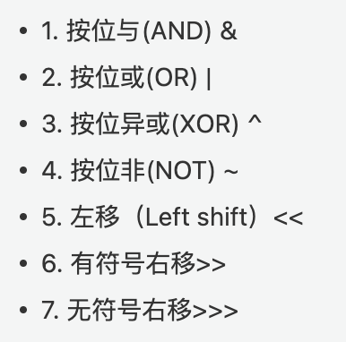
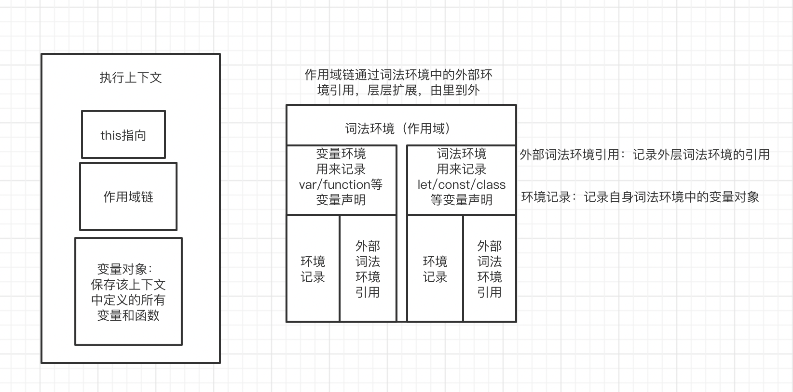

基础没怎么看，一些api都忘了；很尴尬。

要注意基础。

## useMemo和useCallback

首先我们知道这两个api主要的场景都是避免无意义的渲染，节省性能。

> 底层是怎么实现的呢？

### 以useMemo为例

对于`useMemo`来说，这里的`hook.memoizedState`是个数组，`deps`存到`hook.memoizedState[1]`，`nextCreate`初次渲染的时候会被存到`hook.memoizedState[0]`，下次更新只需比较两次的deps是否相等，相等的话，证明依赖项没有发生别变化，直接返回上次存到`hook.memoizedState[0]`的值即可，否则执行`nextCreate`，重新计算，把值再次存入`hook.memoizedState[0]`并返回。

```js
// 初始化useMemo，就是创建一个hook，
// 然后执行useMemo的第一个参数,得到需要缓存的值，
// 然后将值和deps记录下来，赋值给当前hook的memoizedState。
function mountMemo(nextCreate,deps){
  const hook = mountWorkInProgressHook();
  const nextDeps = deps === undefined ? null : deps;
  const nextValue = nextCreate();
  hook.memoizedState = [nextValue, nextDeps];
  return nextValue;
}
// 在组件更新过程中，执行useMemo函数，就是判断两次 deps是否相等，
// 如果不相等等，证明依赖项发生改变，那么执行 useMemo的第一个函数，得到新的值，
// 然后重新赋值给hook.memoizedState,
// 如果相等 证明没有依赖项改变，那么直接获取缓存的值。

function updateMemo(
  nextCreate,
  deps,
) {
  const hook = updateWorkInProgressHook();
  const nextDeps = deps === undefined ? nul : deps; // 新的 deps 值
  const prevState = hook.memoizedState; 
  if (prevState !== null) {
    if (nextDeps !== null) {
      const prevDeps = prevState[1]; // 之前保存的 deps 值
      if (areHookInputsEqual(nextDeps, prevDeps)) { //判断两次 deps 值
        return prevState[0];
      }
    }
  }
  const nextValue = nextCreate();
  hook.memoizedState = [nextValue, nextDeps];
  return nextValue;
}
```

### Object.is

这里要提一下判断两个`deps`是否相等`areHookInputsEqual`，本质上是`ployfill`的`object.is`。

不过`===`有个问题：

```js
+0 === -0 //true
NaN === NaN // false
```

所以：

```js
Object.defineProperty(Object, 'is', {
  value: function(x, y) {
    if (x === y) {
      // 针对+0 不等于 -0的情况
      // 期望的是 +0 不等于 -0 ， +0 -0 false
      return x !== 0 || 1 / x === 1 / y;
    }
    // 针对NaN的情况
    // 期望的是NaN等于NaN NaN NaN true
    return x !== x && y !== y;
  },
  configurable: true,
  enumerable: false,
  writable: true
});
```

这是`react`官方的`polyfill`：

```js
// react/packages/shared/objectIs.js
function is(x: any, y: any) {
  return (
    (x === y && (x !== 0 || 1 / x === 1 / y)) || (x !== x && y !== y) // eslint-disable-line no-self-compare
  );
}

const objectIs: (x: any, y: any) => boolean =
  typeof Object.is === 'function' ? Object.is : is;

export default objectIs;
```

## commonjs加载顺序

+ 模块在被第一次引入时，模块中的js代码会被运行一次

+ 模块被多次引入时，会缓存，最终只加载(运行)一次 
  
  + 因为每个模块对象`module`都有一个属性：loaded。
  
  + 为false表示还没有加载，为true表示已经加载;

Node采用的是深度优先加载：`main -> aaa -> ccc -> ddd -> eee ->bbb`


### 例子🌰

Node [官方文档](https://nodejs.org/api/modules.html#modules_cycles)里面的例子。脚本文件`a.js`代码如下：

```javascript
exports.done = false;
var b = require('./b.js');
console.log('在 a.js 之中，b.done = %j', b.done);
exports.done = true;
console.log('a.js 执行完毕');
```

上面代码之中，`a.js`脚本先输出一个`done`变量，然后加载另一个脚本文件`b.js`。****

**注意，此时`a.js`代码就停在这里，等待`b.js`执行完毕，再往下执行。**

再看`b.js`的代码。

```javascript
exports.done = false;
var a = require('./a.js');
console.log('在 b.js 之中，a.done = %j', a.done);
exports.done = true;
console.log('b.js 执行完毕');
```

上面代码之中，`b.js`执行到第二行，就会去加载`a.js`，这时，就发生了“循环加载”。系统会去`a.js`模块对应对象的`exports`属性取值，可是因为`a.js`还没有执行完，从`exports`属性只能取回已经执行的部分，而不是最后的值。

`a.js`已经执行的部分，只有一行。

```javascript
exports.done = false;
```

因此，对于`b.js`来说，它从`a.js`只输入一个变量`done`，值为`false`。

然后，`b.js`接着往下执行，等到全部执行完毕，再把执行权交还给`a.js`。于是，`a.js`接着往下执行，直到执行完毕。我们写一个脚本`main.js`，验证这个过程。

```javascript
var a = require('./a.js');
var b = require('./b.js');
console.log('在 main.js 之中, a.done=%j, b.done=%j', a.done, b.done);
```

执行`main.js`，运行结果如下。

```bash
$ node main.js

在 b.js 之中，a.done = false
b.js 执行完毕
在 a.js 之中，b.done = true
a.js 执行完毕
在 main.js 之中, a.done=true, b.done=true
```

上面的代码证明了两件事。一是，在`b.js`之中，`a.js`没有执行完毕，只执行了第一行。二是，**`main.js`执行到第二行时，不会再次执行`b.js`，而是输出缓存的`b.js`的执行结果，** 即它的第四行。

## ajax

`Ajax` 是 `Asynchronous JavaScript and XML`（异步的 `JavaScript` 与 `XML` 技术）的缩写。

我们知道，浏览器是有发请求收响应的功能的，把这个功能暴露给开发者，开发者可以用`JS`实现发请求、收响应的功能，这就是`Ajax`。

**Ajax的全部内容就是，用JS发送请求和接收响应。**

怎么把浏览器发送请求接收响应的功能暴露给开发者呢？浏览器在`window`上加了一个**XMLHttpRequest函数**，用这个构造函数（类）可以构造出一个对象，`JS`通过他实现发请求、收响应。

### 四个步骤

- 创建`XMLHttpRequest`对象

- 调用对象的`open`方法，（我们一般只传入前两个参数，这一步是为了“打开”这个对象，然后使用这个对象，需要说明请求的方式以及请求的`URL`）

- 监听`onreadystatechange`事件
  
  - 我们可以在事件处理函数中操作`CSS`文件内容；
    
    - 操作`JS`文件内容
    
    - 操作`HTML`文件内容
    
    - 还可以加载`XML`
    
    - 加载`JSON`

- 调用对象的`send`方法，发送请求。

### 一个请求的一生

| 一个请求的一生                         | req.readyState                  |
| ------------------------------- | ------------------------------- |
| const req=new XMLHttpRequest(); | 0                               |
| req.open()                      | 1                               |
| req.send()                      | 2（send 方法被调用，并且可以获取响应头部以及响应状态码） |
| 第一个信息出现在浏览器                     | 3（开始下载响应内容）                     |
| 下载完成                            | 4                               |

### 原生ajax

```js
const ajax = () => {
    const req = new XMLHttpRequest;
    req.open;
    req.onreadystatechange = ()=>{
        if(req.readyState === 4){
            if(req.status>200 && req.status<300){
                console.log(JSON.parse(req.response))
            }else{
                console.log("error")
            }
        }
    }
     req.send();
}
```

### post请求

```js
const ajax = (method,data,url,onSuccess,onFail) => {
    const req = new XMHttpRequest()
    req.open(method,url)
    // 设置post提交数据方式
    rxhr.setRequestHeader('Content-Type','application/json');
    req.onreadystatechange=()=>{
       if(req.readyState===4 && req.status===200)
            onSuccess(req.response)
        } else{
            onFail(req.status)
        }
    }   
    // 发送请求消息
    xhr.send(JSON.stringify(data)); 
}
```

## 基本包装类型

**创建实例->调用->销毁**

以数值类型为例：

```js
var a = 12.3;
console.log(a.toFixed(3)); // 输出"12.300"

a.foo = 'bar';// 创建实例->调用->销毁
console.log(a.foo); // 输出undefined（因为已经销毁）
```

上述代码说明，基本类型可以像对象类型一样使用，包括访问其属性、对其属性赋值（尽管实际上不起作用，但是形式上可以）。

之所以能这样去使用基本类型，是因为`JavaScript`引擎内部在处理对某个基本类型 `a`进行形如`a.sth`的操作时，会在内部临时创建一个对应的包装类型（对数字类型来说就是`Number`类型）的临时对象，并把对基本类型的操作代理到对这个临时对象身上，使得对基本类型的属性访问看起来像对象一样。但是在操作完成后，临时对象就扔掉了，下次再访问时，会重新建立临时对象，当然对之前的临时对象的修改都不会有效了。

### 细节

基本包装类型是特殊的引用类型。每当读取一个基本类型值的时候，后台就会创建一个对应的基本包装类型的对象，从而可以调用属性、方法来进行后续操作。  

我们经常写类似这样的代码，基本类型的变量可以当做对象一样调用属性、方法，但这又不是一个真正的对象只是一个变量而已：

```js
var str = "hello world";
console.log(str.length); // 113 
console.log(str.toUpperCase());// HELLO WORLD
```

其实为了便于操作基本数据类型的值，`JavaScript` 中的基本数据类型的值会在后台创建一个对应的基本包装类型对象，除了 `null` 和 `undefined` 所有的基本类型都有对应的包装类型。  

如上代码，后台会自动完成下列的处理：  
执行到第二行时： 

1. 创建 String 类型的一个实例     

2. 在实例上调用指定的属性；

3.  销毁这个实例；

执行到第三行时：  

1. 创建 String 类型的一个实例；  

2. 在实例上调用指定的方法；  

3. 销毁这个实例； 

相当于：

```js
// 执行到第二行时
var str = new String("hello world");
// 调用属性
str.length;
// 销毁实例
str = null;
```

并不是包装类型提供了方法，而是`javascript` 引擎后台创建了对应基本包装类型的实例（对象）；

**通过以上代码块我们知道基本包装类型自动创建的对象在对象被调用的时刻存在，调用完后就被销毁了**，而使用new关键字创建的引用类型的实例，对象在当前作用域都存在。

```js
var s='some';
s.age='Joel';
console.log(s.age);//undefined
```

如上代码在给字符串`s`添加`age`属性，但是当代码执行到第三行时`age`属性已经被销毁了，当代码执行第三行时，又创建了一个`String` 实例，但是这个实例并没有`age`属性所以输出`undefined`； 

### 显示实例化包装类型

引用类型对象与基本包装类型对象的区别：主要区别就是这两种对象的生命周期不同。

```js
var s=new String('some'); 
s.age='Joel'; 
console.log(s.age);//Joel
```

## promise的超时重新请求

参数（fn，times，interval）

```js
export default function (promiseProducer, interval, attemptTimes) {
  // interval = typeof interval === "number" && interval >= 300 ? interval : 500;
  // attemptTimes = typeof attemptTimes === "number" && attemptTimes >= 1 ? attemptTimes : 10000;
  return new Promise((resolve, reject) => {
    let promise = null;
    let executePromise = timer => {
      if(attemptTimes < 1){
        window.clearInterval(timer);
        reject(new Error('promise not until timeout'));
        return void 0;
      }
      attemptTimes -= 1;
      return promiseProducer().then(res => {
        window.clearInterval(timer);
        resolve(res);
      }).catch((e) => {
        throw new Error(e);
      });
    };

    let timer = window.setInterval(() => {
      promise = executePromise(timer);
    }, interval);
    promise = executePromise(timer);
  });
}
```

## cookie的属性

| 属性         | 说明                                                                                                                                                              |
| ---------- | --------------------------------------------------------------------------------------------------------------------------------------------------------------- |
| name=value | 键值对，设置 Cookie 的名称及相对应的值，都必须是字符串类型 <br/>- 如果值为 Unicode 字符，需要为字符编码。<br/>- 如果值为二进制数据，则需要使用 BASE64 编码。                                                              |
| domain     | 指定 cookie 所属域名，默认是当前域名                                                                                                                                          |
| path       | 指定 cookie 在哪个路径（路由）下生效，默认是 '/'。<br/>如果设置为 /abc，则只有 /abc 下的路由可以访问到该 cookie，如：/abc/read。                                                                          |
| maxAge     | cookie 失效的时间，单位秒。如果为整数，则该 cookie 在 maxAge 秒后失效。如果为负数，该 cookie 为临时 cookie ，关闭浏览器即失效，浏览器也不会以任何形式保存该 cookie 。如果为 0，表示删除该 cookie 。默认为 -1。 比 expires 好用。             |
| expires    | 过期时间，在设置的某个时间点后该 cookie 就会失效。<br/>一般浏览器的 cookie 都是默认储存的，当关闭浏览器结束这个会话的时候，这个 cookie 也就会被删除                                                                        |
| secure     | 该 cookie 是否仅被使用安全协议传输。安全协议有 HTTPS，SSL等，在网络上传输数据之前先将数据加密。默认为false。<br/>当 secure 值为 true 时，cookie 在 HTTP 中是无效，在 HTTPS 中才有效。                                       |
| httpOnly   | 如果给某个 cookie 设置了 httpOnly 属性，只有在http请求头中会带有此cookie的信息，无法通过 JS 脚本 读取到该 cookie 的信息（document.cookie），但还是能通过 Application 中手动修改 cookie，所以只是在一定程度上可以防止 XSS 攻击，不是绝对的安全 |

#### SameSite

SameSite 是最近非常值得一提的内容，因为 2 月份发布的 Chrome80 版本中默认屏蔽了第三方的 Cookie，这会导致阿里系的很多应用都产生问题，为此还专门成立了问题小组，推动各 BU 进行改造。

##### 作用

我们先来看看这个属性的作用：

SameSite 属性可以让 Cookie 在跨站请求时不会被发送，从而可以阻止跨站请求伪造攻击（CSRF）。

##### 属性值

SameSite 可以有下面三种值：

1. **Strict** 仅允许一方请求携带 Cookie，即浏览器将只发送相同站点请求的 Cookie，即当前网页 URL 与请求目标 URL 完全一致。
2. **Lax** 允许部分第三方请求携带 Cookie
3. **None** 无论是否跨站都会发送 Cookie

**之前默认是 None 的，Chrome80 后默认是 Lax。**

##### 跨域和跨站

首先要理解的一点就是跨站和跨域是不同的。同站(same-site)/跨站(cross-site)」和第一方(first-party)/第三方(third-party)是等价的。但是与浏览器同源策略（SOP）中的「同源(same-origin)/跨域(cross-origin)」是完全不同的概念。

同源策略的同源是指两个 URL 的协议/主机名/端口一致。例如，[www.taobao.com/pages/](https://link.juejin.cn/?target=https%3A%2F%2Fwww.taobao.com%2Fpages%2F "https://www.taobao.com/pages/")...，它的协议是 https，主机名是 www.taobao.com，端口是 443。

同源策略作为浏览器的安全基石，其「同源」判断是比较严格的，相对而言，Cookie中的「同站」判断就比较宽松：只要两个 URL 的 eTLD+1 相同即可，不需要考虑协议和端口。其中，eTLD 表示有效顶级域名，注册于 Mozilla 维护的公共后缀列表（Public Suffix List）中，例如，.com、.co.uk、.github.io 等。eTLD+1 则表示，**有效顶级域名+二级域名**，例如 taobao.com 等。

举几个例子，www.taobao.com 和 www.baidu.com 是跨站，www.a.taobao.com 和 www.b.taobao.com 是同站，a.github.io 和 b.github.io 是跨站(注意是跨站)。

##### 改变

接下来看下从 None 改成 Lax 到底影响了哪些地方的 Cookies 的发送？直接来一个图表：


从上图可以看出，对大部分 web 应用而言，Post 表单，iframe，AJAX，Image 这四种情况从以前的跨站会发送三方 Cookie，变成了不发送。

Post表单：应该的，学 CSRF 总会举表单的例子。

iframe：iframe 嵌入的 web 应用有很多是跨站的，都会受到影响。

AJAX：可能会影响部分前端取值的行为和结果。

Image：图片一般放 CDN，大部分情况不需要 Cookie，故影响有限。但如果引用了需要鉴权的图片，可能会受到影响。

除了这些还有 script 的方式，这种方式也不会发送 Cookie，像淘宝的大部分请求都是 jsonp，如果涉及到跨站也有可能会被影响。

## 解析url

## http请求头

### Accept

告诉服务器，浏览器接受的媒体类型，`*/*`表示任何类型，`type/*`表示该类型下的所有子类型，`type/sub-type`。

比如：`image/gif`、`image/jpeg`

> 还可以设置优先级，用`q`来表示权重（`0～1`，默认为`1`），用`;`分隔，

### Accept-Encoding

Accept-Encoding告知服务器浏览器支持的内容编码；

比如：

+ gzip

+ compress

+ deflate

> 也可以使用`*`作为通配符

### Accept-Language

`Accept-Language`告知服务器浏览器能够处理的语言；

### Referer

`Referer`告知服务器请求的原始`url`是从那个`web`页面发起的。

### User-Agent

  `User-Agent`会将创建请求的浏览器等信息传给服务器。

## 判断数据类型的方式

+ `typeof`
  
  + 引用数据类型 `Object`，用 `typeof` 来判断的话，除了 `function` 会判断为 `OK` 以外，其余都是 '`object`'，是无法判断出来的。
  
  + `typeof null` 的结果是 `object`

+ `instanceof`
  
  + `instanceof` 可以准确地判断复杂引用数据类型，但是不能正确判断基础数据类型；

+ `Object.prototype.toString.call()`
  
  + 使用这个方法最后返回统一字符串格式为 "[object Xxx]" ，而这里字符串里面的 "Xxx" ，第一个首字母要大写（注意：使用 typeof 返回的是小写）

## 懒加载的常用方法，具体实现

### 原理

本质上就是利用了自定义属性`data-`，用于保存数据。对于懒加载来讲，图片依赖于`src`属性，我们可以把真正的地址放到`data-src`中，当需要展示图片时，再赋值给`src`。

> 所有在元素上以`data-`开头的属性为数据属性。比如说你有一篇文章，而你又想要存储一些不需要显示在浏览器上的额外信息。

### getBoundingClientRect

1. 根据 `getBoundingClientRect` 得到元素相对视口的位置，判断是否在可见范围内
2. 在可见范围内时，将 `data-src` 中的值设到 `src` 上
3. 配合滚动监听

```js
function lazyload() {
  let viewHeight = document.body.clientHeight //获取可视区高度
  let imgs = document.querySelectorAll('img[data-src]')
  imgs.forEach((item, index) => {
    if (item.dataset.src === '') return

    // 用于获得页面中某个元素的左，上，右和下分别相对浏览器视窗的位置
    let rect = item.getBoundingClientRect()
    if (rect.bottom >= 0 && rect.top < viewHeight) {
      item.src = item.dataset.src
      item.removeAttribute('data-src')
    }
  })
}

// 
window.addEventListener('scroll', lazyload)
```

这是`html`：

> 页面中的img标签src指向一张小图片或者src为空，然后定义`data-src`（这个属性可以自定义命名）属性指向真实的图片。`src`指向一张默认的图片，否则当`src`为空时也会向服务器发送一次请求。可以指向`loading`的地址。
> 
> `dataset`用来为html普通标签设置自定义属性，方便储存一些数据

```js
<html lang="en">
  <head>
    <meta charset="UTF-8" />
    <title>Lazyload</title>
    <style>
      img {
        display: block;
        margin-bottom: 50px;
        height: 200px;
        width: 400px;
      }
    </style>
  </head>
  <body>
    
    
    
    
    
    
    
    
    
    
  </body>
</html>
```

## css外链，网慢会出现什么状况

链接式:  

```html
<link href="style.css" rel="stylesheet" type="text/css"/>
```

导入式：

```html
<style type="text/css"> @import"style.css";</style>
```

使用链接方式时，会在装载页面主体部分之前装载css文件，这样显示出来的网页从一开始就是带有样式

导入式，会在整个页面装载完成后再装载css文件，对于有的浏览器来说，在一些情况下，如果网页文件的体积比较大，则会出现先显示无样式页面，闪一下之后再出现设置样式后的效果。

对于较大网站，为了便于维护，可能会希望把所有的css样式分类别放到几个css文件中，这样如果使用链接式引入，就需要几个语句分别导入css，如果要调整css的文件分类，就需要同是调整HTML文件。这对于维护工作来说，是一个缺陷。如果使用导入式，则可以只引进一个总的css文件，在这个文件中再导入其他独立css文件;而链接则不具备这个特性

## 怎样阻止事件的默认行为

`event.preventDefault`

## 取消冒泡

`stopPropagation`、`cancelBubble`

## 伪类和伪元素

**伪类的操作对象是文档树中已有的元素，而伪元素则创建了一个文档树外的元素。**

伪类`:` hover/focus

> 伪类用于当已有元素处于的某个状态时，为其添加对应的样式，这个状态是根据用户行为而动态变化的。

伪元素：`::`after/before

> 伪元素用于创建一些不在文档树中的元素，并为其添加样式。比如说，我们可以通过:before来在一个元素前增加一些文本，并为这些文本添加样式。虽然用户可以看到这些文本，但是这些文本实际上不在文档树中。

## meta标签有哪些常用属性

通常有

+ charset，指定字符集（不然会有一些乱码）

+ name+content，content作为name的描述，通常name的值有：author、website、copyright、keywords、description、viewport
  
  + 关于viewport，通常出现在移动端的场景，在HTML的head标签里加上 <meta name="viewport" content="width=device-width"> ，就告诉浏览器我是移动端页面，用的是移动端的设计，对于视口 viewport，我要把默认文档宽度 width （布局视口宽度）设置为逻辑像素宽度 device-width（视觉视口宽度、设备宽度、屏幕宽度）。

+ http-equiv，expires指定网页的过期时间。一旦网页过期，必须从服务器上下载。

#### charset

```js
// 定义网页文档的字符集
<meta charset="utf-8" />
```

<!-- 定义网页文档的字符集 -->

#### name + content属性

```js
// 网页作者
<meta name="author" content="开源技术团队"/>
// 网页地址
<meta name="website" content="https://sanyuan0704.github.io/frontend_daily_question/"/>
// 网页版权信息
 <meta name="copyright" content="2018-2019 demo.com"/>
// 网页关键字, 用于SEO
<meta name="keywords" content="meta,html"/>
// 网页描述
<meta name="description" content="网页描述"/>
// 搜索引擎索引方式，一般为all，不用深究
<meta name="robots" content="all" />
// 移动端常用视口设置
<meta name="viewport" content="width=device-width,initial-scale=1.0,maximum-scale=1.0, user-scalable=no"/>
// viewport参数详解：
// width：宽度（数值 / device-width）（默认为980 像素）
// height：高度（数值 / device-height）
// initial-scale：初始的缩放比例 （范围从>0 到10）
// minimum-scale：允许用户缩放到的最小比例
// maximum-scale：允许用户缩放到的最大比例
// user-scalable：用户是否可以手动缩 (no,yes)  
```

#### http-equiv属性

```js
// expires指定网页的过期时间。一旦网页过期，必须从服务器上下载。
<meta http-equiv="expires" content="Fri, 12 Jan 2020 18:18:18 GMT"/>
// 等待一定的时间刷新或跳转到其他url。下面1表示1秒
<meta http-equiv="refresh" content="1; url=https://www.baidu.com"/>
// 禁止浏览器从本地缓存中读取网页，即浏览器一旦离开网页在无法连接网络的情况下就无法访问到页面。
<meta http-equiv="pragma" content="no-cache"/>
// 也是设置cookie的一种方式，并且可以指定过期时间
<meta http-equiv="set-cookie" content="name=value expires=Fri, 12 Jan 2001 18:18:18 GMT,path=/"/>
// 使用浏览器版本
<meta http-equiv="X-UA-Compatible" content="IE=edge,chrome=1" />
// 针对WebApp全屏模式，隐藏状态栏/设置状态栏颜色，content的值为default | black | black-translucent
<meta name="apple-mobile-web-app-status-bar-style" content="black-translucent" />
```

## display有哪些属性

+ `none`，`none` 此元素不会被显示，并且不占据页面空间，这也是与`visibility:hidden`不同的地方，设置`visibility:hidden`的元素，不会被显示，但是还是会占据原来的页面空间。

+ `inline`，行内元素 元素会在一行内显示，超出屏幕宽度自动换行，不能设置宽度和高度，元素的宽度和高度只能是靠元素内的内容撑开。
  
  示例元素：`span`,`a`,`sub`,`sup`,`strong`,`em`

+ `block`，块级元素 会独占一行，如果不设置宽度，其宽度会自动填满父元素的宽度，可以设置宽高，即使设置了宽度，小于父元素的宽度，块级元素也会独占一行。
  
  示例元素：`div`,`h1-h6`,`ul`,`ol`,`p`

+ `inline-block`，行内块元素 与行内元素一样可以再一行内显示，而且可以设置宽高，可以设置`margin`和`padding`。
  
  示例元素：`input`,`button`,`img`

+ `flex`

+ `inherit`，规定应该从父元素继承 `display` 属性的值

## 说一下bfc，怎么开启bfc

> BFC本质上就是块级元素的内部元素以及块级元素之间的布局规则
> 
> 比如我们写的div，为什么会垂直排列，其实根元素就是一个BFC

块格式化上下文：一个独立的渲染区域，容器里的子节点不会在布局上影响到外面的节点

> 规则

- 节点在垂直方向上按顺序排列
- 节点垂直方向距离由`margin`决定，相邻节点的`margin`会发生重叠，以最大`margin`为合并值
- 节点的`margin-left/right`与父节点的`左边/右边`相接触，即使处于浮动也如此，除非自行形成`BFC`
- `BFC`是一个隔离且不受外界影响的独立容器
- `BFC`不会与同级浮动区域重叠
- 计算`BFC`高度时其浮动子节点也参与计算

> 成因

- 根节点：`html`
- 非溢出可见节点：`overflow:!visible`
- 浮动节点：`float:left/right`
- 绝对定位节点：`position:absolute/fixed`
- 被定义成块级的非块级节点：`display:inline-block/table-cell/table-caption/flex/inline-flex/grid/inline-grid`
- 父节点与正常文档流的子节点(非浮动)自动形成`BFC`

> 场景

- 清除浮动
- 已知宽度水平居中
- 防止浮动节点被覆盖
- 防止垂直margin合并

面试中常问到的`margin塌陷`问题，可用BFC的概念回答了。所谓的塌陷其实是两个BFC的相邻盒或父子盒相互作用时产生的效果，两个盒子会取相邻边最大`margin`作为相邻边的共用`margin`。

在此笔者补充一些`margin折叠`的计算问题，相信在笔试上会遇到。

- 两个盒子相邻边的`margin`都为正值，取最大值
- 两个盒子相邻边的`margin`都为负值，取最小值，两者会互相重合
- 两个盒子相邻边的`margin`一正一负，取两者相加值，若结果为负，两者会互相重合

## script标签的defer和async，defer和loaded事件谁先执行

首先单独的script标签会阻塞浏览器解析`html`（可以理解为一个同步的过程）

**`defer`延迟执行**，等解析完`html`再执行

`async`和`defer`这两个属性都不会阻塞解析`html`，区别在于异步加载`script`的结果回来后，`async`属性的`script`标签会阻塞解析`html`，`defer`会等`html` 解析完毕再执行 `JS` 代码

`load`事件：当整个页面及所有依赖资源如样式表和图片都已完成加载时，将触发`load`事件。

> [`DOMContentLoaded`](https://developer.mozilla.org/zh-CN/docs/Web/API/Document/DOMContentLoaded_event "DOMContentLoaded")事件，只要页面`html`对应的`DOM`加载完成就触发，无需等待依赖资源的加载。
> 
> `DOMContentLoaded`只有在 `defer` 脚本执行结束后才会被触发。

带async的脚本一定会在load事件之前执行，可能会在DOMContentLoaded之前或之后执行。

**`defer`延迟脚本会早于`load`事件注册程序执行**

## 函数科里化

```js
function add(a){
    return function s(b){
        a=a+b
        return s
    }
    // 当引用类型需要转为字符串时，自动调用toString方法
    // 当引用类型需要转为数字时，自动调用valueOf方法
    s.toString=()=>{
        return a
    }
    return s
}
```

## webpack性能优化

### 代码分割

All in one会让bundle过重，所以合理的方案是按着一定的规则打包到多个bundle中，然后根据应用的运行需要按需加载、降低启动成本、提高响应速度

webpack实现分包的方式主要有两种：

+ 根据业务的不同配置多个打包入口，输出多个打包结果

+ 结合ES modules的动态导入特性，按需加载模块

#### 多入口打包

多入口打包一般适用于传统的多页应用程序，最常见的划分规则就是一个页面对应一个打包入口，对于不同页面间公用的部分，再提取到公共的结果中。

##### 项目结构

```
.
├── dist
├── src
│   ├── common
│   │   ├── fetch.js
│   │   └── global.css
│   ├── album.css
│   ├── album.html
│   ├── album.js
│   ├── index.css
│   ├── index.html
│   └── index.js
├── package.json
└── webpack.config.js
```

这个示例中有两个页面，分别是 index 和 album。代码组织的逻辑也很简单：

- index.js 负责实现 index 页面功能逻辑；
- album.js 负责实现 album 页面功能逻辑；
- global.css 是公用的样式文件；
- fetch.js 是一个公用的模块，负责请求 API。

##### webpack配置文件

一般 entry 属性中只会配置一个打包入口，如果我们需要配置多个入口，可以把 entry 定义成一个对象。

> 注意：这里 entry 是定义为对象而不是数组，如果是数组的话就是把多个文件打包到一起，还是一个入口。

在这个对象中一个属性就是一个入口，属性名称就是这个入口的名称，值就是这个入口对应的文件路径。那我们这里配置的就是 index 和 album 页面所对应的 JS 文件路径。

一旦我们的入口配置为多入口形式，那输出文件名也需要修改，因为两个入口就有两个打包结果，不能都叫 bundle.js。我们可以在这里使用 [name] 这种占位符来输出动态的文件名，[name] 最终会被替换为入口的名称。

除此之外，在配置中还通过 html-webpack-plugin 分别为 index 和 album 页面生成了对应的 HTML 文件。

```js
// ./webpack.config.js
const HtmlWebpackPlugin = require('html-webpack-plugin')
module.exports = {
  entry: {
    index: './src/index.js',
    album: './src/album.js'
  },
  output: {
    filename: '[name].bundle.js' // [name] 是入口名称
  },
  // ... 其他配置
  plugins: [
    new HtmlWebpackPlugin({
      title: 'Multi Entry',
      template: './src/index.html',
      filename: 'index.html'
    }),
    new HtmlWebpackPlugin({
      title: 'Multi Entry',
      template: './src/album.html',
      filename: 'album.html'
    })
  ]
}
```

完成配置之后，我们就可以打开命令行终端，运行 Webpack 打包，那此次打包会有两个入口。打包完成后，我们找到输出目录，这里就能看到两个入口文件各自的打包结果了，如下图所示：


但是这里还有一个小问题，我们打开任意一个输出的 HTML 文件，具体结果如下图：


你就会发现 index 和 album 两个打包结果都被页面载入了，而我们希望的是每个页面只使用它对应的那个输出结果。

所以这里还需要修改配置文件，我们回到配置文件中，找到输出 HTML 的插件，`默认这个插件会自动注入所有的打包结果`，如果需要指定所使用的 bundle，我们可以通过 `HtmlWebpackPlugin` 的 `chunks` 属性来设置。我们分别为两个页面配置使用不同的 `chunk`，具体配置如下：

> TIPS：每个打包入口都会形成一个独立的 chunk（块）。

```js
// ./webpack.config.js
const HtmlWebpackPlugin = require('html-webpack-plugin')
module.exports = {
  entry: {
    index: './src/index.js',
    album: './src/album.js'
  },
  output: {
    filename: '[name].bundle.js' // [name] 是入口名称
  },
  // ... 其他配置
  plugins: [
    new HtmlWebpackPlugin({
      title: 'Multi Entry',
      template: './src/index.html',
      filename: 'index.html',
      chunks: ['index'] // 指定使用 index.bundle.js
    }),
    new HtmlWebpackPlugin({
      title: 'Multi Entry',
      template: './src/album.html',
      filename: 'album.html',
      chunks: ['album'] // 指定使用 album.bundle.js
    })
  ]
}
```

完成以后我们再次回到命令行终端，然后运行打包，打包结果如下图：


这一次打包的结果就完全正常了。

那这就是配置多入口打包的方法，以及如何指定在 HTML 中注入的 bundle。

##### 提取公共模块

多入口打包本身非常容易理解和使用，但是它也存在一个小问题，就是不同的入口中一定会存在一些公共使用的模块，如果按照目前这种多入口打包的方式，就**会出现多个打包结果中有相同的模块的情况。**

> 例如我们上述案例中，index 入口和 album 入口中就共同使用了 global.css 和 fetch.js 这两个公共的模块。

所以我们还需要把这些公共的模块提取到一个单独的 bundle 中。Webpack 中实现公共模块提取非常简单，我们只需要在优化配置中开启 splitChunks 功能就可以了，具体配置如下：

```js
// ./webpack.config.js
module.exports = {
  entry: {
    index: './src/index.js',
    album: './src/album.js'
  },
  output: {
    filename: '[name].bundle.js' // [name] 是入口名称
  },
  optimization: {
    splitChunks: {
      // 自动提取所有公共模块到单独 bundle
      chunks: 'all'
    }
  }
  // ... 其他配置
}
```

我们回到配置文件中，这里在 optimization 属性中添加 splitChunks 属性，那这个属性的值是一个对象，这个对象需要配置一个 chunks 属性，我们这里将它设置为 all，表示所有公共模块都可以被提取。

完成以后我们打开命令行终端，再次运行 Webpack 打包，打包结果如下图：


此时在我们的 dist 下就会额外生成一个 JS 文件，在这个文件中就是 index 和 album 中公共的模块部分了。

除此之外，splitChunks 还支持很多高级的用法，可以实现各种各样的分包策略，这些我们可以在[文档](https://webpack.js.org/plugins/split-chunks-plugin/)中找到对应的介绍。

#### 动态导入

除了多入口打包的方式，**Code Splitting 更常见的实现方式还是结合 ES Modules 的动态导入特性**，从而实现按需加载。

是我们这里所说的按需加载，指的是在应用运行过程中，需要某个资源模块时，才去加载这个模块。

> 这种方式极大地降低了应用启动时需要加载的资源体积，提高了应用的响应速度，同时也节省了带宽和流量。

Webpack 中支持使用动态导入的方式实现模块的按需加载，而且所有动态导入的模块都会被自动提取到单独的 `bundle` 中，从而实现分包。

> 相比于多入口的方式，动态导入更为灵活，因为我们可以通过代码中的逻辑去控制需不需要加载某个模块，或者什么时候加载某个模块。而且我们分包的目的中，很重要的一点就是让模块实现按需加载，从而提高应用的响应速度。


在这个应用的主体区域，如果我们访问的是首页，它显示的是一个文章列表，如果我们访问的是相册页，它显示的就是相册列表。

回到代码中，我们来看目前的实现方式，具体结构如下：

```
.
├── src
│   ├── album
│   │   ├── album.css
│   │   └── album.js
│   ├── common
│   │   ├── fetch.js
│   │   └── global.css
│   ├── posts
│   │   ├── posts.css
│   │   └── posts.js
│   ├── index.html
│   └── index.js
├── package.json
└── webpack.config.js
```

文章列表对应的是这里的 posts 组件，而相册列表对应的是 album 组件。我在打包入口（index.js）中同时导入了这两个模块，然后根据页面锚点的变化决定显示哪个组件，核心代码如下：

```js
// ./src/index.js
import posts from './posts/posts'
import album from './album/album'
const update = () => {
  const hash = window.location.hash || '#posts'
  const mainElement = document.querySelector('.main')
  mainElement.innerHTML = ''
  if (hash === '#posts') {
    mainElement.appendChild(posts())
  } else if (hash === '#album') {
    mainElement.appendChild(album())
  }
}
window.addEventListener('hashchange', update)
update()
```

在这种情况下，就可能产生资源浪费。试想一下：如果用户只需要访问其中一个页面，那么加载另外一个页面对应的组件就是浪费。

如果我们采用动态导入的方式，就不会产生浪费的问题了，因为所有的组件都是惰性加载，只有用到的时候才会去加载。具体实现代码如下：

```js
// ./src/index.js
// import posts from './posts/posts'
// import album from './album/album'
const update = () => {
  const hash = window.location.hash || '#posts'
  const mainElement = document.querySelector('.main')
  mainElement.innerHTML = ''
  if (hash === '#posts') {
    // mainElement.appendChild(posts())
    import('./posts/posts').then(({ default: posts }) => {
      mainElement.appendChild(posts())
    })
  } else if (hash === '#album') {
    // mainElement.appendChild(album())
    import('./album/album').then(({ default: album }) => {
      mainElement.appendChild(album())
    })
  }
}
window.addEventListener('hashchange', update)
update()
```

> P.S. 为了动态导入模块，可以将 **import 关键字作为函数调用** 。当以这种方式使用时，import 函数返回一个 Promise 对象。这就是 ES Modules 标准中的 [Dynamic Imports](https://developer.mozilla.org/en-US/docs/Web/JavaScript/Reference/Statements/import#Dynamic_Imports)。

这里我们先移除 import 这种静态导入，然后在需要使用组件的地方通过 import 函数导入指定路径，那这个方法返回的是一个 Promise。在这个 Promise 的 then 方法中我们能够拿到模块对象。

由于我们这里的 posts 和 album 模块是以默认成员导出，所以我们需要解构模块对象中的 default，先拿到导出成员，然后再正常使用这个导出成员。

完成以后，Webpack Dev Server 自动重新打包，我们再次回到浏览器，此时应用仍然是可以正常工作的。

那我们再回到命令行终端，重新运行打包，然后看看此时的打包结果具体是怎样的。打包完成以后我们打开 dist 目录，具体结果如下图所示：


此时 dist 目录下就会额外多出三个 JS 文件，其中有两个文件是动态导入的模块，另外一个文件是动态导入模块中公共的模块，这三个文件就是由动态导入自动分包产生的。

以上就是动态导入在 `Webpack` 中的使用。整个过程我们无需额外配置任何地方，只需要按照 `ES Modules` 动态导入的方式去导入模块就可以了，Webpack 内部会自动处理分包和按需加载。

如果使用的是 SPA 开发框架的话，那你项目中路由映射的组件就可以通过这种动态导入的方式实现按需加载，从而实现分包。

#### 魔法注释

默认通过动态导入产生的 bundle 文件，它的 name 就是一个序号，这并没有什么不好，因为大多数时候，在生产环境中我们根本不用关心资源文件的名称。

但是如果你还是需要给这些 bundle 命名的话，就可以使用 Webpack 所特有的魔法注释去实现。具体方式如下：

```
// 魔法注释
import(/* webpackChunkName: 'posts' */'./posts/posts')
  .then(({ default: posts }) => {
    mainElement.appendChild(posts())
  })
```

所谓魔法注释，就是在 import 函数的形式参数位置，添加一个行内注释，这个注释有一个特定的格式：`/* webpackChunkName: "这里填名字" */`，这样就可以给分包的 chunk 起名字了。

完成过后，我们再次打开命令行终端，运行 Webpack 打包，那此时我们生成 bundle 的 name 就会使用刚刚注释中提供的名称了，具体结果如下：


除此之外，魔法注释还有个特殊用途：如果你的 chunkName 相同的话，那相同的 chunkName 最终就会被打包到一起，例如我们这里可以把这两个 chunkName 都设置为 components，然后再次运行打包，那此时这两个模块都会被打包到一个文件中，具体操作如下图所示：


借助这个特点，你就可以根据自己的实际情况，灵活组织动态加载的模块了。

## react中的key

key 有助于能精准的找到用于新节点复用的老节点，key要有唯一性和稳定性，唯一性就是指和要映射的数据一一对应，稳定性就是指不会改变。

> react-reconciler/src/ReactChildFiber.js

在`react`底层，我们会用 `reconcileChildrenArray` 来调和数组生成的子代 fiber，通常我们谈到`key`的时候，都是移动这样的操作，会调用`mapRemainingChildren` 返回一个 `map` ，`map` 里存放剩余的老的 `fiber` 和对应的 key (或 index )的映射关系。遍历剩下 `Children` ，通过 `updateFromMap` ，判断 `mapRemainingChildren` 中有没有可以复用 `oldFiber` ，如果有，那么复用，如果没有，新创建一个 `newFiber` 。

```js
 // react-reconciler/src/ReactChildFiber.js
 function mapRemainingChildren(
    returnFiber: Fiber,
    currentFirstChild: Fiber,
  ): Map<string | number, Fiber> {
    // Add the remaining children to a temporary map so that we can find them by
    // keys quickly. Implicit (null) keys get added to this set with their index
    // instead.
    const existingChildren: Map<string | number, Fiber> = new Map();

    let existingChild = currentFirstChild;
    while (existingChild !== null) {
      if (existingChild.key !== null) {
        existingChildren.set(existingChild.key, existingChild);
      } else {
        existingChildren.set(existingChild.index, existingChild);
      }
      existingChild = existingChild.sibling;
    }
    return existingChildren;
  }

// 大量的if判断逻辑 
function updateFromMap(
    existingChildren: Map<string | number, Fiber>,
    returnFiber: Fiber,
    newIdx: number,
    newChild: any,
    lanes: Lanes,
  ): Fiber | null {
    if (typeof newChild === 'string' || typeof newChild === 'number') {
      // Text nodes don't have keys, so we neither have to check the old nor
      // new node for the key. If both are text nodes, they match.
      const matchedFiber = existingChildren.get(newIdx) || null;
      return updateTextNode(returnFiber, matchedFiber, '' + newChild, lanes);
    }

    if (typeof newChild === 'object' && newChild !== null) {
      switch (newChild.$$typeof) {
        case REACT_ELEMENT_TYPE: {
          const matchedFiber =
            existingChildren.get(
              newChild.key === null ? newIdx : newChild.key,
            ) || null;
          return updateElement(returnFiber, matchedFiber, newChild, lanes);
        }
        case REACT_PORTAL_TYPE: {
          const matchedFiber =
            existingChildren.get(
              newChild.key === null ? newIdx : newChild.key,
            ) || null;
          return updatePortal(returnFiber, matchedFiber, newChild, lanes);
        }
        case REACT_LAZY_TYPE:
          if (enableLazyElements) {
            const payload = newChild._payload;
            const init = newChild._init;
            return updateFromMap(
              existingChildren,
              returnFiber,
              newIdx,
              init(payload),
              lanes,
            );
          }
      }

      if (isArray(newChild) || getIteratorFn(newChild)) {
        const matchedFiber = existingChildren.get(newIdx) || null;
        return updateFragment(returnFiber, matchedFiber, newChild, lanes, null);
      }

      throwOnInvalidObjectType(returnFiber, newChild);
    }

    if (__DEV__) {
      if (typeof newChild === 'function') {
        warnOnFunctionType(returnFiber);
      }
    }

    return null;
  }
```

## 说一下fiber

> `JS` 线程和渲染线程是互斥的。因为`js`可以操作dom，所以这两个线程肯定是串行的关系；
> 
> 线程间通信就是`postMessage`和`onMessage`

`JS` 线程和渲染线程是互斥的，若`JS`执行时间过长，那么渲染层面的更新就不得不长时间地等待。在`react15`，对于大型的 `React` 应用，会存在一次更新，递归遍历大量的虚拟 `DOM` ，造成占用 `js` 线程，不只是渲染层面，触发的事件也难以被响应。

所以有了`fiber`，目的是实现更细粒度的更新，将这些更新穿插到帧之间，也就是时间分片。

传统的vDOM，就是一个`element`对象，`vDom`的树形结构并不满足中途暂停，下次继续的需求，从树变成了链表；

**虚拟`DOM`树->真实`DOM`树 变成了 虚拟`DOM`树->`fiber`树->真实`DOM`树**，`diff`算法也从`diff`两棵虚拟`DOM`树，变成了`diff`两棵`fiber`树。

## set和map的区别

set是集合，map是字典，集合是以value，value的形式储存的，字典是以key，value的形式储存的，set内部元素是没有重复的值，map是一组键值对的结构，具有极快的查找速度。

## CSRF（Cross-site Request Forgery——跨站请求伪造）

通常我们会在cookie中存一些身份信息，黑客诱导用户进入钓鱼网站，在第三方网站中，向被攻击网站发送跨站请求。因为已经有被攻击网站的cookie，就可以绕过用户验证，最终执行黑客定义的操作。

### 举例

一个很经典的例子就是转账，只要用户之前在银行网站进行过登录，一旦用户访问了钓鱼页面，攻击者可以通过在钓鱼页面中嵌入隐藏表单并通过脚本来触发操作。

比如像下面的代码，创建了两个表单字段，分别为 `amount` 和 `to`，然后自动执行 `JavaScript` 脚本提交表单。

```
<form action="http://bank.com/withdraw" method="POST""> 
    <input type="hidden" name="amount" value="100" /> 
    <input type="hidden" name="to" value="C" /> 
</form> 
<script> document.forms[0].submit(); </script>
```

### 防护措施

#### CSRF token

主要就是为了加一个没办法被猜到的参数。这样就没办法构造对应的form表单。

CSRF Token 是每次用户正常访问页面时，服务端随机生成返回给浏览器的（一般Token都包括随机字符串和时间戳的组合）。所以，每一次正常的转账接口调用，都会携带不同的 CSRF Token。黑客没有办法进行提前猜测，也就没有办法构造出正确的表单了。

> 1.将CSRF Token输出到页面中
> 
> Token通过加密算法对数据进行加密，一般Token都包括随机字符串和时间戳的组合，Token存在服务器的Session中（不然放在cookie中会被冒用）。
> 
> 之后在每次页面加载时，使用JS遍历整个DOM树，对于DOM中所有的a和form标签后加入Token。
> 
> 2.页面提交的请求携带这个Token
> 
> 对于GET请求，Token将附在请求地址之后，这样URL 就变成 [http://url?csrftoken=tokenvalue。](https://link.juejin.cn?target=http%3A%2F%2Furl%3Fcsrftoken%3Dtokenvalue%25E3%2580%2582 "http://url?csrftoken=tokenvalue%E3%80%82") 而对于 POST 请求来说，要在 form 的最后加上：
> 
> ```
> <input type=”hidden” name=”csrftoken” value=”tokenvalue”/>
> ```
> 
> 这样，就把Token以参数的形式加入请求了。
> 
> 3.服务器验证Token是否正确
> 
> 当用户从客户端得到了Token，再次提交给服务器的时候，服务器需要判断Token的有效性，验证过程是先解密Token，对比加密字符串以及时间戳，如果加密字符串一致且时间未过期，那么这个Token就是有效的。

#### 同源检测

利用请求头`Referer`字段，`Referer`字段会记录该`HTTP`请求的来源地址。

对于`Ajax`请求，图片和`script`等资源请求，`Referer`为发起请求的页面地址。对于页面跳转，`Referer`为打开页面历史记录的前一个页面地址。因此我们使用`Referer`中链接的`Origin`部分可以得知请求的来源域名。

但是**Referer的值是由浏览器提供的**，不能保证浏览器自身没有安全漏洞。

#### Samesite Cookie

源头上解决。

> 同站指的是顶级域名和二级域名一样。

为Set-Cookie响应头新增Samesite属性，没有办法发送跨站的cookie。**SameSite 属性可以让 Cookie 在跨站请求时不会被发送**，所以身份没办法认证，从而可以阻止跨站请求伪造攻击（CSRF）。

##### 属性值

SameSite 可以有下面三种值：

1. **Strict** 仅允许一方请求携带 Cookie，即浏览器将只发送相同站点请求的 Cookie。
   
   > 当前网页 URL 与请求目标 URL 完全一致，请求中才会携带这个cookie。

2. **Lax** 允许部分第三方请求携带 Cookie
   
   > 如果这个请求是这种请求（改变了当前页面或者打开了新页面）且同时是个**GET请求**，则这个Cookie可以作为第三方Cookie

3. **None** 无论是否跨站都会发送 Cookie

**之前默认是 None 的，Chrome80 后默认是 Lax。**

兼容性不好，且不支持子域

> 2021.3.11 感觉只要不是 IE，大部分主流浏览器还是支持的，但 UC 目前不支持

比如说 [b.com](https://link.juejin.cn?target=http%3A%2F%2Fb.com "http://b.com") 设置了如下 Cookie：

```
Set-Cookie: foo=1; Samesite=Strict
Set-Cookie: bar=2; Samesite=Lax
Set-Cookie: baz=3
```

我们在 [a.com](https://link.juejin.cn?target=http%3A%2F%2Fa.com "http://a.com") 下发起对 [b.com](https://link.juejin.cn?target=http%3A%2F%2Fb.com "http://b.com") 的任意请求，foo 这个 Cookie 不会被包含在 Cookie 请求头中，但 bar 会。举个实际的例子就是，假如淘宝网站用来识别用户登录与否的 Cookie 被设置成了 Samesite=Strict，那么用户从百度搜索页面甚至天猫页面的链接点击进入淘宝后，淘宝都不会是登录状态，因为淘宝的服务器不会接受到那个 Cookie，其它网站发起的对淘宝的任意请求都不会带上那个 Cookie。

## chrome插件工具集

只要声明了`manifest.json`文件，就可以让`chrome`识别是一个插件。

`manifest.json`包含了扩展的基本信息：名字、版本、描述以及`manifest`的自身版本的限制。

### manifest v2 vs v3

目前最新的版本`v3`是从`chrome88`后开始使用，v3版本有更严格的安全隐私校验，禁止了远程脚本的加载。

考虑到扩展程序的每次更新都需要重新安装新版本，发布新版本对使用的同学很难感知到，也没动力去更新。所以可以直接引用线上资源的方式去避免这个问题。所以`manifest`版本必须是`v2`，还要在manifest中去声明安全策略，允许加载远程脚本：`"content_security_policy":"script-src 'self' https://cdn-domain.com;"`

### background

`background`可以理解为插件常驻后台的进程。

没有`background`的话，每次关掉插件不会保留状态，下次打开插件依然是一个全新加载的页面。

用`background`声明常驻的后台`js`或者后台页面，两种指定方式：`"scripts"`、`"page"`

`popup`和`background`之间的通讯方式有两种。一种是`chrome.extension.getBackgroundPage`获得`background`的`window`对象，另一种是通过`chrome.runtime`建立事件监听。

## 设计一个方法得到浏览器渲染过程的时间消耗

我们可以用`window.performance`对象，拿到各个过程的性能参数。

从时间先后有：

- `domLoading`：开始渲染`dom`树的时间，这是整个过程中开始时的时间戳，浏览器第一次收到HTML文档的字节开始解析时的时间戳。
- `domInteractive`：当浏览器完成了所有的HTML解析且DOM构造完成时的时间戳。但是并没有加载网页内的资源。
- `domContentLoaded`：当`DOM`+`CSSOM`都完成时——意味着我们现在可以构造`render tree`的时间戳。
  + `dom`解析完成后，开始加载其他资源的时间。
  - 许多`js`框架当它们开始执行它们自己的逻辑之前等待这个事件——因为浏览器捕捉`EventStart`和`EventEnd`时间戳来允许我们追踪这个事件执行多久。
- `domComplete`：页面上所有的资源（例如图片等）下载完成和页面上所有的操作都完成。
- `loadEvent`：当每个页面上最后一步加载浏览器的时候出发onload事件的时候会触发额外的应用逻辑

```js
function measureCRP() {
        var t = window.performance.timing,
          interactive = t.domInteractive - t.domLoading,
          dcl = t.domContentLoadedEventStart - t.domLoading,
          complete = t.domComplete - t.domLoading;
        var stats = document.createElement('p');
        stats.textContent = 'interactive: ' + interactive + 'ms, ' +
            'dcl: ' + dcl + 'ms, complete: ' + complete + 'ms';
        document.body.appendChild(stats);
      }
```

### 函数作用域和块级作用域

- 函数作用域：属于这个函数的全部变量都可以在整个函数的范围内使用及复用
- 块级作用域：将变量绑定到`{ .. }`内部

## JSON.stringify

JSON 对象包含两个方法：

+ 用于解析成 `JSON` 对象的 `parse()`；

+ 用于将对象转换为 `JSON` 字符串方法的 `stringify()`。

数据类型输入以及对应的输出：


## webpack的构建打包过程

### 构建打包过程

在`webpack`中一个文件就是一个模块。

`Webpack` 在整个打包的过程中：

+ 通过 `Loader` 处理特殊类型资源的加载，例如加载样式、图片；

+ 通过 `Plugin` 实现各种自动化的构建任务，例如自动压缩、自动发布。

具体来看打包的过程，`Webpack` 启动后，会根据我们的配置，找到项目中的某个指定文件（一般这个文件都会是一个 `JS` 文件）作为入口。然后顺着入口文件中的代码，根据代码中出现的 `import`（`ES Modules`）或者是 `require`（`CommonJS`）之类的语句，解析推断出来这个文件所依赖的资源模块，然后再分别去解析每个资源模块的依赖，最后形成整个项目中所有用到的文件之间的依赖关系树。

有了这个依赖关系树过后， `Webpack` 会遍历（递归）这个依赖树，找到每个节点对应的资源文件，然后根据配置选项中的 `Loader` 配置，交给对应的 `Loader` 去加载这个模块，最后将加载的结果放入 `bundle.js`（打包结果）中，从而实现整个项目的打包。

对于依赖模块中无法通过 `JavaScript` 代码表示的资源模块，例如图片或字体文件，一般的 `Loader` 会将它们单独作为资源文件拷贝到输出目录中，然后将这个资源文件所对应的访问路径作为这个模块的导出成员暴露给外部。

> - 读取`webpack`的配置参数；
> - 启动`webpack`，创建`Compiler`对象并开始解析项目；
> - 从入口文件（`entry`）开始解析，并且找到其导入的依赖模块，递归遍历分析，形成依赖关系树；
> - 对不同文件类型的依赖模块文件使用对应的`Loader`进行编译，最终转为`Javascript`文件；
> - 合并 `Loader` 处理完的结果，将打包结果输出到 dist 目录。
> 
> 整个过程中`webpack`会通过发布订阅模式，向外抛出一些`hooks`，而`webpack`的插件即可通过监听这些关键的事件节点，执行插件任务进而达到干预输出结果的目的。

#### 关于plugin

`webpack`工作过程的每个环节都有一个钩子，我们可以把一些自定义任务（放到插件中）挂载到钩子上，从而扩展 `Webpack` 打包功能以外的能力。

#### 关于loader

`loader`机制实现各种各样类型的资源文件加载。`loader`本质上就是一个`module.exports`导出的函数。

### 打包结果运行原理

整个`bundle.js`就是一个立即执行函数，接收一个`modules`的参数（接收所有的模块），然后调用时传入了一个数组，展开这个数组，数组中每一个元素都是一个参数列表相同的函数，每一个函数就是源代码中的每一个模块（每一个模块最终会被包裹到这样的一个函数中），从而实现每个模块都会有的私有作用域。

module就是`(function(module,__webpack_exports__,__webpack_require__){...})`

```js
// 每一个module都是一个函数
(function(modules){...})([module,module,...])
```

进入webpack的工作入口函数，在最开始定义了installedModules对象来缓存加载过的模块，然后定义了webpack_require的函数，用来加载模块，然后在这个模块加载函数上挂载了一些数据和工作函数，最后就调用了刚刚定义的webpack_require模块加载函数，并且传入了模块id为0，开始加载源代码中的入口模块，也就是数组下标0。


require 函数内部会先判断这个模块有没有被加载过，如果加载了就从缓存里面读，没有的话就创建一个新的对象，然后去调用这个模块（以函数形式作为数组元素）`modules[moduleId].call()`，传入刚刚创建的模块对象，还有导出成员对象，还有webpack_require模块加载函数。


这样在模块内部（数组元素）就可以用module.exports去导出成员，通过webpack_require加载模块。

在模块内部先调用了一个r函数（在导出对象上添加标记`__esModule__`），接着继续调用require函数传入了1，也就是加载第一个模块，再以同样的道理去执行第一个模块。


## 常用的loader与plugin介绍

### loader

- `babel-loader`：把 ES6 转换成 ES5
- `style-loader`：把 CSS 代码注入到 JavaScript 中，通过 DOM 操作去加载 CSS
- `css-loader`：加载 CSS，支持模块化、压缩、文件导入等特性
- `less-loader`
- `ts-loader`: 将 TypeScript 转换成 JavaScript
- `eslint-loader`：通过 ESLint 检查 JavaScript 代码

### plugin

- `clean-webpack-plugin`: 目录清理
- `html-webpack-plugin`：简化 HTML 文件创建 (依赖于 html-loader)
- `mini-css-extract-plugin`: 分离样式文件，CSS 提取为独立文件，支持按需加载 (替代extract-text-webpack-plugin)
- `webpack-bundle-analyzer`: 可视化 Webpack 输出文件的体积 (业务组件、依赖第三方模块)

`Loader` 在 module.rules 中配置，作为模块的解析规则，类型为数组。每一项都是一个 Object，内部包含了 test(类型文件)、use属性。

`Plugin` 在 plugins 中单独配置，类型为数组，每一项是一个 Plugin 的实例，参数都通过构造函数传入。

## 手写bind

首先`bind`有两个特点，会返回一个函数，然后可以传入参数。

还要注意一点：当 bind 返回的函数作为构造函数的时候，bind 时指定的 this 值会失效，但传入的参数依然生效。

举个例子：

```js
var value = 2;

var foo = {
    value: 1
};

function bar(name, age) {
    this.habit = 'shopping';
    console.log(this.value);
    console.log(name);
    console.log(age);
}

bar.prototype.friend = 'kevin';

var bindFoo = bar.bind(foo, 'daisy');

var obj = new bindFoo('18');
// undefined  // 这里this失效了，因为new的时候this指向了新创建的对象
// daisy
// 18
console.log(obj.habit);
console.log(obj.friend);
// shopping
// kevin
```

所以要注意返回函数的this指向，当然还要注意，返回函数的实例要继承绑定函数的原型的值（但是不可以直接引用赋值`fBound.prototype = this.prototype;`，不然直接修改`fBound.prototype`会改变`this.prototype`，有点类似于我们不可能修改实例的属性改变原型）：

```js
function Person() {

}

Person.prototype.name = 'Kevin';

var person = new Person();

person.name = 'Daisy';
console.log(person.name) // Daisy

delete person.name;
console.log(person.name) // Kevin
```

综上所述：

```js
Function.prototype.bind = function (context){
    let self = this;
    let args = Array.prototype.slice.call(arguments,1);
    const fbound = function (){
        let fboundargs = Array.prototype.slice.call(arguments)
        return self.apply(this instanceof fbound ? this : context, args.concat(fboundargs))
    }
    // 实例继承绑定函数原型的值
    fbound.prototype = Object.create(this.prototype)
    return fbound
}    
```

## CSS

## 半圆

### 三角形

**元素的长宽都设置为0**

```css
div {
    width: 0;
    height: 0;
    border-top: 50px solid red;
    border-right: 50px solid transparent;
    border-left: 50px solid transparent;
}
```

### 扇形

**加一个圆角的属性**

```css
div{
    border: 100px solid transparent;
    width: 0;
    heigt: 0;
    border-radius: 100px;
    border-top-color: red;
}
```

### 梯形

```css
div {
        width: 50px;
        height: 50px;
        background: transparent;
        border-top: 50px solid transparent;
        border-bottom: 50px solid transparent;
        border-left: 50px solid transparent;
        border-right: 50px solid #0ff;
      }
```

### 箭头

```css
div {
        width: 0;
        height: 0;
        border-right: 50px solid #0f0;
        border-top: 50px solid transparent;
        border-bottom: 50px solid transparent;
        position: relative;
      }
      div::after{
            content: '';
            position: absolute;
            left: -40px;
            top: -50px;
            border: 50px solid;
            border-color: transparent #fff transparent transparent;
        }
```

## 插花

## get和post的区别

+ 携带数据的形式
  
  + get只能依赖url传参
  
  + post一般会放到body里面，不过浏览器在POST一个表单时，url上也可以带参数，只要`<form action="url" >`里的url带querystring就行。只不过表单里面的那些用`<input> `等标签经过用户操作产生的数据都在会在body里。

+ 携带的数据量
  
  - 常说的 “GET数据有长度限制 “其实是指”URL的长度限制“
  - HTTP协议本身对URL长度并没有做任何规定。实际的限制是由客户端/浏览器以及服务器端决定的。
  - IE8 的限制为 2048 个字符；Chrome 限制为 2MB
  - POST 也是相似的，主要起限制作用的是服务器的处理程序的处理能力

### post传输的格式

+ **application/x-www-form-urlencoded**，form表单默认的数据格式，提交的数据按照 key1=val1&key2=val2 的方式进行编码，key 和 val 都进行了 URL 转码。
  
  ```
  POST http://www.example.com HTTP/1.1
  Content-Type: application/x-www-form-urlencoded;charset=utf-8
  
  title=test&sub%5B%5D=1&sub%5B%5D=2&sub%5B%5D=3
  ```

+ **application/json**
  
  ```
  POST http://www.example.com HTTP/1.1
  Content-Type: application/json;charset=utf-8
  
  {"title":"test","sub":[1,2,3]}
  ```

+ **multipart/form-data**，对用于在表单中上传文件时，也可以上传普通数据，只需要让`from`的`enctyped`等于`multipart/form-data`就可以了：
  
  ```
  POST /adduser HTTP/1.1
  Host: localhost:8030
  Connection: keep-alive
  Content-Length: 232
  Pragma: no-cache
  Cache-Control: no-cache
  Origin: chrome-extension://fdmmgilgnpjigdojojpjoooidkmcomcm
  User-Agent: Mozilla/5.0 (Windows NT 6.1; Win64; x64) AppleWebKit/537.36 (KHTML, like Gecko) Chrome/66.0.3359.181 Safari/537.36
  Content-Type: multipart/form-data; boundary=----WebKitFormBoundaryBRi81vNtMyBL97Rb
  Accept: */
  Accept-Encoding: gzip, deflate, br
  Accept-Language: zh-CN,zh;q=0.9
  
  ------WebKitFormBoundaryBRi81vNtMyBL97Rb
  Content-Disposition: form-data; name="name"
  
  name1
  ------WebKitFormBoundaryBRi81vNtMyBL97Rb
  Content-Disposition: form-data; name="age"
  
  12
  ------WebKitFormBoundaryBRi81vNtMyBL97Rb--
  ```
  
  这种格式的数据会有一个边界线boundary（这里就是`------WebKitFormBoundaryBRi81vNtMyBL97Rb`）用于分割不同的字段。消息主体以`boundary`开始，紧接着就是内容描述信息，然后是回车，最后是字段具体的内容（文本或二进制）。如果传输的是文件，还要包含文件名和文件类型信息。消息主体以`boundary`结束。

## window.requestAnimationFrame

请求动画帧，**`window.requestAnimationFrame()`** 告诉浏览器——你希望执行一个动画，并且要求浏览器在下次重绘之前调用指定的回调函数更新动画。该方法需要**传入一个回调函数作为参数，该回调函数会在浏览器下一次重绘之前执行。**

JS 执行完，开始渲染之前会有一个生命周期，就是 `requestAnimationFrame`，在这里面做一些更新动画的计算，能保证一定是在渲染之前做的计算。

## window.requestIdleCallback

在帧之间的`Idle`（空闲）执行的回掉。

距离下一帧的刷新还有时间，就执行。如果时间不够，就先下一帧再说。

提供了 `timeout` 的参数可以指定最长的等待时间，如果一直没时间执行这个逻辑，那么就算拖延了帧渲染也要执行。

## 模块化

模块可以看作一种代码模式，本质上是利用了闭包这个概念+封装的思想。

> 《你不知道的JavaScript（卷一）》

```js
function CoolModule(){
    var something = "cool";
    var another = [1,2,3];
    function doSomething (){
        console.log(something)
    }
    function doAnother (){
        console.log(another.join("!"))
    }
    return {
        doSomething:doAnother,
        doAnother:doAnother
    }
}
var foo = CoolModule()
foo.doSomething();
foo.doAnother();
```

这个代码模式就是模块。

**CoolModule()** 只是一个函数，我们通过调用他创建了一个模块实例，也创建了内部作用域和闭包。

这里返回值可以看作**模块的公共API**。每次调用都会创建一个新的模块实例。

当然也可以从内部对模块实例进行修改（添加、删除方法或者属性，以及修改值）。

但是这种实现模块化的方式依赖的是动态加载，也就是运行时的。ES6模块的API是静态的，也就是编译时（这是语言层面的，其他的模块化规范都是在上层做的）。

现在看来，模块有两个特征：

+ 为创建内部作用域而调用了一个包装函数

+ 包装函数的返回值必须至少包括一个对内部函数的引用，这样调用包装函数时，就会创建包含整个包装函数内部作用域的闭包

## HOC和hooks

## 封装一个搜索组件

## HTTP响应状态码

1xx表示服务器收到，需要进一步操作

> 100-continue 是用于客户端在发送 post 数据给服务器时，征询服务器情况，看服务器是否处理 post 的数据，如果不处理，客户端则不上传 post 是数据，反之则上传。在实际应用中，通过 post 上传大数据时，才会使用到 100-continue 协议。

200表示ok

301 moved permanently，永久性重定向，表示资源已被分配了新的 URL

302 found，临时性重定向，表示资源临时被分配了新的 URL

303 see other，表示资源存在着另一个 URL，应使用 GET 方法定向获取资源

304 not modified，表示服务器允许访问资源，但因发生请求未满足条件的情况

307 temporary redirect，临时重定向，和302含义相同

+ 4xx：表示客户端发生错误
  
  + 400 bad request，请求报文存在语法错误
  
  + 401 unauthorized，表示发送的请求需要有通过 HTTP 认证的认证信息
  
  + 403 forbidden，表示对请求资源的访问被服务器拒绝
  
  + 404 not found，表示在服务器上没有找到请求的资源

+ 5xx：表示服务器发生错误
  
  + 500 internal sever error，表示服务器端在执行请求时发生了错误
  
  + 503 service unavailable，表明服务器暂时处于超负载或正在停机维护，无法处理请求

## 根节点到叶子结点数字之和

```js
const pathSum = (root) => {
    const sumFunc = (node,cur) => {
        if(node === null)return 0
        cur = cur * 10 + node.val
        if(node.left === null && node.right === null){
            return cur
        }
        return sumFunc(node.left,cur)+sumFunc(node.right,cur)
    }
    return sumFunc(root,0)
}
```

## 类数组对象

类数组对象：

+ 具有`length`属性

+ 不具备数组的方法

> 典型的有`arguments`和`HTMLCollection`集合（即通过`getElementByTagName`这类方法获得的集合）

```js
arguments.length;//返回类数组的长度
arguments[0];//返回类数组的第一项(第一个参数)
```

转换成数组的方法：

+ **`Array.prototype.slice.call()`** 

```js
var o =　{0:42,1:52,2:63,length:3}
console.log(Array.prototype.**slice**.call(o)); // [42, 52, 63]
```

+ 　**`Array.from`** 方法用于将两类对象转为真正的数组：类似数组的对象（array-like object）和可遍历（iterable）的对象（包括ES6新增的数据结构Set和Map）。

```js
var o =　{0:42,1:52,2:63,length:3}
console.log(Array.from(o)) // [42,52,63]
```

## 死锁

死锁是多个进程在并发执行过程中因抢夺不可抢占资源而造成的阻塞现象。

> 不可抢占资源包括信号、消息、设备缓冲区中存储的数据；打印机

死锁产生的原因：

+ 系统资源不足

+ 进程推进顺序不当

产生死锁的四个必要条件：

+ 互斥条件（任意时刻该资源仅能被一个进程占用）

+ 请求和保持条件（一个进程在请求资源得不到而阻塞时，并不释放已分配的资源）

+ 不可抢占条件（进程所获得的资源在未使用完毕前不能被其他进程抢占，只能由本进程释放）

+ 循环等待条件（多个进程形成一条循环等待链，链中的每个进程都在等待该链中下一个进程所占用的资源）

## 类型转换

> 注意 `[].toString()`返回`""`

关于对象转换，这里有几个题：

```js
// [].valueOf()不是基本类型，所以调用[].toString()返回""，两个空字符串拼接还是空字符串
[]+[] // ""

// {}.valueOf()是非基础类型，{}.toString()返回"[object Object]"
[]+{} // "[object Object]"


{}+{} // "[object Object][object Object]"

// 第一个被当成空代码块，所以变成+[]，Number([])=Number([].toString())=Number("")=0
{}+[] // 0

// {}.toString()是"[object Object]"，数字加字符串，按字符串拼接
10+{} // "10[object Object]"

// 第一个被当成空代码块，所以变成+10
{}+10 // 10
```


## 面向对象

+ 封装
  
  + 封装可以隐藏实现细节，使得代码模块化

+ 继承
  
  + 继承可以扩展已存在的代码模块（类），它们的目的都是为了——代码重用

+ 多态
  
  + 多态就是相同的事物，调用其相同的方法，参数也相同时，但表现的行为却不同。多态的表现形式重写与重载。

## 原型、原型链

首先明确原型、原型链的概念：

每一个函数都有一个`prototype`属性，指向这个构造函数的原型对象，这个原型对象有一个`constructor`属性指回构造函数；同时，每个实例对象都有一个`__proto__`属性，指向构造函数的原型对象；同时该原型对象也有一个`__proto__`属性，指向自己的原型。

> 直到有一个`__proto__`指向`null`

我们`new`一个对象，每个对象都会从原型继承属性。

注意：原型对象是`Object`这个构造函数创建的；而`Object`作为一个函数对象又是`Function` 创建的


## 深拷贝的原理

## 范型

其实泛型就是类型参数化，通常用尖括号`<>`语法来定义函数的范型参数。

范型是一个非常灵活的概念，就是类型参数化，可以用来约束函数、类、接口；

### 范型的使用场景

#### 约束函数参数的类型

约束函数参数的类型（可以给函数定义若干个被调用时才会传入明确类型的参数。）

比如：

> `useState`的用法

```ts
function reflect<T>(params: T): T{
    return params
}

// 用起来就是这样
const reflectStr = reflect<string>('string'); // str 类型是 string
const reflectNum = reflect<number>(1); // num 类型 number
```

泛型不仅可以约束函数整个参数的类型，还可以约束参数`key`、`value`的类型，比如参数的类型可以是数组、对象：

```ts
function reflect<T>(params: P[]){
    return params
}


// reflectArr 是 (string | number)[]
const reflectArr = reflectArray([1, '1']); 
```

最经典的还是`react`里的定义：

```js
function useState<S>(state: S, initialValue?: S) {
  return [state, (s: S) => void 0] as unknown as [S, (s: S) => void];
}
```

`return` 的结果的第一个元素的类型就是泛型 `S`，第二个函数的参数类型也是泛型 `S`。

#### 范型类

用范型来约束类的属性和方法：

```ts
class MyType<S> {
    store:S;
    constructor(stores : S){
        this.store=stores;
    }
    set(stores:S){
        this.store = stores;
    }
    get(){
        return this.store
    }
}


// 使用
const numMemory = new MyType<number>(1); // <number> 可缺省
const getNumMemory = numMemory.get(); // 类型是 number
numMemory.set(2); // 只能写入 number 类型
const strMemory = new MyType(''); // 缺省 <string>
const getStrMemory = strMemory.get(); // 类型是 string
strMemory.set('string'); // 只能写入 string 类型
```

#### 范型类型

**终极目的是范型接口**

类型本身就可以由范型来定义

```ts
// reflectFn 的类型是 <P>(param: P) => P
const reflectFn: <P>(param: P) => P = reflect;
```

> 这里我们为变量 reflectFn 显式添加了泛型类型注解，并将 reflect 函数作为值赋给了它。

这样就可以提出一个接口或者类型别名来描述这个类型：

```ts
type ReflectFuncton = <P>(param: P) => P;
interface IReflectFuncton {
  <P>(param: P): P
}
const reflectFn2: ReflectFuncton = reflect;
const reflectFn3: IReflectFuncton = reflect;
```

进一步可以将泛型参数当作整个接口的一个参数，这样我们在用这个接口的时候就可以显示声明参数类型（比如： `Dictionary<string>而不只是Dictionary`），也可以知道接口里的其他成员的参数的类型了。

```ts
interface IGenericIdentityFn<T> {
    (arg: T): T;
}

function identity<T>(arg: T): T {
    return arg;
}

let myIdentity: IGenericIdentityFn<number> = identity;
```

注意，我们的示例做了少许改动。 不再描述泛型函数，而是把非泛型函数签名作为泛型类型一部分。 当我们使用 `GenericIdentityFn`的时候，还得传入一个类型参数来指定泛型类型（这里是：`number`），锁定了之后代码里使用的类型。 

> 对于描述哪部分类型属于泛型部分来说，理解何时把参数放在调用签名里和何时放在接口上是很有帮助的。

#### 范型约束

限定范型的入参就是范型约束。

+ `泛型入参名 extends 类型`

+ `范型入参名 extends 接口`

```ts
// 限定泛型入参只能是 number | string | boolean 的子集
// 泛型入参名 extends 类型
function reflectSpecified<P extends number | string | boolean>(param: P):P {
  return param;
}
reflectSpecified('string'); // ok
reflectSpecified(1); // ok
reflectSpecified(true); // ok
reflectSpecified(null); // ts(2345) 'null' 不能赋予类型 'number | string | boolean'
```

也可以`范型入参 extends 接口`

```ts
interface ILengthwise {
    length: number;
}

function loggingIdentity<T extends ILengthwise>(arg: T): T {
    console.log(arg.length);  // Now we know it has a .length property, so no more error
    return arg;
}

// 现在这个泛型函数被定义了约束，因此它不再是适用于任意类型：
loggingIdentity(3);  // Error, number doesn't have a .length property

// 需要传入符合约束类型的值，必须包含必须的属性：
loggingIdentity({length: 10, value: 3});
```

## 位运算

```
>>1  等价于 /2
<<1  等价于 *2
// %取余
// /取模
```



> 异或遵循交换律和结合律
>  a ^ 0 = a
>  a ^ a = 0

1. 使用&运算符判断一个数的奇偶

```js
// 偶数 & 1 = 0
// 奇数 & 1 = 1
console.log(2 & 1)    // 0
console.log(3 & 1)    // 1
复制代码
```

2. 使用`~, >>, <<, >>>, |`来取整

```js
console.log(~~ 6.83)    // 6
console.log(6.83 >> 0)  // 6
console.log(6.83 << 0)  // 6
console.log(6.83 | 0)   // 6
// >>>不可对负数取整
console.log(6.83 >>> 0)   // 6
复制代码
```

3. 使用`^`来完成值交换

```js
var a = 5
var b = 8
a ^= b
b ^= a
a ^= b
console.log(a)   // 8
console.log(b)   // 5
复制代码
```

4. 使用`&, >>, |`来完成rgb值和16进制颜色值之间的转换

```js
/** * 16进制颜色值转RGB * @param  {String} hex 16进制颜色字符串 * @return {String}     RGB颜色字符串 */
  function hexToRGB(hex) {
    var hexx = hex.replace('#', '0x')
    var r = hexx >> 16
    var g = hexx >> 8 & 0xff
    var b = hexx & 0xff
    return `rgb(${r}, ${g}, ${b})`
}

/** * RGB颜色转16进制颜色 * @param  {String} rgb RGB进制颜色字符串 * @return {String}     16进制颜色字符串 */
function RGBToHex(rgb) {
    var rgbArr = rgb.split(/[^\d]+/)
    var color = rgbArr[1]<<16 | rgbArr[2]<<8 | rgbArr[3]
    return '#'+ color.toString(16)
}
// -------------------------------------------------
hexToRGB('#ffffff')               // 'rgb(255,255,255)'
RGBToHex('rgb(255,255,255)')      // '#ffffff'
```

## 0.1+0.2!==0.3

在运算时会有两次精度损失：

+ 进制转换

+ 对阶运算

首先0.1和0.2转成十进制会无限循环，本身标准里对尾数位数会有一个限制，所以多余的位会被截掉；

第二点，由于指数位数不相同，运算时需要对阶运算，这部分也可能产生精度损失。

> 关于浮点数的运算，一般由以下五个步骤完成：对阶、尾数运算、规格化、舍入处理、溢出判断。我们来简单看一下 0.1 和 0.2 的计算。
> 
> 首先是对阶，所谓对阶，就是把阶码调整为相同，比如 0.1 是 `1.1001100110011…… * 2^-4`，阶码是 -4，而 0.2 就是 `1.10011001100110...* 2^-3`，阶码是 -3，两个阶码不同，所以先调整为相同的阶码再进行计算，调整原则是小阶对大阶，也就是 0.1 的 -4 调整为 -3，对应变成 `0.11001100110011…… * 2^-3`
> 
> 接下来是尾数计算:
> 
> ```
>   0.1100110011001100110011001100110011001100110011001101
> + 1.1001100110011001100110011001100110011001100110011010
> ————————————————————————————————————————————————————————
>  10.0110011001100110011001100110011001100110011001100111
> ```
> 
> 我们得到结果为 `10.0110011001100110011001100110011001100110011001100111 * 2^-3`
> 
> 将这个结果处理一下，即结果规格化，变成 `1.0011001100110011001100110011001100110011001100110011(1) * 2^-2`
> 
> 括号里的 1 意思是说计算后这个 1 超出了范围，所以要被舍弃了。
> 
> 再然后是舍入，四舍五入对应到二进制中，就是 0 舍 1 入，因为我们要把括号里的 1 丢了，所以这里会进一，结果变成
> 
> `1.0011001100110011001100110011001100110011001100110100 * 2^-2`
> 
> 本来还有一个溢出判断，因为这里不涉及，就不讲了。
> 
> 所以最终的结果存成 64 位就是
> 
> > 0 01111111101 0011001100110011001100110011001100110011001100110100
> 
> 将它转换为10进制数就得到 `0.30000000000000004440892098500626`
> 
> 因为两次存储时的精度丢失加上一次运算时的精度丢失，最终导致了 0.1 + 0.2 !== 0.3

### 解决办法

#### 第三方库

`Math.js`

专门为 `JavaScript` 和 `Node.js`提供的一个广泛的数学库。支持数字，大数字(超出安全数的数字)，复数，分数，单位和矩阵。 功能强大，易于使用。

#### 数字转成整数

这是最容易想到的方法，也相对简单

```js
function add(num1, num2) {
 const num1Digits = (num1.toString().split('.')[1] || '').length;
 const num2Digits = (num2.toString().split('.')[1] || '').length;
 const baseNum = Math.pow(10, Math.max(num1Digits, num2Digits));
 return (num1 * baseNum + num2 * baseNum) / baseNum;
}
```

## JS执行上下文

执行上下文可以理解为`JS`的运行环境，第一次载入`JS`代码，首先会创建一个全局环境（就是`main`函数对应的帧），直到程序退出才会被销毁（比如关闭浏览器）；随着函数一层层被调用，栈会一层层扩展；调用结束，栈又会一层层回溯，把内存释放回去。

> 不同的函数运行环境不一样，即使是同一个函数，在被多次调用时也会创建多个不同的函数环境。

执行上下文有三个重要的属性：

+ 作用域链（`scope chain`）

+ 变量对象（`Variable Object`，简称 `VO`）

+ `this`指向



### 变量对象

变量对象会保存这个上下文中定义的所有变量和函数。

> 在浏览器中，全局环境的变量对象是`window`对象，因此所有的全局变量和函数都是作为`window`对象的属性和方法创建的。相应的，在 `Node` 中全局环境的变量对象则是`global`对象。

创建变量对象将会创建`arguments`对象（仅函数环境下），同时会检查当前上下文的函数声明和变量声明：

+ 对于变量声明：此时会给变量分配内存，并将其初始化为`undefined`（该过程只进行定义声明，执行阶段才执行赋值语句）。

+ 对于函数声明：此时会在内存里创建函数对象，并且直接初始化为该函数对象。

### 作用域链

#### 作用域

词法作用域中的变量，在定义时（写代码时）就会产生一个确定的作用域，这个作用域即当前的执行上下文，在 `ES5` 后我们使用词法环境（`Lexical Environment`）替代作用域来描述该执行上下文。因此，**词法环境可理解为我们常说的作用域，同样也指当前的执行上下文。**

在 `JavaScript` 中，词法环境又分为词法环境（`Lexical Environment`）和变量环境（`Variable Environment`）两种，其中：

+ 变量环境用来记录`var/function`等变量声明；（这部分会有变量提升）

+ 词法环境用来记录`let/const/class`等变量声明。

**`JavaScript` 实现了支持块级作用域的同时，不影响原有的变量声明和函数声明：**

> 用两个词法环境一个支持`es6`后的块级作用域；一个支持`es5`的`var`和`function`声明

创建变量过程中会进行函数提升和变量提升，`JavaScript` 会通过词法环境来记录函数和变量声明。通过使用两个词法环境（而不是一个）分别记录不同的变量声明内容。

#### 作用域链

作用域就是词法环境，而词法环境由两个成员组成。

+ 环境记录（`Environment Record`）：用于记录自身词法环境中的变量对象。

+ 外部词法环境引用（`Outer Lexical Environment`）：记录外层词法环境的引用。

通过外部词法环境的引用，作用域可以层层拓展，建立起从里到外延伸的一条作用域链。当某个变量无法在自身词法环境记录中找到时，可以根据外部词法环境引用向外层进行寻找，直到最外层的词法环境中外部词法环境引用为`null`，这便是作用域链的变量查询。

### this指向

调用时确定。

## 作用域

所谓作用域就是变量可以被访问到的范围。

`ES6`之前函数只有全局作用域和函数作用域（或者叫局部作用域），`ES6`之后，多了块级作用域。

### 全局作用域

在代码中任何地方都能被访问到。

+ `window`对象的属性

+ 最外层函数、最外层函数外面定义的变量

+ 所有末定义直接赋值的变量自动声明为拥有全局作用域

```js
var outVariable = "外层变量"
function outFun2() {
    var inVariable = "内层变量";
    globalVariable = "全局变量"
    console.log(outVariable) // "外层变量"
}

// 这是最外层函数，可以在任何地方都被调用
outFun2();
console.log(globalVariable) // "全局变量"
console.log(inVariable); // Uncaught ReferenceError: inVariable is not defined
```

### 函数作用域

是指声明在函数内部的变量，只能在函数内被访问到。

**作用域是分层的，内层作用域可以访问外层作用域的变量，反之则不行**

> 作用域链是在定义的时候创建的，就是写代码的那一刻就被确定了

```js
function doSomething(){
    var blogName="浪里行舟";
    function innerSay(){
        var blog="123"
        console.log(blog,blogName) // "123" "浪里行舟"
    }
    console.log("blog:",blog) // Uncaught ReferenceError: blog is not defined at doSomething
    innerSay(); 
}
doSomething()
console.log(blogName); // Uncaught ReferenceError: blogName is not defined
innerSay(); // Uncaught ReferenceError: innerSay is not defined
```

```js
var name = "789"
function foo(){
    var name = "123"
    console.log(name) 
    var name = "456"
}
var name = "101010"


foo() // "123"
```

### 块级作用域

> `JS` 的初学者经常需要花点时间才能习惯变量提升，而如果不理解这种特有行为，就可能导致 `bug` 。正因为如此， `ES6` 引入了块级作用域，让变量的生命周期更加可控。

块级作用域可通过新增命令`let`和`const`声明，所声明的变量在指定块的作用域外无法被访问。块级作用域在如下情况被创建：

1. 在一个函数内部
2. 在一个代码块（由一对花括号包裹）内部

`let` 声明的语法与 `var` 的语法一致。你基本上可以用 `let` 来代替 `var` 进行变量声明，但会将变量的作用域限制在当前代码块中。块级作用域有以下几个特点：

+ 没有变量提升

+ 在同一个块内，禁止重复声明

+ 在`const`声明的时候一定要初始化，`let`可以只声明

+ `let`、`const`存在暂时性死区

+ 循环中的绑定块作用域

## 浏览器加载解析HTML、JS、CSS的过程

- 当浏览器获得一个`html`文件时，会”自上而下“加载，并在加载过程中进行解析渲染。  
  
  加载过程中遇到外部`css`文件，浏览器另外发出一个请求，来获取`css`文件。  
  
  遇到图片资源，浏览器也会另外发出一个请求，来获取图片资源。这是异步请求，并不会影响`html`文档进行加载

- 当文档加载过程中遇到`js`文件，`html`文档会挂起渲染（加载解析渲染同步）的线程，不仅要等待文档中`js`文件加载完毕，还要等待`js`解析执行完毕，才可以恢复`html`文档的渲染线程

- `css`不会阻塞`html`的解析，但是会阻塞渲染

如果遇到的是内联代码，也就是在 `script` 标签中直接写代码，那么解析过程会暂停，执行权限会转给 `JavaScript` 脚本引擎，待 `JavaScript` 脚本执行完成之后再交由渲染引擎继续解析。

渲染引擎在解析 `HTML` 时，若遇到 `script` 标签引用文件，则会暂停解析过程，同时通知网络线程加载文件，文件加载后会切换至 `JavaScript` 引擎来执行对应代码，代码执行完成之后切换至渲染引擎继续渲染页面。

在这一过程中可以看到，页面渲染过程中包含了请求文件以及执行文件的时间，但页面的首次渲染可能并不依赖这些文件，这些请求和执行文件的动作反而延长了用户看到页面的时间，从而降低了用户体验。

## 浏览器缓存

缓存分为强缓存和协商缓存，从优先级的角度是强缓存大于协商缓存，两种缓存方式最大的区别就是在于是否向服务器发送请求：

+ 强缓存是当我们访问`URL`的时候，不会向服务器发送请求，直接从缓存中读取资源，但是会返回`200`的状态码

+ 协商缓存就是强缓存失效后，浏览器携带**缓存标识**向服务器发送请求，由服务器根据缓存标识来决定是否使用缓存的过程


### 强缓存

#### Expires

`expires`是`HTTP1.0`来控制缓存的一个字段，值为时间戳，表示缓存的到期时间，再次发送请求时，如果未超过过期时间，直接使用该缓存，如果过期了则重新请求。

但是有一个问题就是，是否过期是用本地时间来判断，而我们电脑的本地时间是可以随意修改的。

#### Cache-Control

`Cache-Control`是`HTTP1.1`中来控制缓存的字段，主要取值有：

**Cache-Control使用了max-age，意思是缓存的寿命，解决了expires的问题。**

+ `public`：资源客户端和服务器都可以缓存。

+ `privite`：资源只有客户端可以缓存。

+ `no-cache`：客户端缓存资源，但是是否缓存需要经过协商缓存来验证。

+ `no-store`：不使用缓存。

+ `max-age`：缓存保质期。


#### pragma

这个是`HTTP1.0`中禁用网页缓存的字段，其取值为`no-cache`，和`Cache-Control`的`no-cache`效果一样。

### 协商缓存

#### Last-Modified / If-Modified-Since

`Last-Modified`是服务器响应请求时，返回该资源文件在服务器最后被修改的时间。

当客户端再次发送请求时，会携带上次返回的`Last-Modified`的值作为`If-Modified-Since`字段的值，服务端会比较`If-Modified-Since`的字段值与该资源在服务器的最后被修改时间，如果被修改过（也就是服务器的资源最后被修改时间更大），则重新返回资源，状态码为`200`；否则则返回`304`，代表资源无更新，可继续使用缓存文件。

#### Etag / If-None-Match

`Etag`（`Entity Tag`）是服务器响应请求时，返回当前资源文件的一个唯一标识。

**通常是使用内容的散列、最后修改时间戳的哈希值或简单地使用版本号**

`If-None-Match`是客户端再次发起该请求时，携带上次请求返回的唯一标识`Etag`值，通过此字段值告诉服务器该资源上次请求返回的唯一标识值。服务器收到该请求后，发现该请求头中含有`If-None-Match`，则会根据`If-None-Match`的字段值与该资源在服务器的`Etag`值做对比，一致则返回`304`，代表资源无更新，继续使用缓存文件；不一致则重新返回资源文件，状态码为`200`。

> `sha1`算法：对于任意长度的明文，`SHA1`首先对其进行分组，使得每一组的长度为`512`位，然后对这些明文分组反复重复处理。

### 附录

#### ETag 的语法

```md
ETag: W/"<etag_value>" 
ETag: "<etag_value>" 
```

- `W/(可选)`：`W/`（大小写敏感） 表示使用弱验证器。弱验证器很容易生成，但不利于比较。强验证器是比较的理想选择，但很难有效地生成。相同资源的两个弱 `Etag` 值可能语义等同，但不是每个字节都相同。

- `"<etag_value>"`：实体标签唯一地表示所请求的资源。它们是位于双引号之间的 `ASCII` 字符串（如 `"2c-1799c10ab70` ）。没有明确指定生成 `ETag` 值的方法。通常是使用内容的散列、最后修改时间戳的哈希值或简单地使用版本号。比如，`MDN` 使用 `wiki` 内容的十六进制数字的哈希值。

#### 以koa为例

`koa`有一个`koa-etag`库，底层就是用到`etag`这个库，会使用 `sha1` 消息摘要算法来生成 `hash` 值并以 `base64` 格式输出，而实际的生成的 `hash` 值会取前 `27` 个字符。此外，由以上代码可知，最终的 `ETag` 将由实体的长度和哈希值两部分组成。

需要注意的是，生成 `ETag` 的算法并不是固定的， 通常是使用内容的散列、最后修改时间戳的哈希值或简单地使用版本号。
