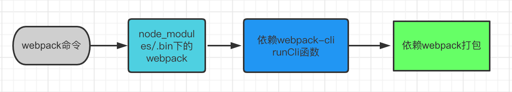
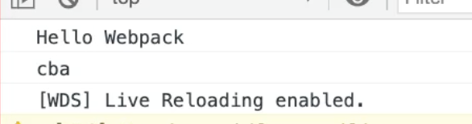
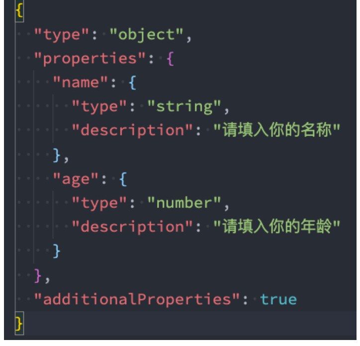
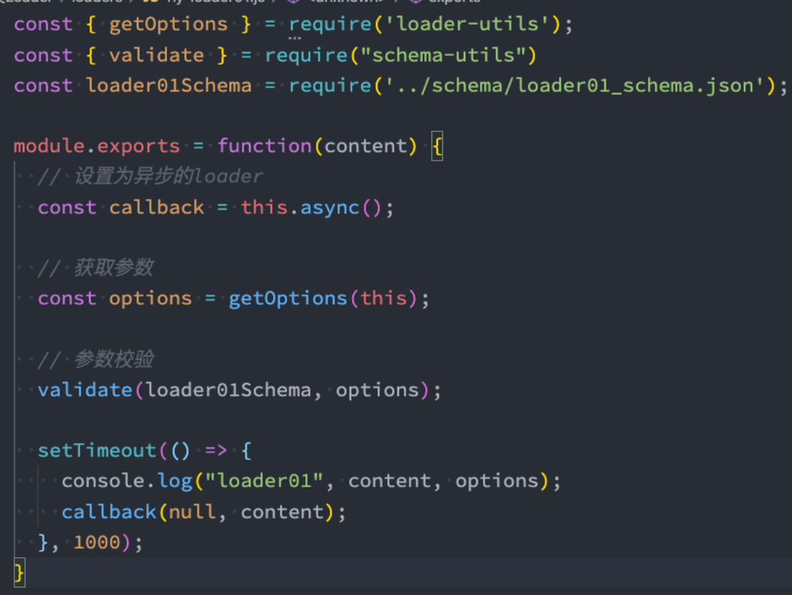

- [webpack webpack-cli](#webpack-webpack-cli)
- [Webpack配置文件](#webpack配置文件)
  - [基本配置](#基本配置)
- [webpack-dev-server](#webpack-dev-server)
  - [webpack watch mode](#webpack-watch-mode)
    - [watch原理](#watch原理)
  - [webpack-dev-server](#webpack-dev-server-1)
    - [webpack-dev-server原理](#webpack-dev-server原理)
  - [webpack-dev-middleware](#webpack-dev-middleware)
  - [模块热替换 HMR](#模块热替换-hmr)
    - [webpack-dev-server额外的配置](#webpack-dev-server额外的配置)
      - [指定额外的静态资源访问](#指定额外的静态资源访问)
      - [proxy代理](#proxy代理)
    - [react中组件级别的HMR](#react中组件级别的hmr)
- [自定义loader](#自定义loader)
  - [loader](#loader)
  - [自定义loader](#自定义loader-1)
    - [获取options参数](#获取options参数)
    - [校验options参数](#校验options参数)
  - [编写一个markdown-loader](#编写一个markdown-loader)
- [自定义plugin](#自定义plugin)
- [tree-shaking](#tree-shaking)
  - [usedExports](#usedexports)
  - [sideEffects](#sideeffects)
- [React中的webpack配置](#react中的webpack配置)
## webpack webpack-cli

webpack是一个静态的模块化打包工具。

> webpack 是通过模块之间依赖关系的分析来构建依赖图，通过不同的后缀对应的 loader 来对不同内容做转换，所以支持 css、js、png 等各种模块。



**webpack在执行时是依赖webpack-cli的，如果没有安装webpack-cli第三步就走不通就会报错；webpack-cli中代码执行，才是真正利用webpack进行编译和打包的过程;**

## Webpack配置文件

### 基本配置

> 执行 nix webapck本质上就是来执行配置文件

```js
// webpack.config.js
const path = require('path')

module.exports = {
  mode: 'development', // 指定构建模式

  entry: './src/index.js', // 指定构建入口文件

  output: {
    path: path.resolve(__dirname, 'dist'), // 指定构建生成文件所在路径
    filename: 'bundle.js', // 指定构建生成的文件名
  }
}
```

## webpack-dev-server

**文件发生变化时，可以自动的完成编译和展示。**

+ webpack watch mode
+ webpack-dev-server
+ web pack-dev-middleware

### webpack watch mode

最直接的配置就是修改package.json文件中的"script"：

```js
{
  // ...
  "script":{
    "build": "webpack --watch"
  }
}
```

这会自动监听依赖文件的变化，在打包完成过后，webpack-cli 不会立即退出，它会等待文件变化再次工作，直到我们手动结束它或是出现不可控的异常。

修改代码 → Webpack 自动打包 → 手动刷新浏览器 → 预览运行结果。

> `webpack watch` 有一个问题：每一次修改都要重新编译；并且每次打包产物均放到 dist/ 文件夹下，这表明每次打包产物实际上是与磁盘发生了 I/O，这种操作是非常耗时的。

#### watch原理

我们也可以在配置文件中配置watch相关的字段。

```js
// webpack.config.js 中的 module.exports 的字段
	
module.exports = {
	// 开启监听模式，默认为 false,
	watch: true,
	// 监听模式的配置
	watchOptions: {
  // 不监听的文件
  ignore: /node_modules/,
  // 第一个文件变化后，随后 aggregateTimeout 内的所有文件变化，只会打包一次
  aggregateTimeout: 300,
  // 每隔 poll ms 轮询一次，检查文件是否发生变化
  poll: 1000,
	}
}
```

从 `poll` 字段可知，`webpack watch` 是通过轮询查看是否文件发生变化，若变化，则重新打包。

### webpack-dev-server

```
npm i webpack-dev-server -D
```

然后来到package.json里：

```js
{
  // ...
  "script":{
    // ...
    "server": "webpack serve"
  }
}
```

`npm run server`

> webpack5 直接` "server": "webpack serve"`，webpack4是 `"server": "webpack-dev-server"`



实现了实时刷新浏览器，webpack-dev-server 在编译之后不会写入到任何输出文件。而是将 bundle 文件保留在内存中。

#### webpack-dev-server原理

运行 webpack-dev-server 这个命令时，它内部会启动一个 node Server（利用express），为打包的结果提供静态文件服务。当本地项目内的文件发生变化时，会通过 HMR Server(Hot Module Replacement, 已内置在 webpack-dev-server 中) 来与浏览器通信，随后更新文件。

内部的 node Server 从内存中读取这些文件。这样会减少很多不必要的磁盘读写操作，大大提高了整体的构建效率。

### webpack-dev-middleware

自由配置一个node server，传入webpack配置，但是用的少

### 模块热替换 HMR

Hot Module Replacement，模块热替换；模块热替换是指在应用程序运行过程中，替换、添加、删除模块，而无需重新刷新整个页面;

```js
// 指定哪些模块发生变化，进行HMR
import "./math.js"
console.log("hello world")
console.log("123")
// 第二个参数回调函数是可选的
if(module.hot){
   module.hot.accept("./math.js",() => {
     console.log("math模块发生了热更新")
   })
}
```

然后只需要在配置文件中增加

```js
module.exports = {
  // ...
  // 为webpack-dev-server添加配置
  devServer :{
    hot: true
  }
}
```

#### webpack-dev-server额外的配置

##### 指定额外的静态资源访问

> webpack-dev-server 默认会将构建结果和输出文件全部作为开发服务器的资源文件，只要通过 Webpack 打包能够输出的文件都可以直接被访问到。但是如果你还有一些没有参与打包的静态文件也需要作为开发服务器的资源被访问，就需要额外通过配置告诉webpack-dev-server。

通过这个 devServer 对象的 contentBase 属性指定额外的静态资源路径。这个 contentBase 属性可以是一个字符串或者数组，也就是说你可以配置一个或者多个路径。

```js
// webpack.config.js

module.exports = {
  // ...
  devServer: {
    contentBase: ['public']
  }
}
```

##### proxy代理

> 由于 webpack-dev-server 是一个本地开发服务器，所以我们的应用在开发阶段是独立运行在 localhost 的一个端口上，而后端服务又是运行在另外一个地址上。但是最终上线过后，我们的应用一般又会和后端服务部署到同源地址下。
>
> 那这样就会出现一个非常常见的问题：在实际生产环境中能够直接访问的 API，回到我们的开发环境后，再次访问这些 API 就会产生跨域请求问题。

```js
// ./webpack.config.js
module.exports = {
  // ...
  devServer: {
    proxy: {
      '/api': {
        // 请求代理前缀
        target: 'https://api.github.com',
        pathRewrite: {
          '^/api': '' // 替换掉代理地址中的 /api
        },
        changeOrigin: true // 确保请求 GitHub 的主机名就是：api.github.com
      }
    }
  }
}
```

设置 changeOrigin 属性为 true。因为默认代理服务器会以我们实际在浏览器中请求的主机名，也就是 localhost:8080 作为代理请求中的主机名。而一般服务器需要根据请求的主机名判断是哪个网站的请求，那 localhost:8080 这个主机名，对于 GitHub 的服务器来说，肯定无法正常请求，所以需要修改。

将代理规则配置的 changeOrigin 属性设置为 true，就会以实际代理请求地址中的主机名去请求，也就是我们正常请求这个地址的主机名是什么，实际请求 GitHub 时就会设置成什么。

#### react中组件级别的HMR

react开发中，有React Hot Loader，实时调整react组件(目前React官方已经弃用了，改成使用react- refresh，刷新性能更好)；

```
npm i @pmmmwh/react-refresh-webpack-plugin react-refresh
```

手动配置需要用到`@pmmmwh/react-refresh-webpack-plugin`插件：

```js
// webpack.config.js
const ReactRefreshPlugin = require("@pmmmwh/react-refresh-webpack-plugin")

module.exports = {
  // ...
  plugins :[
    new ReactRefreshPlugin()
  ]
}
```

然后需要在.babelrc引入react-refresh插件：

```js
module.exports = {
  presets:[
    ["@babel/preset-env"],
    ["@babel/preset-react"]
  ],
  plugins: [
    ["react-refresh/babel"]
  ]
}
```

## 自定义loader

### loader

loader负责的是把webpack不支持的模块转为可以被识别加载的模块。

`module.rules`数组允许你在 webpack 配置中指定多个 loader对象：test属性 、use属性（`loader :["style-loader","css-loader","less-loader"]`、 options:{}）。

```js
// webpack.config.js

module.exports = {
  // ...
  module: {
    rules: [
      {
				/**
        * test: 匹配要转换的文件类型
        * use: 对命中的模块使用具体的loader以及配置loader
        */
        test: /\.css$/i,
        use: [
          {
            loader: "css-loader"
          }
        ]
      },
      {
        test: 正则表达式 ,
        use: [
          loader: [],
        	options: {
            
          }
        ] 
      }
    ]
  }
}
```

### 自定义loader

loader本质就是一个导出为函数的JS模块。

一般一个loader会接受三个参数：content:资源文件的内容; map:sourcemap相关的数据; meta:一些元数据;

**这里content就是我们test匹配到的资源文件的内容**

```js
module.exports =function (content,map,meta) {
  console.log(content)
  // 返回值就是最终被打包的内容、将这一个loader产生的结果或者资源文件作为下一个loader的content;
  return content
}
```

#### 获取options参数

有时候我们还会在 use 属性中传入一些参数options：

> 这些参数我们可以用` loader-utils` 在自定义loader里拿到

```js
// webpack.config.js
module.exports = {
  // ...
  module: {
    rules: [
      {
        test: /\.js$/i,
        // 相对路径
        use:{
          loader: ["./my-loader.js"],
          options: {
            name:"name",
            age:18
          }
        }
      }
    ]
  }
}
```

```
npm i loader-utils -D
```

```js
// my-loader.js
const { getOptions } from "loader-utils"

module.exports =function (content) {
  // 设置为异步的loader
  // const callback = this.async()
  // 拿到options参数
  const options = getOptions(this)
  console.log("my-loader",content,options)
  // Loader必须通过 return 或者 this.callback 来返回结果，交给下一个loader来处理; 
  // 通常在有错误的情况下，我们会使用 this.callback;
  // this.callback的用法如下: 
  // 第一个参数必须是 Error 或者 null; 
  // 第二个参数是一个 string或者Buffer;
  this.callback(null,content)
  // 在异步操作完成后，再返回这个loader处理的结果; 配合 const callback = this.async()
  // setTimeout(()=>{
  // 	callback(null,content)
  // })
}
```

#### 校验options参数

```js
npm install schema-utils -D
```

编写json文件，作为校验规则：



引入校验工具函数：



这就是自定义loader的全部。

### 编写一个markdown-loader

加载 markdown 文件的加载器，以便可以在代码中直接导入 md 文件。我们都应该知道 markdown 一般是需要转换为 html 之后再呈现到页面上的，所以我希望导入 md 文件后，直接得到 markdown 转换后的 html 字符串。

```js
// webpack.config.js

module.exports = {
  // ...
  module : {
    rules: [
      {
        test:/\.md$/i,
        use:{
          loader:["./markdown-loader.js"]
        }
      }
    ]
  }
}
```

**loader逻辑**

```js
// markdown-loader.js
const marked = require('marked')

module.exports =function (content) {
   // 1. 将 markdown 转换为 html 字符串
  const html = marked(content)
  // html => '<h1>About</h1><p>this is a markdown file.</p>'
  // 2. 将 html 字符串拼接为一段导出字符串的 JS 代码
  const code = `module.exports = ${JSON.stringify(html)}`
  return code 
  // code => 'export default "<h1>About</h1><p>this is a markdown file.</p>"'
}
```

## 自定义plugin

插件主要就是扩展了webpack的构建能力，可以用来控制最终生成的代码是如何进行组织和输出的，包括对代码的打包优化、压缩，甚至是启用模块热替换、重新定义环境中的变量，等等。

>  去除Webpack 打包结果中的注释

**写plugin的关键是在对应的钩子上注册事件**

plugin就是一个类。webpack插件机制利用的是钩子机制，在构建的每个环节都埋有钩子，我们要做的就是在对应的钩子上挂载任务。

我们需要把插件注册到webpack生命周期中，在注册插件时会调用插件类的apply方法;  插件类会接收compiler对象，我们可以通过compiler对象来注册Hook的事件;

**要明确插件的使用时机，也就是到底应该把这个任务挂载到哪个钩子上**

emit 钩子，这个钩子会在 Webpack 即将向输出目录输出文件时执行

```js
// ./remove-comments-plugin.js
class RemoveCommentsPlugin {
  apply (compiler) {
    console.log('RemoveCommentsPlugin 启动')
    // compiler => 包含了我们此次构建的所有配置信息
  }
}
```

通过 compiler 对象的 hooks 属性访问到 emit 钩子，再通过 **tap 方法**注册一个钩子函数，这个方法接收两个参数：

+ 第一个是插件的名称，我们这里的插件名称是 RemoveCommentsPlugin；

+ 第二个是要挂载到这个钩子上的函数（我们要写的逻辑）；

> compilation.assets[name].source() 输出文件内容
>
> 通过正则替换的方式移除掉代码中的注释，最后覆盖掉 compilation.assets 中对应的对象，在覆盖的对象中，我们同样暴露一个 source 方法用来返回新的内容。另外还需要再暴露一个 size 方法，用来返回内容大小，这是 Webpack 内部要求的格式

```js
// ./remove-comments-plugin.js
class RemoveCommentsPlugin {
  apply (compiler) {
    compiler.hooks.emit.tap('RemoveCommentsPlugin', compilation => {
      // compilation => 可以理解为此次打包的上下文
      for (const name in compilation.assets) {
        // console.log(name) 输出文件名
        if (name.endsWith('.js')) {
          const contents = compilation.assets[name].source()
          const noComments = contents.replace(/\/\*{2,}\/\s?/g, '')
          compilation.assets[name] = {
            source: () => noComments,
            size: () => noComments.length
          }
        }
      }
    })
  }
}
```

## tree-shaking

移除未引用的代码。

+ 在optimization中配置usedExports为true，来帮助Terser进行优化; 
+ 在package.json中配置sideEffects，直接对模块进行优化;
  + 严格来讲第二种不算tree-shaking

### usedExports

**usedExports特性在 production 模式下同样会自动开启**

```js
// webpack.config.js
module.exports = {
  // ... 其他配置项
  // 优化
  optimization: {
    // 模块只导出被使用的成员
    usedExports: true,
    // 压缩输出结果
    minimize: true
  }
}
```

### sideEffects

**移除副作用代码**

Webpack 4 中新增了一个 sideEffects 特性，它允许我们通过配置标识我们的代码是否有副作用，从而提供更大的压缩空间。

>  模块的副作用指的就是模块执行的时候除了导出成员，是否还做了其他的事情。

这个特性一般只有我们去开发一个 npm 模块时才会用到。因为官网把对 sideEffects 特性的介绍跟 Tree-shaking 混到了一起，所以很多人误认为它们之间是因果关系，其实它们没有什么太大的关系

**Tree-shaking 只能移除没有用到的代码成员，而想要完整移除没有用到的模块（模块里可能会有一些副作用代码），那就需要开启 sideEffects 特性了**。

Tree-shaking基于ESM，所以只能移除没用到的那些export的部分。

开启sideEffects：

**sideEffects特性在 production 模式下同样会自动开启**

```js
// ./webpack.config.js
module.exports = {
  mode: 'none',
  entry: './src/main.js',
  output: {
    filename: 'bundle.js'
  },
  optimization: {
    sideEffects: true
  }
}
```

此时 Webpack 在打包某个模块之前，会先检查这个模块所属的 package.json 中的 sideEffects 标识，以此来判断这个模块是否有副作用，如果没有副作用`false`的话，这些没用到的模块就不再被打包。换句话说，即便这些没有用到的模块中存在一些副作用代码，我们也可以通过 package.json 中的 sideEffects 去强制声明没有副作用。

我们打开项目 package.json 添加一个 sideEffects 字段，把它设置为 false，具体代码如下：

```js
{
  "name": "side-effects",
  "version": "0.1.0",
  "license": "MIT",
  "scripts": {
    "build": "webpack"
  },
  "devDependencies": {
		"webpack": "^5.46.0",
    "webpack-cli": "^4.7.2"
  },
  "sideEffects": false
}
```

这样就表示我们这个项目中的所有代码都没有副作用，让 Webpack 放心大胆地去移除。

+ webpack.config.js 中的 sideEffects 用来开启这个功能；
+ package.json 中的 sideEffects 用来标识我们的代码没有副作用。

目前很多第三方的库或者框架都已经使用了 sideEffects 标识，所以我们再也不用担心为了一个小功能引入一个很大体积的库了。例如，某个 UI 组件库中只有一两个组件会用到，那只要它支持 sideEffects，你就可以放心大胆的直接用了。

> 其实 webpack 里的 `sideEffects: false` 的意思并不是我这个模块真的没有副作用，而只是为了在"摇树"时告诉 webpack：**我这个包在设计的时候就是期望没有副作用的，即使他打完包后是有副作用的，webpack 同学你"摇树"时放心的当成无副作用包摇就好啦！**。

但是有的时候我们可能也需要副作用，不希望被移除，可以在package.json文件中声明需要保留副作用的模块路径：

>  JS 中直接载入的 CSS 模块，属于副作用模块

```js
{
  "name": "side-effects",
  "version": "0.1.0",
  "license": "MIT",
  "scripts": {
    "build": "webpack"
  },
  "devDependencies": {
		"webpack": "^5.46.0",
    "webpack-cli": "^4.7.2"
  },
  "sideEffects": [
    "./src/extend.js",
    "*.css"
  ]
}
```


如果我们引入的 包/模块 被标记为 `sideEffects: false` 了，那么不管它是否真的有副作用，只要它没有被引用到，整个 模块/包 都会被完整的移除。以 `mobx-react-devtool`  为例，我们通常这样去用：

```text
import DevTools from 'mobx-react-devtools';

class MyApp extends React.Component {
  render() {
    return (
      <div>
        ...
        { process.env.NODE_ENV === 'production' ? null : <DevTools /> }
      </div>
    );
  }
}
```

这是一个很常见的按需导入场景，然而在没有 `sideEffects: false` 配置时，即便 `NODE_ENV` 设为 `production` （`production` 模式会自动`sideEffects: true`），打包后的代码里依然会包含 `mobx-react-devtools` 包，虽然我们没使用过其导出成员，但是 `mobx-react-devtools` 还是会被 import，因为里面“可能”会有副作用。但当我们加上 sideEffects false 之后，tree shaking 就能安全的把它从 bundle 里完整的移除掉了。

## React中的webpack配置

通过`cra`，然后`npm run eject`暴露出来。

打包过程对很多node模块做了排除，设置为了empty

