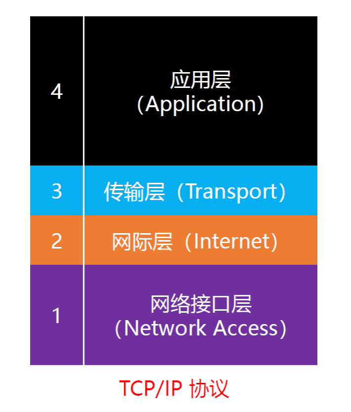
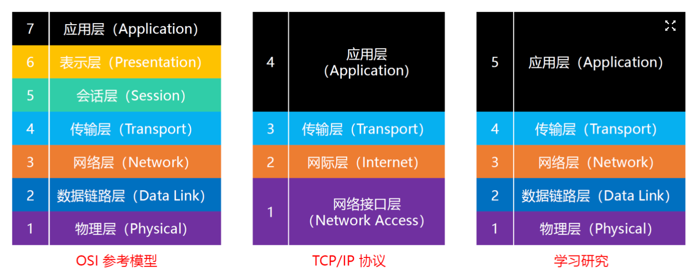
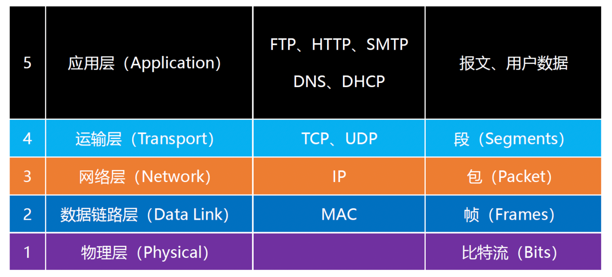
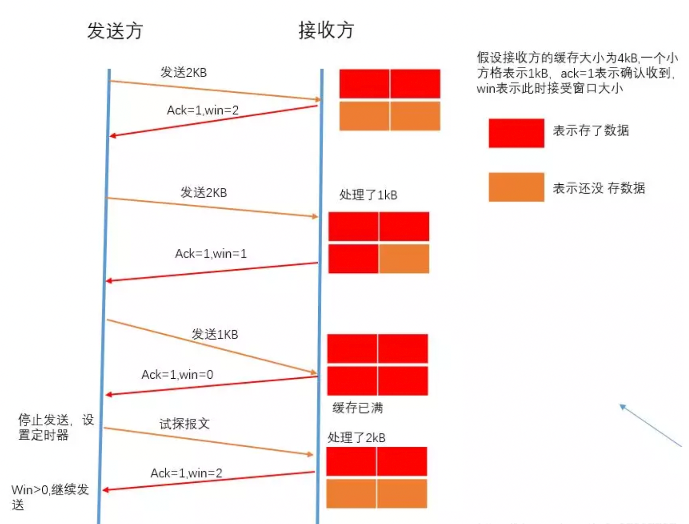
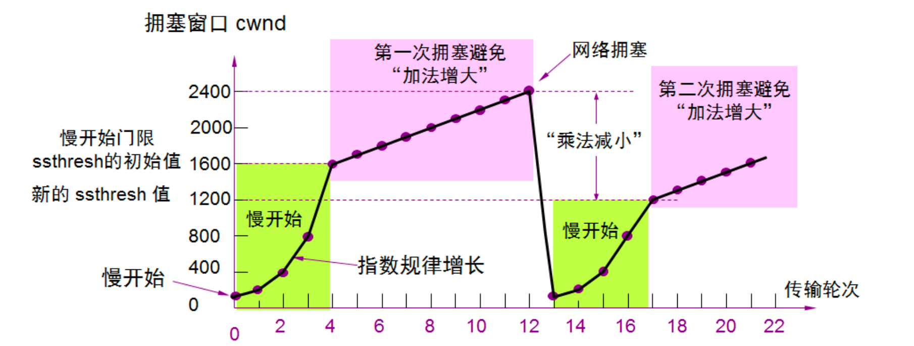
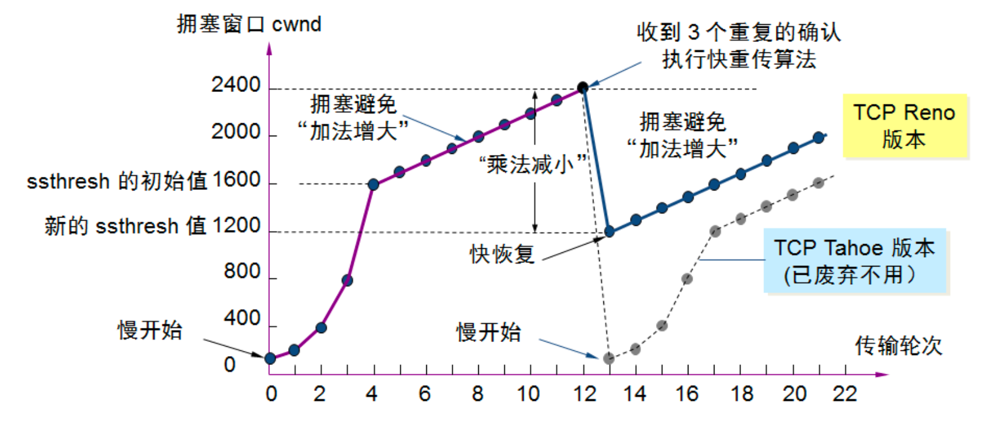
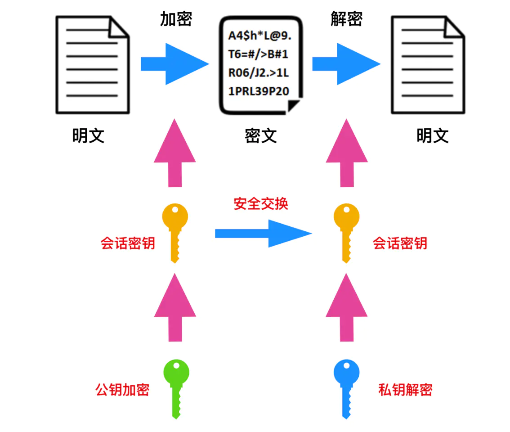
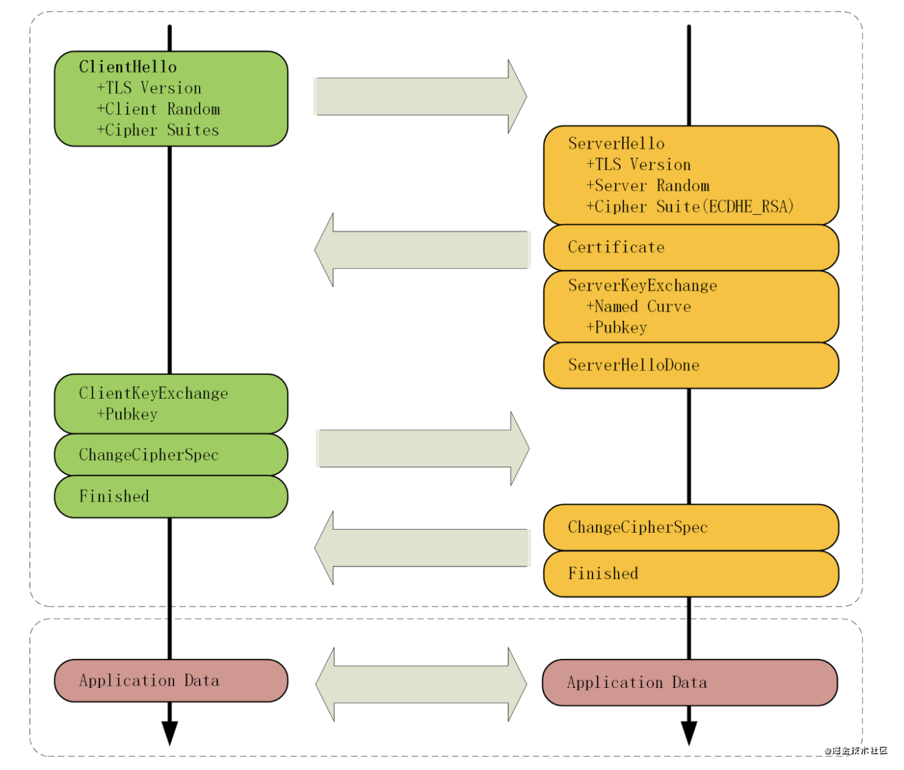

- [CDN、DNS](#cdndns)
  - [DNS](#dns)
    - [DNS过程](#dns过程)
  - [CDN](#cdn)
    - [CDN过程](#cdn过程)
- [TCP/IP](#tcpip)
  - [TCP/IP协议4层模型](#tcpip协议4层模型)
  - [可靠传输](#可靠传输)
    - [校验和](#校验和)
    - [序列号、确认应答号](#序列号确认应答号)
      - [序列号](#序列号)
      - [确认应答号](#确认应答号)
    - [重传机制](#重传机制)
      - [超时重传管理](#超时重传管理)
      - [高速重发控制](#高速重发控制)
    - [滑动窗口](#滑动窗口)
    - [流量控制](#流量控制)
    - [拥塞控制](#拥塞控制)
- [HTTPS](#https)
  - [SSL/TLS](#ssltls)
  - [数字签名和证书](#数字签名和证书)
    - [数字签名](#数字签名)
    - [证书](#证书)
  - [TLS的握手过程](#tls的握手过程)

## CDN、DNS

### DNS

DNS域名解析系统（本质上是一个分布式数据库），联系域名和IP地址。

> 域名与ip的对应关系，被称为记录(record)，可分为各种类型
> 
> - A: Address，域名指向的IP地址，一个域名可以有多个A记录。
> - NS：Name Server，保存下一级域名信息的服务器地址
> - MX：Mail eXchange，接受电子邮件的服务器地址
> - **CNAME**：Canonical Name，域名跳转，返回另一个域名，令当前查询域名跳去该域名，多个域名->服务器的映射。
> - PTR： Pointer Record，只用于ip地址查询域名

要访问baidu.com，需要先通过dns系统查出他的ip地址如220.181.57.216，才能访问。

#### DNS过程

6个步骤

dns通过域名来查出ip，以浏览器输入www.example.com为例：

1. 检查浏览器缓存

2. 检查操作系统缓存，常见的如hosts文件

3. 如果没有缓存信息，会向本地DNS服务器询问该域名对应的IP地址

4. 如果本机中没有缓存，则会到我们的`本地DNS`询问该域名对应的IP地址

5. 如果`本地DNS`服务器没找到，会由`本地DNS`依次向`根DNS`、`顶级域DNS`、`权威DNS`进行询问，最终通过域名查询到目标IP，`本地DNS`将IP地址发送给客户端
   
   > 会向根域名服务器(Root Server)请求解析，分为以下几步：
   > 
   > - 根服务器返回顶级域名(TLD)服务器如.com，.cn，.org等的地址，全球只有13台，该例子中会返回.com的地址
   > - 接着向TLD发送请求，然后会返回次级域名(SLD)服务器的地址，本例子会返回.example的地址
   > - 接着向SLD域名服务器通过域名查询目标IP，本例子会返回`http://www.example.com`的地址

6. `本地DNS`服务器会缓存结果，并返回给用户，缓存在系统中。

### CDN

CDN的全称是Content Delivery Network，即内容分发网络。

**将用户的请求重定向到离用户最近的服务节点上**

> 实时地根据网络流量和各节点的连接、负载状况以及到用户的距离和响应时间等综合信息将用户的请求重新导向离用户最近的服务节点上。其目的是使用户可就近取得所需内容，解决 Internet网络拥挤的状况，提高用户访问网站的响应速度。

#### CDN过程

6个步骤

**本质上就是通过修改DNS让浏览器根据IP等情况来选择合适的CDN缓存服务器来获取资源。**

> 设置一个cname指向cdn专用DNS服务器

1. 本地DNS会设置一个cname指向CDN专用DNS服务器，用户输入URL，经过本地DNS解析，DNS系统会最终将域名的解析权交给CNAME指向的CDN专用DNS服务器

2. CDN的DNS服务器将CDN的全局负载均衡系统的IP地址返回用户

3. 浏览器向CDN的全局负载均衡系统发起内容URL访问请求

4. CDN全局负载均衡系统会返回距离用户最近的本地负载均衡系统的地址

5. 本地负载均衡系统会根据浏览器请求的资源和浏览器IP地址，选出合适的缓存服务器返回给浏览器

6. 浏览器重定向到缓存服务器，缓存服务器将用户所需内容响应给浏览器；
   
   > 如果没有缓存资源，就向源服务器请求，并缓存在本地

## TCP/IP

### TCP/IP协议4层模型

+ 应用层

+ 传输层

+ 网络层（网际层）

+ 网络接口层

我们平时学习研究一般用的是五层模型：

每一层对应的协议

### 可靠传输

TCP通过校验和、序列号、确认应答、重发控制、连接管理、窗口控制等实现可靠传输。

#### 校验和

检验和（checksum）是TCP首部的一个字段，是由发送方根据伪首部+数据信息计算得到，由接收端验证。目的是为了发现TCP首部和数据在发送端到接收端之间是否有改动。如果接收方检测到校验和有差错，则TCP段会被直接丢弃。

**通过校验和，TCP 能够识别内是否有改变，从而保证可靠性**

> 伪首部：包括源IP地址、目标IP地址、协议号、TCP包长度；占12字节，**仅在计算校验和时起作用，不会传给网络层**。

#### 序列号、确认应答号

##### 序列号

序列号字段占4个字节，实际上在传输数据中的每一个字节都会有一个编号，这里说的序列号是指这一次传给对方的**TCP数据部分的第一个字节的编号**；

##### 确认应答号

确认应答字段也占4个字节，这里指期望对方**下一次传过来的TCP数据部分的第一个字节的编号**。

这样通过序列号和确认应答号这个机制，我们就可以知道是否已经接收数据以及是否需要接收数据，TCP以此实现可靠传输。

#### 重传机制

##### 超时重传管理

重发超时时间指的是往返时间+偏差。

**如果发送端在在超过了这个时间仍未收到来自接收方的确认报文，可能为报文段丢失或 ACK 确认报文丢失，发送端就会进行数据重发。**

如果数据重发后依然收不到确认应答，则再次发送，同时重传超时时间加倍。

达到一定重发次数之后，如果仍没有任何确认应答返回，就会判断为网络或对端主机发生了异常，强制关闭连接，并且通知应用通信异常强行终止。

##### 高速重发控制

接收主机如果收到一个自己应该接收的序列号以外的数据时，会针对当前为止收到的数据返回确认应答号，指明下一个期待字节的序号，发送确认应答号。

在窗口比较大时，又出现报文段丢失的情况，同一序号的确认应答会被重复不断的返回。**当发送端主机连续3次收到同一个确认应答时，即会认为该序号的报文段丢失，就会将其所对应的数据重发**。

#### 滑动窗口

如果TCP以1个段为单位，每发一个段进行一次确认应答的处理，那么包的往返时间越长通信性能越低。引入窗口概念，控制网络性能的下降。

> 窗口大小由接收端主机决定，接收端主机会通知发送端自己可以接收数据的大小，发送端就会按着该限度发送数据。该大小限度就是窗口大小。

确认应答以窗口为单位进行确认，替代原有的以分段为单位进行确认。

发送端主机，在发送了一个段以后不必要一直等待确认应答，而是继续发送。

- 发送端主机在收到确认应答前，需要设置缓存保留这些可能被重传的数据，直到收到他们的确认应答
- 当收到确认应答，不需要重传时，数据可从缓冲区清除
- 收到确认应答的情况下，将窗口滑动到确认应答中的序列号的位置

#### 流量控制

对发送端发送数据量的控制就是流量控制。

之前提到，**接收端主机会通知发送端自己可以接收数据的大小**，这个大小是可变的，取决于接收端剩余缓冲区大小；所以**发送端主机会根据接收端主机的提示，对发送数据的量进行控制——流量控制**。

- 接收端主机根据自己可缓冲区可接受的大小，将其作为窗口大小，存入 TCP 首部，向发送端主机通知自己可以接受的数据大小
- 发送端发送不超过该限度（即窗口大小）的数据
- 如果接收到窗口大小的值为 0，那么发送方将停止发送数据。

> 接收端在收到接收端窗口更新通知后通信会继续进行；
> 
> 接收端为防止窗口更新通知在传送途中丢失，也会定期向接收端发送窗口探测数据段（一个字节），提醒接收端把窗口大小告诉发送端

#### 拥塞控制

避免在通信刚开始发送大量数据。慢开始->拥塞避免->超时重传/快速重传

+ 慢开始：在通信开始，接收端设置拥塞窗口为1个数据段发送数据，每接收到1个确认应答ACK，拥塞窗口变为 $2^{n+1}$ 个数据段（指数上升）

+ 拥塞避免：当拥塞窗口值达到设置的慢开始阈值时，每接收到1个确认应答ACK，拥塞窗口增加1个数据段（线性上升）

+ 当触发**超时重传时**，**慢开始阈值会调整为当前拥塞窗口值的一半，拥塞窗口值恢复到初始值 1**，同时执行慢开始，指数增大。

- 当触发**快速重传**时，进入快恢复，把阈值调整为拥塞窗口值的一半，**并作为新的拥塞窗口值**。执行拥塞避免，加法增大。

## HTTPS

**HTTPS = HTTP over SSL/TLS**

通常HTTP直接和TCP

添加了加密和认证机制的HTTP称为HTTPS。

+ SSL，安全套接层（Secure Sockets Layer），既有会话功能，又能加密解密

+ TSL，传输层安全（Transport Layer Security），**TLS1.0 实际上就是 SSLv3.1**

HTTPS 名字里的“S”，就是把 HTTP 下层的传输协议由 TCP/IP 换成了SSL/TLS，由“HTTP over TCP/IP”变成了“HTTP over SSL/TLS”，让 HTTP 运行在了安全的 SSL/TLS 协议上，收发报文调用专门的安全接口。

### SSL/TLS

`TLS(Transport Layer Security)` 是 `SSL(Secure Socket Layer)` 的后续版本，它们是用于在互联网两台计算机之间用于`身份验证`和`加密`的一种协议。

> 目前应用的最广泛的 TLS 是 1.2

TLS 是使用`对称加密`和`非对称加密` 的混合加密方式来实现机密性。

非对称加密 的运算速度非常慢，对称加密 的加密速度比较快，而 TLS 正是使用了这种`混合加密`方式。

用公钥加密会话密钥，用会话密钥加密要传输的明文，这样只有用私钥才能解密会话密钥，然后用会话密钥解密加密的信息。

> 其中会话密钥是本次通信随机生成的临时密钥，作为对称加密的密钥，用于加密消息，提高速度。

### 数字签名和证书

#### 数字签名

数字签名不是用来加密的，而是用来验证消息的完整性。

我们可以把消息用单向散列函数进行加密，生成散列值，然后用自己的私钥加密，生成签名（私钥加密消息散列值）；发送消息和签名，接收方可以接收到消息和签名，用公钥解密签名得到散列值，再用单向散列函数加密消息得到散列值，对比两个散列值，即可知道消息有没有被篡改。

#### 证书

借助第三方 CA（证书认证机构）确保获取的公钥是合法的；

**证书=公钥+服务器与CA信息+签名；**

> 签名：CA的私钥加密明文对应的散列值

其中签名是由CA用自己的私钥加密服务器的公钥以及服务器与CA信息得到的（通常加密的是经过散列函数计算得到散列值），客户端向服务器发出请求时，服务器返回证书文件；客户端用单向散列函数加密明文得到散列值，再用CA的公钥解密签名得到散列值，对比两个散列值，就可以知道这个公钥是否合法。再进行混合加密。

+ 服务方S向CA提交信息审核，如信息审核通过，CA会向申请者签发认证文件-证书。
  证书包含以下信息：申请者公钥、申请者的组织信息和个人信息、签发机构 CA的信息、有效时间、证书序列号等信息的明文，同时包含一个签名;
  签名的产生算法：首先，使用散列函数计算公开的明文信息的信息摘要，然后，采用 CA的私钥对信息摘要进行加密，密文即签名

+ 客户端 C 向服务器 S 发出请求时，S 返回证书文件;

+ 客户端 C读取证书中的相关的明文信息，采用相同的散列函数计算得到散列值，然后，利用对应 CA的公钥解密签名数据，对比证书的散列值，如果一致，则可以确认证书的合法性，即公钥合法;

+ 客户端然后验证证书相关的域名信息、有效时间等信息;

+ 客户端会内置信任CA的证书信息(包含公钥)，如果CA不被信任，则找不到对应 CA的证书，证书也会被判定非法。

> 系统或浏览器中内置的CA机构的证书和公钥成为了至关重要的环节，这也是CA机构公信身份的证明，如果系统或浏览器中没有这个CA机构，那么客户端可以不接受服务端传回的证书，显示HTTPS警告。
> 
> 实际上CA机构的证书是一条信任链，A信任B，B信任C，以**掘金的证书**为例，掘金向RapidSSL申请一张证书，而RapidSSL的CA身份是由DigiCert Global根CA认证的，构成了一条信任链。

### TLS的握手过程

HTTPS的通信过程分为三个大阶段：

+ TCP的3次握手

+ TLS的连接

+ HTTP的请求和响应

其中TLS的连接一共有10个步骤，目标是建立安全连接：

- **client hello消息：** 客户端通过发送"client hello"消息向服务器发起握手请求，该消息包含了客户端所支持的 TLS 版本和密码组合以供服务器进行选择，还有一个"client random"随机字符串。

- **server hello消息：** 服务器发送"server hello"消息对客户端进行回应，该消息包含了数字证书，服务器选择的密码组合和"server random"随机字符串。

- **验证：** 客户端对服务器发来的证书进行验证，确保对方的合法身份，验证过程可以细化为以下几个步骤：
  
  1. 检查数字签名
  2. 验证证书链
  3. 检查证书的有效期
  4. 检查证书的撤回状态 (撤回代表证书已失效)

- **Server Key Exchange：** 携带（Server Params）用以实现密钥交换算法，为了防止伪造，Server Params经过了服务器私钥签名

- **Server Hello Done ：** 发送完毕
  
  > 目前为止，客户端和服务器端之间通过明文共享了`Client Random`、`Server Random`、`Server Params`
  > 
  > 而且，客户端也拿到了服务器的证书，接下来客户端会验证证书的合法性

- **Client Key Exchange：** 携带（Client Params）用以实现密钥交换算法
  
  > 目前为止，客户端、服务端都拥有了密钥交换算法需要的两个参数Client Params、Server Params，分别使用Client Params、Server Params通过密钥交换算法计算出新的随机密钥串pre-master，然后用 Client Random、Server Random 和 Pre-Master三个值生成主秘钥。
  > 
  > 最后利用主秘钥得到其他密钥，比如客户端发送用的会话密钥（client_write_key）、服务器发送用的会话密钥（server_write_key）

- **Change Cipher Spec：** 告知服务器，之后的通信会采用计算出来的会话密钥进行加密

- **Finished：** 把之前所有发送的数据做个摘要，再加密一下，让服务器做个验证
  
  > 这次握手协商是否成功，要以服务器是否能够正确解密该报文作为判定标准

- **Change Cipher Spec**  

- **Finished**
  
  > 到此为止，客户端服务器都验证加密解密没问题，握手正式结束
  > 
  > 后面开始传输加密的HTTP请求和响应
