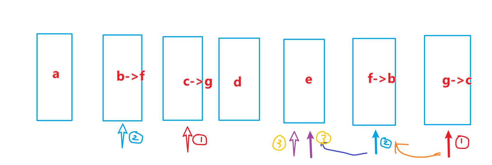

## 题目 打乱数组

> 链接：https://leetcode-cn.com/problems/shuffle-an-array

给你一个整数数组 `nums` ，设计算法来打乱一个没有重复元素的数组。

实现 `Solution` class:

+ `Solution(int[] nums)` 使用整数数组 `nums` 初始化对象
+ `int[] reset()` 重设数组到它的初始状态并返回
+ `int[] shuffle()` 返回数组随机打乱后的结果

示例：

```js
输入
["Solution", "shuffle", "reset", "shuffle"]
[[[1, 2, 3]], [], [], []]
输出
[null, [3, 1, 2], [1, 2, 3], [1, 3, 2]]

解释
Solution solution = new Solution([1, 2, 3]);
solution.shuffle();    // 打乱数组 [1,2,3] 并返回结果。任何 [1,2,3]的排列返回的概率应该相同。例如，返回 [3, 1, 2]
solution.reset();      // 重设数组到它的初始状态 [1, 2, 3] 。返回 [1, 2, 3]
solution.shuffle();    // 随机返回数组 [1, 2, 3] 打乱后的结果。例如，返回 [1, 3, 2]
```


提示：

```js
1 <= nums.length <= 200
-106 <= nums[i] <= 106
nums 中的所有元素都是 唯一的
最多可以调用 5 * 104 次 reset 和 shuffle
```

### 思路

洗牌算法（Fisher-Yates）：

+ 以数组最后一个元素为基准点
+ 在数组开始位置到基准数之间（未洗牌区间）“随机”选一个位置，交换该位置与基准点的元素
+ 基准点前移
+ 重复2、3步骤，直到基准点为数组开始位置



### 代码

```js
var Solution=function (nums){
    this.nums=nums;
}
Solution.prototype.reset=function (){
    return this.nums;
}
Solution.prototype.shuffle=function (){
    let arr=this.nums.slice(0);
    for(let i=arr.length-1;i>=0;i--){
        let random=Math.floor(Math.random()*(i+1));
        let temp=arr[i];
        arr[i]=arr[random];
        arr[random]=temp
    }
    return arr
}
```


