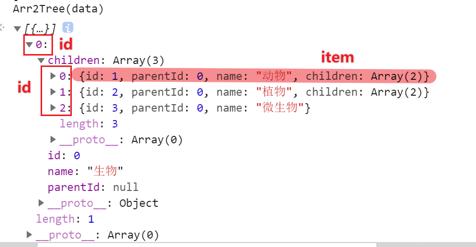

## 数组结构转为树结构

数组转换为树结构

```csharp
let data = [
  { id: 0, parentId: null, name: '生物' },
  { id: 1, parentId: 0, name: '动物' },
  { id: 2, parentId: 0, name: '植物' },
  { id: 3, parentId: 0, name: '微生物' },
  { id: 4, parentId: 1, name: '哺乳动物' },
  { id: 5, parentId: 1, name: '卵生动物' },
  { id: 6, parentId: 2, name: '种子植物' },
  { id: 7, parentId: 2, name: '蕨类植物' },
  { id: 8, parentId: 4, name: '大象' },
  { id: 9, parentId: 4, name: '海豚' },
  { id: 10, parentId: 4, name: '猩猩' },
  { id: 11, parentId: 5, name: '蟒蛇' },
  { id: 12, parentId: 5, name: '麻雀' }
]
```

`id`是唯一的，`parentId`是`id`的父节点；

### 思路

看每一项的父节点是否存在，若不存在则这一项为根节点；若存在，则将这一项作为父节点的children属性；

### 代码

```js
function Arr2Tree (data){
    const res=[];
    const obj={};
    data.forEach(item=>{
        obj[item.id]=item;
    })
    data.forEach(item=>{
        let parent=obj[item.parentId];
        if(parent){
            (parent.children||(parent.children=[])).push(item);
        }else{
            res.push(item)
        }
    })
    return res
}
```



