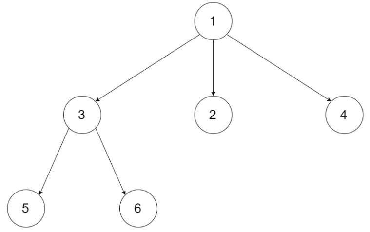
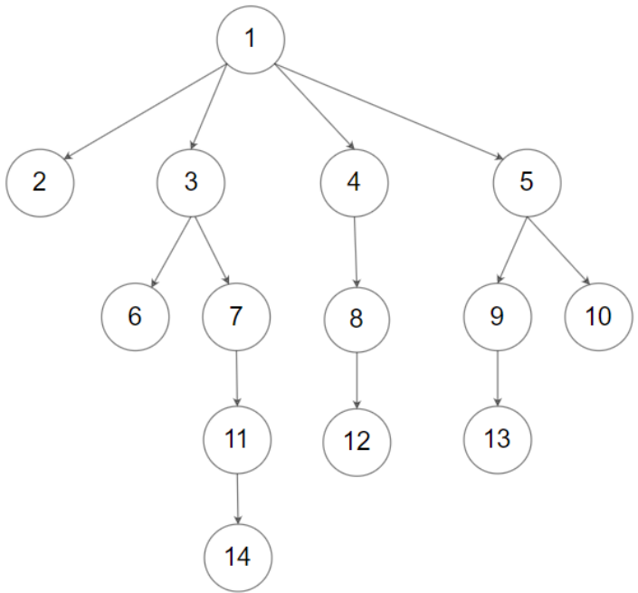

## 题目 普通树的层序遍历

给定一个 N 叉树，返回其节点值的层序遍历。（即从左到右，逐层遍历）。

树的序列化输入是用层序遍历，每组子节点都由 null 值分隔（参见示例）。

示例 1：



```
输入：root = [1,null,3,2,4,null,5,6]
输出：[[1],[3,2,4],[5,6]]
```


示例 2：



```
输入：root = [1,null,2,3,4,5,null,null,6,7,null,8,null,9,10,null,null,11,null,12,null,13,null,null,14]
输出：[[1],[2,3,4,5],[6,7,8,9,10],[11,12,13],[14]]
```

#### 思路

使用队列。

queue存储每个节点的孩子们（下一次循环次数），level存储每个子节点的值。


#### 代码

```js
function bfs(root){
    if(!root) return [];
    const res=[];
    const queue=[root];
    while(queue.length){
        const level=[];
        for(let i=0;i<queue.length;i++){
            const cur=queue.shift();
            level.push(cur.val);
            queue.push(...cur.children);
        }
        res.push(level);
    }
    return res
}
```


