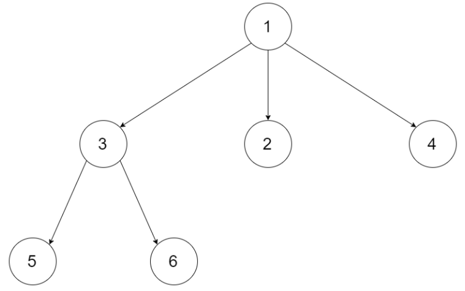
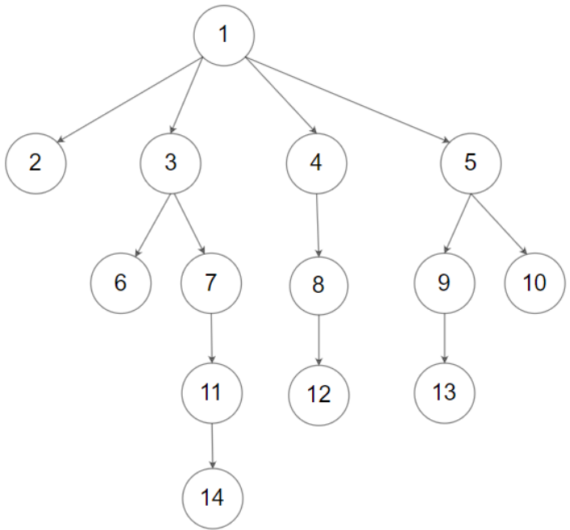

## 前序遍历

### 题目

给定一个 N 叉树，返回其节点值的 **前序遍历** 。

N 叉树 在输入中按层序遍历进行序列化表示，每组子节点由空值 `null` 分隔。



```
输入：root = [1,null,3,2,4,null,5,6]
输出：[1,3,5,6,2,4]
```

### 思路

**前序遍历首先访问根节点，然后逐个遍历以其子节点为根的子树。**

递归：因为是前序遍历，所以我们要`在遍历子节点前进行当前节点的操作。`

迭代：


### 代码

#### 递归

```js
function preorder(root){
    if(!root) return [];
    const res=[];
    pre(root);
    return res;
    function pre(root){
        if(!root) return;
        res.push(root.val)
        for(let i=0;i<root.children.length;i++){
            pre(root.children[i]);
        }
    }
}
```

#### 迭代

```js
function preorder(root){
    if(!root) return [];
    const res=[];
    const stack=[root];
    while(stack.length){
        const cur=stack.pop();
        res.push(cur.val)
        for(let i=cur.children.length-1;i>=0;i--){
            stack.push(cur.children[i]);
        }
    }
    return res
}
```


## 后序遍历

### 题目



```
输入：root = [1,null,2,3,4,5,null,null,6,7,null,8,null,9,10,null,null,11,null,12,null,13,null,null,14]
输出：[2,6,14,11,7,3,12,8,4,13,9,10,5,1]
```

### 思路

**后序遍历首先逐个遍历以根节点的子节点为根的子树，最后访问根节点。**

（把前序遍历反过来：`push->unshift`以及`i=cur.children.length-1->i=0`）

递归：因为是后序遍历，所以我们要`先遍历子节点再进行当前节点的操作。`

迭代：


### 代码

#### 递归

```js
function postorder(root){
    if(!root) return [];
    const res=[];
    post(root);
    return res
    function post(root){
        for(let i=0;i<root.children.length;i++){
            post(root.children[i])
        }
        res.push(root.val)
    }
}
```

#### 迭代

```js
function postorder(root){
    if(!root) return [];
    const res=[];
    const stack=[root];
    while(stack.length){
       let cur=stack.pop();
       res.unshift(cur.val)
       for(let i=0;i<cur.children.length;i++){
           stack.push(cur.children[i]);
       }
    }
    return res
}
```


