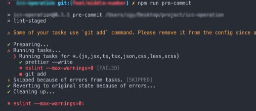
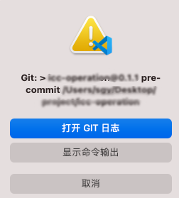

###### 代码规范

> 对于没有使用过`husky`的项目，要注意`husky`的版本；或者可以直接`npm i -D husky@4`

`husky`的使用：

注意`husky`在`version 5`之后，改变了创建`hook`的方式：

+ 安装`husky`：`npm install -D husky `

+ 安装后自动启用`git hooks`：`npm set-script prepare "husky install"`或者手动在`package.json`添加。

  + 执行完，在`package.json`里你应该会看到

    ```js
    {
      "scripts": {
        "prepare": "husky install"
      }
    }
    ```

  然后`npm run prepare`

  > 或者直接`npx husky install`（根目录下增加`.husky`目录）

+ 接下来就是添加`hook`：

  + 添加`hook`：`husky add <file> [cmd]`

    （添加`lint-staged`）：

    ```js
    npx husky add .husky/pre-commit "npm run pre-commit"
    ```

    这会在`.husky`目录下增加 `pre-commit`文件。

  + 最后在`package.json`里增加：

    ```js
    {
      "scripts": {
        "pre-commit": "lint-staged"
      }
    }
    ```

添加`lint-staged`后，就能顺利的在`commit`前对暂存区的代码进行检查。

> 要么在终端执行`npm run pre-commit`，要么直接提交暂存区的代码。
>
> ```
> {
> 	...,
> 	"lint-staged": {
>         "*.{js,jsx,ts,tsx,css,less,scss}": [
>             "prettier --write",
>             "eslint --max-warnings=0",
>             "git add"
>         ]
>     },
>     "husky": {
>         "hooks": {
>             "pre-commit": "lint-staged"
>         }
>     }
> }
> ```
>
> 
>
> 
>
> 


附 代码格式：

```js
// prettier.config.js or .prettierrc
module.exports = {
  // Default: 80
  printWidth: 120,
  // Default: 2
  tabWidth: 4,
  // Default: false
  useTabs: false,
  // Default: true
  semi: true,
  // Default: false
  singleQuote: true,
  // Default: 'none'
  trailingComma: 'es5',
  // Default: true
  bracketSpacing: true,
  // Default: false
  jsxBracketSameLine: false,
  // Default: 'avoid'
  arrowParens: 'avoid',
  // Default: 0
  rangeStart: 0,
  // Default: Infinity
  rangeEnd: Infinity,
  /* no parser */
  /* no filePath */
  // Default: false
  requirePragma: false,
  // Default: false
  insertPragma: false,
  // Default: 'preserve'
  proseWrap: 'preserve',
  // Default: 'css'
  htmlWhitespaceSensitivity: 'strict',
  // Default: 'auto'
  endOfLine: 'lf',
};
```

