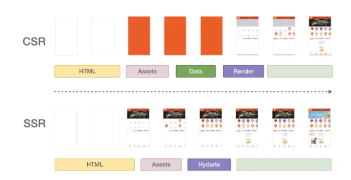

- [总览](#总览)
  - [`SSR`——服务端渲染](#ssr服务端渲染)
    - [`SSR`优缺点](#ssr优缺点)
  - [`CSR`——客户端渲染](#csr客户端渲染)
    - [CSR（SPA）的优缺点](#csrspa的优缺点)
  - [SSR vs CSR](#ssr-vs-csr)
  - [React SSR](#react-ssr)
    - [React SSR=SSR + SPA 完美的结合](#react-ssrssr--spa-完美的结合)
- [React SSR的原理](#react-ssr的原理)
  - [虚拟DOM](#虚拟dom)
  - [同构](#同构)
  - [总结](#总结)

# 总览

## `SSR`——服务端渲染

`SSR` 的全称是`Server Side Rendering`，服务端渲染，也就是将渲染的工作放在服务端进行。

实际上，一直以来就是这种方式：由服务端返回给浏览器完整的`html`内容（包含数据），浏览器拿到返回的完整结构后就可以直接进行`DOM		`的解析、构建、加载资源以及后续的渲染。

我们来说一下服务端渲染返回的`html`内容：

```js
<div>
	<div>首页</div>
  <div>产品</div>
</div>
```

大概是这种，`html`会包含具体的数据。

### `SSR`优缺点

> `SSR`服务端会直接返回完整的`html`数据。
>
> 问优点就是首屏，缺点就是服务器压力大（因为每次都会向服务器请求完整的页面内容和资源，频繁的跳转体验也不好）。

可以想到，这种页面（`html`）直出的方式可以让首屏较快的展现给用户，对搜索引擎比较友好，爬虫可以方便的找到页面的内容，非常有利于`SEO`。

不好的地方就是每一个页面的加载都需要向服务器请求完整的页面内容和资源，访问量较大的时候会对服务器造成一定的压力，另外页面之间频繁刷新跳转的体验并不是很友好。

## `CSR`——客户端渲染

`CSR`，全称是 `Client Side Rendering`，也就是客户端渲染。

这是目前`web`应用中主流的渲染模式，一般由`Server`端返回初始`html`内容，然后再开辟新的线程，由`JS`去异步加载数据，再完成页面渲染。

客户端渲染模式中最流行的开发模式当属`SPA`（单页应用），所以后文都会基于`SPA`进行说明。

这种模式下服务端只会返回一个页面的框架和`js`脚本资源，而不会返回具体的数据。

页面的框架就是：

```js
<div id="root"></div>
```

`js`脚本资源就是`<script src=""></script>`的静态资源。

### CSR（SPA）的优缺点

> 优点就是体验好，缺点就是首屏白屏(因为服务器返回的只是一个框架无内容无数据，内容需要等页面`js`、`css`加载完成、数据需要异步请求)+不利于`seo`优化

因为是单页面应用，页面之间的跳转不会刷新整个页面，而是局部刷新，体验上有了很大的提升。

单页应用中，只有首次进入或者刷新的时候才会请求服务器，只需加载一次`js css`资源，页面的路由维护在客户端，页面间的跳转就是切换相关的组件所以切换速度很快，另外**数据渲染都在客户端完成，服务器只需要提供一个返回数据的接口，大大降低了服务器的压力。**

所以后来就有了 `web app`的叫法，也是为了突出这种体验很像是`Native App` 。

`SPA`这种客户端渲染的方式在整体体验上有了很大的提升，但是它仍然有缺陷 - 对 `SEO` 不友好，页面首次加载可能有较长的白屏时间。

> 在 `SPA` 模式下，第一次打开页面我们得到的是一个`html` 框架，不包含内容。数据的渲染需要等待页面`js css`资源加载完成，且执行时再发起异步数据请求，然后等数据返回后，再进行渲染，渲染完成后用户才能看到最终的页面。

## SSR vs CSR

下面这张图，是同一个应用，用两种不同的方式去渲染时对应的页面的加载时序：



+ 橙色部分为页面背景色，对应了常规意义上的白屏时间

从内容可见的时间上，**`SSR`要比`CSR`快。**这主要是因为`SSR`的原理（因为每次都会向服务器请求完整的页面内容和资源），但是`CSR`会每次异步去加载数据，线程间的通信肯定会更慢。

`CSR`的优势主要集中在体验和性能上。

## React SSR

从上面的分析，实际上`CSR`不好的地方只有：

+ `seo`不友好
+ 首次白屏等待

### React SSR=SSR + SPA 完美的结合

**第一次打开页面是服务端渲染，基于第一次访问，用户的后续交互是 `SPA` 的效果和体验，同时还能解决`SEO`问题。**

但是要实现两种技术的结合，同时可以最大限度的重用代码（同构），减少开发维护成本，那就需要采用 `react` 或者 `vue` 等前端框架和`node(ssr)`相结合的方式来实现。

`csr` 和 `react ssr` 从用户体验上来说差别不大，只是首次访问页面是 `ssr`直出，后续交互是 `spa`。

# React SSR的原理

传统的`ssr`和目前流行的`csr`方案`spa`都不够完美，所以我们需要能综合这两者优点的技术 - `react ssr (SPA+SSR)`。

每次刷新页面的时候数据是从服务端直出（这部分没什么特别的，和语言无关`php`、`jsp `、`node`都可以），然后后续的访问就是 `spa` 的体验，即能解决`SEO`问题，也能保持页面切换的效率，服务器的压力要比传统的`ssr`也相对小。

## 虚拟DOM

使用`react ssr`技术开发出的最终产物其实就是`SPA+SSR`的结合。

因为`React`组件化的思想，这里的`SSR`指的就是在服务端渲染组件。

我们的组件本质上都是在写`JSX`，他会转换成`React.createElement()`的调用，返回`ReactElement`对象，也就是虚拟`DOM`（虚拟`DOM`本身就是一个内存中的对象，通过对象的属性来描述要渲染的具体是什么元素以及内容。）。

虚拟 `DOM` 除了在渲染时用于提高渲染性能，以最小的代价来更新视图的作用外，另一个作用就是为组件的跨平台渲染提供可能（一套代码多端使用）。

有了这样的对象，我们就可以轻松的把这个对象转换我们想要的表现形式，比如 `html`格式，而这个`html`就是我们要直出的内容。

不过这个转换的过程不需要我们来完成，`react`已经帮我们完成，其本身就已提供了内置方法来支持服务端渲染。

## 同构

不过，为什么要用`React`来实现`SSR`呢？是的，不用raect也一样可以实现SSR，只是我们基于`react`来实现可以更高效，写更少的代码。因为我们可以构造同构应用。

**所谓同构，就是指前后端公用一套代码**，比如我们的组件可以在服务端渲染也可以在客户端渲染，但都是同一个组件。开发效率很高！

`SSR`主要是直接表达出页面最基础和核心的内容这就够了。

剩下的工作就要交给浏览器了，浏览器端需要对页面的交互完成进一步的渲染、事件绑定等增强功能。

服务端把首屏的内容直出，让用户更快的看到页面，然后后面的数据采用`js`来异步请求和加载。

当然打造同构应用还有一个条件，双端使用同一种语言 - `javascript`。`SSR` 部分我们使用`node`就能完成，所以我们才可以编写同一套代码供双端执行。

另外还有一个重要的特性也是同构的重要体现，浏览器接管页面后的进一步渲染（交互、事件）过程中，会判断已有的`DOM`结构和浏览器渲染出的结构是否相同，若相同，则不重复渲染，只需要绑定事件即可。

当然上面的这个特性是`react`提供的双端节点对比功能，也是为了最大限度的提高页面的渲染效率，尽可能的重用服务端给出的`html`结构。

说了这么多其实本质还是`react`的能力，有了它的支持才可以，这当然也得力于`node`。

## 总结

我们想要拥有`CSR`的体验好以及性能优势，但是又想避免`CSR`不支持的首屏直出以及`SEO`。

想到的解决办法就是`CSR`+`SSR`，也就是`React SSR`，核心原理在于虚拟`DOM`，一套代码，可以在多端渲染。服务端把首屏的内容直出，让用户更快的看到页面，然后后面的数据采用`js`来异步请求和加载。

> 每次刷新页面的时候数据是从服务端直出，然后后续的访问就是 `spa` 的体验，即能解决`SEO`问题，也能保持页面切换的效率，服务器的压力要比传统的`ssr`也相对小。

用React SSR的原因主要在于开发效率高。