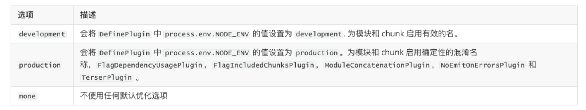

>  webpack is a static module bundler for modern JavaScript applications.

这是webpack官网上的一句话，说的是：

**webpack是为了现代JavaScript应用的静态模块化打包工具。**

理解（翻译）：

+ 打包bundler： webpack可以将帮助我们进行打包，所以它是一个**打包工具**；
+ 静态的static：这样表述的原因是我们最终可以将代码打包成最终的静态资源（部署到静态服务器）；
+ 模块化module： **webpack默认支持各种模块化开发**，ES Module、CommonJS、AMD等；
+ 现代的modern：正是因为现代前端开发面临各种各样的问题，才催生了webpack的出现和发展；

## webpack的安装

webpack的安装目前分为两个：`webpack`、`webpack-cli`

1. 执行`webpack`命令，会执行`node_modules`下的`.bin`目录下的`webpack`；
2. `webpack`在执行时是依赖`webpack-cli`的，如果没有安装就会报错；
3. 而`webpack-cli`中代码执行时，才是真正利用`webpack`进行编译和打包的过程；
4. 所以在安装`webpack`时，我们需要同时安装`webpack-cli`（第三方的脚手架事实上是没有使用`webpack-cli`的，而是类似于
   自己的`vue-service-cli`的东西）


有全局安装和局部安装两种：

```js
	npm install webpack webpack-cli -g #全局安装
npm install webpack webpack-cli -D #局部(开发依赖)安装 -D 是--save-dev
```

一般我们用的是局部安装。这样在项目的`package.json`文件中可以看到`webpack`和`webpack-cli`的版本，方便协作开发。

## webpack默认打包

+ 我们可以通过webpack进行打包，之后运行打包后的代码：
  + 在目录下直接执行webpack 命令
+ 生成一个dist文件夹，里面存放一个main.js的文件，就是我们打包之后的文件：
  + 这个文件中的代码被压缩和丑化了；
  + 另外我们发现代码中依然存在ES6的语法，比如箭头函数、const等，这是因为默认情况下webpack并不清楚
    我们打包后的文件是否需要转成ES5之前的语法，后续我们需要通过babel来进行转换和设置；
+ 我们发现是可以正常进行打包的，但是有一个问题，webpack是如何确定我们的入口的呢？
  + 事实上，当我们运行webpack时，webpack会查找当前目录下的src/index.js作为入口；
  + 所以，如果当前项目中没有存在src/index.js文件，那么会报错；

## webpack配置文件

因为通常打包一个项目是非常复杂的，我们需要进行一些配置，需要在根目录下创建`webpack.config.js`的文件，作为webpack的配置文件：

> Mode配置选项，可以告知webpack使用响应模式的内置优化：
>
> + 默认值是production（什么都不设置的情况下）；
> + 可选值有：'none' | 'development' | 'production'；
>
> 

```JS
const path = require("path");

//导出配置信息
MODULE.EXPORTS = {
    entry: "./src/main.js",
    output: {
        // __dirname 指明项目的路径（当前模块的目录名）
        // path.resolve 将参数拼接为路径
        filename: "bundle.js",
        path: path.resolve(__dirname, "./dist")
    }
}
```

也可以指定webpack的配置文件：比如`wk.config.js`，这时候只需要在`package.json`里加上：

```json
{
    "scripts": "webpack --config wk.config.js"
}
```

然后执行npm run build便可以进行打包。


##　webpack依赖图

webpack在处理应用程序时，它会根据命令或者配置文件找到入口文件；

+ 从入口开始，会生成一个依赖关系图，这个依赖关系图会包含应用程序中所需的所有模块（比如.js文件、css文件、图片、
  字体等）；

+ 然后遍历图结构，打包一个个模块（根据文件的不同使用不同的loader来解析）；

(官网的图)

## webpack 解析 css

如果我们直接引入一个元素，并且给他一些样式，然后执行`npm run build`，我们会发现报错信息：模块解析失败、你需要一个合适的loader来处理这个文件类型。

```JS
// src/index.js
import "./css/style.css"

const component() {
    const element = document.createElement("div");
    element.innerHTML = ["hello","webpack"].join(" ");
    element.className = "content";
    
    return elemrnt;
}
document.body.appendChild(component());

// ./css/style.css 
.content{
    color:red;
}
```

因为webpack只能识别 JS、JSON文件，所以我们需要一个loader来加载这个css文件，但是loader是什么呢？

> 模块转换器，将所有类型的文件转为webpack可以处理的有效模块，然后可以利用webpack的打包能力，对他们进行处理

+ loader 可以用于对模块的源代码进行转换；
+ 我们可以将css文件也看成是一个模块，我们是通过import来加载这个模块的；
+ 在加载这个模块时，webpack其实并不知道如何对其进行加载，我们必须制定对应的loader来完成这个功能；

对于加载css文件来说，我们需要一个可以读取css文件的loader；

+ 这个loader最常用的是css-loader；

+ css-loader的安装：
  `npm install css-loader -D`

### css-loader 和 style-loader

#### 配置loader

配置方式表示的意思是在我们的webpack.config.js文件中写明配置信息：

+ module.rules中允许我们配置多个loader（因为我们也会继续使用其他的loader，来完成其他文件的加载）；
+ 这种方式可以更好的表示loader的配置，也方便后期的维护，同时也让你对各个Loader有一个全局的概览；

module.rules的配置如下：

+ rules属性对应的值是一个数组：[Rule]
+ 数组中存放的是一个个的Rule，Rule是一个对象，对象中可以设置多个属性：
  + test属性：用于对resource（资源）进行匹配的，通常会设置成正则表达式；
  + use属性：对应的值时一个数组：[UseEntry]
    + UseEn try是一个对象，可以通过对象的属性来设置一些其他属性
      Ø loader：必须有一个loader属性，对应的值是一个字符串；
      Ø options：可选的属性，值是一个字符串或者对象，值会被传入到loader中；
      Ø query：目前已经使用options来替代；
    + 传递字符串（如：use: [ 'style-loader' ]）是loader 属性的简写方式（如：use: [ { loader: 'style-loader'} ]）；
+  loader属性： Rule.use: [ { loader } ] 的简写。

```js
module.exports = {
    mode: "development",
    entry: "./src/main.js",
    output: {
        filename:"bundle.js",
        path: path.resolve(__dirname,"./dist")
    },
    module: {
        rules: [
            {
                test: /\.css$/,
                // loader: "css-loader"
                // use: ["css-loader"]
                use: [
                    {loader : "css-loader"}
                ]
            }
        ]
    }
}
```

css-loader只是负责将.css文件进行解析，并不会将解析之后的css插入到页面中；

+ 如果我们希望再完成插入style的操作，那么我们还需要另外一个loader，就是style-loader；
+ 安装style-loader：
  + `npm install style-loader -D`

注意：loader的执行顺序是从后往前，要先加载`css-loader`然后是`style-loader`

```js
use: [
    {loader: "style-loader"},
    {loader: "css-loader"}
]
```

重新执行编译npm run build，可以发现打包后的css已经生效了：

+ 当前目前我们的css是通过页内样式的方式添加进来的；

####　处理`less`文件

我们可以使用less-loader，来自动使用less工具转换less到css；
`npm install less-loader -D`

配置webpack.config.js

```js
use: [
    {loader: "style-loader"},
    {loader: "css-loader"},
    {loader: "less-loader"}
]
```

执行npm run build
less就可以自动转换成css，并且页面也会生效了

## webpack插件机制

plugins是在webpack构建流程中的特定时机注入扩展逻辑来改变构建结果或者做你想要的事情。

**扩展webpack的构建能力**

Webpack 插件机制的目的是为了增强 Webpack 在项目自动化构建方面的能力。Loader 就是负责完成项目中各种各样资源模块的加载，从而实现整体项目的模块化，而 Plugin 则是用来解决项目中除了资源模块打包以外的其他自动化工作，所以说 Plugin 的能力范围更广，用途自然也就更多。

几个插件最常见的应用场景：

+ 实现自动在打包之前清除 dist 目录（上次的打包结果）；

+ 自动生成应用所需要的 HTML 文件；

+ 根据不同环境为代码注入类似 API 地址这种可能变化的部分；

+ 拷贝不需要参与打包的资源文件到输出目录；

+ 压缩 Webpack 打包完成后输出的文件；

+ 自动发布打包结果到服务器实现自动部署。

### 打包前清除dist目录

Webpack 每次打包的结果都是直接覆盖到 dist 目录。而在打包之前，dist 目录中就可能已经存入了一些在上一次打包操作时遗留的文件，当我们再次打包时，只能覆盖掉同名文件，而那些已经移除的资源文件就会一直累积在里面，最终导致部署上线时出现多余文件，这显然非常不合理。

更为合理的做法就是在每次完整打包之前，自动清理 dist 目录，这样每次打包过后，dist 目录中就只会存在那些必要的文件。

clean-webpack-plugin 这个插件就很好的实现了这一需求。它是一个第三方的 npm 包，我们需要先通过 npm 安装一下，具体操作如下：

```
npm install -D clean-webpack-plugin
```

安装过后，我们回到 Webpack 的配置文件中，然后导入 clean-webpack-plugin 插件，这个插件模块导出了一个叫作 CleanWebpackPlugin 的成员，我们先把它解构出来，具体代码如下。

```js
const { CleanWebpackPlugin } = require('clean-webpack-plugin')
```

回到配置对象中，添加一个 plugins 属性，这个属性就是专门用来配置插件的地方，它是一个数组，添加一个插件就是在这个数组中添加一个元素。

绝大多数插件模块导出的都是一个类型，我们这里的 CleanWebpackPlugin 也不例外，使用它，就是通过这个类型创建一个实例，放入 plugins 数组中，具体代码如下：

```js
// ./webpack.config.js

const { CleanWebpackPlugin } = require('clean-webpack-plugin')

module.exports = {
  entry: './src/main.js',
  output: {
    filename: 'bundle.js'
  },
  plugins: [
    new CleanWebpackPlugin()
  ]
}
```

完成以后我们来测试一下 clean-webpack-plugin 插件的效果。回到命令行终端，再次运行 Webpack 打包，此时之前的打包结果就不会存在了，dist 目录中存放的就都是我们本次打包的结果。

在这里，我只是希望通过这个非常简单的插件带你体验一下 Webpack 插件的使用。一般来说，当我们有了某个自动化的需求过后，可以先去找到一个合适的插件，然后安装这个插件，最后将它配置到 Webpack 配置对象的 plugins 数组中，这个过程唯一有可能不一样的地方就是，有的插件可能需要有一些配置参数。

### 用于生成 HTML 的插件
除了自动清理 dist 目录，我们还有一个非常常见的需求，就是自动生成使用打包结果的 HTML，所谓使用打包结果指的是在 HTML 中自动注入 Webpack 打包生成的 bundle。

在使用接下来这个插件之前，我们的 HTML 文件一般都是通过硬编码的方式，单独存放在项目根目录下的，这种方式有两个问题：
项目发布时，我们需要同时发布根目录下的 HTML 文件和 dist 目录中所有的打包结果，非常麻烦，而且上线过后还要确保 HTML 代码中的资源文件路径是正确的。

如果打包结果输出的目录或者文件名称发生变化，那 HTML 代码中所对应的 script 标签也需要我们手动修改路径。

解决这两个问题最好的办法就是让 Webpack 在打包的同时，自动生成对应的 HTML 文件，让 HTML 文件也参与到整个项目的构建过程。这样的话，在构建过程中，Webpack 就可以自动将打包的 bundle 文件引入到页面中。

相比于之前写死 HTML 文件的方式，自动生成 HTML 的优势在于：

HTML 也输出到 dist 目录中了，上线时我们只需要把 dist 目录发布出去就可以了；

HTML 中的 script 标签是自动引入的，所以可以确保资源文件的路径是正常的。

具体的实现方式就需要借助于 html-webpack-plugin 插件来实现，这个插件也是一个第三方的 npm 模块，我们这里同样需要单独安装这个模块，具体操作如下：

```js
 npm install html-webpack-plugin --save-dev
```

安装完成过后，回到配置文件，载入这个模块，不同于 clean-webpack-plugin，html-webpack-plugin 插件默认导出的就是插件类型，不需要再解构内部成员，具体如下：

```js
const HtmlWebpackPlugin = require('html-webpack-plugin')
```


有了这个类型过后，回到配置对象的 plugins 属性中，同样需要添加一下这个类型的实例对象，完成这个插件的使用，具体配置代码如下：

```js
// ./webpack.config.js
const HtmlWebpackPlugin = require('html-webpack-plugin')
const { CleanWebpackPlugin } = require('clean-webpack-plugin')

module.exports = {
  entry: './src/main.js',
  output: {
    filename: 'bundle.js'
  },
  plugins: [
    new CleanWebpackPlugin(),
    new HtmlWebpackPlugin()
  ]
}
```

最后我们回到命令行终端，再次运行打包命令，此时打包过程中就会自动生成一个 index.html 文件到 dist 目录。我们找到这个文件，可以看到文件中的内容就是一段使用了 bundle.js 的空白 HTML，具体结果如下：


至此，Webpack 就可以动态生成应用所需的 HTML 文件了，但是这里仍然存在一些需要改进的地方：

对于生成的 HTML 文件，页面 title 必须要修改；

很多时候还需要我们自定义页面的一些 meta 标签和一些基础的 DOM 结构。

也就是说，还需要我们能够充分自定义这个插件最终输出的 HTML 文件。

如果只是简单的自定义，我们可以通过修改 HtmlWebpackPlugin 的参数来实现。

我们回到 Webpack 的配置文件中，这里我们给 HtmlWebpackPlugin 构造函数传入一个对象参数，用于指定配置选项。其中，title 属性设置的是 HTML 的标题，我们把它设置为 Webpack Plugin Simple。meta 属性需要以对象的形式设置页面中的元数据标签，这里我们尝试为页面添加一个 viewport 设置，具体代码如下：

```js
// ./webpack.config.js
const HtmlWebpackPlugin = require('html-webpack-plugin')
const { CleanWebpackPlugin } = require('clean-webpack-plugin')

module.exports = {
  entry: './src/main.js',
  output: {
    filename: 'bundle.js'
  },
  plugins: [
    new CleanWebpackPlugin(),
    new HtmlWebpackPlugin({
      title: 'Webpack Plugin Sample',
      meta: {
        viewport: 'width=device-width'
      }
    })
  ]
}
```

完成以后回到命令行终端，再次打包，然后我们再来看一下生成的 HTML 文件，此时这里的 title 和 meta 标签就会根据配置生成。

如果需要对 HTML 进行大量的自定义，更好的做法是在源代码中添加一个用于生成 HTML 的模板，然后让 html-webpack-plugin 插件根据这个模板去生成页面文件。

我们这里在 src 目录下新建一个 index.html 文件作为 HTML 文件的模板，然后根据我们的需要在这个文件中添加相应的元素。对于模板中动态的内容，可以使用 Lodash 模板语法输出，模板中可以通过 htmlWebpackPlugin.options 访问这个插件的配置数据，例如我们这里输出配置中的 title 属性，具体代码如下：

```js
<!-- ./src/index.html -->
<!DOCTYPE html>
<html lang="en">
<head>
  <meta charset="UTF-8">
  <meta name="viewport" content="width=device-width, initial-scale=1.0">
  <meta http-equiv="X-UA-Compatible" content="ie=edge">
  <title><%= htmlWebpackPlugin.options.title %></title>
</head>
<body>
  <div class="container">
    <h1>页面上的基础结构</h1>
    <div id="root"></div>
  </div>
</body>
</html>
```

有了模板文件过后，回到配置文件中，我们通过 HtmlWebpackPlugin 的 template 属性指定所使用的模板，具体配置如下：

```js
// ./webpack.config.js
const HtmlWebpackPlugin = require('html-webpack-plugin')
const { CleanWebpackPlugin } = require('clean-webpack-plugin')

module.exports = {
  entry: './src/main.js',
  output: {
    filename: 'bundle.js'
  },
  plugins: [
    new CleanWebpackPlugin(),
    new HtmlWebpackPlugin({
      title: 'Webpack Plugin Sample',
      template: './src/index.html'
    })
  ]
}
```

完成以后我们回到命令行终端，运行打包命令，然后再来看一下生成的 HTML 文件，此时 HTML 中就都是根据模板生成的内容了。

关于 html-webpack-plugin 插件，除了自定义输出文件的内容，同时输出多个 HTML 文件也是一个非常常见的需求，除非我们的应用是一个单页应用程序，否则一定需要输出多个 HTML 文件。

如果需要同时输出多个 HTML 文件，其实也非常简单，我们回到配置文件中，这里通过 HtmlWebpackPlugin 创建的对象就是用于生成 index.html 的，那我们完全可以再创建一个新的实例对象，用于创建额外的 HTML 文件。

例如，这里我们再来添加一个 HtmlWebpackPlugin 实例用于创建一个 about.html 的页面文件，我们需要通过 filename 指定输出文件名，这个属性的默认值是 index.html，我们把它设置为 about.html，具体配置如下：

```js
// ./webpack.config.js
const HtmlWebpackPlugin = require('html-webpack-plugin')
const { CleanWebpackPlugin } = require('clean-webpack-plugin')

module.exports = {
  entry: './src/main.js',
  output: {
    filename: 'bundle.js'
  },
  plugins: [
    new CleanWebpackPlugin(),
    // 用于生成 index.html
    new HtmlWebpackPlugin({
      title: 'Webpack Plugin Sample',
      template: './src/index.html'
    }),
    // 用于生成 about.html
    new HtmlWebpackPlugin({
      filename: 'about.html'
    })
  ]
}
```

完成以后我们再次回到命令行终端，运行打包命令，然后我们展开 dist 目录，此时 dist 目录中就同时生成了 index.html 和 about.html 两个页面文件。

根据这个尝试我们就应该知道，如果需要创建多个页面，就需要在插件列表中加入多个 HtmlWebpackPlugin 的实例对象，让每个对象负责一个页面文件的生成。

## 代码分割


## Tree shaking

什么是Tree Shaking呢？

> 移除未引用的死代码，极大的减少打包后bundle的体积

+ Tree Shaking是一个术语，在计算机中表示消除死代码（dead_code）；
+ 最早的想法起源于LISP，用于消除未调用的代码（纯函数无副作用，可以放心的消除，这也是为什么要求我们在进
  行函数式编程时，尽量使用纯函数的原因之一）；
+ 后来Tree Shaking也被应用于其他的语言，比如JavaScript、Dart；

 JavaScript的Tree Shaking：

+ 对JavaScript进行Tree Shaking是源自打包工具rollup；
+ 这是因为Tree Shaking依赖于ES Module的静态语法分析（不执行任何的代码，可以明确知道模块的依赖关系）；
+ webpack2正式内置支持了ES2015模块，和检测未使用模块的能力；
+ 在webpack4正式扩展了这个能力，并且通过package.json的sideEffects属性作为标记，告知webpack在编译时，
  哪里文件可以安全的删除掉；
+ webpack5中，也提供了对部分CommonJS的tree shaking的支持；
  + https://github.com/webpack/changelog-v5#commonjs-tree-shaking


**使用 Webpack 生产模式打包的优化过程中，就使用自动开启这个功能，以此来检测我们代码中的未引用代码，然后自动移除它们。**

我们可以先来体验一下这个功能的效果，这里我的源代码非常简单，只有两个文件。

```js
└─ tree-shaking
   ├── src
   │   ├── components.js
   │   └── main.js
   ├── package.json
   └── webpack.config.js
```

其中 components.js 中导出了一些函数，这些函数各自模拟了一个组件，具体代码如下：

```js
// ./src/components.js
export const Button = () => {
  return document.createElement('button')
  console.log('dead-code')
}

export const Link = () => {
  return document.createElement('a')
}

export const Heading = level => {
  return document.createElement('h' + level)
}
```

其中 Button 组件函数中，在 return 过后还有一个 console.log() 语句，很明显这句代码永远都不会被执行，所以这个 console.log() 就属于未引用代码。

在 main.js 文件中只是导入了 compnents.js，具体代码如下：

```js
// ./src/main.js
import { Button } from './components'
document.body.appendChild(Button())
```

但是注意这里导入 components 模块时，我们只提取了模块中的 Button 成员，那这就导致components 模块中很多地方都不会被用到，那这些地方就是冗余的，具体冗余部分如下：

```js
// ./src/components.js
export const Button = () => {
  return document.createElement('button')
  // 未引用代码
  console.log('dead-code')
}
// 未引用代码
export const Link = () => {
  return document.createElement('a')
}
// 未引用代码
export const Heading = level => {
  return document.createElement('h' + level)
}
```

去除冗余代码是生产环境优化中一个很重要的工作，Webpack 的 Tree-shaking 功能就很好地实现了这一点。

我们打开命令行终端，这里我们尝试以 production 模式运行打包，具体命令如下：

```
npx webpack --mode=production
```


Webpack 的 Tree-shaking 特性在生产模式下会自动开启。打包完成以后我们打开输出的 bundle.js，通过搜索你会发现，components 模块中冗余的代码根本没有输出。这就是经过 Tree-shaking 处理过后的效果。

试想一下，如果我们在项目中引入 Lodash 这种工具库，大部分情况下我们只会使用其中的某几个工具函数，而其他没有用到的部分就是冗余代码。通过 Tree-shaking 就可以极大地减少最终打包后 bundle 的体积。

需要注意的是，Tree-shaking 并不是指 Webpack 中的某一个配置选项，而是一组功能搭配使用过后实现的效果，这组功能在生产模式下都会自动启用，所以使用生产模式打包就会有 Tree-shaking 的效果。


### 开启 Tree Shaking
这里再来介绍一下在其他模式下，如何一步一步手动开启 Tree-shaking。通过这个过程，还可以顺便了解 Tree-shaking 的工作过程和 Webpack 其他的一些优化功能。

我们再次运行 Webpack 打包，不过这一次我们不再使用 production 模式，而是使用 none，也就是不开启任何内置功能和插件，具体命令如下：

```js
npx webpack --mode=none
```

打包完成过后，我们再次找到输出的 bundle.js 文件，我们这里注意一下 components 对应的这个模块，虽然外部没有使用这里的 Link 函数和 Heading 函数，但是仍然导出了它们。显然这种导出是没有任何意义的。

明确目前打包结果的状态过后，我们打开 Webpack 的配置文件，在配置对象中添加一个 optimization 属性，这个属性用来集中配置 Webpack 内置优化功能，它的值也是一个对象。

在 optimization 对象中我们可以先开启一个 usedExports 选项，表示**在输出结果中只导出外部使用了的成员**，具体配置代码如下：

```js
// ./webpack.config.js
module.exports = {
  // ... 其他配置项
  optimization: {
    // 模块只导出被使用的成员
    usedExports: true
  }
}
```


配置完成后，重新打包，然后我们再来看一下输出的 bundle.js，此时你会发现 components 模块所对应的函数，就不再导出 Link 和 Heading 这两个函数了，那它们对应的代码就变成了未引用代码。而且如果你使用的是 VS Code，会发现 VS Code 将这两个函数名的颜色变淡了，这是为了表示它们未被引用。

对于这种未引用代码，如果我们开启压缩代码功能，就可以自动压缩掉这些没有用到的代码。

我们可以回到配置文件中，尝试在 optimization 配置中开启 minimize，具体配置如下：

```js
// ./webpack.config.js
module.exports = {
  // ... 其他配置项
  optimization: {
    // 模块只导出被使用的成员
    usedExports: true,
    // 压缩输出结果
    minimize: true
  }
}
```

然后再次回到命令行重新运行打包，仔细查看打包结果，你会发现，Link 和 Heading 这些未引用代码都被自动移除了。

这就是 Tree-shaking 的实现，整个过程用到了 Webpack 的两个优化功能：

> usedExports - 打包结果中只导出外部用到的成员；
> minimize - 压缩打包结果。

如果把我们的代码看成一棵大树，那你可以这样理解：

+ usedExports 的作用就是标记树上哪些是枯树枝、枯树叶；
+ minimize 的作用就是负责把枯树枝、枯树叶摇下来。

### 合并模块（扩展）
除了 usedExports 选项之外，我们还可以使用一个 concatenateModules 选项继续优化输出。

普通打包只是将一个模块最终放入一个单独的函数中，如果我们的模块很多，就意味着在输出结果中会有很多的模块函数。

concatenateModules 配置的作用就是尽可能将所有模块合并到一起输出到一个函数中，这样既提升了运行效率，又减少了代码的体积。

我们回到配置文件中，这里我们在 optimization 属性中开启 concatenateModules。同时，为了更好地看到效果，我们先关闭 minimize，具体配置如下：

```js
// ./webpack.config.js
module.exports = {
  // ... 其他配置项
  optimization: {
    // 模块只导出被使用的成员
    usedExports: true,
    // 尽可能合并每一个模块到一个函数中
    concatenateModules: true,
    // 压缩输出结果
    minimize: false
  }
}
```

然后回到命令行终端再次运行打包。那此时 bundle.js 中就不再是一个模块对应一个函数了，而是把所有的模块都放到了一个函数中，这个特性又被称为 Scope Hoisting，也就是作用域提升，它是 Webpack 3.0 中添加的一个特性。

如果再配合 minimize 选项，打包结果的体积又会减小很多。

### 注意

Tree-shaking 实现的前提是 ES Modules，也就是说：最终交给 Webpack 打包的代码，必须是使用 ES Modules 的方式来组织的模块化。

为什么这么说呢？

我们都知道 Webpack 在打包所有的模块代码之前，先是将模块根据配置交给不同的 Loader 处理，最后再将 Loader 处理的结果打包到一起。

很多时候，我们为了更好的兼容性，会选择使用 babel-loader 去转换我们源代码中的一些 ECMAScript 的新特性。而 Babel 在转换 JS 代码时，很有可能处理掉我们代码中的 ES Modules 部分，把它们转换成 CommonJS 的方式。


当然了，Babel 具体会不会处理 ES Modules 代码，取决于我们有没有为它配置使用转换 ES Modules 的插件。

很多时候，我们为 Babel 配置的都是一个 preset（预设插件集合），而不是某些具体的插件。例如，目前市面上使用最多的 @babel/preset-env，这个预设里面就有转换 ES Modules 的插件。所以当我们使用这个预设时，代码中的 ES Modules 部分就会被转换成 CommonJS 方式。那 Webpack 再去打包时，拿到的就是以 CommonJS 方式组织的代码了，所以 Tree-shaking 不能生效。

**不过在最新版本（8.x）的 babel-loader 中，已经自动帮我们关闭了对 ES Modules 转换的插件，经过 babel-loader 处理后的代码默认仍然是 ES Modules，那 Webpack 最终打包得到的还是 ES Modules 代码，Tree-shaking 自然也就可以正常工作了。**

那我们这里具体来尝试一下。为了可以更容易分辨结果，我们只开启 usedExports，完整配置如下：

```js
// ./webpack.config.js
module.exports = {
  mode: 'none',
  entry: './src/main.js',
  output: {
    filename: 'bundle.js'
  },
  module: {
    rules: [
      {
        test: /\.js$/,
        use: {
          loader: 'babel-loader',
          options: {
            presets: [
              ['@babel/preset-env']
            ]
          }
        }
      }
    ]
  },
  optimization: {
    usedExports: true
  }
}
```


配置完成过后，我们打开命令行终端，运行 Webpack 打包命令，然后再找到 bundle.js，仔细查看你会发现，结果并不是像刚刚说的那样，这里 usedExports 功能仍然正常工作了，此时，如果我们压缩代码，这些未引用的代码依然会被移除。这也就说明 Tree-shaking 并没有失效。

我们也可以在 babel-loader 的配置中强制开启 ES Modules 转换插件来试一下，具体配置如下：

```js
// ./webpack.config.js
module.exports = {
  mode: 'none',
  entry: './src/main.js',
  output: {
    filename: 'bundle.js'
  },
  module: {
    rules: [
      {
        test: /\.js$/,
        use: {
          loader: 'babel-loader',
          options: {
            presets: [
              ['@babel/preset-env', { modules: 'commonjs' }]
            ]
          }
        }
      }
    ]
  },
  optimization: {
    usedExports: true
  }
}
```


给 Babel preset 添加配置的方式比较特别，这里很多人都会配错，一定要注意。它需要把预设数组中的成员定义成一个数组，然后这个数组中的第一个成员就是所使用的 preset 的名称，第二个成员就是给这个 preset 定义的配置对象。

我们在这个对象中将 modules 属性设置为 "commonjs"，默认这个属性是 auto，也就是根据环境判断是否开启 ES Modules 插件，我们设置为 commonjs 就表示我们强制使用 Babel 的 ES Modules 插件把代码中的 ES Modules 转换为 CommonJS。

完成以后，我们再次打开命令行终端，运行 Webpack 打包。然后找到 bundle.js，此时，你就会发现 usedExports 没法生效了。即便我们开启压缩代码，Tree-shaking 也会失效。

**总结一下，这里通过实验发现，最新版本的 babel-loader 并不会导致 Tree-shaking 失效。如果你不确定现在使用的 babel-loader 会不会导致这个问题，最简单的办法就是在配置中将 @babel/preset-env 的 modules 属性设置为 false，确保不会转换 ES Modules，也就确保了 Tree-shaking 的前提。**

另外，我们刚刚探索的过程也值得你仔细再去琢磨一下，通过这样的探索能够帮助你了解很多背后的原因，做到“知其然，知其所以然”。

### sideEffects
Webpack 4 中新增了一个 sideEffects 特性，它允许我们通过配置标识我们的代码是否有副作用，从而提供更大的压缩空间。

TIPS：模块的副作用指的就是模块执行的时候除了导出成员，是否还做了其他的事情。

这个特性一般只有我们去开发一个 npm 模块时才会用到。因为官网把对 sideEffects 特性的介绍跟 Tree-shaking 混到了一起，所以很多人误认为它们之间是因果关系，其实它们没有什么太大的关系。

我们先把 sideEffects 特性本身的作用弄明白，你就更容易理解为什么说它跟 Tree-shaking 没什么关系了。

这里我先设计一个 sideEffects 能够发挥效果的场景，案例具体结构如下：

```
├── src
│   ├── components
│   │   ├── button.js
│   │   ├── heading.js
│   │   ├── index.js
│   │   └── link.js
│   └── main.js
├── package.json
└── webpack.config.js
```

基于上一个案例的基础上，我们把 components 模块拆分出多个组件文件，然后在 components/index.js 中集中导出，以便于外界集中导入，具体 index.js 代码如下：

```js
// ./src/components/index.js
export { default as Button } from './button'
export { default as Link } from './link'
export { default as Heading } from './heading'
```


这也是我们经常见到一种同类文件的组织方式。另外，在每个组件中，我们都添加了一个 console 操作（副作用代码），具体代码如下：

```js
// ./src/components/button.js
console.log('Button component~') // 副作用代码

export default () => {
  return document.createElement('button')
}
```


我们再到打包入口文件（main.js）中去载入 components 中的 Button 成员，具体代码如下：

```js
// ./src/main.js
import { Button } from './components'
document.body.appendChild(Button())
```


那这样就会出现一个问题，虽然我们在这里只是希望载入 Button 模块，但实际上载入的是 components/index.js，而 index.js 中又载入了这个目录中全部的组件模块，这就会导致所有组件模块都会被加载执行。

我们打开命令行终端，尝试运行打包，打包完成过后找到打包结果，根据打包结果发现，所有的组件模块都被打包进了 bundle.js。

此时如果我们开启 Tree-shaking 特性（只设置 useExports），这里没有用到的导出成员其实最终也可以被移除，但是由于这些成员所属的模块中有副作用代码，所以就导致最终 Tree-shaking 过后，这些模块并不会被完全移除。

可能你会认为这些代码应该保留下来，而实际情况是，这些模块内的副作用代码一般都是为这个模块服务的，例如这里我添加的 console.log，就是希望表示一下当前这个模块被加载了。但是最终整个模块都没用到，也就没必要留下这些副作用代码了。

所以说，**Tree-shaking 只能移除没有用到的代码成员，而想要完整移除没有用到的模块，那就需要开启 sideEffects 特性了。**

#### sideEffects 作用
我们打开 Webpack 的配置文件，在 optimization 中开启 sideEffects 特性，具体配置如下：

```js
// ./webpack.config.js
module.exports = {
  mode: 'none',
  entry: './src/main.js',
  output: {
    filename: 'bundle.js'
  },
  optimization: {
    sideEffects: true
  }
}
```


**TIPS：注意这个特性在 production 模式下同样会自动开启。**

那此时 Webpack 在打包某个模块之前，会先检查这个模块所属的 package.json 中的 sideEffects 标识，以此来判断这个模块是否有副作用，如果没有副作用的话，这些没用到的模块就不再被打包。换句话说，即便这些没有用到的模块中存在一些副作用代码，我们也可以通过 package.json 中的 sideEffects 去强制声明没有副作用。

那我们打开项目 package.json 添加一个 sideEffects 字段，把它设置为 false，具体代码如下：

```js
{
  "name": "09-side-effects",
  "version": "0.1.0",
  "author": "zce <w@zce.me> (https://zce.me)",
  "license": "MIT",
  "scripts": {
    "build": "webpack"
  },
  "devDependencies": {
    "webpack": "^4.43.0",
    "webpack-cli": "^3.3.11"
  },
  "sideEffects": false
}
```


这样就表示我们这个项目中的所有代码都没有副作用，让 Webpack 放心大胆地去“干”。

完成以后我们再次运行打包，然后同样找到打包输出的 bundle.js 文件，此时那些没有用到的模块就彻底不会被打包进来了。那这就是 sideEffects 的作用。

这里设置了两个地方：

+ webpack.config.js 中的 sideEffects 用来开启这个功能；
+ package.json 中的 sideEffects 用来标识我们的代码没有副作用。

目前很多第三方的库或者框架都已经使用了 sideEffects 标识，所以我们再也不用担心为了一个小功能引入一个很大体积的库了。例如，某个 UI 组件库中只有一两个组件会用到，那只要它支持 sideEffects，你就可以放心大胆的直接用了。

#### sideEffects 注意
使用 sideEffects 这个功能的前提是确定你的代码没有副作用，或者副作用代码没有全局影响，否则打包时就会误删掉你那些有意义的副作用代码。

例如，我这里准备的 extend.js 模块：

```js
// ./src/extend.js
// 为 Number 的原型添加一个扩展方法
Number.prototype.pad = function (size) {
  const leadingZeros = Array(size + 1).join(0)
  return leadingZeros + this
}
```


在这个模块中并没有导出任何成员，仅仅是在 Number 的原型上挂载了一个 pad 方法，用来为数字添加前面的导零，这是一种很早以前常见的基于原型的扩展方法。

我们回到 main.js 中去导入 extend 模块，具体代码如下：

```js
// ./src/main.js
import './extend' // 内部包含影响全局的副作用

console.log((8).pad(3)) // => '0008'
```


因为这个模块确实没有导出任何成员，所以这里也就不需要提取任何成员。导入过后就可以使用它为 Number 提供扩展方法了。

这里为 Number 类型做扩展的操作就是 extend 模块对全局产生的副作用。

此时如果我们还是通过 package.json 标识我们代码没有副作用，那么再次打包过后，就会出现问题。我们可以找到打包结果，我们看到，对 Number 的扩展模块并不会打包进来。

缺少了对 Number 的扩展操作，我们的代码再去运行的时候，就会出现错误。这种扩展的操作属于对全局产生的副作用。

这种基于原型的扩展方式，在很多 Polyfill 库中都会大量出现，比较常见的有 es6-promise，这种模块都属于典型的副作用模块。

除此之外，我们在 JS 中直接载入的 CSS 模块，也都属于副作用模块，同样会面临这种问题。

所以说不是所有的副作用都应该被移除，有一些必要的副作用需要保留下来。

最好的办法就是在 package.json 中的 sideEffects 字段中标识需要保留副作用的模块路径（可以使用通配符），具体配置如下：

```js
{
  "name": "09-side-effects",
  "version": "0.1.0",
  "author": "zce <w@zce.me> (https://zce.me)",
  "license": "MIT",
  "scripts": {
    "build": "webpack"
  },
  "devDependencies": {
    "webpack": "^4.43.0",
    "webpack-cli": "^3.3.11"
  },
  "sideEffects": [
    "./src/extend.js",
    "*.css"
  ]
}
```


这样 Webpack 的 sideEffects 就不会忽略确实有必要的副作用模块了。

### 写在最后
最后我们来总结一下，今天介绍到了两个 Webpack 中的高级特性，分别是 Tree-shaking 和 sideEffects。

**Tree-shaking 只能移除没有用到的代码成员，而想要完整移除没有用到的模块，那就需要开启 sideEffects 特性了。**

Tree-shaking 的本身没有太多需要你理解和思考的地方，你只需要了解它的效果，以及相关的配置即可。

而 sideEffects 可能需要你花点时间去理解一下，重点就是想明白哪些副作用代码是可以随着模块的移除而移除，哪些又是不可以移除的。总结下来其实也很简单：对全局有影响的副作用代码不能移除，而只是对模块有影响的副作用代码就可以移除。

总之不管是 Tree-shaking 还是 sideEffects，我个人认为，它们都是为了弥补 JavaScript 早期在模块系统设计上的不足。随着 Webpack 这类技术的发展，JavaScript 的模块化确实越来越好用，也越来越合理。

除此之外，我还想强调一点，当你对这些特性有了一定的了解之后，就应该意识到：尽可能不要写影响全局的副作用代码。